# 如何使用 Azure AD 通过 OAuth 和 JWT 保护 OCI API 网关

> 原文：<https://medium.com/oracledevs/how-to-use-azure-ad-to-secure-oci-api-gateway-with-oauth-and-jwt-d3762072ff42?source=collection_archive---------0----------------------->

Azure AD 是 Azure 中流行的身份和访问管理(IAM)服务。它是基于云的，可以作为 OAuth 2.0 IdP，使得跨多云的 SSO 变得容易和流畅。OCI API 网关是一个坚如磐石的 API 管理解决方案，用于保护和控制 OCI 的 API。API 网关可以使用 Azure AD OAuth 功能来保护和授权 API 端点。如何基于 JWT 在 OCI 的 Azure AD 和 API Gateway 之间设置 OAuth SSO？Azure AD 和 API Gateway 之间 JWKS 密钥不兼容怎么办？如何在 OCI 配置 API 网关使用 Azure AD 发行的 JWT？继续阅读，找出答案。

先决条件:

*   你有权使用 OCI 和 Azure 的租约。
*   您有一个客户端应用程序，需要连接到 OCI 的 API 网关。我将使用 Visual Builder 进行演示。不过，你可以使用你的任何一个，因为应用程序在 Azure AD 中注册，并为 JWT 发行实现简单的 [OAuth 客户端凭证流](https://learn.microsoft.com/en-us/azure/active-directory/develop/v2-oauth2-client-creds-grant-flow)。
*   你对 OCI 的 [API 网关](https://docs.oracle.com/en-us/iaas/Content/APIGateway/Concepts/apigatewayoverview.htm)和[函数](https://docs.oracle.com/en-us/iaas/Content/Functions/Concepts/functionsoverview.htm)有基本的了解。
*   您已经在 OCI 为 API 网关和功能创建了一个虚拟云网络(VCN)。

# 介绍

在多云时代，最好在不同的超大规模云中使用分布式组件。此示例将确保 Azure AD OAuth IdP 使用 JWT 令牌和 OAuth 客户端凭据流保护 OCI 的 API 部署。该流程通常易于使用，因为它需要从 Azure AD IdP 导出(1) JWKS 密钥，并将它们导入 OCI API 网关。然后，客户端应用程序调用 Azure AD IdP 来(2)使用客户端凭据发布 JWT，并从响应中获取 JWT。最后，客户端应用程序向 JWT 提供针对 OCI 受保护 API 网关资源的(3)请求。下面按照体系结构顺序描述了提到的三个步骤。

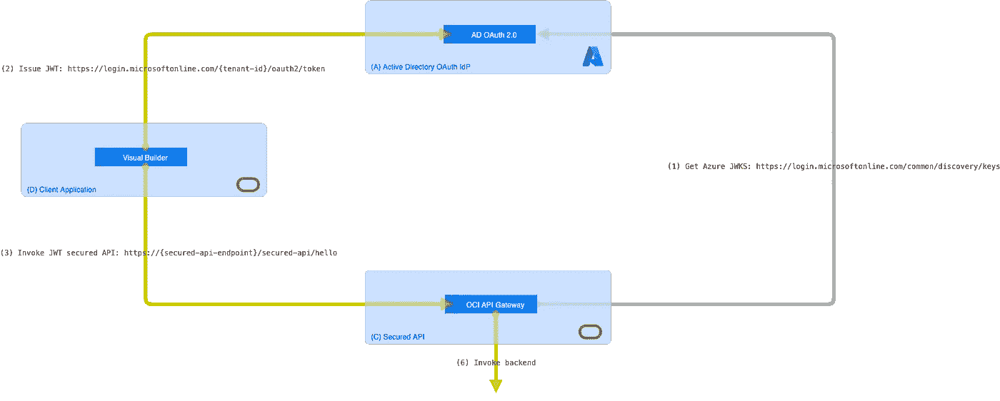

Ideal architecture

由于 JWKS 中与键中缺少`alg`字段相关的某些限制，我们需要在 OCI 开发 JWKS 适配器组件，作为上面序列(1)的代理。JWKS 适配器通过添加必需的`alg`字段来动态修改 JWKS，将其设置为`RS256`。此外，JWKS 适配器通过从密钥中移除`x5c`来减小 JWKS 的总大小。JWKS 适配器是使用函数构建的，API 网关是 OCI。

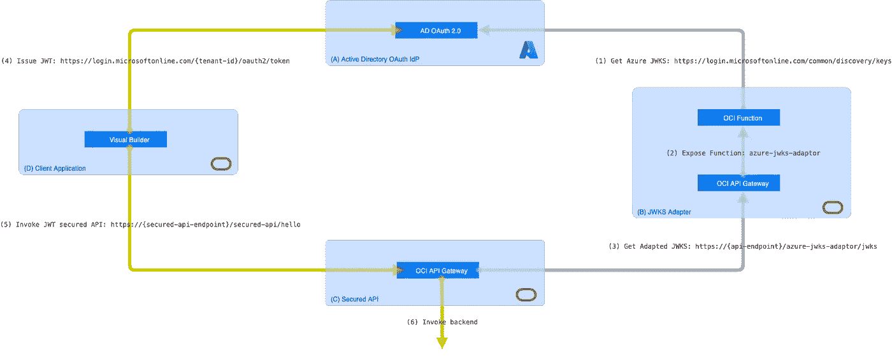

Target architecture with JWKS Adapter component

目标架构由四个主要组件组成:

*   (A)活动目录 OAuth IdP [Azure]
*   JWKS 适配器[OCI]
*   安全 API [OCI]
*   客户应用程序

JWKS 适配器(B)在安全 API 和(A) Active Directory OAuth IdP 之间扮演反向代理的角色。该序列从 API Gateway (3)从另一个 API 部署中检索适配的 jwk 开始，充当该功能的门面。API 部署(2)调用函数，函数(1)调用 Azure JWKS 并动态修改它。当消息被返回给最初的请求者 JWKS 适配器时，它是一组来自 Azure 的修改过的 JWKS，准备在 API Gateway 中使用。

确保遵循以下步骤:

1.  配置(A) Azure Active Directory OAuth IdP
2.  使用 OCI 函数构建和部署(B) JWKS 适配器
3.  使用 API 网关和 JWT 部署安全 API

# 1.配置(A) Azure Active Directory OAuth IdP

在 Azure 控制台上打开 Azure Active Directory。从左侧菜单中选择`App registrations`并按下`New registration`按钮，注册一个新应用程序。

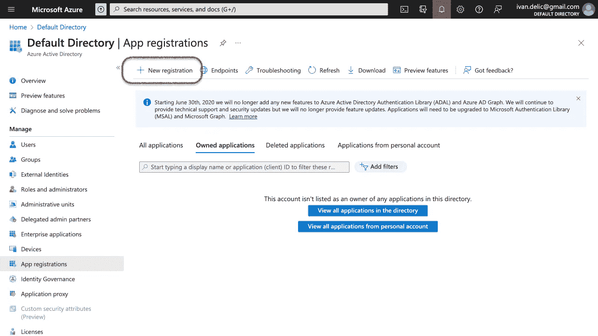

给应用程序起一个友好的名字，选择选项`Accounts in this organizational directory only (Default Directory only - Single tenant)`并按下`Register`。

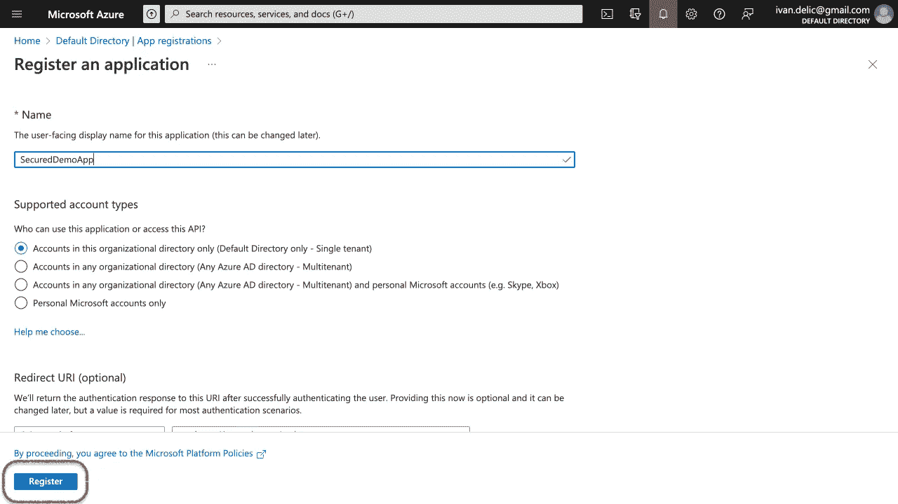

请注意`Application (client) ID`，因为我们将在令牌生成 API 中使用它作为凭证。

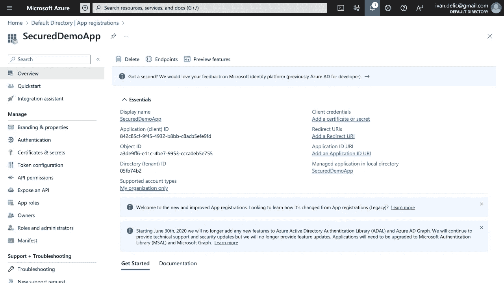

从左侧菜单中选择`Certificates & secrets`并按下`New client secret`按钮。

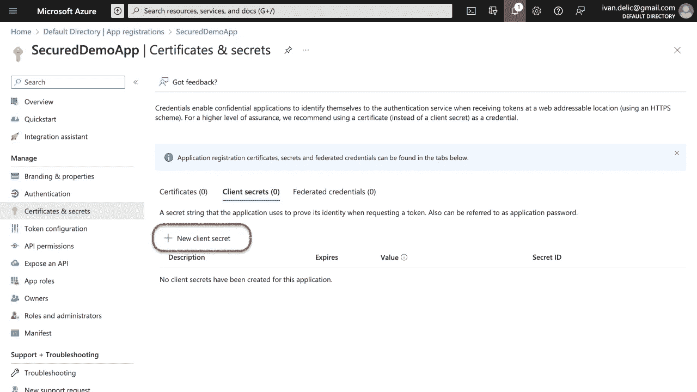

输入简短的密码描述并选择到期选项。默认情况下，密码的到期时间设置为 6 个月。这个秘密将与步骤 3 中的`Application (client) ID`配对。最后，按下`Add`按钮。

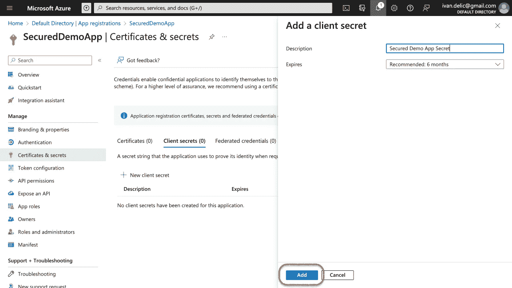

通过复制`Value`字段记录秘密。

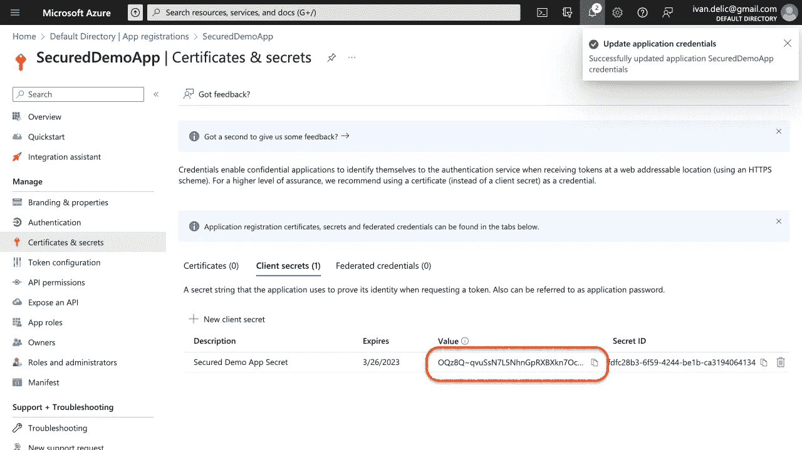

从左侧菜单中选择`Token configuration`并按下`Add optional claim`按钮。然后选择`Access`令牌类型并选择`aud`声明。按下`Add`按钮完成动作。

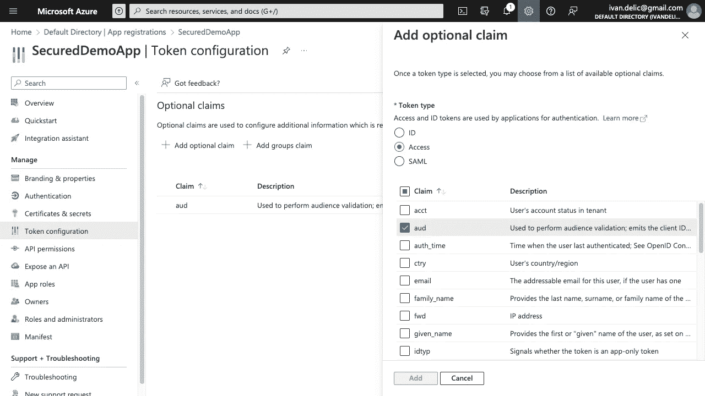

从左侧菜单返回到`Overview`，按`Endpoints`按钮并复制`OAuth 2.0 token endpoint (v1)` URL，该 URL 将用于 JWT 代币的发行。

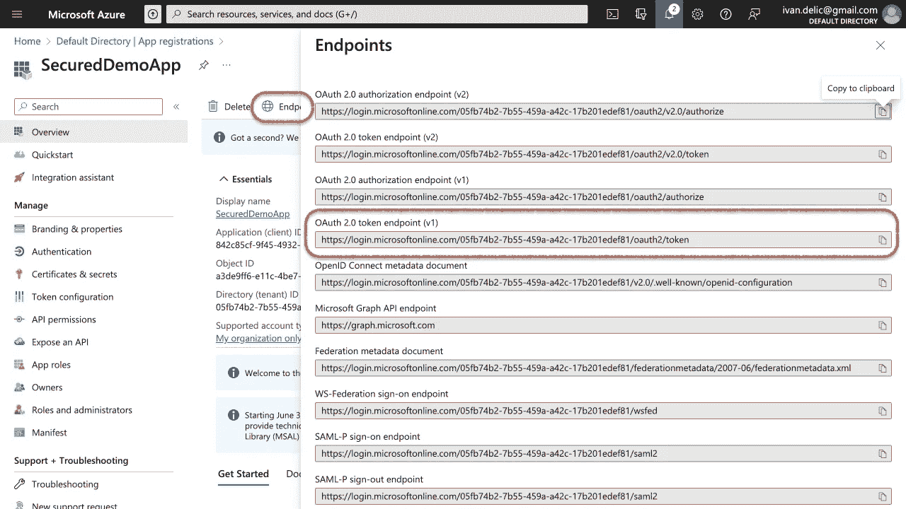

# 2.使用 OCI 函数构建和部署(B) JWKS 适配器

按下`Create application`按钮，为 JWKS 适配器功能创建一个应用程序。

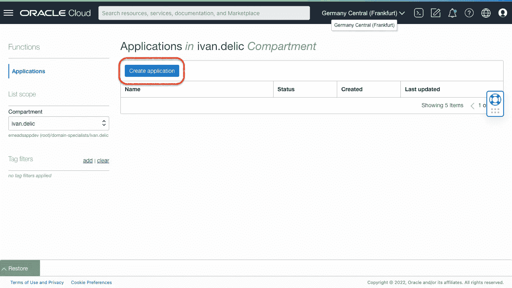

确保您配置了正确的 VCN，并准备好托管 JWKS 适配器功能。输入一个名称(如`jwks-adapter`)并按`Create`。

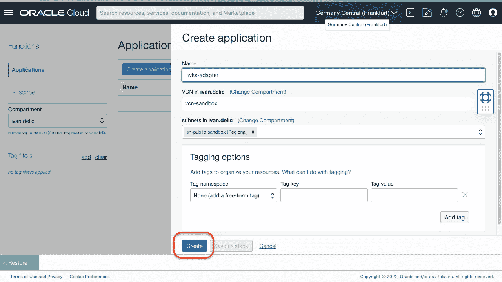

创建应用程序后，从左侧菜单中选择`Getting started`并遵循`Setup fn CLI on Cloud Shell`指南。按照步骤 1 到 7 进行操作。您需要通过按按钮或选择页面右上方的图标来启动云壳。

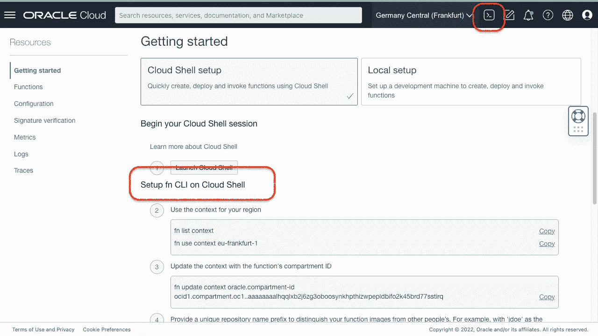

保持云 Shell 打开，从 GitHub 克隆适配器功能

```
git clone [https://github.com/ivandelic/how-to-use-azure-ad-to-secure-oci-api-gateway-with-oauth-and-jwt.git](https://github.com/ivandelic/how-to-use-azure-ad-to-secure-oci-api-gateway-with-oauth-and-jwt.git)
```

进入克隆的存储库，并将适配器功能部署到步骤 1 中创建的应用程序。确保`--app`参数等于应用程序名称。

```
fn -v deploy --app jwks-adapter
```

通过调用来测试新部署的函数

```
fn invoke jwks-adapter azure-jwks-transformator
```

如果配置正确，它应该返回类似于:

```
ivan_delic@cloudshell:~ (eu-frankfurt-1)$ fn invoke jwks-adapter azure-jwks-transformator {"keys":[{"kty":"RSA","use":"sig","kid":"nOo3ZDrODXEK1jKWhXslHR_KXEg","x5t":"nOo3ZDrODXEK1jKWhXslHR_KXEg","n":"oaLLT9hkcSj2tGfZsjbu7Xz1Krs0qEicXPmEsJKOBQHauZ_kRM1HdEkgOJbUznUspE6xOuOSXjlzErqBxXAu4SCvcvVOCYG2v9G3-uIrLF5dstD0sYHBo1VomtKxzF90Vslrkn6rNQgUGIWgvuQTxm1uRklYFPEcTIRw0LnYknzJ06GC9ljKR617wABVrZNkBuDgQKj37qcyxoaxIGdxEcmVFZXJyrxDgdXh9owRmZn6LIJlGjZ9m59emfuwnBnsIQG7DirJwe9SXrLXnexRQWqyzCdkYaOqkpKrsjuxUj2-MHX31FqsdpJJsOAvYXGOYBKJRjhGrGdONVrZdUdTBQ","e":"AQAB","alg":"RS256"},...]}
```

从 OCI 菜单中找到你的 API 网关，选择`Deployments`，按`Create deployment`。这将使我们的适配器函数成为可调用的。

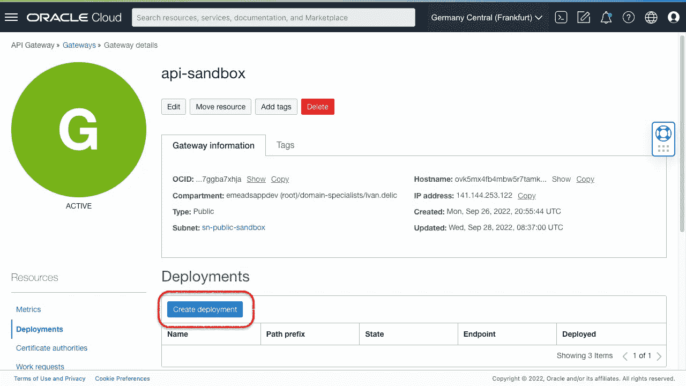

填充`Name`和`Path`并按下`Next`。

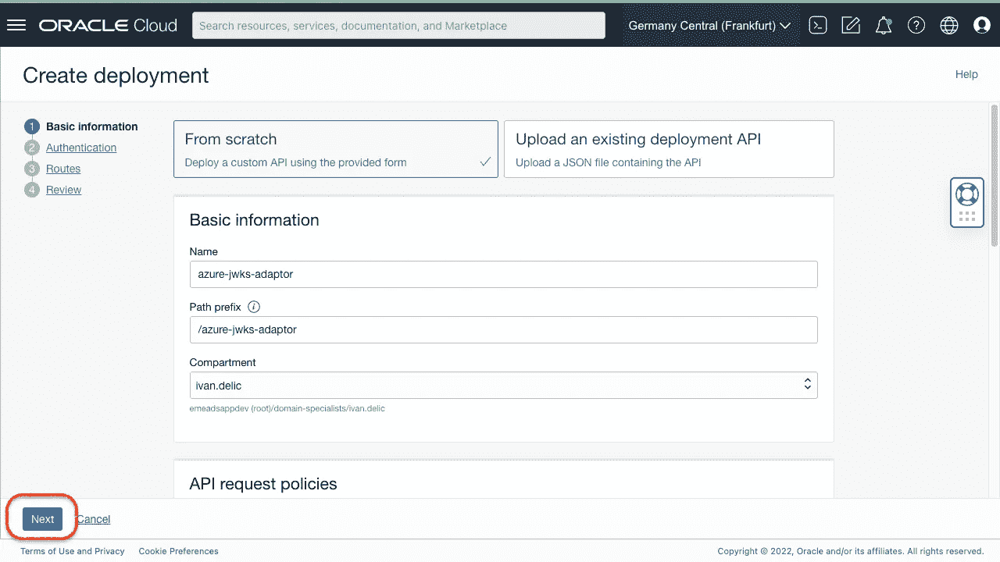

将部署留给`No Authentication`，因为它将只用于代理和修改 Azure JWKS，并使其适应 API Gateway 的预期格式。按下`Next`继续。

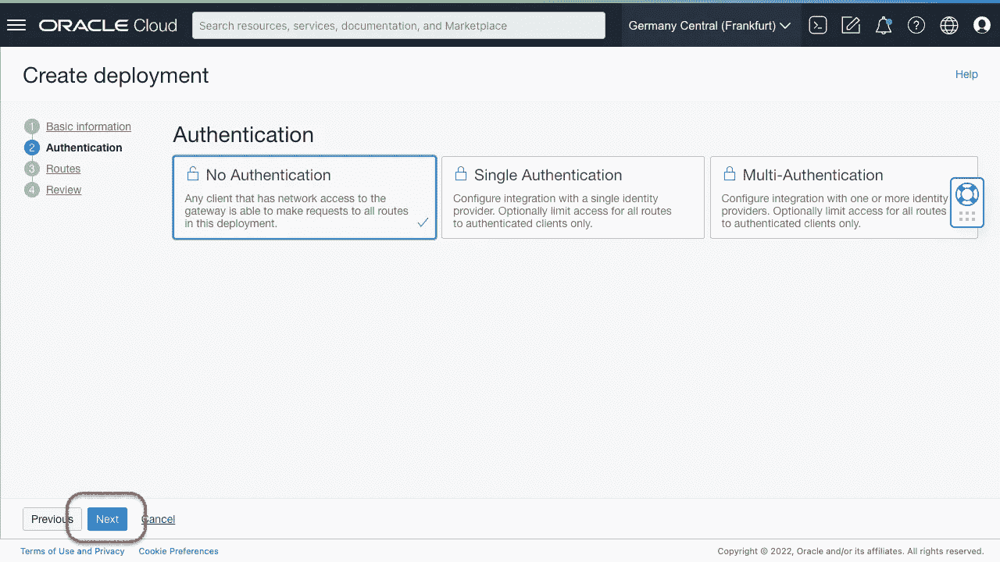

创建一条路线，定义一个`Path`和`Methods`。用`Oracle functions`类型选择`Single backend`。选择在前面步骤中部署的应用程序和功能。

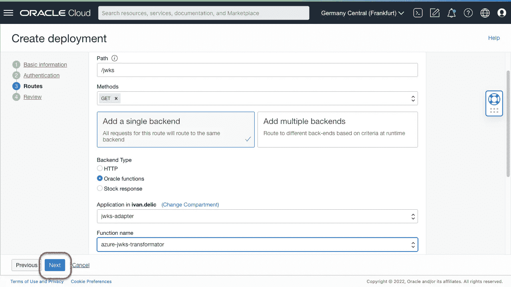

查看部署并按下`Create`。

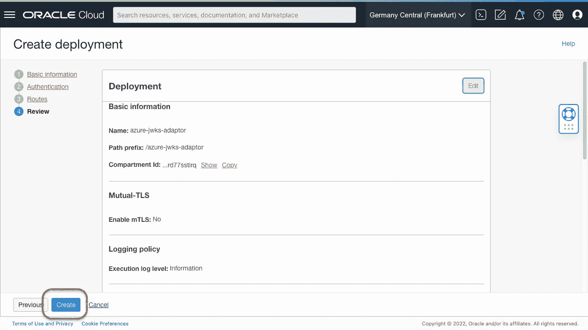

等到展开处于`Active`状态，复制`Endpoint`。

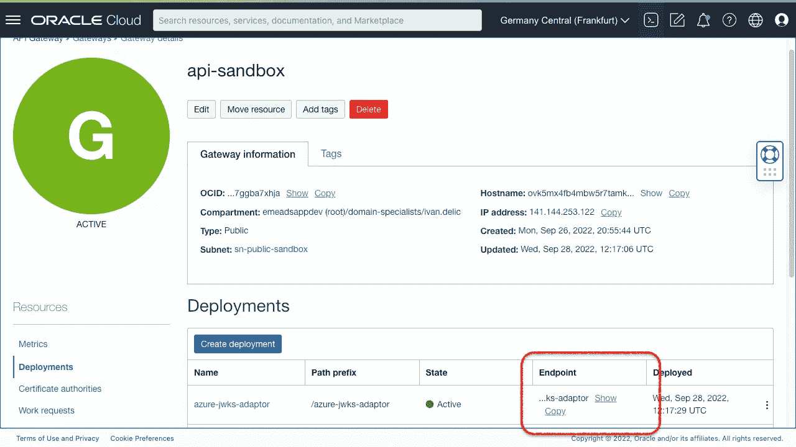

使用 Postman 或类似的工具来测试端点。它应该检索带有修改值的 Azure JWKS。粘贴复制的端点，并在其后添加步骤 10 中的`Route`路径。

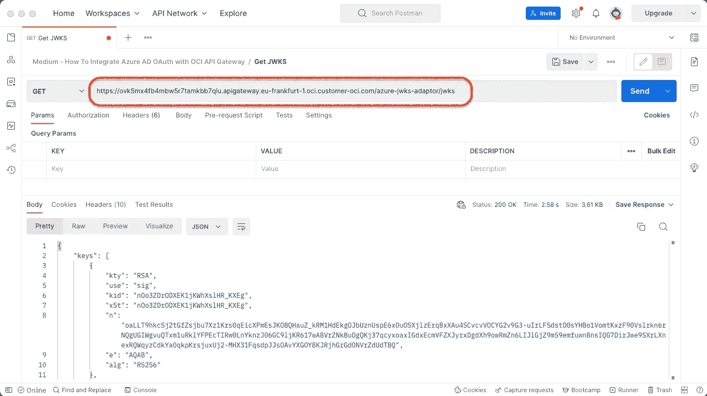

# 3.使用 API 网关和 JWT 部署安全 API

从 OCI 菜单中找到您的 API 网关，选择`Deployments`，然后按`Create deployment`。我们将创建一个由 JWT 保护的 API。


填充`Name`和`Path`并按下`Next`。

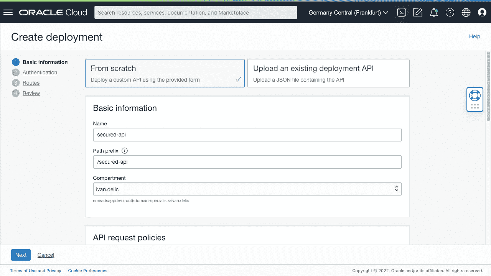

我们将使用 JSON Web Token (JWT)来保护 API。在认证步骤下，选择`Single Authentication`。将 JWT 令牌位置选择到`Header`，并将标题名称定义到`Authorization`。使用认证方案`Bearer`。按下`Next`继续。

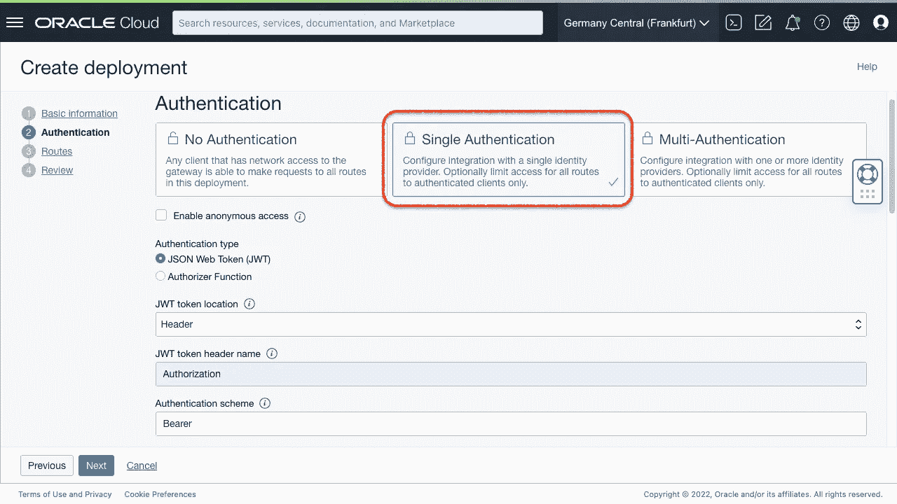

定义`Allowed issuer`和`Allowed audience`。既然我们用的是 v1 令牌 API，`Allowed issuer`就应该设为`https://sts.windows.net/{tenant-id}/`。将{tenant-id}替换为您的 Azure 租户 id。`Allowed audience`应该包含`aud`索赔值，默认情况下，除非明确设置，否则为`00000002-0000-0000-c000-000000000000`。

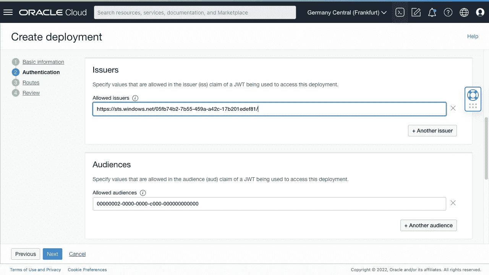

对于公钥，确保选择`Remote JWKS`并输入`JWKS URI`以匹配`JWKS Adapter`功能的部署

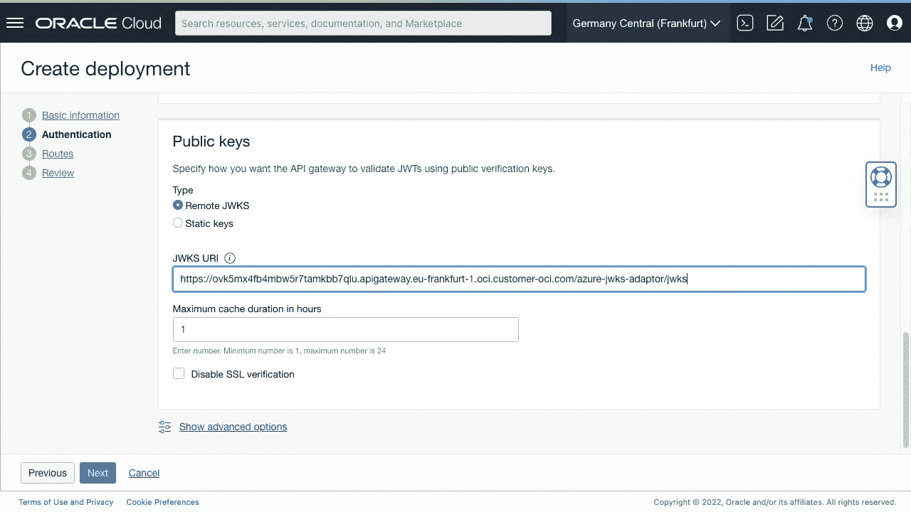

创建一条路线，定义一个`Path`和`Methods`。用`Stock response`类型选择`Single backend`。定义简单的正文和状态代码。按下一步继续。

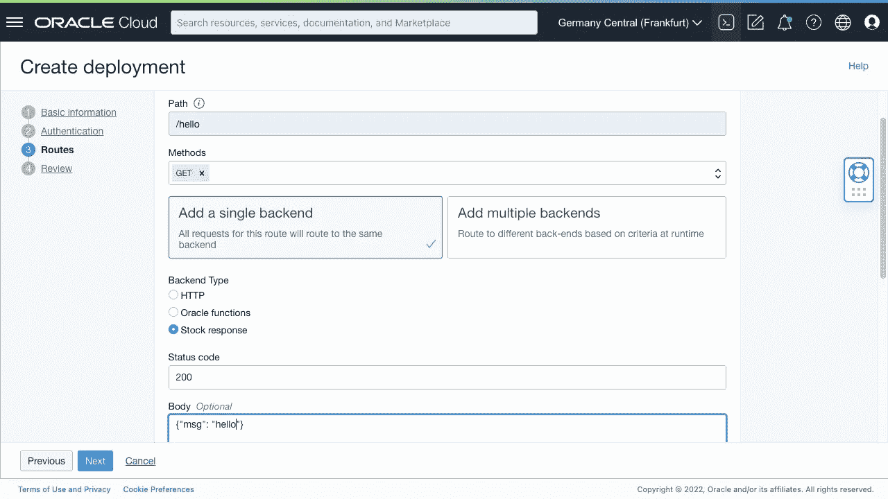

查看部署并按下`Create`。

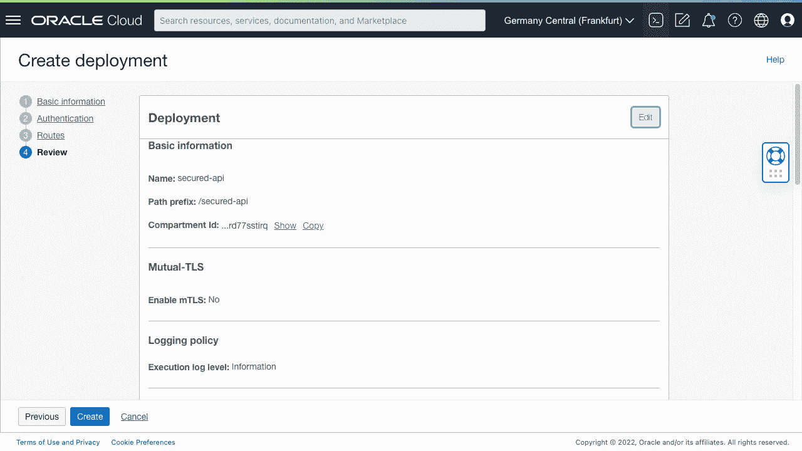

等到展开处于`Active`状态，复制`Endpoint`。

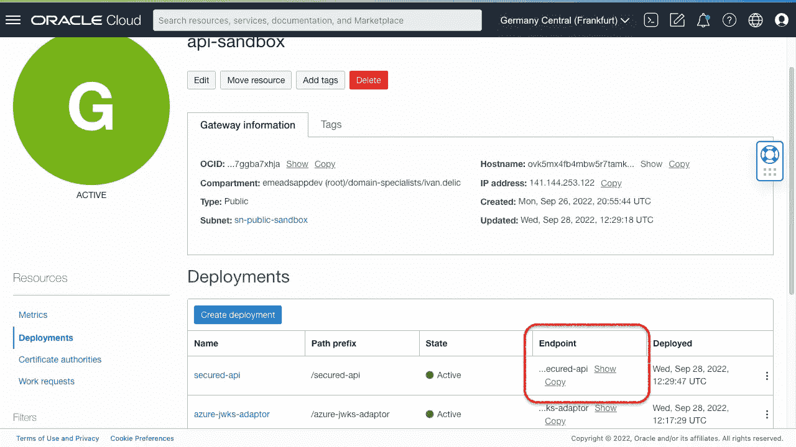

使用 Postman 从 Azure AD 中检索 JWT 令牌。输入令牌 API URL[https://login.microsoftonline.com/{tenant-id}/oauth2/token](https://login.microsoftonline.com/%7Btenant-id%7D/oauth2/token)，同时用您的 Azure 租户 id 替换{tenant-id}。发送请求并复制`access_token`值。

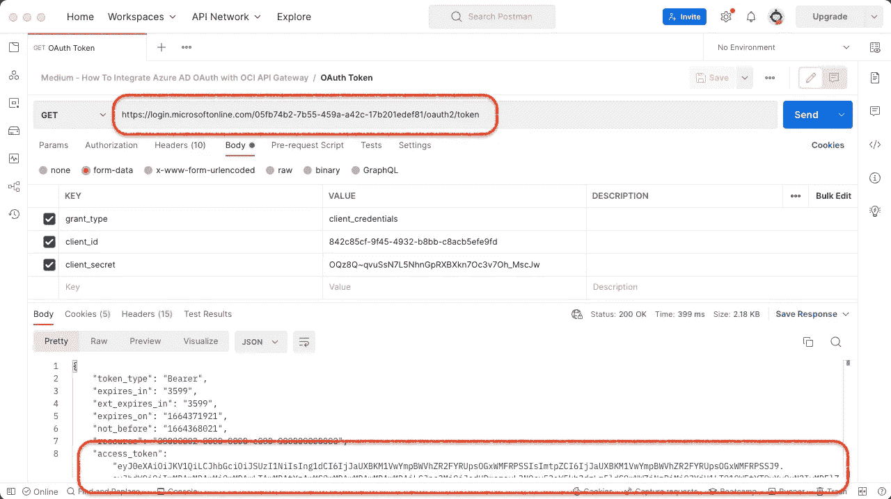

最后，使用 Postman 测试安全的 API 端点。粘贴复制的端点，并在其后添加步骤 6 中的`Route`路径。添加授权头，使用承载方案，并粘贴上一步中颁发的 JWT 令牌。

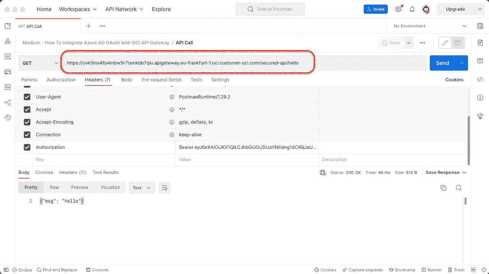

就是这样。您已经使用 Azure AD JWT 保护了 API 网关部署。

如果你对甲骨文开发人员在他们的自然栖息地发生的事情感到好奇，来[加入我们的公共休闲频道](https://bit.ly/odevrel_slack)！

如果您还没有注册，现在就可以[注册 Oracle 云免费层帐户](https://signup.cloud.oracle.com/?language=en)。如果你对如何开始学习 OCI 感兴趣，注册是第一步，没有必要跟着这篇文章走。