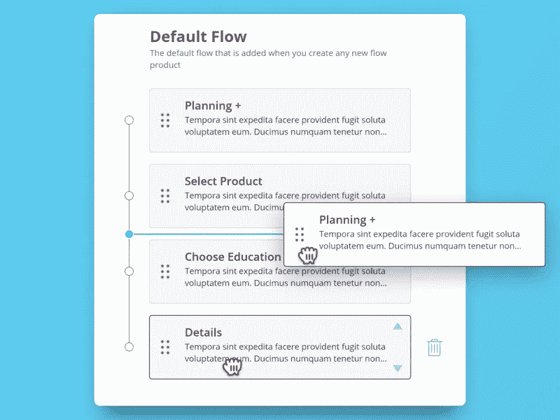

# 如何在 Mendix 中使用卡片

> 原文：<https://medium.com/mendix/how-to-use-cards-in-mendix-f63d1ab00869?source=collection_archive---------0----------------------->

## 为什么卡不是导航卡

> 从原始媒体文章[复制到这里](https://uxplanet.org/why-cards-are-not-navs-4316f5b93376)

*一段时间以来，我一直试图解决的问题是:为什么“活动状态”不适用于卡片，这篇博客探讨了卡片和导航之间的抽象区别。*

# 可视化用户界面语言

创建界面时，确保有一致的“视觉语言”是很重要的。

视觉语言是一种表达“用户是否清楚当他们点击一个元素时会有什么样的交互”的方式。
最常见的交互包括改变你在层次结构中的位置，或者保留层次结构并改变页面上的元素(你是在网站中更深入还是向侧面移动)。

# 改变层次结构

改变层次结构的一个常见例子是文本中的彩色超链接，你知道当你点击它们时，你会失去你所在的页面，并转到链接所指向的页面。本质上改变了你在等级中的位置。

# 保留层次结构

保持层次结构的一个例子是顶部导航。当你点击一个项目时，你将进入那个页面，但是菜单在你进入的页面上仍然是可见的。从等级的角度来看，你是横向移动，而不是上下移动。

# 卡片与列表

*这不是一个明确的指南，您的设计语言可能会因网站和应用程序设计、移动和桌面模式、复杂性或只是品味和趋势的差异而有所不同。*

卡片清单

# 卡片

卡片是一个自包含的 UI 元素，包含关于单个主题的信息，并且可以进行交互。用正常人的话来说:一张卡片有一些信息，可以点击。

卡片应该像超链接一样工作，一旦点击，你就可以进入关于卡片的页面。

带有卡片设计的导航列表

# 导航列表

导航列表通常在视觉上与卡片相同，除了通常有一个可见的内容面板，当你选择一个导航列表项时，你会期望面板的内容会改变。

导航列表项的工作方式更像导航，当你点击它们时，它们仍然可见，但是页面上的元素发生了变化。

如果你想知道为什么我们称它为导航项目“列表”,看看这篇文章。

最常见的例子是 outlook 如何处理收到的电子邮件列表。

# 嵌板

有时，您希望将内容分组在一起，使其看起来更好，而不存在与卡片相关的任何交互(仪表板指标)。为了避免混淆“可点击卡片”和“不可点击卡片”,我们使用术语“面板”。这意味着我们也可以稍微改变它的风格，让每个人的生活稍微轻松一点。

# 卡片状元素(高级)

[https://dribbble . com/shots/6379838-拖放式启示](https://dribbble.com/shots/6379838-Drag-and-Drop-Affordances)

# 可拖动列表项

有时你想拖动一个元素(像特雷罗或吉拉)，有时这是一张卡片，有时这是一个列表项。就我个人而言，我喜欢有某种视觉提示(启示)来表明这是可以做到的。另一个可以考虑的最佳实践是添加按钮，因为由于技术限制或用户残疾，拖动并不总是可行的。

# 具有嵌套动作的卡片

根据 W3C 的 [HTML5 Spec 文档:你不允许在一个锚标签中嵌套某些元素(比如按钮)，一张卡片通常是一个巨大的锚标签。](https://stackoverflow.com/questions/6393827/can-i-nest-a-button-element-inside-an-a-using-html5)

也就是说，有很多例子可以让你在卡片中添加可点击的元素，比如喜欢、收藏、分享、删除或任何其他微交互。

我不确定最佳实践是什么，用它来反对你的最佳判断，并努力记住可访问性。

【https://dribbble.com/shots/5921662-Radio-Buttons 

# 单选/复选框卡

另一个你经常在高“终端用户交互质量”的应用中看到的例子是当卡片被用来选择一个选项时。这些元素的工作方式类似于单选按钮或复选框，但有更多的上下文。

它们甚至不是真正的卡片，它们只是单选按钮，比普通的单选按钮拥有更多的内容。通常有一个视觉提示，可以选择或检查它们。

# 结论

如果它有一个选择/激活状态，它可能不是一个“卡”。

使用卡片来改变你在等级中的位置。

使用列表来保留您在层次结构中的位置。

卡片可以被设计成列表，反之亦然(但尽量不要这样)。

不可点击的卡片应该被称为面板。

尽量不要在卡片中嵌套可点击的项目。

# 编辑 1。

在和朋友进行了一些有趣的讨论后，主要的收获是；如果把设计和交互分开会发生什么？卡片是一种设计元素，可以放在不同的交互上，比如超链接、导航元素和可拖动列表项。唯一需要回答的是:一旦一张卡片被点击，它的交互会是什么样的，这一点清楚吗？