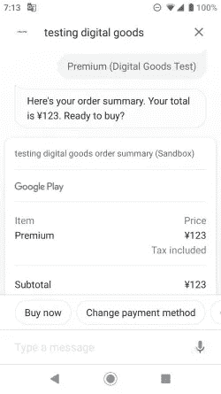

# 如何将数字商品交易用于您的行动

> 原文：<https://medium.com/google-developer-experts/how-to-use-digital-goods-transactions-for-your-action-90747d1fa0e9?source=collection_archive---------3----------------------->

谷歌助手已于 2018 年 5 月推出，到本文撰写时已经过去了 31 个月。目前，谷歌助手有许多功能，而且数量与日俱增。在特性中，有一些特性我们可以在业务行动中使用。

*   用户认证
*   实物/数字商品购买

我用一些故事来介绍数字商品交易。这些故事的目的是让你了解谷歌上的数字商品交易活动，并了解如何将其融入你的行动中。

# 故事

阅读以下故事，了解如何在您的行动中使用数字商品交易:

 [## 谷歌上的数字商品交易行为(概述)

### 谷歌助手已于 2018 年 5 月推出，到本文撰写时已经过去了 31 个月。目前，谷歌…

medium.com](/@yoichiro/digital-goods-transaction-of-actions-on-google-overview-e833b2725091)  [## 谷歌上的行动数字商品交易(建立 Android 应用程序)

### 在前面的故事中，我描述了 Google 上 Actions 提供的数字商品交易特性的概述。

medium.com](/@yoichiro/digital-goods-transaction-of-actions-on-google-build-android-app-59fdb221cfb)  [## 谷歌上的行动数字商品交易(创建行动)

### 在之前的故事中，我描述了如何创建一个 Android 应用程序，并将其上传到 Google Play…

medium.com](/@yoichiro/digital-goods-transaction-of-actions-on-google-create-action-c3dbe86e8048)  [## Google 上 actions 的数字商品交易(连接 Action 和 Android 应用)

### 直到上一个故事，你有三个项目:谷歌项目的行动，对话流代理和谷歌上的 Android 应用程序…

medium.com](/@yoichiro/digital-goods-transaction-of-actions-on-google-connect-action-and-android-app-60b4dc3b281e)  [## 谷歌上的行动数字商品交易(准备行动 API)

### 在之前的故事中，你可以将你在 Google project 上的操作连接到 Google Play 上的 Android 应用程序。要访问…

medium.com](/@yoichiro/digital-goods-transaction-of-actions-on-google-prepare-for-actions-api-189d6cb7bf7d)  [## 谷歌上的数字商品交易行为(注册产品)

### 通过前面的故事，你已经有了一个测试数字商品交易的环境。现在，您可以管理…

medium.com](/@yoichiro/digital-goods-transaction-of-actions-on-google-register-products-e17e0136ab74)  [## 谷歌上的数字商品交易行为(编写代码和测试)

### 从第 1 部分到第 6 部分，我描述了如何准备使用数字商品交易功能。现在，你…

medium.com](/@yoichiro/digital-goods-transaction-of-actions-on-google-write-code-and-test-9cb352e8d3db)  [## 谷歌上的数字商品交易行为(消费产品)

### 作为最后一个故事，我在这个故事中描述了如何实现一个功能来消费数字商品。

medium.com](/@yoichiro/digital-goods-transaction-of-actions-on-google-consume-products-e40e534512e1) 

# 官方参考文件

您可以从以下文档中看到官方数字商品交易参考:

 [## 构建数字交易| Google 上的行动| Google 开发者

### 要向数字采购 API 发送请求，您需要下载一个与您的……

developers.google.com](https://developers.google.com/actions/transactions/digital/dev-guide-digital)