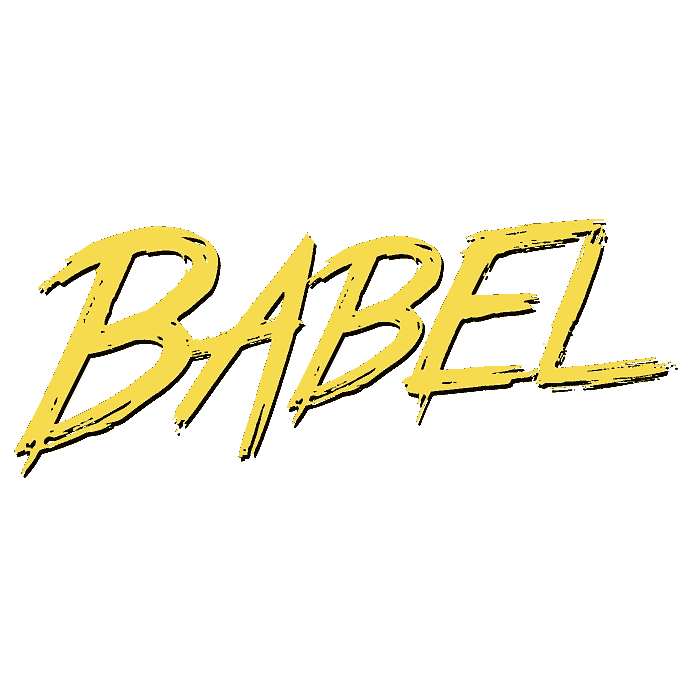

# 如何将 ES6 用于通用 JavaScript 应用程序

> 原文：<https://medium.com/javascript-scene/how-to-use-es6-for-isomorphic-javascript-apps-2a9c3abe5ea2?source=collection_archive---------2----------------------->

现在尘埃落定，我终于开始将 ES6 用于生产应用——因为我编写了[通用 JavaScript](https://github.com/ericelliott/isomorphic-express-boilerplate) ，它必须适用于 Node.js 和浏览器。

这不会是一个关于 ES6 特性或者[通用 JavaScript](/@mjackson/universal-javascript-4761051b7ae9) (又名同构 JavaScript)的深度教程。我们将介绍一些基础知识，帮助您开始运行。



# 使用巴别塔

Babel.js 是一个很棒的工具，可以让你将 ES6 代码转换成可以在今天的 JavaScript 环境中运行的 ES5 代码，包括 Node.js 和浏览器，但是不清楚如何设置它。

## 安装巴别塔

几乎你找到的每一个教程都会告诉你在全球范围内安装 Babel。如果没有人必须共享您的代码，这很好，但是如果您在一个团队中或者正在开发开源库，那么也要在本地安装每个包:

```
$ npm install -g babel-cli
$ npm install --save-dev babel-cli babel-preset-es2015 babel-preset-stage-0
```

现在你可以启动*`巴别塔节点`* CLI/REPL:

```
$ babel-node
> Object.assign({}, {msg: 'wow!'}); // => { msg: 'wow!' }
```

对于浏览工作流，您可能也需要这些:

```
$ npm install --save-dev babelify browserify
```

这将允许您使用所有很酷的新 ES6 语法，如箭头函数:

```
(x) => x + 1;
```

但是它不会让你使用新的内置方法，比如 *`Object.assign()`* ， *`Object.is()`* 等等…

这并不是显而易见的，因为这些特性在使用 *`babel-node`* REPL 时非常好用:

```
Object.is(NaN, NaN); // => true
```

幸运的是，这可以通过 polyfill 轻松解决:

```
$ npm install --save core-js
```

然后，在条目文件的顶部:

```
import 'core-js';
```

## 林挺

担心你将不得不放弃林挺你的代码？别担心。ESLint 为您提供服务！

```
$ npm install --save-dev eslint babel-eslint
```

> 这是我正在试验的。

ES6 love 在 *`env`* 和 *`ecmaFeatures`* 键中。当 ESLint 遇到特定于 ES6 的代码时，您需要这些来防止错误。

如果你还想要对象 rest & spread ( [一个 ES7 提议](https://github.com/sebmarkbage/ecmascript-rest-spread)常用于 React 代码)，你还需要[*` babel-eslint`*](https://github.com/babel/babel-eslint)*。*

## 收集

在大多数情况下，您可以简单地将您的 *`node`* 调用替换为 *`babel-node`* 调用。 *`babel-node`* 在内存中缓存模块，因此会有很大的启动延迟和潜在的大量内存使用。考虑将 to 编译成 ES5 用于生产。请继续阅读。

Babel 的文档让编译看起来轻而易举:

```
$ babel script.js --out-file script-compiled.js
```

再简单不过了，对吧？好吧，如果你不尝试导入任何模块，当然，这将工作得很好。但是如果你做一些不平凡的事情，你会想要编译你的整个代码库，而不仅仅是一个文件。为此，您需要使用 *`-d`* 选项。

```
$ babel -d build-dir source-dir
```

注意，输出目录在最前面。

如果您想让调试器正常工作，您将需要使用 *`-s`* 选项添加源映射:

```
$ babel -d build-dir source-dir -s
```

这样做将告诉 Babel，对于它编译的每个文件，它还应该生成一个源映射文件，当您在引擎中单步执行实时代码时，该文件将告诉调试器在哪里可以找到原始源代码。换句话说，您将看到自己编写的代码，而不是 Babel 生成的编译输出。这通常是你想要的。

要为浏览器编译，你需要使用 [Webpack](http://webpack.github.io/) ，或者 Babelify Browserify 转换。我通常在终端使用 babelify 进行快速编译。例如，要运行一些单元测试:

```
npm install -g browserify browser-run
browserify -t babelify script.js | browser-run -p 2222
```

1.  安装 *`browserify`* 和 *`browser-run`* ，这样你就可以在终端的任何地方使用它们。
2.  从 *`script.js`* 创建一个包，并在 chrome 中运行该脚本。从您最喜欢的浏览器中点击 [http://localhost:2222](http://localhost:2222) ，脚本将在浏览器中运行。控制台日志输出将通过管道返回到控制台。

编译一个包:

```
$ browserify script.js -t babelify --outfile bundle.js
```

配置 Webpack 对于这个快速教程来说太多了，但是如果你想跳过所有的无用功，你可以使用这个[样板用于生产模块](https://github.com/cloverfield-tools/prod-module-boilerplate)。

## 使用现有模块

使用上述工具，您可以使用 ES6 语法导入 ES6 和节点样式的模块:

```
import 'core-js'; // Node module
import harness from './harness'; // ES6 module
```

所以你可以在你的现代 ES6 代码库中继续使用你将在大规模 npm 生态系统中找到的所有标准模块——但是由于这么多人仍在使用 ES5，我建议你向 npm 发布你的模块的编译版本。

对于公共库，我把源码放在一个 *`source`* 目录下，把 ES5 编译在 *`dist`* 或者 *`lib`。*目前来看，用*` package . JSON`**中的 *`main`* 键指向编译后的 ES5 版本可能是个好主意。*

## 自动化

我喜欢将这些命令放在我的 npm 脚本中:

## 反应

React 用户的额外收获是:你也被覆盖了。巴贝尔和埃斯林都支持 JSX。不错！

**编辑:**截止到 2015 年 11 月 8 日，Babel 6 API 的改动已经打破了 babel-react-transform。如果需要，可以安装最新兼容版本的 Babel:

```
npm install --save-dev babel@5.8.29
```

## 聚会时间

恭喜你！您已经准备好将 ES6 用于您的通用应用程序。如果你想知道，这里有一些我最喜欢的 ES6 的东西，你应该探索一下:

*   压缩对象文字
*   解构
*   箭头函数(非常适合单线 lambdas)
*   默认参数
*   休息参数
*   发电机

您应该马上记住新的默认/覆盖模式:

> 尽情享受吧！

> [跟随 Eric Elliott 学习 ES6](https://ericelliottjs.com/product/lifetime-access-pass/)

***埃里克·埃利奥特*** *是《编程 JavaScript 应用程序》* *(奥赖利)的作者，纪录片制作人，* ***【编程素养】*** *。他曾为****Adobe Systems*******尊巴健身*******华尔街日报*******ESPN*******BBC****等顶级录音师贡献过软件经验*****

**他大部分时间都在旧金山湾区和世界上最美丽的女人在一起。**