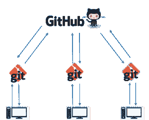
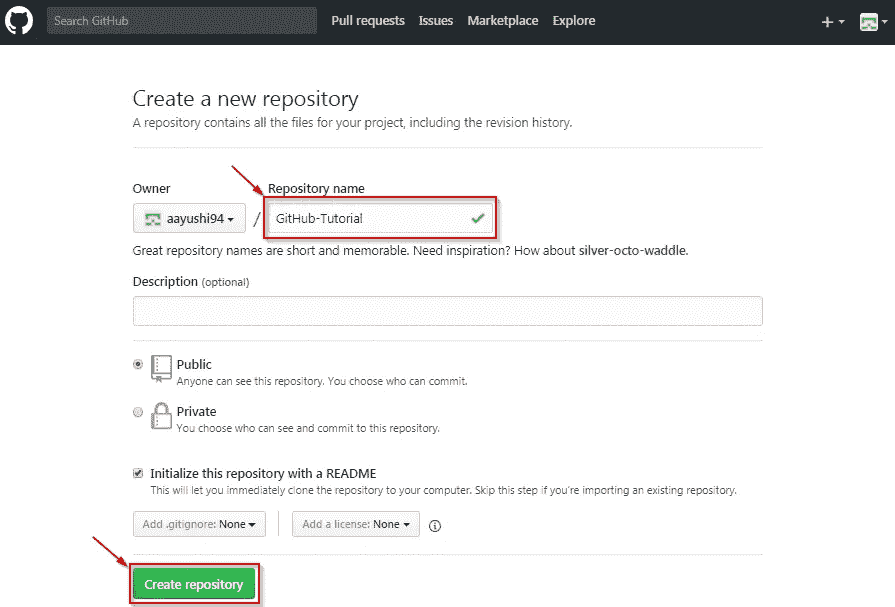
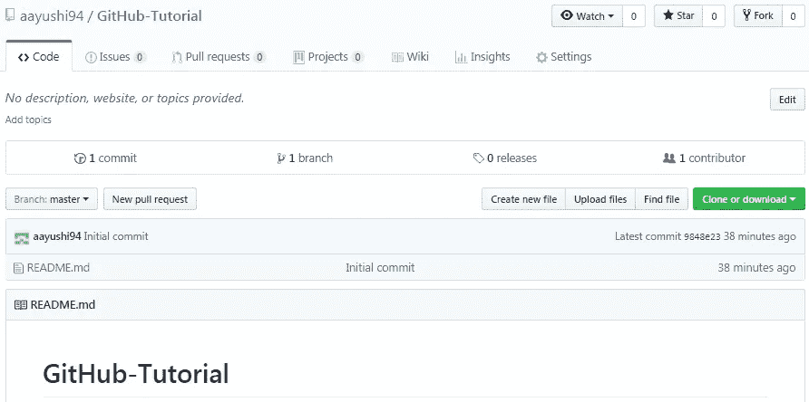
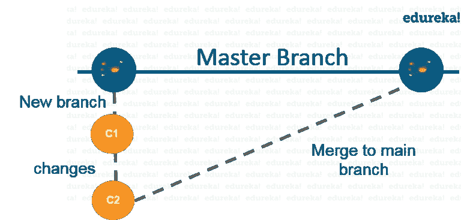
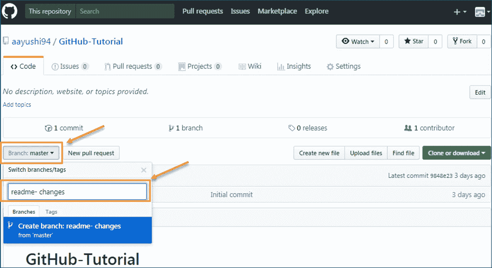
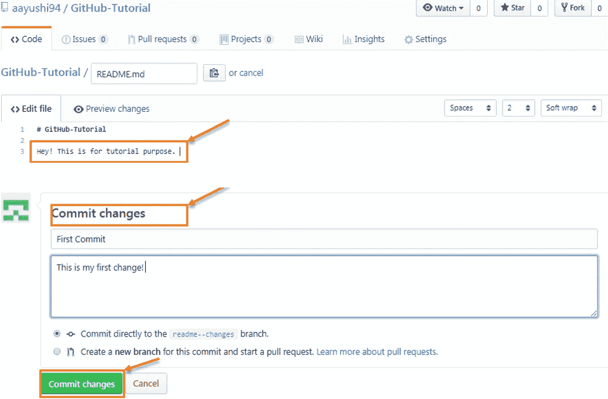
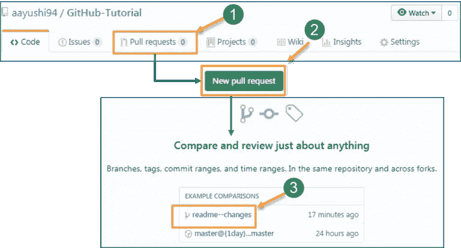
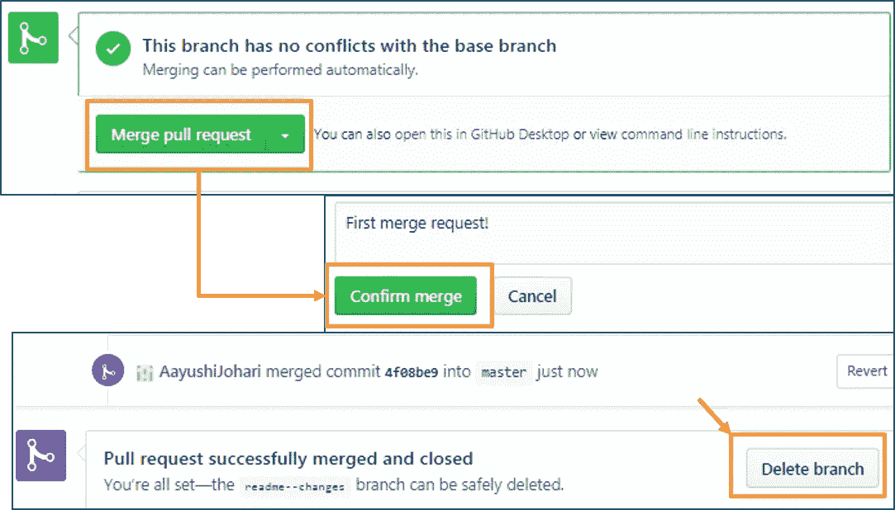
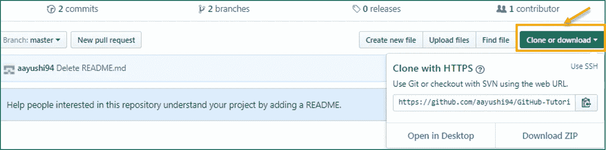
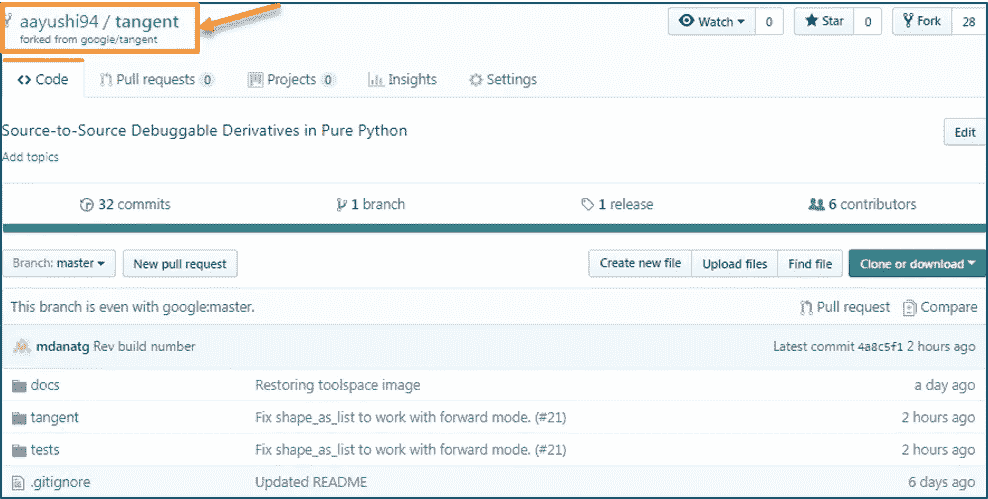

# 如何使用 GitHub——使用 GitHub 的开发者协作

> 原文：<https://medium.com/edureka/how-to-use-github-156e1624eb04?source=collection_archive---------8----------------------->

如果你是一个不知道如何使用 GitHub 的人，那么这个博客就是为你准备的。Github 是一个基于网络的平台，用于版本控制。Git 简化了与其他人合作的过程，使项目协作变得容易。团队成员可以处理文件，并轻松地将他们的更改合并到项目的主分支中。慢慢地从首选技能变成了多种工作角色的必备技能。在这篇博客中，我将带您了解 GitHub 的各种功能和能力。

在这篇“如何使用 Github”文章中，您将了解到:

*   Github 简介
*   在 Github 中创建存储库
*   创建分支并执行操作
*   克隆和派生 Github 存储库

坦率地说，GitHub 到底是什么，它是一种与不同的人合作的文件或代码共享服务。

GitHub 是一个使用率很高的软件，通常用于版本控制。当不止一个人在一个项目中工作时，这是很有帮助的。比方说，一个软件开发团队想要建立一个网站，每个人都必须在项目工作的同时更新他们的代码。在这种情况下，Github 帮助他们建立一个集中的存储库，每个人都可以上传、编辑和管理代码文件。

# Github 为什么这么受欢迎？

GitHub 有各种优势，但许多人经常有一个疑问，为什么不使用 dropbox 或任何基于云的系统？让我举同样的例子来回答这个问题。假设两个以上的软件开发人员正在处理同一个文件，他们想同时更新它。不幸的是，首先保存文件的人将优先于其他人。而在 Github 中，情况并非如此。Github 记录了这些变化，并以一种有组织的方式反映出来，以避免上传的任何文件之间出现混乱。因此，使用 GitHub 集中式存储库，它避免了所有的混乱，并且处理相同的代码变得非常容易。

如果你看左边的图片，GitHub 是一个中央存储库，Git 是一个允许你创建本地存储库的工具。现在人们通常会混淆 git 和 GitHub，但实际上它们是非常不同的。Git 是一个版本控制工具，允许你执行各种操作，从中央服务器获取数据或将数据推送到中央服务器，而 GitHub 是一个用于版本控制协作的代码托管平台。GitHub 是一家允许您在远程服务器上托管中央存储库的公司。

现在让我列出 GitHub 简化 git 的方法:

*   GitHub 为您提供了一个漂亮的可视化界面，帮助您在本地跟踪或管理您的版本控制项目。
*   一旦你在 GitHub 上注册，你就可以和社交网络建立联系，建立一个强大的档案。

所以让我们从 GitHub 开始吧。

# 第二步:如何创建 GitHub 资源库？

存储库是项目所在的存储空间。它可以是您电脑上的本地文件夹，也可以是 GitHub 或其他在线主机上的存储空间。您可以在存储库中保存代码文件、文本文件、图像或任何类型的文件。当你做了一些修改并准备上传时，你需要一个 GitHub 库。这个 GitHub 存储库充当您的远程存储库。因此，让我简化您的任务，只需遵循以下简单步骤来创建 GitHub 存储库:

*   去链接:[https://github.com/](https://github.com/)。填写注册表格并点击“注册 Github”。
*   点击“开始一个新项目”。

参考下面的截图，以获得更好的理解。

*   输入任意存储库名称，然后单击“创建存储库”。您还可以对您的存储库进行描述(可选)。

现在，如果你注意到默认情况下 GitHub 存储库是公开的，这意味着任何人都可以查看这个存储库的内容，而在私有存储库中，你可以选择谁可以查看内容。此外，私有存储库是一个付费版本。此外，如果您参考上面的屏幕截图，用一个自述文件初始化存储库。此文件包含文件的描述，一旦您选中此框，这将是您的存储库中的第一个文件。

祝贺您，您的存储库已成功创建！它看起来像下面的截图:

现在，我的中央存储库已经成功创建了！完成后，您就可以提交、拉、推和执行所有其他操作了。现在让我们向前看，理解 GitHub 中的分支。

# 步骤 3:创建分支并执行操作

**分支:**分支帮助您同时处理不同版本的存储库。假设您想要添加一个新特性(处于开发阶段)，同时您担心是否要对您的主项目进行更改。这就是 git 分支拯救的地方。分支允许您在项目的不同状态/版本之间来回移动。在上面的场景中，您可以创建一个新的分支，并在不影响主分支的情况下测试新的特性。一旦您完成了它，您就可以将变更从新分支合并到主分支。这里的主分支是主分支，默认情况下它在您的存储库中。为了更好地理解，请参考下图:

如上图所示，有一个主/生产分支，它有一个新的测试分支。在这个分支下，完成了两组变更，一旦完成，就合并回主分支。这就是分支的工作原理！
让我们继续“如何使用 GitHub”博客，学习如何创建分支。

要在 GitHub 中创建分支，请遵循以下步骤:

*   点击下拉菜单“分支:主”
*   只要您单击分支，您就可以找到一个现有的分支，或者创建一个新的分支。在我的例子中，我正在创建一个名为“readme- changes”的新分支。为了更好的理解，请参考下面的截图。

一旦您创建了一个新的分支，现在您的存储库中就有了两个分支，即自述文件(主分支)和自述文件更改。新分支只是主分支的副本。因此，让我们在新分支中执行一些更改，使它看起来与主分支不同。

此操作帮助您保存文件中的更改。当您提交文件时，您应该总是提供消息，只是为了记住您所做的更改。虽然这个消息不是必须的，但是我们总是推荐它，这样它可以区分到目前为止您对您的存储库所做的各种版本或提交。这些提交消息维护更改的历史，这反过来帮助其他参与者更好地理解文件。现在，让我们按照以下步骤进行第一次提交:

*   单击我们刚刚创建的“自述文件-变更”文件。
*   单击文件最右上角的“编辑”或铅笔图标。
*   一旦你点击它，一个编辑器将会打开，你可以在那里输入修改或任何东西。
*   编写一条确认您的更改的提交消息。
*   最后单击提交更改。

请参考下面的截图，以便更好地理解:

我们已经成功地进行了第一次提交。现在，这个“自述文件-更改”文件不同于主分支。接下来，让我们看看如何打开一个拉取请求。

## 拉命令

Pull 命令是 GitHub 中最重要的命令。它告知文件中所做的更改，并请求其他贡献者查看它，以及将它与主分支合并。提交完成后，任何人都可以获取文件，并就此展开讨论。一旦全部完成，您就可以合并文件了。Pull 命令比较文件中所做的更改，如果有任何冲突，您可以手动解决。现在让我们看看在 GitHub 中拉取请求的不同步骤。

*   单击“拉动请求”选项卡。
*   点击“新的拉取请求”。
*   单击“拉”请求后，选择分支并单击“自述文件-更改”文件，以查看存储库中两个文件之间的更改。
*   单击“创建拉式请求”。
*   输入任何标题、更改描述，然后单击“创建拉动式请求”。参考下面的截图。

接下来，让我们继续，看看如何合并您的拉取请求。

## 合并命令

下面是最后一个命令，它将更改合并到主分支中。我们看到了粉红色和绿色的变化，现在让我们将“自述-变化”文件与主分支/自述文件合并。完成以下步骤以合并拉取请求。

*   单击“合并拉式请求”将更改合并到主分支机构中。
*   点击“确认合并”。
*   一旦所有的更改都被合并并且没有冲突，您就可以删除该分支。参考下面的截图。

我希望你们在学习如何使用 GitHub 的同时尝试这些步骤。接下来，让我们转到“如何使用 GitHub”博客中的最后一个主题，即克隆和派生 GitHub 库。

# 步骤 4:克隆和派生 GitHub 存储库

**克隆:**在我实际谈论克隆一个 GitHub 库之前，首先让我们了解一下为什么我们需要克隆一个库。答案很简单！假设您想要使用公共存储库中的一些代码，您可以通过克隆或下载来直接复制内容。为了更好的理解，请参考下面的截图。

克隆真的很简单！如果你在如何使用 GitHub 上面临任何挑战，请在下面的部分评论你的问题。继续，让我们看看什么是分叉。

**分叉:**首先，让我们谈谈为什么我们需要分叉。假设你需要一些代码，这些代码存在于你的库和 GitHub 账户下的公共库中。为此，我们需要派生一个存储库。

在我们开始分叉之前，有一些重要的点你应该永远记住。

*   对原始存储库所做的更改将反映回分叉的存储库。
*   如果您在分叉存储库中进行了更改，它将不会反映到原始存储库中，除非您发出了拉取请求。

现在让我们来看看你想如何派生一个存储库。为此，请遵循以下步骤:

*   转到探索和搜索公共存储库。
*   点击“分叉”。注意，这个“正切”存储库已经被分叉了 27 次，它位于“谷歌”账户下。为了更好地理解，请参考下图。

*   恭喜你！您已经成功地在自己的帐户下派生了一个现有的存储库。
*   这篇帖子到此为止，希望你喜欢，并得到“如何使用 GitHub”的解决方案。

你一点击“Fork”，就要花一些时间来分叉资源库。完成后，您会注意到存储库名称在您的帐户下。作为参考，你可以看看下面的截图。

恭喜你！您已经成功地在自己的帐户下派生了一个现有的存储库。

这篇帖子到此为止，希望你喜欢，并得到“如何使用 GitHub”的解决方案。

这是我关于 Nagios 面试问题的文章的结尾。如果你想查看更多关于人工智能、Python、道德黑客等市场最热门技术的文章，你可以参考 Edureka 的官方网站。

请留意本系列中的其他文章，它们将解释 DevOps 的各个方面。

> *1。* [*DevOps 教程*](/edureka/devops-tutorial-89363dac9d3f)
> 
> *2。* [*饭桶教程*](/edureka/git-tutorial-da652b566ece)
> 
> *3。* [*詹金斯教程*](/edureka/jenkins-tutorial-68110a2b4bb3)
> 
> *4。* [*Docker 教程*](/edureka/docker-tutorial-9a6a6140d917)
> 
> *5。* [*Ansible 教程*](/edureka/ansible-tutorial-9a6794a49b23)
> 
> *6。* [*傀儡教程*](/edureka/puppet-tutorial-848861e45cc2)
> 
> *7。* [*厨师教程*](/edureka/chef-tutorial-8205607f4564)
> 
> *8。* [*Nagios 教程*](/edureka/nagios-tutorial-e63e2a744cc8)
> 
> *9。* [*如何编排 DevOps 工具？*](/edureka/devops-tools-56e7d68994af)
> 
> *10。* [*连续交货*](/edureka/continuous-delivery-5ca2358aedd8)
> 
> *11。* [*持续集成*](/edureka/continuous-integration-615325cfeeac)
> 
> *12。* [*连续部署*](/edureka/continuous-deployment-b03df3e3c44c)
> 
> *13。* [*持续交付 vs 持续部署*](/edureka/continuous-delivery-vs-continuous-deployment-5375642865a)
> 
> *14。* [*CI CD 管道*](/edureka/ci-cd-pipeline-5508227b19ca)
> 
> *15。* [*Docker 作曲*](/edureka/docker-compose-containerizing-mean-stack-application-e4516a3c8c89)
> 
> *16。* [*码头工人群*](/edureka/docker-swarm-cluster-of-docker-engines-for-high-availability-40d9662a8df1)
> 
> *17。* [*Docker 联网*](/edureka/docker-networking-1a7d65e89013)
> 
> *18。* [*天穹*](/edureka/ansible-vault-secure-secrets-f5c322779c77)
> 
> *19。* [*可变角色*](/edureka/ansible-roles-78d48578aca1)
> 
> *20。* [*适用于 AWS*](/edureka/ansible-for-aws-provision-ec2-instance-9308b49daed9)
> 
> *21。* [*詹金斯管道*](/edureka/jenkins-pipeline-tutorial-continuous-delivery-75a86936bc92)
> 
> 22。 [*顶级 Docker 命令*](/edureka/docker-commands-29f7551498a8)
> 
> *23。*[*Git vs GitHub*](/edureka/git-vs-github-67c511d09d3e)
> 
> *24。* [*顶级 Git 命令*](/edureka/git-commands-with-example-7c5a555d14c)
> 
> 25。 [*DevOps 面试问题*](/edureka/devops-interview-questions-e91a4e6ecbf3)
> 
> *二十六。* [*谁是 DevOps 工程师？*](/edureka/devops-engineer-role-481567822e06)
> 
> 27。 [*DevOps 生命周期*](/edureka/devops-lifecycle-8412a213a654)
> 
> *28。*[*Git Reflog*](/edureka/git-reflog-dc05158c1217)
> 
> *29。* [*易变条款*](/edureka/ansible-provisioning-setting-up-lamp-stack-d8549b38dc59)
> 
> 30。 [*组织正在寻找的顶尖 DevOps 技能*](/edureka/devops-skills-f6a7614ac1c7)
> 
> *30。* [*瀑布 vs 敏捷*](/edureka/waterfall-vs-agile-991b14509fe8)
> 
> *31。* [*詹金斯小抄*](/edureka/jenkins-cheat-sheet-e0f7e25558a3)
> 
> *32。* [*Ansible 备忘单*](/edureka/ansible-cheat-sheet-guide-5fe615ad65c0)
> 
> *33。* [*Ansible 面试问答*](/edureka/ansible-interview-questions-adf8750be54)
> 
> *34。* [*50 码头工人面试问题*](/edureka/docker-interview-questions-da0010bedb75)
> 
> *35。* [*敏捷方法论*](/edureka/what-is-agile-methodology-fe8ad9f0da2f)
> 
> *36。* [*詹金斯面试问题*](/edureka/jenkins-interview-questions-7bb54bc8c679)
> 
> *37。* [*Git 面试问题*](/edureka/git-interview-questions-32fb0f618565)
> 
> *38。* [*Docker 架构*](/edureka/docker-architecture-be79628e076e)
> 
> 39。[*devo PS 中使用的 Linux 命令*](/edureka/linux-commands-in-devops-73b5a2bcd007)
> 
> 40。 [*詹金斯 vs 竹子*](/edureka/jenkins-vs-bamboo-782c6b775cd5)
> 
> *41。* [*Nagios 教程*](/edureka/nagios-tutorial-e63e2a744cc8)
> 
> *42。* [*Nagios 面试问题*](/edureka/nagios-interview-questions-f3719926cc67)
> 
> 43。 [*DevOps 实时场景*](/edureka/jenkins-x-d87c0271af57)
> 
> 44。 [*詹金斯和詹金斯 X 的区别*](/edureka/jenkins-vs-bamboo-782c6b775cd5)
> 
> 45。[*Windows Docker*](/edureka/docker-for-windows-ed971362c1ec)
> 
> *46。*[*Git vs Github*](http://git%20vs%20github/)

*原载于 2017 年 11 月 18 日*[*https://www.edureka.co*](https://www.edureka.co/blog/how-to-use-github/)*。*