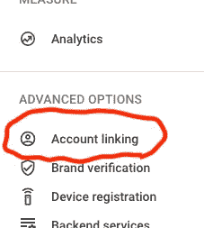
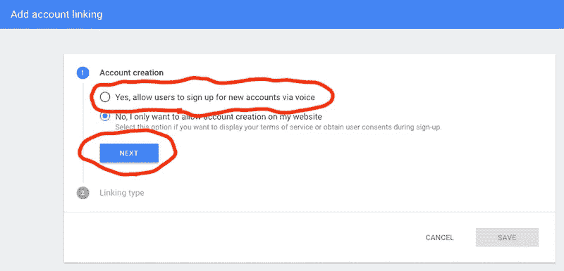
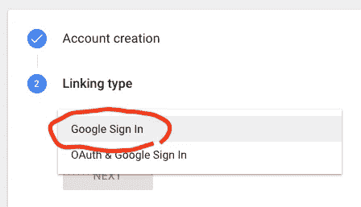
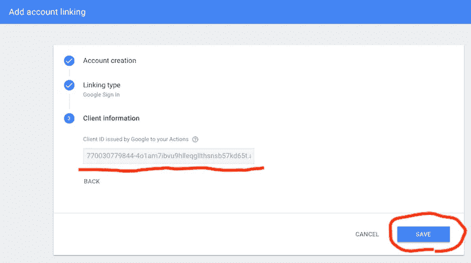
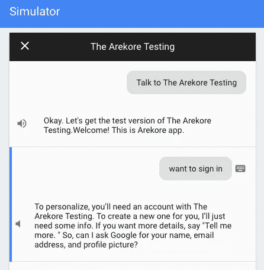
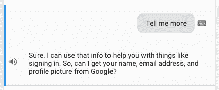
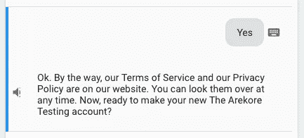
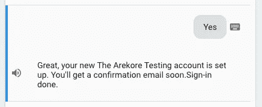
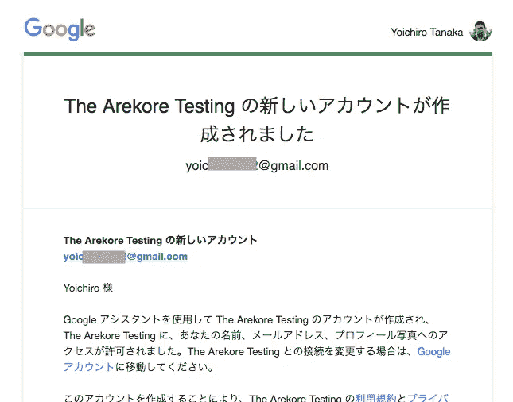
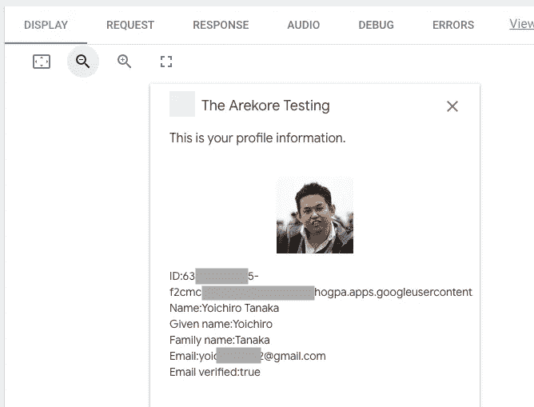

# 如何在助手中使用 Google 登录

> 原文：<https://medium.com/google-developer-experts/how-to-use-google-sign-in-for-the-assistant-b818f3de9211?source=collection_archive---------1----------------------->

谷歌助手有如此多的使用案例。在用例中，如果能够认证用户，将会有许多可以提供高度个性化服务的动作。我们已经有很多经验，互联网上的许多服务都需要登录(即用户认证)。在谷歌助手中，用户认证也非常重要。此外，如果用户认证的步骤简单，它将带来高转换率的可能性。再者，如果用户可以通过声控设备登录，那就更好了。

Google Sign-In for the Assistant 是一个在 actions 中使用 Google 帐户轻松验证用户身份的功能。动作的用户和开发者都可以非常容易地使用这个特性。我在 2018 年 9 月 6 日写这个故事。也许，这个特性是作为开发者预览版提供的，直到上周，而且我记得它只适用于美国地区。但是，官方文件已经被更新，并且“开发者预览”的字眼已经被删除。也就是说，我认为我们可以说，谷歌助手功能的登录是从开发者预览版中派生出来的，并作为一个稳定的功能发布。当然，该特性也适用于其他地区，包括日本！

[](https://developers.google.com/actions/identity/google-sign-in) [## 与 Google 登录的帐户链接| Google 上的操作| Google 开发者

### Google Sign-In for the Assistant 为用户和开发者提供了最简单和最容易的用户体验

developers.google.com](https://developers.google.com/actions/identity/google-sign-in) 

我想介绍一下如何将助手的 Google 登录整合到您的操作中。

# Google 控制台上操作的配置

首先，在编写代码之前，您需要配置一些设置，以便在 Google 控制台上的操作上使用助手的 Google 登录。请注意，如果我们忘记了配置，从您的代码使用 Google 登录助手时将会出现错误。

在谷歌控制台的操作中，左侧菜单有一个“账户链接”菜单项。在您的操作中，单击“帐户链接”菜单项。



更改页面后，选择右侧的“是，允许用户通过语音注册新帐户”项目，然后单击“下一步”按钮。



接下来，选择“Google 登录”作为链接类型，并单击“下一步”按钮。



这里，发布并显示一个客户端 ID。虽然它是灰色的，但您可以选择客户端 ID 字符串。你需要写下客户 ID 作为备忘录。因为稍后您会将客户端 ID 字符串写入您的代码。写完备忘录后，点击右下方的“保存”按钮。



配置是在 Google 控制台端的操作上完成的。

# 从您的代码中调用助手的 Google 登录

现在，您可以从代码中为助手使用 Google 登录。如果你使用[actions-on-Google-nodejs](https://github.com/actions-on-google/actions-on-google-nodejs)SDK，就可以很容易地使用助手的 Google 登录。

## 设置客户端 ID

您应该已经有了在 Google 控制台上的操作的上一步中发布的客户端 ID。有必要将客户端 ID 传递给 SDK。

如果使用 Dialogflow，编写如下代码。

```
**const** {
  dialogflow
} **=** require("actions-on-google");

**const** app **=** dialogflow({
  clientId: **<**YOUR_CLIENT_ID**>**
});
```

如果您使用 Actions SDK，请编写如下代码。

```
**const** {
  actionssdk
} **=** require("actions-on-google");

**const** app **=** actionssdk({
  clientId: **<**YOUR_CLIENT_ID**>**
});
```

## 发送登录请求

您可以使用 SDK 提供的“登录”类向 Google 上的操作助手发送使用 Google 登录的用户验证请求。当您想要验证用户身份时，可以随时发送请求。

如果您使用 Dialogflow，请编写如下代码。

```
**const** {
  dialogflow,
  SignIn
} **=** require("actions-on-google");

...

app.intent("Start Sign-in", conv **=>** {
  conv.ask(**new** SignIn("To personalize"));
});
```

如果您使用 Actions SDK，请编写如下代码。这段代码与上面的 Dialogflow 代码几乎相同。

```
**const** {
  actionssdk,
  SignIn
} **=** require("actions-on-google");

...

app.intent("actions.intent.TEXT", conv **=>** {
  conv.ask(**new** SignIn("To personalize"));
});
```

通过上面的代码，Google Assistant 向用户提出用户认证的请求。见下面截图。您会在用户验证时看到该对话框。在这种情况下，动作名为“Arekore Testing”(日语单词“Arekore”在英语中的意思是“各种各样”)。有意向开始助理流的 Google 签到，意向有一个训练短语“想签到”。



好像消息的模板是这样的。

```
<CONTEXT_STRING>, you’ll need an account with <ACTION_NAME>. To create a new one for you, I’ll just need some info. If you want more details, say "Tell me more. " So, can I ask Google for your name, email address, and profile picture?
```

“<context_string>”是传递给“登录”类的构造函数的字符串。当用户说“告诉我更多”时，谷歌助手会像下面这样说。</context_string>



用户需要回答“是”或“否”。

## 正在检索登录的结果

当用户回答时，Google 上的 actions 向您的 Actions 发送一个“actions_intent_SIGN_IN”事件，告诉用户验证的结果。您需要通过准备一个实现代码来处理结果。

如果使用 Dialogflow，则需要创建一个意图来处理“actions_intent_SIGN_IN”事件。这里，意向名称是“Get Signin”。像下面这样写一个实现代码。

```
app.intent("Get signin", (conv, params, signin) **=>** {
  **if** (signin.status **===** "OK") {
    conv.ask("Sign-in done.");
  } **else** {
    conv.ask("You need to sign in to personalize.");
  }
});
```

如果您使用 Actions SDK，请编写如下代码。它也几乎与对话流的代码相同。

```
app.intent("actions_intent_SIGN_IN", (conv, params, signin) **=>** {
  **if** (signin.status **===** "OK") {
    conv.ask("Sign-in done.");
  } **else** {
    conv.ask("You need to sign in to personalize.");
  }
});
```

用户认证的结果被传递给回调函数的第三个参数，该参数被传递给“app.intent()”函数。第三个参数在“ [SignInValue](https://developers.google.com/actions/reference/rest/Shared.Types/SignInValue) 中定义。由“ [SignInStatus](https://developers.google.com/actions/reference/rest/Shared.Types/SignInStatus) 定义的任一值将作为“状态”值传递。基本上，如果值为“OK”，则用户接受用户身份验证。否则，用户拒绝用户认证。

当用户说“不”时，上面的代码会发送“您需要登录进行个性化设置”消息作为回复。谷歌助手不只是说信息。其实下面的留言回复了。


当用户回答“是”时，Google Assistant 会再次询问用户以下信息。也就是说，此时用户认证没有完成。



在这里，用户可以说“否”来拒绝身份验证。说“否”时，“signin.status”值不是“OK”。

当用户对 Google Assistant 说“是”时，登录被确认，“signin.status”值为“OK”。在上面的代码中，实现代码返回“登录完成”消息作为动作的回复。但是，与前一种情况相同，Google Assistant 将其他消息添加到该操作返回的消息字符串中。



几乎在同一时间，用户会收到如下邮件。不好意思，下面的截图是针对日本用户的。



该电子邮件内容有一个撤销身份验证的 URL。

# 检索用户配置文件信息

在使用助手的 Google 登录对用户进行身份验证后，该操作可以检索用户的个人资料信息。例如，在认证之后，每当用户对动作说话时，Google 上的动作就向动作发送一个由 JWT 表示的 ID 令牌。actions-on-google-nodejs SDK 处理令牌、验证令牌、解析令牌并将用户信息提供给实现代码。

您可以使用“conv.user.profile.payload”检索用户配置文件信息。如果该值未定义，您的操作可以识别出用户尚未通过身份验证。以下代码是一个示例，显示了带有 BasicCard 丰富响应的用户信息。

```
**const** {
  ...
  BasicCard,
  Image
} **=** require("actions-on-google");

app.intent("Show User Profile", conv **=>** {
  **const** payload **=** conv.user.profile.payload;
  **if** (payload) {

    **const** userId **=** payload.aud;
    **const** name **=** payload.name;
    **const** givenName **=** payload.given_name;
    **const** familyName **=** payload.family_name;
    **const** email **=** payload.email;
    **const** emailVerified **=** payload.email_verified;
    **const** picture **=** payload.picture;

    conv.ask("This is your profile information.");
    conv.ask(**new** BasicCard({
      text: `ID:${userId}  
      Name:${name}  
      Given name:${givenName}  
      Family name:${familyName}  
      Email:${email}  
      Email verified:${emailVerified}`,
      image: **new** Image({
        url: picture,
        alt: "Profile Image"
      })
    }));
  } **else** {
    conv.ask("Not signed in yet.");
    conv.ask(**new** Suggestion("want to sign in"));
  }
});
```

下面的屏幕截图是在 Actions Simulator 上发送 BasicCard 响应后的示例响应。



当我在写这篇文章时测试这个特性时，可以检索到以下用户信息。

*   用户 ID:“conv . user . profile . payload . aud”
*   名称:" conv.user.profile.payload.name "
*   系列名称:“conv . profile . payload . family _ name”
*   名字:" conv . profile . payload . given _ name "
*   个人资料图片 URL:“conv . profile . payload . picture”
*   电子邮件地址:“conv.profile.payload.email”
*   电子邮件地址是否经过验证:“conv . profile . payload . Email _ verified”

# 助手的谷歌登录是不可能的事

助手功能的谷歌登录是为了验证谷歌帐户，而不是为了授权。所以，下面的事情是不可能的。

*   Google 上的操作传递 ID 令牌。Google 上的操作不传递访问令牌。
*   目前，您不能要求用户配置文件的附加信息。您只能检索上面列出的信息。

# 结论

我们不能在与 OAuth 链接的帐户中使用 Google 登录。就 Google 上的操作而言，如果我们希望使用 Google 帐户验证用户，我们需要使用 Google 登录来获得助手功能。然而，谷歌助手的登录是作为开发者预览版，并且直到现在只针对美国地区。我猜很多开发者都在等待这个特性的发布。

今天，您可以在行动中使用 Google Sign-In 的助手功能。请尽快将这一功能融入到你的行动中，从你的行动中为众多用户带来更丰富的体验！