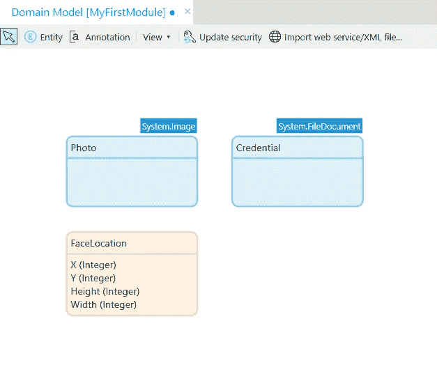
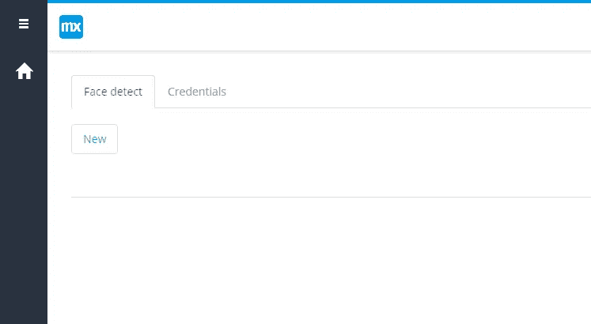
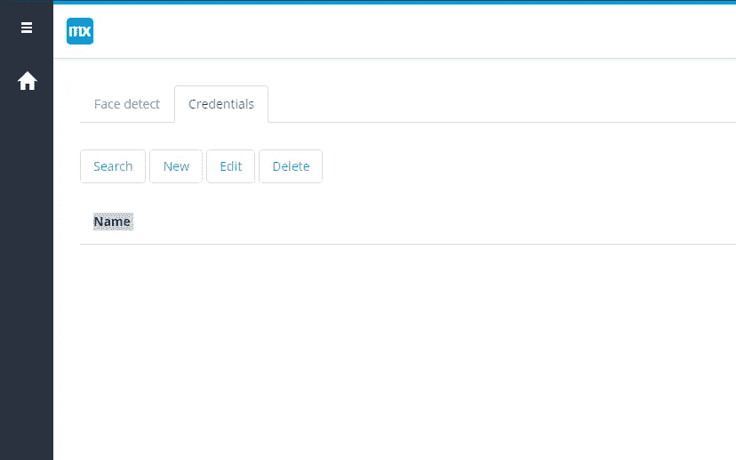
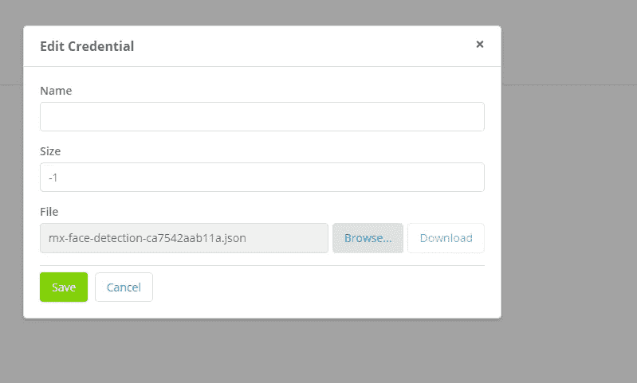
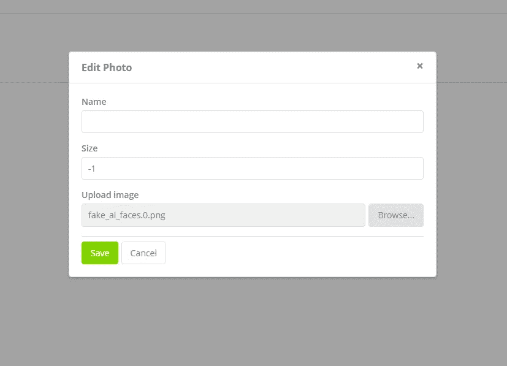
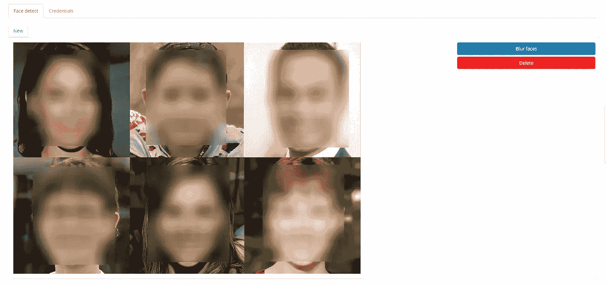
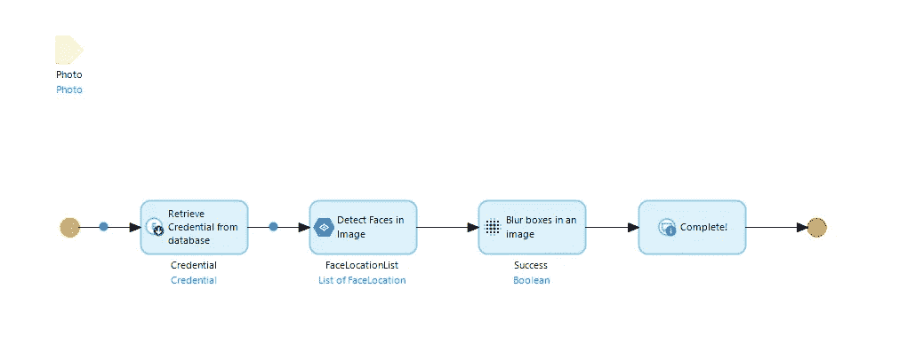
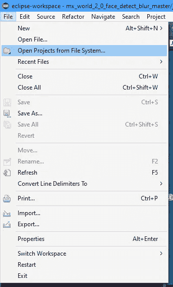
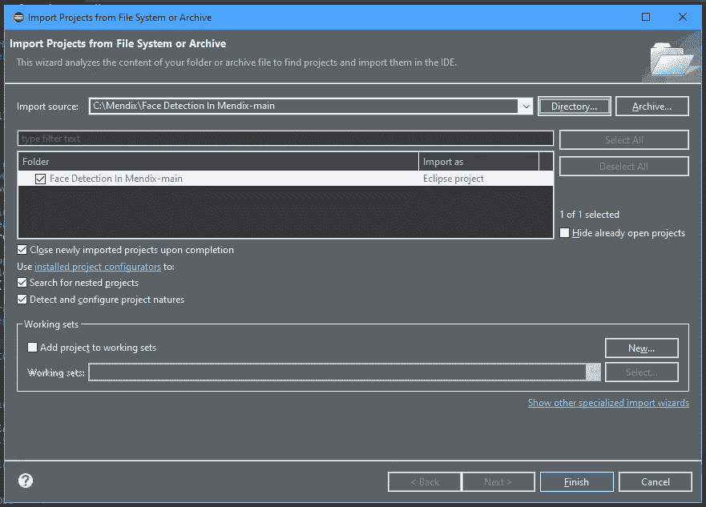

# 如何在 Java 中使用 Google 的 vision API——Mendix How-to

> 原文：<https://medium.com/mendix/how-to-use-googles-vision-api-with-java-mendix-how-to-41ec961832b?source=collection_archive---------4----------------------->


# 最近我一直在重新观看去年的一些会议。因此，当我偶然发现我的同事 Alistair Crawford 关于使用谷歌的面部检测 API，使用他们的 Java 库的一个会话时，我必须尝试一下。

# 虽然我在大学里学过 Java，但我很少在我的职业生活中使用它，而且我已经很久没有练习使用这些技能了，所以我跳到了 [github repo](https://github.com/mxcrawford/mx-world-2-0-face-detect-blur) 上，并沉迷其中。

# 开始之前

在我们出发之前，我们需要一些东西，所以在我们开始之前，花一点时间来确保你有所有的东西。

您将需要:

> Mendix Studio Pro 8 以上版本(本例我用的是 8.12)。
> 
> 你可以在 www.Eclipse.org/downloads/的[下载 Eclipse IDE。](https://www.eclipse.org/downloads/)
> 
> 一个启用了 [Google Vision API](https://cloud.google.com/vision/?hl=en_GB) 的 [Google Cloud](https://console.cloud.google.com/) 项目。
> 
> 添加到 Google Cloud 项目中的[服务帐户](https://cloud.google.com/iam/docs/service-accounts)，角色为“所有者”。
> 
> 你需要确保谷歌视觉 API 启用和设置计费，这将不会与它一起工作。
> 
> 请务必观看来自 Mendix World 2020 的 Alistairs 原创[会议](https://mxworld2020.mendix.com/session/extending-mendix-apps-with-java/)。


[https://bit.ly/MXW21](https://bit.ly/MXW21)

# 获取 API 的访问密钥

通常，为了调用 API，您需要将自己认证为允许的用户，这是使用访问密钥来完成的。

为此:

-转到谷歌云项目概述中的项目。在左侧，转到 **IAM & Admin** ，然后转到**服务账户。**

-打开添加到项目中的服务帐户。您现在应该会看到这样的屏幕:


-在页面顶部的选项卡中，转到**键**

-点击**添加键**

-选择 **JSON** 作为密钥类型，点击**创建**


单击 create 后，会要求您保存 JSON 文件。请务必这样做，因为您在这里只有这个选项。您将无法选择以后重新下载它，如果它丢失了，您将不得不创建一个新的密钥，所以要 100%确定它保存在某个安全的地方。

# 该编码了！

你可以从 [Github](https://github.com/mxcrawford/mx-world-2-0-face-detect-blur) 获得项目文件。一旦你在 Studio Pro 中下载并打开了你的应用，你会注意到我们已经做了很多准备工作。域模型中有一些实体:照片、凭证和 FaceLocation。



*   照片是上传的图片，我们想处理。
*   Credentials 是一个文件文档，它将保存我们刚刚下载的身份验证密钥。
*   面部位置是从 Java 操作返回的对象或对象列表。

# 让应用程序运行

如果你已经尝试运行你的应用程序，你可能会注意到少了什么，这会导致 Java 编译错误并阻止你的应用程序启动。

这是因为它缺少一些依赖项，我们现在将添加这些依赖项。Mendix 可以支持多种 Java 的依赖管理工具，比如 Maven 或者 Ivy。这个项目使用 Ivy，所以我们需要让 Ivy 自动更新或添加任何缺失的依赖项。

*   打开终端并导航到您的项目目录。

`cd C:\\YourProjectLocation`

*   使用为 Ivy 运行 import 命令。

`runivy.cmd`

*   等待它完成。

> **如果你没有将路径添加到你的 Java JDK 中作为** [**系统环境变量**](https://www.digitalcitizen.life/simple-questions-what-are-environment-variables/) **这将会失败。你可以在这里** **了解更多关于如何设置这个** [**。**](https://techoral.com/blog/java/adoptopenjdk-install-windows.html)

# 上传 Google Vision API 密钥

一旦你的应用程序编译并成功运行，你就必须上传我们从谷歌云控制台下载的 API 密钥。

运行您的应用程序，并在浏览器中导航至该应用程序。一旦你进入应用程序的主页，你会看到有 2 个标签:

1.  人脸检测
2.  资格证书



单击凭据选项卡，然后单击新建。



在弹出窗口中，单击 browse 并在出现的文件浏览器中选择我们从 Google Cloud 控制台下载的 JSON 文件。要结束，请单击保存。



# 测试它

你现在可以第一次完全测试这个应用了。为此，请返回应用程序主页上的“人脸检测”选项卡，然后单击“新建”按钮。

在出现的弹出窗口中，单击上传图像字段上的浏览，并选择任何包含人脸的照片。为了测试的目的，我使用了一些由人工智能在线创建的计算机生成的人脸图像。单击保存关闭窗口。



现在，您应该会看到您上传的照片出现在表单中。你现在可以点击模糊面孔来测试这个应用程序。


您应该会看到类似这样的:



# 仔细看看代码

现在我们已经让它工作了，让我们看看这段代码实际上在做什么。如果我们检查连接到主页上模糊面孔按钮的微流 ACT_ProcessImage。在内部，我们可以看到一个相当简单的流程，它检索我们从数据库上传的凭证文件，然后将它和我们试图处理的图像一起传递到两个独立的 Java 操作中。



为了找出这些动作在做什么，我们必须在 Eclipse 中打开这个项目。为此，在 Studio Pro 中，按 F6 键为 Eclipse 部署项目。然后打开 eclipse，通过点击顶部导航栏中的 File 导入项目，然后选择 Open projects from file system。



在打开的新窗口中，选择导入源下的目录，并选择项目的根文件夹，然后单击完成以完成导入



一旦您的项目在左侧的 Package explorer 中打开，查找 Javasource，然后查找子文件夹 myfirstmodule.actions。

*   JA _ 检测面孔
*   JA _ BlurBoxes

JA_DetectFaces 包含的完整代码如下所示。有关详细信息，请查看粗体行内注释。

```
// This file was generated by Mendix Studio Pro.
//
// WARNING: Only the following code will be retained when actions are regenerated:
// - the import list
// - the code between BEGIN USER CODE and END USER CODE
// - the code between BEGIN EXTRA CODE and END EXTRA CODE
// Other code you write will be lost the next time you deploy the project.
// Special characters, e.g., é, ö, à , etc. are supported in comments.package myfirstmodule.actions;import java.io.FileInputStream;
import java.io.IOException;
import java.io.InputStream;
import java.util.ArrayList;
import java.util.List;
import com.google.api.gax.core.CredentialsProvider;
import com.google.auth.Credentials;
import com.google.auth.oauth2.GoogleCredentials;
import com.google.cloud.vision.v1.AnnotateImageRequest;
import com.google.cloud.vision.v1.AnnotateImageResponse;
import com.google.cloud.vision.v1.BatchAnnotateImagesResponse;
import com.google.cloud.vision.v1.BoundingPoly;
import com.google.cloud.vision.v1.FaceAnnotation;
import com.google.cloud.vision.v1.Feature;
import com.google.cloud.vision.v1.Image;
import com.google.cloud.vision.v1.ImageAnnotatorClient;
import com.google.cloud.vision.v1.ImageAnnotatorSettings;
import com.google.common.collect.Lists;
import com.google.protobuf.ByteString;
import com.mendix.core.Core;
import com.mendix.systemwideinterfaces.core.IContext;
import com.mendix.webui.CustomJavaAction;
import com.mendix.systemwideinterfaces.core.IMendixObject;
import myfirstmodule.proxies.FaceLocation;public class JA_DetectFaces extends CustomJavaAction<java.util.List<IMendixObject>>
{
 private IMendixObject __SourceImage;
 private myfirstmodule.proxies.Photo SourceImage;
 private IMendixObject __CredentialsFile;
 private myfirstmodule.proxies.Credential CredentialsFile;public JA_DetectFaces(IContext context, IMendixObject SourceImage, IMendixObject CredentialsFile)
 {
  super(context);
  this.__SourceImage = SourceImage;
  this.__CredentialsFile = CredentialsFile;
 }[@java](http://twitter.com/java).lang.Override
 public java.util.List<IMendixObject> executeAction() throws Exception
 {
  this.SourceImage = __SourceImage == null ? null : myfirstmodule.proxies.Photo.initialize(getContext(), __SourceImage);this.CredentialsFile = __CredentialsFile == null ? null : myfirstmodule.proxies.Credential.initialize(getContext(), __CredentialsFile);// BEGIN USER CODE**// Setup credentials for Google Vision** IContext ctx = getContext();
  InputStream credentialsFIle = Core.getFileDocumentContent(ctx, __CredentialsFile);
  CredentialProvider provider = new CredentialProvider(credentialsFIle);
  ImageAnnotatorSettings imageAnnotatorSettings =
    ImageAnnotatorSettings.newBuilder()
    .setCredentialsProvider(provider)
    .build();

  **// Convert photo into format useable for Google Vision**
  InputStream fis =  Core.getFileDocumentContent(ctx, __SourceImage);
  ByteString imgBytes = ByteString.readFrom(fis);
  Image img = Image.newBuilder().setContent(imgBytes).build();

  **// Set the feature type to Facial Detection** Feature feat = Feature.newBuilder().setType(Feature.Type.FACE_DETECTION).build();
 ** 
  // Prepare the request for the API** AnnotateImageRequest request =
    AnnotateImageRequest.newBuilder().addFeatures(feat).setImage(img).build();
  List<AnnotateImageRequest> requests = new ArrayList<>();
  requests.add(request);**// Handle responses** ArrayList<IMendixObject> faceLocations = new ArrayList<IMendixObject>();
  try (ImageAnnotatorClient client = ImageAnnotatorClient.create(imageAnnotatorSettings)) {
   BatchAnnotateImagesResponse response = client.batchAnnotateImages(requests);
   List<AnnotateImageResponse> responses = response.getResponsesList();
   for (AnnotateImageResponse res : responses) {
    if (res.hasError()) {
     return faceLocations;
    }

    **// For each face gather information needed** for (FaceAnnotation annotation : res.getFaceAnnotationsList()) {
     BoundingPoly boundingBox = annotation.getBoundingPoly();
     List<com.google.cloud.vision.v1.Vertex> boxVertices = boundingBox.getVerticesList();

   **  // Gather X,Y, Width & Height** int X = Math.round(boxVertices.get(0).getX());
     int Y = Math.round(boxVertices.get(0).getY());
     int Width = Math.round(boxVertices.get(2).getX()) - X;
     int Height = Math.round(boxVertices.get(2).getY()) - Y;

     **// Set FaceLocation Attributes** FaceLocation faceLocation = new FaceLocation(ctx);
     faceLocation.setX(X);
     faceLocation.setY(Y);
     faceLocation.setWidth(Width);
     faceLocation.setHeight(Height);

     **// Add new location to List** faceLocations.add(faceLocation.getMendixObject());
    }
   }
  }
  return faceLocations;
  // END USER CODE
 }/**
  * Returns a string representation of this action
  */
 [@java](http://twitter.com/java).lang.Override
 public java.lang.String toString()
 {
  return "JA_DetectFaces";
 }// BEGIN EXTRA CODE
 public class CredentialProvider implements CredentialsProvider {private InputStream authStream;
  private boolean usePath=false;
  private String path;public CredentialProvider(InputStream inputStream) {
   this.authStream = inputStream;
   this.usePath=false;
  }public CredentialProvider(String inputPath) {
   this.path = inputPath;
   this.usePath=true;
  }[@Override](http://twitter.com/Override)
  public Credentials getCredentials() throws IOException {
   // TODO Auto-generated method stub
   if (this.usePath)
   {
    return GoogleCredentials.fromStream(new FileInputStream(path))
      .createScoped(Lists.newArrayList("[https://www.googleapis.com/auth/cloud-platform](https://www.googleapis.com/auth/cloud-platform)"));
   }
   else
   {
    return GoogleCredentials.fromStream(authStream)
      .createScoped(Lists.newArrayList("[https://www.googleapis.com/auth/cloud-platform](https://www.googleapis.com/auth/cloud-platform)"));
   }
  }}
 // END EXTRA CODE
}
```

这个动作完成后，应用程序调用第二个动作 JA_BlurFaces，你可以在下面看到完整的代码，再次寻找加粗的评论了解详情。

```
// This file was generated by Mendix Studio Pro.
//
// WARNING: Only the following code will be retained when actions are regenerated:
// - the import list
// - the code between BEGIN USER CODE and END USER CODE
// - the code between BEGIN EXTRA CODE and END EXTRA CODE
// Other code you write will be lost the next time you deploy the project.
// Special characters, e.g., é, ö, à , etc. are supported in comments.package myfirstmodule.actions;import java.awt.Graphics;
import java.awt.image.BufferedImage;
import java.awt.image.BufferedImageOp;
import java.awt.image.ColorModel;
import java.awt.image.ConvolveOp;
import java.awt.image.Kernel;
import java.io.ByteArrayInputStream;
import java.io.ByteArrayOutputStream;
import java.io.InputStream;
import javax.imageio.ImageIO;
import com.mendix.core.Core;
import com.mendix.systemwideinterfaces.core.IContext;
import com.mendix.webui.CustomJavaAction;
import com.mendix.systemwideinterfaces.core.IMendixObject;
import myfirstmodule.proxies.FaceLocation;public class JA_BlurBoxes extends CustomJavaAction<java.lang.Boolean>
{
 private IMendixObject __SoureImage;
 private myfirstmodule.proxies.Photo SoureImage;
 private IMendixObject __DestinationImage;
 private myfirstmodule.proxies.Photo DestinationImage;
 private java.util.List<IMendixObject> __FaceLocations;
 private java.util.List<myfirstmodule.proxies.FaceLocation> FaceLocations;public JA_BlurBoxes(IContext context, IMendixObject SoureImage, IMendixObject DestinationImage, java.util.List<IMendixObject> FaceLocations)
 {
  super(context);
  this.__SoureImage = SoureImage;
  this.__DestinationImage = DestinationImage;
  this.__FaceLocations = FaceLocations;
 }[@java](http://twitter.com/java).lang.Override
 public java.lang.Boolean executeAction() throws Exception
 {
  this.SoureImage = __SoureImage == null ? null : myfirstmodule.proxies.Photo.initialize(getContext(), __SoureImage);this.DestinationImage = __DestinationImage == null ? null : myfirstmodule.proxies.Photo.initialize(getContext(), __DestinationImage);this.FaceLocations = new java.util.ArrayList<myfirstmodule.proxies.FaceLocation>();
  if (__FaceLocations != null)
   for (IMendixObject __FaceLocationsElement : __FaceLocations)
    this.FaceLocations.add(myfirstmodule.proxies.FaceLocation.initialize(getContext(), __FaceLocationsElement));// BEGIN USER CODE
  IContext ctx =  getContext();
  try { ** // Get input stream from Mendix object and read into Buffered image** InputStream fis = Core.getFileDocumentContent(ctx, __SoureImage);
   BufferedImage readOnlyImage = ImageIO.read(fis); **// New Image, prep for drawing...** BufferedImage image =
     new BufferedImage(readOnlyImage.getWidth(),readOnlyImage.getHeight(), BufferedImage.TYPE_INT_RGB);Graphics gfx = image.getGraphics();
   gfx.drawImage(readOnlyImage, 0, 0, null);
   gfx.dispose();

  ** // A 3x3 kernel that blurs an image** float[] matrix = new float[2500];
   for (int i = 0; i < 2500; i++)
    matrix[i] = 1.0f/2500.0f;
   Kernel kernel = new Kernel(50, 50, matrix);
   BufferedImageOp op = new ConvolveOp(kernel, ConvolveOp.EDGE_NO_OP,null);**// Iterate and blur sub images based on each location**

   for (FaceLocation location : FaceLocations) {
    BufferedImage dest = image.getSubimage(
      (location.getX()),
      location.getY(),
      location.getWidth(),
      location.getHeight());
    ColorModel cm = dest.getColorModel();
    BufferedImage src = new BufferedImage(cm,
      dest.copyData(dest.getRaster().createCompatibleWritableRaster()),
      cm.isAlphaPremultiplied(),
      null)
      .getSubimage(0, 0, dest.getWidth(), dest.getHeight());
    op.filter(src, dest);
   }

   **// Write result to Byte array to be stored back in mx object** ByteArrayOutputStream output = new ByteArrayOutputStream();
   ImageIO.write(image, "jpg", output);**//Store in InputStream and Write to Mendix object** InputStream is = new ByteArrayInputStream(output.toByteArray());
   Core.storeImageDocumentContent(ctx, DestinationImage.getMendixObject(), is, image.getWidth(), image.getHeight());**// Cleanup**
   output.close();
   is.close();return true;
  } catch (Exception e) {
   throw e;
  }
  // END USER CODE
 }/**
  * Returns a string representation of this action
  */
 [@java](http://twitter.com/java).lang.Override
 public java.lang.String toString()
 {
  return "JA_BlurBoxes";
 }// BEGIN EXTRA CODE
 // END EXTRA CODE
}
```

## 代码摘要:

*   图像和凭证文件被传递到 JA_Detect faces 中。然后，该操作将凭证和图像发送到 Google Vision API。
*   如果成功，API 将返回检测到人脸的位置数组。
*   然后，结果被映射到 FaceLocation 对象的列表中，并由操作返回。
*   然后，图像和面部位置列表被传递到 JA_BlurFaces。
*   JA_BlurFaces 然后使用 google 提供的位置遍历人脸列表，并使用一些图像绘制库，对人脸进行模糊处理。
*   结果是提交到数据库，覆盖上传的原始图像，并刷新浏览器中的图像，现在应该显示最终结果。

## 阅读更多

[](https://bit.ly/MXW21) [## Mendix World 2021 |召集您的应用开发团队 2021 年 9 月 7 日至 9 日

### 好像你需要说服…在一个全球制造商社区，他们想通过探索什么来相互学习…

bit.ly](https://bit.ly/MXW21) [](https://www.mendix.com/mendix-world/tracks/) [## 曲目|门迪克斯世界 2021

### 在今年 Mendix World 开幕之前，手工制作您的议程。浏览专为您量身定制的 8 个专题讲座中的 85 个以上专题讲座…

www.mendix.com](https://www.mendix.com/mendix-world/tracks/) 

*   [https://docs.mendix.com/refguide/java-actions](https://docs.mendix.com/refguide/java-actions)
*   [https://docs . mendix . com/how to/logic-business-rules/Java-API-tutorial](https://docs.mendix.com/howto/logic-business-rules/java-api-tutorial)
*   [https://docs.mendix.com/apidocs-mxsdk/apidocs/](https://docs.mendix.com/apidocs-mxsdk/apidocs/)

*来自发布者-*

*如果你喜欢这篇文章，你可以在我们的* [*媒体页面*](https://medium.com/mendix) *或我们自己的* [*社区博客网站*](https://developers.mendix.com/community-blog/) *找到更多类似的文章。*

*希望入门的创客，可以注册一个* [*免费账号*](https://signup.mendix.com/link/signup/?source=direct) *，通过我们的* [*学苑*](https://academy.mendix.com/link/home) *即时获取学习。*

有兴趣更多地参与我们的社区吗？你可以加入我们的 [*Slack 社区频道*](https://join.slack.com/t/mendixcommunity/shared_invite/zt-hwhwkcxu-~59ywyjqHlUHXmrw5heqpQ) *或者想更多参与的人，看看加入我们的* [*遇见 ups*](https://developers.mendix.com/meetups/#meetupsNearYou) *。*