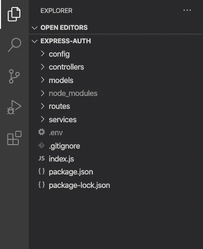

# 如何将 JWT 用于 Express + NodeJS

> 原文：<https://medium.com/quick-code/how-to-use-jwt-for-express-nodejs-628ddf9f7c83?source=collection_archive---------0----------------------->


created by stories at [www.freepik.com](http://www.freepik.com)

在本文中，我们将学习如何使用 JSON Web 令牌为 NodeJS + Express 服务器实现身份验证。本文将指导您完成服务器的初始设置，直到一个具有工作身份验证的全功能服务器。

这篇文章由以下几部分组成。如果你想直接进入代码部分。跳到 ***项目设置*** :

*   理解 JSON Web 令牌
*   项目设置
*   设置数据库
*   实现授权中间件
*   添加路由
*   签署令牌
*   将这些点连接起来

## 理解 JSON Web 令牌

JSON Web 令牌或 JWT 用于在各方之间以 JSON 对象的形式安全地传输用户信息。它由**报头**、**有效载荷、**和**签名**组成

**头**定义了令牌的类型和用于验证它的算法

```
{
   "type" : "JWT",
   "alg" : "HS256"
}
```

**有效载荷**包含我们想要传输的信息。例如

```
{
   id : 1
   email : 'test@user.com'
}
```

**签名**对报头和有效载荷中的信息进行编码。它还验证正在发送的消息在发送过程中没有被篡改

## 项目设置

让我们从创建一个空的存储库开始，并运行以下命令。这将初始化 npm 存储库并安装所有必需的依赖项。我们稍后将逐一介绍它们。

```
npm init -y
npm install --save bcrypt-nodejs body-parser dotenv express http jsonwebtoken mongoose passport passport-jwt passport-local
```

让我们继续创建文件夹结构



*   ***config****将包含数据库 URI 等配置变量*
*   ***控制器**包含类似检查 JWT 的内部逻辑*
*   *模型将定义我们的数据库结构*
*   ***路由**将定义我们的 API 端点*
*   ***服务**实施第三方集成*

## *设置数据库*

*我们的数据库将只包含一个模型，那就是用户。对于这个例子，我们只需要两个字段。但是请记住，这个模型很容易扩展。该模型确保我们在调用 API 端点时不会暴露用户密码。并且当创建新用户时，该密码被散列和加盐。它还包含一个助手函数来检查密码是否有效*

## *实现授权中间件*

*我们正好需要 3 个中间件或策略。其中一个将创建一个新用户，用于注册。第二个将检查用户是否存在以及密码是否正确。这个将用于登录。第三个是检验 JWT 是否正确。它还将从令牌中提取用户信息。这个将用来保护我们的路线。*

## *添加路由*

*我们的认证路线将非常简单。他们只会使用我们在上一步中定义的中间件，并将响应返回给用户。如果需要一些额外的逻辑。它将由管理员来处理*

## *签署令牌*

*当新用户注册或现有用户登录时。我们需要为他/她创建一个令牌。这个令牌将在我们的 API 请求的响应中返回。你可以在上面的代码片段中看到我们正在调用`generateToken`函数。这个函数只是简单地获取用户对象，并从中创建一个签名的 JWT 令牌。*

## *将这些点连接起来*

*既然我们所有的部分都准备好了。让我们把它们放在一起，用它们创建一个跑步机器。这是我们服务器的入口点。它执行以下操作:*

*   *加载环境变量(我们不想暴露敏感数据，如数据库 URI)*
*   *初始化数据库模型并连接到数据库*
*   *创建快速应用程序*
*   *向我们的请求添加解析器*
*   *初始化护照和路线*
*   *最后，监听指定端口上的传入请求*

## *结论*

*事实上这就是一切。如果您想看看整个例子的运行情况。[点击这里进入 GitHub 库。](https://github.com/codewithbernard/express-auth)*

*现在是做一点总结的时候了。在本文中，我们了解到:*

*   *JSON Web 令牌如何工作(如果您没有跳过这一部分)*
*   *如何从头开始设置 express server*
*   *如何添加授权中间件与 JWT 一起工作*
*   *如何使用 JWT 检查保护 API 端点*

**

*如果你有任何问题、意见或建议，请在下面的评论区告诉我。下次见！*