# 如何使用网络负载平衡器连接到 OCI 实例

> 原文：<https://medium.com/oracledevs/how-to-use-network-load-balancer-to-connect-to-oci-instances-697c484bf196?source=collection_archive---------0----------------------->

# **甲骨文云网络负载平衡器特性**

Oracle 网络负载平衡器是一个非代理负载平衡解决方案，它执行第 3 层和第 4 层(TCP/UDP/ICMP)负载的直通负载平衡。此外，它还提供了一个可弹性扩展的区域 VIP 地址，可以根据客户端流量扩大或缩小，没有最小或最大带宽配置要求。

它还提供了流高可用性、源和目的 IP 地址以及端口保留的好处。它旨在处理多变的流量模式和数百万的流量，在保持超低延迟的同时提供高吞吐量。这种适用于延迟敏感型工作负载的理想负载平衡解决方案包括实时流、VoIP、物联网和交易平台。网络负载平衡器针对几天或几个月的长时间运行的连接进行了优化，这使它最适合您的数据库或 WebSocket 类型的应用程序。

网络负载平衡器在连接级别运行，并根据 IP 协议数据平衡传入客户端到健康后端服务器的连接。负载平衡策略使用哈希算法来分发客户端流。默认的负载平衡分布策略基于源和目标 IP 地址、端口和 IP 协议信息的 5 元组散列。这种 5 元组散列策略在给定的 TCP 或 UDP 会话中提供会话关联性，其中同一会话中的分组被定向到网络负载平衡器后面的同一后端服务器。此外，您可以使用三元组(源 IP、目标 IP 和协议)或二元组(源 IP 和目标 IP)负载平衡策略来提供超出给定会话生存期的会话相关性。

*注意:如果您还没有注册，您可以今天就* [*注册甲骨文云免费层账户*](https://signup.cloud.oracle.com/?language=en&sourceType=:ex:tb:::::Medium_useNetworkLoadBalancerToConnect&SC=:ex:tb:::::Medium_useNetworkLoadBalancerToConnect&pcode=) *。*

# 网络负载平衡器的优势

第 4 层负载平衡器在不检查数据包内容的情况下向上游服务器转发网络数据包，这使它们更加安全。他们不需要解密数据包的内容；他们只能转发。在客户端和服务器之间仅流式传输一个连接，以便网络负载平衡器可以服务最大数量的连接。总的来说，网络负载平衡器是为速度和效率而构建的。

# **采用 Oracle 云网络负载平衡器**

**第四层负载均衡**:是

哈:是的

**带宽**:灵活

**客户端头保存**:是

> 注意:不建议将 SSH、RDP 和 DB 端口的端口大开(对互联网 0.0.0.0/0 上的任何 IP 开放)。请参考下面的安全指南和最佳实践。
> 
> [甲骨文云安全最佳实践指南](https://docs.oracle.com/en-us/iaas/Content/Security/Reference/configuration_security.htm)，
> 
> [甲骨文云基础设施安全指南](https://docs.oracle.com/en-us/iaas/Content/Security/Concepts/security_guide.htm)，
> 
> [Oracle 云基础设施最佳实践框架](https://docs.oracle.com/en/solutions/oci-best-practices/#GUID-5F2D2745-934E-409A-A7BA-D0976F727845)

# 步伐

1.  在网络部分选择负载平衡器下创建网络负载平衡器。*确保您到达了您想要的 OCI 地区和车厢。*

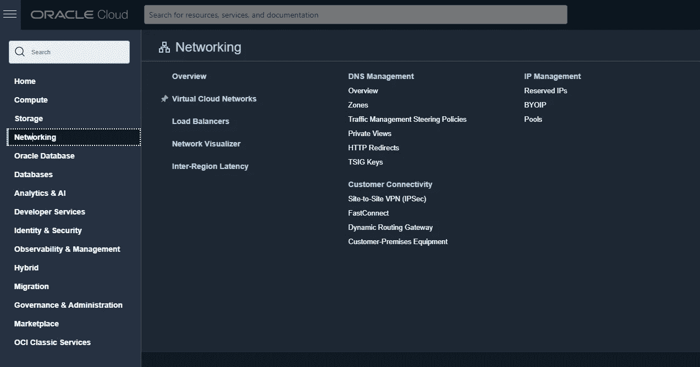

2.点击**创建负载平衡器**。

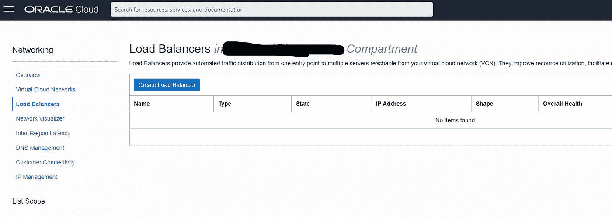

2a。选择**网络负载平衡器**。

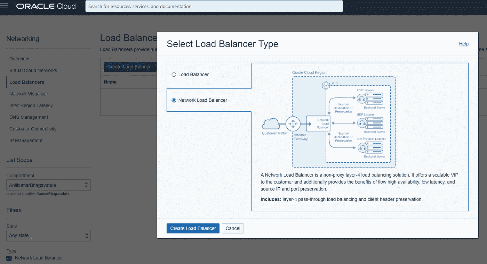

2b。提供负载平衡器名称和可见性类型 Public。公共 IP 可以是[临时 IP 地址](https://docs.oracle.com/en-us/iaas/Content/Network/Tasks/managingpublicIPs.htm)或[保留 IP 地址](https://docs.oracle.com/en-us/iaas/Content/Network/Tasks/managingpublicIPs.htm#overview)。

选择 VCN 和子网，即公共子网。

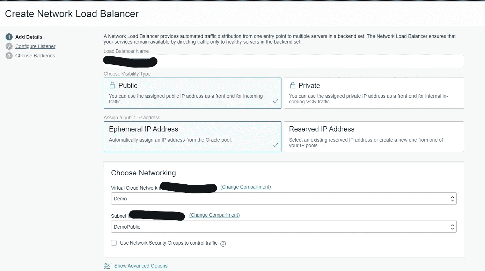

2c。选择网络安全组。

网络安全组允许负载平衡器的入口和出口。使用网络负载平衡器，我们可以将您的企业网络公共 IP 列入白名单，只允许访问负载平衡器

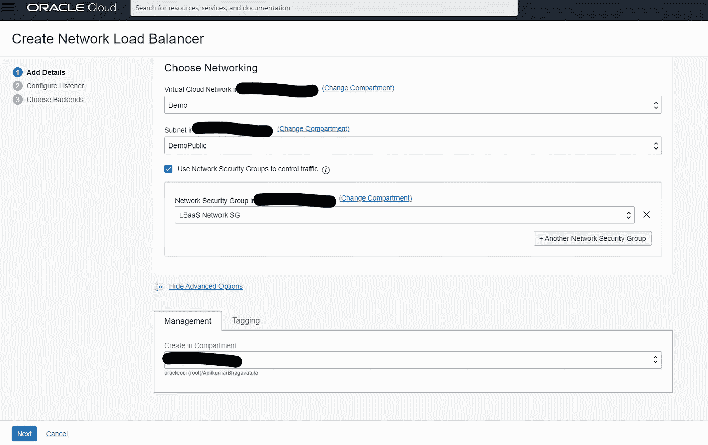

2d。为我们需要 SSH 连接的虚拟机创建后端。

取消选中保留源 IP。

为 TCP 指定端口号 22 上的健康检查选项。

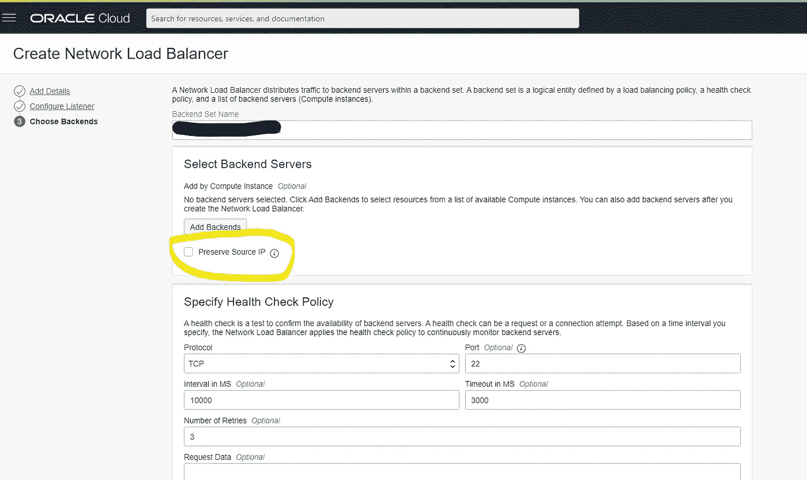

2e。添加希望 SSH 连接到的后端服务器。

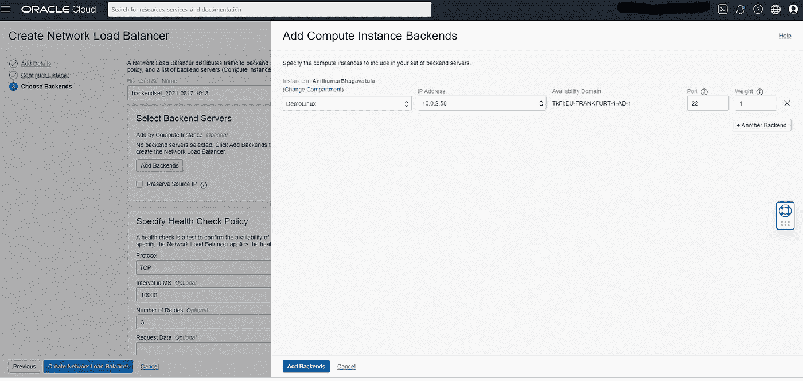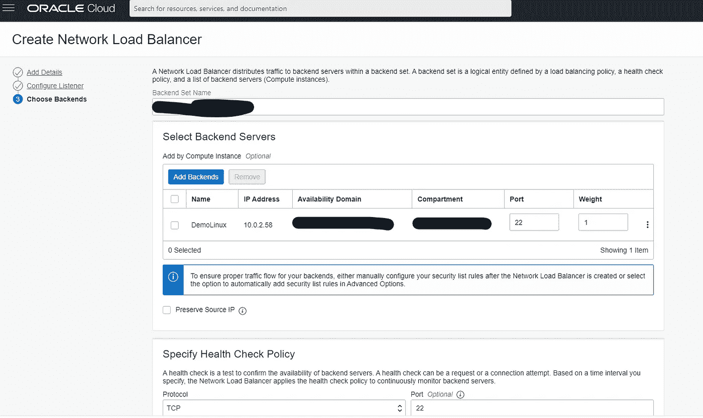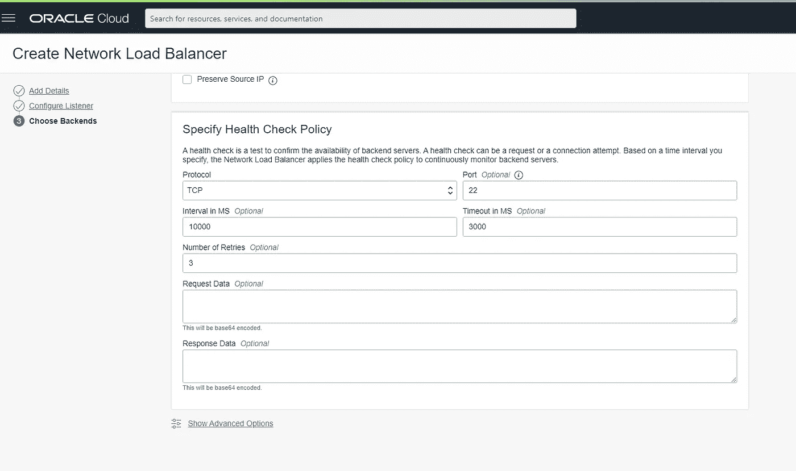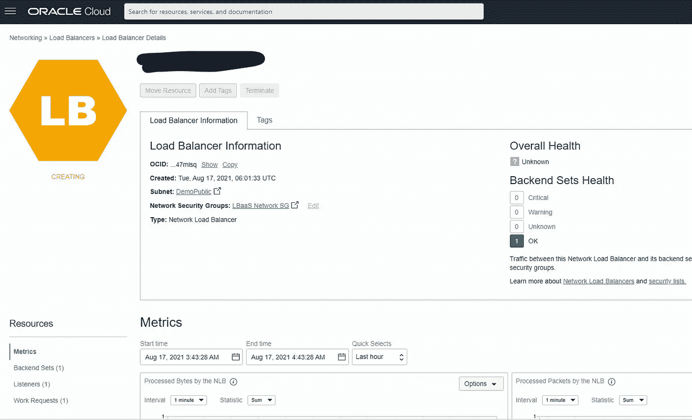

创建网络负载平衡器后，LBaaS 和运行状况应该为绿色。

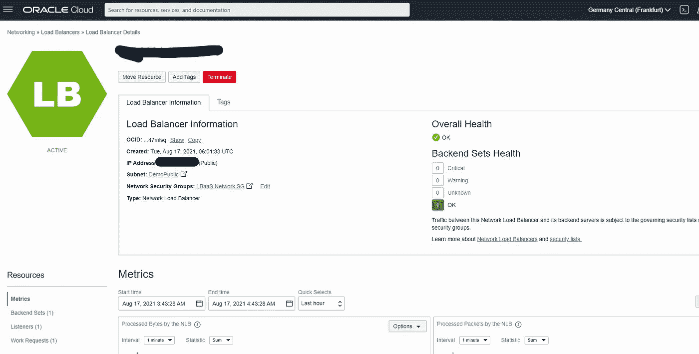

使用 LBaaS 公共 IP，您可以访问 Linux 虚拟机。

确保您已经在网络负载平衡器的网络安全组中将您的公共 IP(公司或互联网公共 IP)列入白名单。

还要配置从网络安全组到特定 IP 的出口。

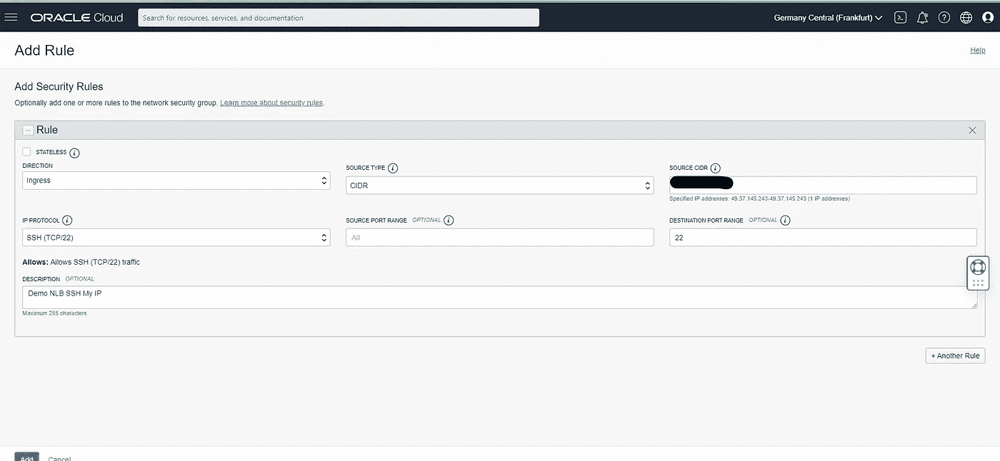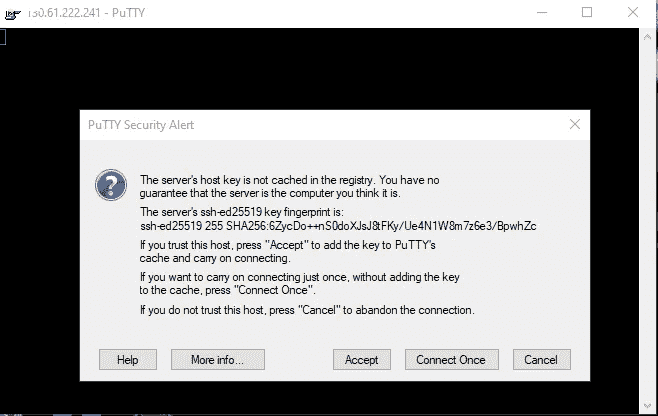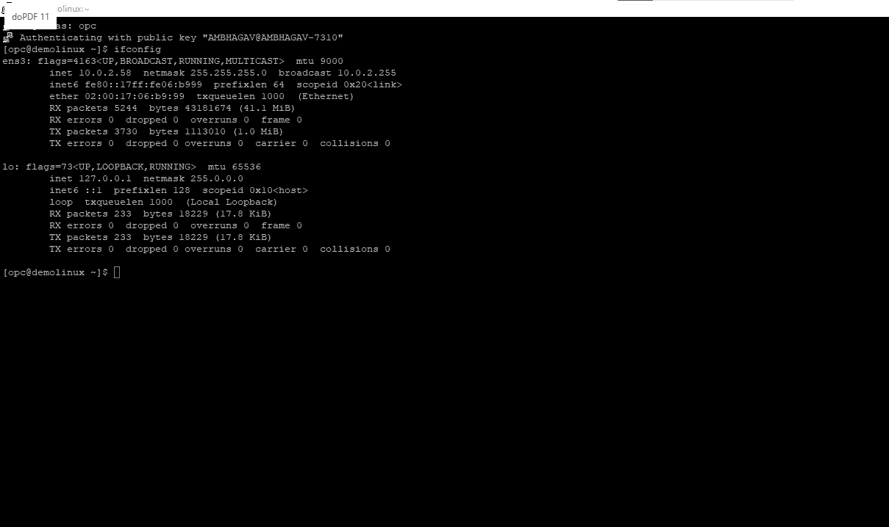

我们还可以使用网络负载平衡器连接到 Windows RDP、数据库端口或任何 TCP 或 UDP 端口。

*甲骨文云网络负载平衡器服务不收费。*

# **总结**

有关更多信息，请参见 OCI 文档中的 [OCI 网络负载平衡器](https://docs.oracle.com/en-us/iaas/Content/NetworkLoadBalancer/overview.htm?source=:so:tw:or:awr:ocl)或 [OCI 负载平衡器](https://docs.oracle.com/en-us/iaas/Content/Balance/Concepts/balanceoverview.htm?source=:so:tw:or:awr:ocl)。我们希望您体验 Oracle 云基础架构提供的这些新特性和所有企业级功能。

*注意——自由级用户可能会体验到其帐户所含服务的变化。*