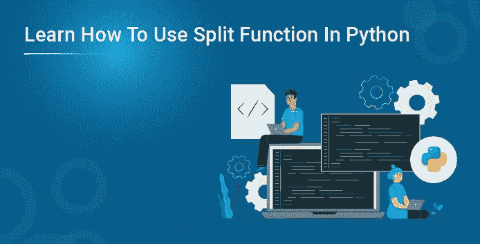

# 了解如何在 Python 中使用 Split 函数

> 原文：<https://medium.com/edureka/how-to-use-split-function-in-python-6994e3794be4?source=collection_archive---------5----------------------->



Python 编程语言有各种数据类型，包括字符串。即使字符串在本质上是不可变的，我们仍然可以使用像 split 函数这样的函数来操作字符串。它使用不同的参数将较大的字符串分解成较小的字符串。在本文中，我们将了解如何在 python 中使用 split 函数。以下是本文中讨论的主题:

*   什么是字符串？
*   需要拆分功能？
*   Python 中如何使用 Split 函数？
*   分割参数
*   分离器
*   最大
*   例子

# 什么是字符串？

python 中的字符串表示 unicode 字符值。Python 没有字符数据类型，单个字符也被视为字符串。

我们用单引号或双引号来声明一个字符串。为了访问一个字符串，我们使用索引和方括号。因为字符串本质上是可变的，所以我们不能在声明一个字符串后做任何改变。

```
name **=** "Edureka"print(name[0])**Output:** E
```

虽然我们不能在声明后改变字符串，但我们可以在 python 中拆分字符串。

# 需要拆分功能

Split 函数在根据给定分隔符分割字符串后返回字符串列表。以下是在 python 中使用拆分函数的优势:

*   在某些时候，我们可能不得不将一个大的字符串分解成更小的块或字符串。
*   它与串联相反，串联将两个字符串相加。
*   如果 split 函数中没有提供空格，则空格将被视为分隔符。
*   分析和推断结论变得更加容易。
*   它有助于解码加密字符串。

# Python 中如何使用 Split 函数？

Split 函数分解一个较大的字符串，给出一个包含较小块或字符串的列表。下面是一个用 python 拆分字符串的例子。

```
a **=** "We are Edureka, we have cutting edge tutorials and certification programs to upskill your knowledge"print(a.split())**Output:** [ 'We' , 'are' , 'Edureka' , 'we' , 'have' , 'cutting' , 'edge' , 'tutorials' , 'and' , 'certification' , 'programs' , 'to' , 'upskill' , 'your' , 'knowledge']
```

上面是一个简单的例子，展示了如何使用 split 函数将整个文本分解成更小的字符串。但是 split 函数有不同的参数来优化执行。

# 分割参数

1.  分隔符—它的作用类似于分隔符，字符串根据指定的分隔符进行分解。它也是可选的，如果没有指定分隔符，默认分隔符将是空白。
2.  Max —它也是可选的。它定义了将要发生的拆分次数。默认值为-1，这意味着对拆分次数没有限制。

# 分离器

以下示例显示了带分隔符参数的 split 函数:

```
a **=** "Edureka is the biggest edtech company, it has many cutting edge courses to learn"print(a.split(" , ")b **=** "Sunday*Monday*Tuesday*Wednesday*Thursday*Friday*Saturday"print(a.split(" * ")**Output:** [ ' Edureka is the biggest edtech company' , 'it has many cutting edge courses to learn' ]
['Sunday' , 'Monday' , 'Tuesday' , 'Wednesday' , 'Thursday' , 'Friday' , 'Saturday' ]
```

在上面的示例中，分隔符是根据将字符串拆分为更小的字符串的方式指定的。

# 最大

以下示例显示了带有最大参数的分割函数:

```
a **=** "my*name*is*python"print(a.split(" * " , 3)**Output :** [ 'my' , 'name' , 'is' , 'python' ]
```

上例中的 max 参数设置为 3，这意味着输出的字符串列表中有 4 个元素。

# 例子

下面是几个例子，我们可以使用 split 函数将字符串分割成更小的块或字符串。

```
a **=** "my name is python"print(a.split())b **=** "CatDogAntCarTap"print([b[ i : i**+**3] **for** i **in** range(0 , len(b) , 3)])c **=** "python#was#made#by#Guido#van#rossum"print(c.split(" #", 6)d **=** " this , will , be , in , output, this will be not"print(d.split(" , " , 4)**Output:** [ 'my' , 'name' , 'is' , 'python' ]
['Cat' , 'Dog' , 'Ant' , 'Car' , 'Tap' ]
['python' , 'was' , 'made' , 'by' , 'Guido' , 'van' , 'rossum' ]
['this' , 'will' , 'be' , 'in' , 'output' ]
```

在这篇博客中，我们学习了如何使用 split 函数将大字符串分解成小块或小串。字符串是一种不可变的数据结构，这意味着一旦你声明了它，它就不能被改变。虽然可以使用分离功能进行操作。Python 编程语言有不同的数据类型，如列表、字典、元组、集合等。

原始数据类型和专用数据结构优化了您的代码，使 python 比其他编程语言更胜一筹。要掌握您的技能，请注册 Python 在线培训计划并开始学习。

如果你想查看更多关于人工智能、DevOps、道德黑客等市场最热门技术的文章，你可以参考 Edureka 的官方网站。

请留意本系列中的其他文章，它们将解释 Python 和数据科学的各个方面。

> *1。* [*Python 教程*](/edureka/python-tutorial-be1b3d015745)
> 
> *2。* [*Python 函数*](/edureka/python-functions-f0cabca8c4a)
> 
> *3。*[*Python 中的文件处理*](/edureka/file-handling-in-python-e0a6ff96ede9)
> 
> *4。【T21[*Python Numpy 教程*](/edureka/python-numpy-tutorial-89fb8b642c7d)*
> 
> *5。* [*Scikit 学习机*](/edureka/scikit-learn-machine-learning-7a2d92e4dd07)
> 
> *6。* [*Python 熊猫教程*](/edureka/python-pandas-tutorial-c5055c61d12e)
> 
> *7。* [*Matplotlib 教程*](/edureka/python-matplotlib-tutorial-15d148a7bfee)
> 
> *8。* [*Tkinter 教程*](/edureka/tkinter-tutorial-f655d3f4c818)
> 
> *9。* [*请求教程*](/edureka/python-requests-tutorial-30edabfa6a1c)
> 
> *10。* [*PyGame 教程*](/edureka/pygame-tutorial-9874f7e5c0b4)
> 
> *11。* [*OpenCV 教程*](/edureka/python-opencv-tutorial-5549bd4940e3)
> 
> *12。* [*用 Python 进行网页抓取*](/edureka/web-scraping-with-python-d9e6506007bf)
> 
> 13。 [*PyCharm 教程*](/edureka/pycharm-tutorial-d0ec9ce6fb60)
> 
> 14。 [*机器学习教程*](/edureka/machine-learning-tutorial-f2883412fba1)
> 
> *15。*[*Python 中从头开始的线性回归算法*](/edureka/linear-regression-in-python-e66f869cb6ce)
> 
> *16。* [*用于数据科学的 Python*](/edureka/learn-python-for-data-science-1f9f407943d3)
> 
> 17。 [*Python 正则表达式*](/edureka/python-regex-regular-expression-tutorial-f2d17ffcf17e)
> 
> 18。[*Python 中的循环*](/edureka/loops-in-python-fc5b42e2f313)
> 
> 19。 [*Python 项目*](/edureka/python-projects-1f401a555ca0)
> 
> *20。* [*机器学习项目*](/edureka/machine-learning-projects-cb0130d0606f)
> 
> *21。*[*Python 中的数组*](/edureka/arrays-in-python-14aecabec16e)
> 
> *22。* [*在 Python 中设置*](/edureka/sets-in-python-a16b410becf4)
> 
> *23。*[*Python 中的多线程*](/edureka/what-is-mutithreading-19b6349dde0f)
> 
> *24。* [*Python 面试问题*](/edureka/python-interview-questions-a22257bc309f)
> 
> *25。*[*Java vs Python*](/edureka/java-vs-python-31d7433ed9d)
> 
> *26。* [*如何成为一名 Python 开发者？*](/edureka/how-to-become-a-python-developer-462a0093f246)
> 
> *27。* [*Python Lambda 函数*](/edureka/python-lambda-b84d68d449a0)
> 
> *28。* [*网飞如何使用 Python？*](/edureka/how-netflix-uses-python-1e4deb2f8ca5)
> 
> *29。*[*Python 中的套接字编程是什么*](/edureka/socket-programming-python-bbac2d423bf9)
> 
> *三十。* [*Python 数据库连接*](/edureka/python-database-connection-b4f9b301947c)
> 
> *31。*[*Golang vs Python*](/edureka/golang-vs-python-5ac32e1ef2)
> 
> 32。 [*Python Seaborn 教程*](/edureka/python-seaborn-tutorial-646fdddff322)
> 
> 33。 [*Python 职业机会*](/edureka/python-career-opportunities-a2500ce158de)

*原载于 2021 年 7 月 15 日 https://www.edureka.co*[](https://www.edureka.co/blog/split-function-in-python/)**。**