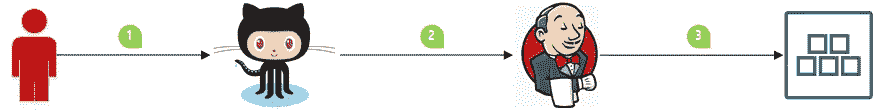
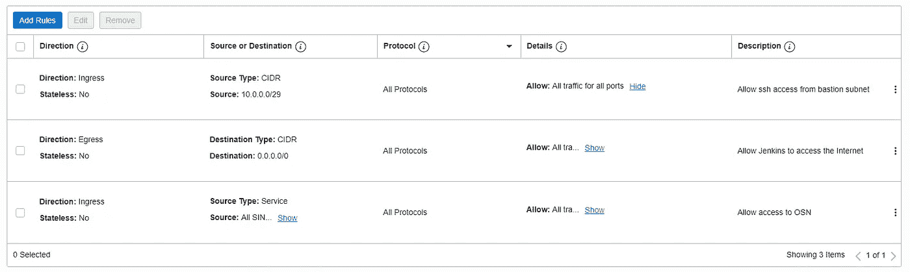
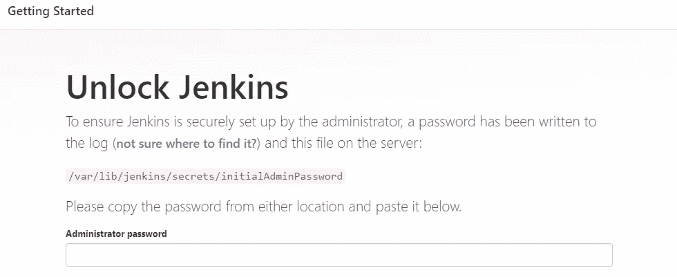
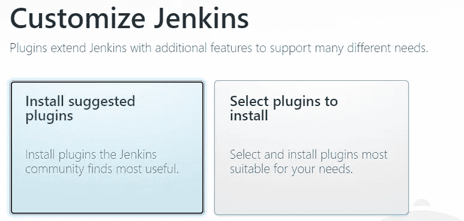
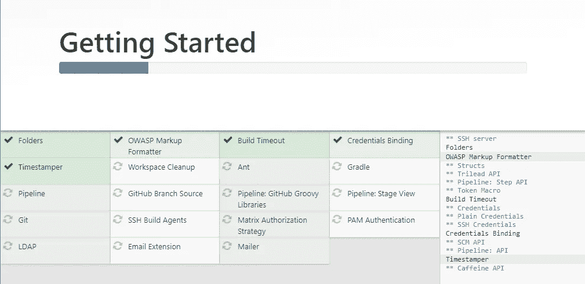
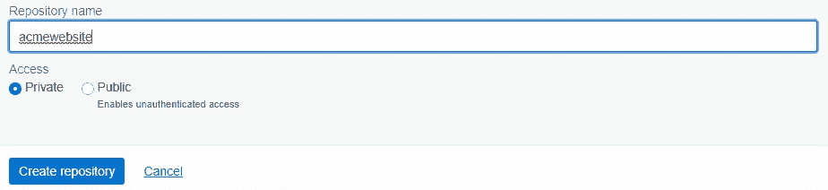
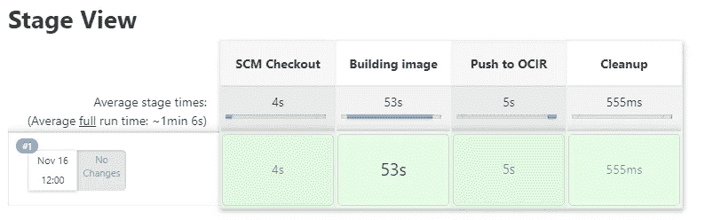
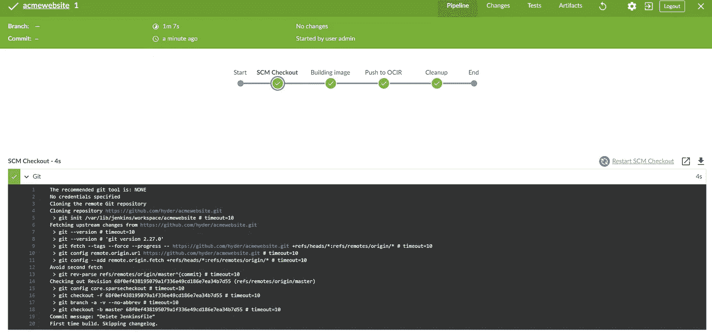
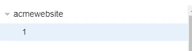

# 如何:使用 Jenkins 构建容器映像并推送到 OCIR

> 原文：<https://medium.com/oracledevs/how-to-using-jenkins-to-build-container-image-and-push-to-ocir-c475f46b2a8d?source=collection_archive---------0----------------------->

我真正喜欢 OCI 的一点是它的开放性:对开发者的开放性，允许他们使用和接受完全不同的软件和解决方案，即使他们看起来对 OCI 自己的服务有竞争力。

一个典型的例子是:极具竞争力的持续集成前景。OCI 有了新的 [DevOps 服务](https://docs.oracle.com/en-us/iaas/Content/devops/using/home.htm)。见鬼，我以前甚至写过关于使用 [Tekton](https://lmukadam.medium.com/running-continuous-integration-on-oke-with-tekton-353684c15730) 的文章。

但是在本教程中，我们将看到如何使用 Oracle Linux 在 OCI 上部署 [Jenkins](https://jenkins.io/) 来构建容器并推送到 OCIR (OCI 注册中心)。

以下是我们将努力实现的概念性目标:



1.  开发人员将代码推送到 git repo(在本例中是 GitHub)
2.  Jenkins 检测到一个推动，并开始新的构建
3.  在成功构建之后，Jenkins 将新的容器映像推送到 OCIR

## 安装 Jenkins

我们将从在私有子网中的计算实例上安装 Jenkins 开始。创建没有安全列表的专用子网，并创建分别具有以下出口和入口规则的 NSG:



NSG for Jenkins instance

接下来，通过选择 Oracle Linux 8 创建您的实例。确保您选择了正确的子网和 NSG。记下私有 IP 地址，您可以使用堡垒主机通过 ssh 访问它:

```
ssh -i ~/.ssh/id_rsa -J opc@11.22.33.44 opc@10.0.3.14
```

接下来，配置防火墙 d:

```
sudo firewall-cmd --permanent --add-service=jenkins
sudo firewall-cmd --reload
```

请注意，您也可以使用 terraform 和 cloud init 来自动完成这项工作。在这种情况下，您需要运行“防火墙-脱机-cmd”并且不使用“永久”选项:

```
# Configuring firewalld using cloud-init
firewall-offline-cmd --add-service=jenkins
```

接下来，安装 JDK

```
sudo dnf install -y java-11-openjdk.x86_64
```

检查 Java 是否在您的路径中:

```
$ java -versionopenjdk version "11.0.13" 2021-10-19 LTS
OpenJDK Runtime Environment 18.9 (build 11.0.13+8-LTS)
OpenJDK 64-Bit Server VM 18.9 (build 11.0.13+8-LTS, mixed mode, sharing)
```

安装 Jenkins 和 git:

```
sudo wget -O /etc/yum.repos.d/jenkins.repo http://pkg.jenkins.io/redhat/jenkins.reposudo dnf config-manager --enable jenkins --enable ol8_developer_EPELsudo rpm --import http://pkg.jenkins.io/redhat/jenkins.io.keysudo dnf install -y jenkins gitsudo systemctl enable jenkins & sudo systemctl start jenkins
```

## 安装容器-工具

由于我们将构建容器，我们还需要安装必要的工具和守护进程。在 Oracle Linux 7 上，我们会安装 docker-engine，但我们不再为 OL 8 构建 docker-engine。相反，我们建议您使用 install podman 和相关实用程序:

```
sudo dnf module install -y container-tools:ol8
```

这也将安装 [buildah](https://buildah.io/) 和 [skopeo](https://github.com/containers/skopeo) 。容器工具(podman，buildah，skopeo)对于 Docker 就像[刀锋](https://www.imdb.com/title/tt0120611/)对于吸血鬼一样:[它的所有优点，没有它的缺点](https://www.youtube.com/watch?v=xdUlvsdgWQU&t=26s)。在这些优势中，重用和持续使用现有或新 docker 文件的能力最为突出。这为开发人员省去许多重写构建脚本的麻烦。

那些弱点呢？虽然 Docker 需要 root 访问权限来用 Docker 守护进程构建 Docker 映像，但 buildah 和 podman 都不需要。这意味着不再有突破容器进入底层主机的风险。

也就是说，旧的(或者坏的，或者两者都有)习惯很难改变，我仍然习惯使用 Docker 命令，可能还有其他命令:

```
docker search
docker build
docker push
....
```

因此，虽然有 [podman 的等效](https://docs.podman.io/en/latest/Commands.html)命令，我认为许多 CI 工具仍然希望能够运行 docker 命令。这就是波德曼-多克一揽子计划的救援之处。podman-docker 软件包为 podman 提供了 docker 别名，省去了你不得不修改脚本或重新连接你的小脑的麻烦。让我们安装它:

```
sudo dnf install -y podman-docker
```

现在，我们可以测试它:

```
dockerEmulate Docker CLI using podman. Create /etc/containers/nodocker to quiet msg.
Error: missing command 'podman COMMAND'
Try 'podman --help' for more information.
```

同样，如果我们搜索一幅图像:

```
docker search ubuntuEmulate Docker CLI using podman. Create /etc/containers/nodocker to quiet msg.
INDEX       NAME                                                               DESCRIPTION                                      STARS       OFFICIAL    AUTOMATED
docker.io   docker.io/library/ubuntu                                           Ubuntu is a Debian-based Linux operating sys...  13130       [OK]
...
...
```

## 配置 Jenkins

我们现在必须配置詹金斯，安装插件等。启动与 Jenkins 的新终端会话以建立隧道:

```
ssh -L 8080:localhost:8080 -i ~/.ssh/id_rsa -J opc@11.22.33.44 opc@10.0.3.14
```

使用您的浏览器，访问位于 [http://localhost:8080](http://localhost:8080) 的 Jenkins。您将被要求提供初始管理员密码:



Provide the initialAdminPassword

```
sudo cat /var/lib/jenkins/secrets/initialAdminPassword
```

复制并粘贴密码，然后单击“继续”按钮。接下来会要求您安装建议的插件:



Install suggested plugins

继续安装建议的插件:



Installing the suggested plugins

选择“跳过并以管理员身份继续”，然后在实例配置页面上保存并完成。

接下来，我们需要安装几个 Jenkins 插件:

*   点击“管理 Jenkins”>“管理插件”>可用
*   使用搜索栏搜索“Docker”、“Docker Pipeline”、“GitHub Authentication”和“Blue Ocean Aggregator”插件
*   找到插件后选择它们
*   单击“安装而不重新启动”

由于 jenkins 将作为“Jenkins”用户运行，我们需要确保 podman 可以在[无根模式](https://www.mankier.com/1/podman#Rootless_mode)下运行:

```
sudo echo jenkins:10000:65536 >> /etc/subuid
sudo echo jenkins:10000:65536 >> /etc/subgid
```

## 配置 OCIR 凭据

首先，我们需要在 OCI 做两件事:

1.  创建用于登录的身份验证令牌
2.  获取租用名称空间

让我们这样做:

*   登录 OCI 控制台，点击“个人资料”图标>“用户设置”
*   点击“授权令牌”
*   点击“生成令牌”
*   点击“复制”并把它保存在某个安全的地方，就像一个密码管理器
*   再次单击“个人资料”图标>“租赁”
*   找到“对象存储命名空间”并记下它的值。这是

根据[这篇文章](/@gustavo.guss/jenkins-building-docker-image-and-sending-to-registry-64b84ea45ee9)，我们现在可以为 OCIR 创建凭证:

*   点击“管理 Jenkins”>“管理凭证”
*   点击“Jenkins”>“全局凭证”>“添加凭证”
*   为种类选择“带密码的用户名”
*   选择“全球…”对于范围
*   如果您使用的是 OCI 本地用户，用户名将是 <tenancy-namespace>/<username></username></tenancy-namespace>
*   如果您使用的是 IDCS 用户，用户名将是<tenancy-namespace>/oracleidentitycloudservice/<username></username></tenancy-namespace>
*   密码是您在创建身份验证令牌时获得的值
*   输入“OCIR”作为 ID

注意，在上面，出于写作的目的，我使用了我自己的凭证。但是，我建议您:

*   创建一个专门的 Jenkins 用户
*   将 Jenkins 用户添加到组中
*   创建一个策略，给该组[必要的和有限的特权](https://docs.oracle.com/en-us/iaas/Content/Registry/Concepts/registrypolicyrepoaccess.htm#Policies_to_Control_Repository_Access)，这将允许它把图像推送到 OCIR。

## 在 OCIR 创建存储库

接下来，我们需要在 OCIR 创建一个存储库。首先，让我们澄清一个常见的混淆:存储库是租户的名称空间和 repo 路径中的标记之间存在的一切。

假设我们对 Acme Corp .有以下两个回购:

*   租赁 _ 名称空间/网站:1.0
*   tenance _ namespace/acme/blog:1.0

第一个存储库是“网站”，而第二个存储库是“acme/blog”。换句话说，存储库包括图像的名称。其次，每个地区都有自己的 URI。通常是在 ocir.io 前面加上[地区的 IATA 代码](https://en.wikipedia.org/wiki/IATA_airport_code)，例如伦敦是 lon.ocir.io，悉尼是 syd.ocir.io，圣何塞是 sjc.ocir.io 等等。

让我们为 acmewebsite 创建一个。



Creating a repository

## 在詹金斯建立管道

我们要做的最后一件事是在 Jenkins 创建一个管道。我们希望将 Jenkins 指向 GitHub repo，并执行一系列步骤，这些步骤将导致构建容器映像并将其推送到我们之前创建的存储库中。再说一次，我或多或少地关注了这个博客(帽尖)，并根据我们的需要对它进行了调整:

*   点击“新项目”
*   输入名称，例如“acmewebsite”
*   检查 GitHub 项目并输入网址:[https://github.com/hyder/acmewebsite](https://github.com/hyder/acmewebsite)
*   对于管道，选择管道脚本并输入以下内容:

```
pipeline {
    environment {
        registry = "**region_code**.ocir.io/**namespace**/acmewebsite"
        registryCredential = 'ocir'
        dockerImage = ''
    }
    agent any
    stages {
        stage('SCM Checkout') {
            steps {
                git branch: 'master', url: '[**https://github.com/hyder/acmewebsite.git**'](https://github.com/lmukadam/acmewebsite.git')
            }
        }
        stage('Building image') {
            steps{
                script {
                    dockerImage = docker.build(registry + ":${BUILD_NUMBER}")
                }
            }
        }
        stage('Push to OCIR') {
            steps {
                script {
                    docker.withRegistry( '[https://](https://sin.ocir.io')**region_code**[.ocir.io'](https://sin.ocir.io'), registryCredential ) {
                    dockerImage.push()
                    }
                }
            }
        }
        stage('Cleanup') {
            steps{
                sh "docker rmi $registry:$BUILD_NUMBER"
            }
        }
    }
}
```

用适当的值替换上面的粗体字。请注意，我们在这里没有配置完整的管道；我们只想让 Jenkins 构建一个容器映像，并将其推送到 OCIR。

保存并点击立即构建。



Building the image

你也可以打开蓝色海洋视图:



Blue Ocean view of Jenkins pipeline

导航回 OCI 控制台>开发人员服务>容器注册表。您现在应该能够看到 OCIR 的容器图像:



Container image in OCIR

## 结论

在上面的例子中，我们使用了一个内嵌管道脚本。您还可以将管道存储在 Jenkinsfile 中，然后可以在 GitHub repo 中检查它。但是，您必须确保敏感变量(如租用名称空间和凭据)不会随代码一起签入。

我们让 Jenkins 构建一个容器映像并将其推送到 OCIR 的练习到此结束。