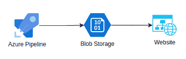
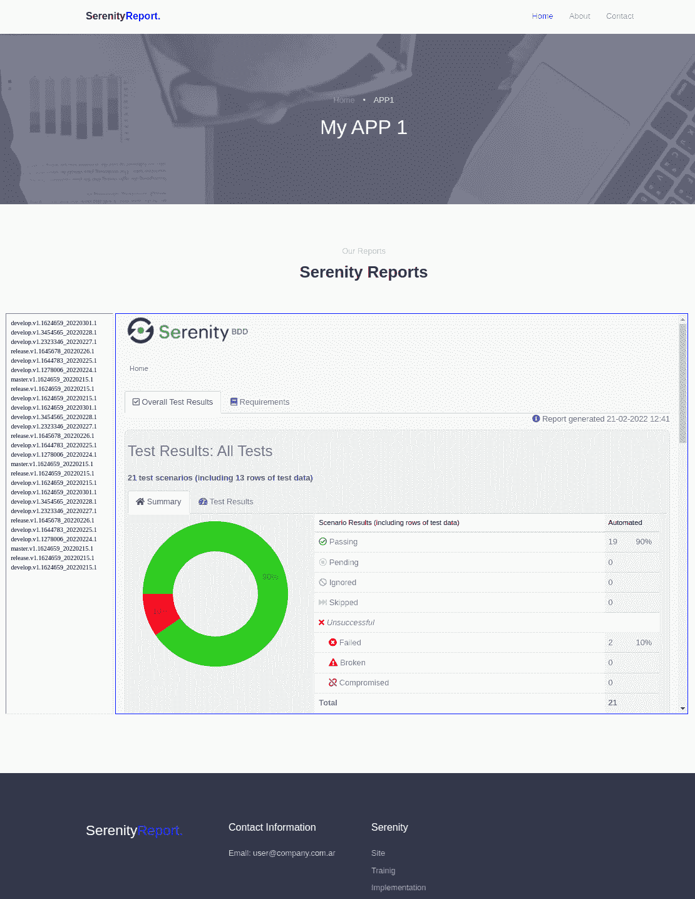
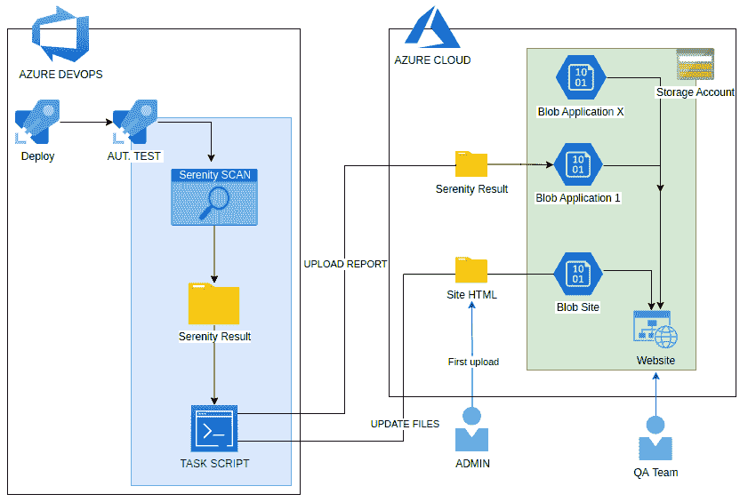

# 如何在网站上查看来自 Azure Pipelines 的报告？

> 原文：<https://medium.com/globant/how-to-view-reports-from-azure-pipelines-on-a-website-f7cb33f2e82b?source=collection_archive---------0----------------------->

## 使用 Azure 存储帐户

有时我们需要一个工具来可视化在 Azure Devops 管道中完成的任务的结果或报告。

为此，在本文中，我将向您展示一个**集成**，其中在管道中生成的**报告**可以上传到 **Azure 存储帐户中。**此外，这是一种易于维护的经济解决方案。

在本文中，我将讨论一个使用**分步模板和** **模板的例子！**

# 目标是什么？🎯

您的目标是在内部使用的门户中以一致和有序的方式可视化报告，以便在将来添加应用程序，并在将来灵活地添加应用程序



本文中解释的例子将使用 Serenity BDD 工具(smoke test 的自动化测试)。Serenity 任务将在云中的一个隔离的私有代理中执行。结果将在 Azure Pipelines 的代理内自动生成，路径如下:"/target/site/serenity/index . html "

然后，使用 CI/CD 中的任务脚本，将报告上传到存储帐户中的 blob 空间，并使用报告中的数据更新网站内容(之前由管理员上传)。

因此，您将拥有一个**静态网站，该网站使用来自 Azure Pipeline** 的冒烟测试的每次执行的报告或结果进行更新，并且团队 QA 将拥有一个报告查看门户。



Reporting portal screenshot

> *您可以使用从 Azure Pipelines 生成的任何其他报告*

# 先决条件📝

要实施此解决方案，您需要:

*   Azure 订阅:存储帐户的所有者角色
*   Azure 管道权限:创建脚本任务
*   安装了“Az CLI”的代理池管道
*   Serenity BDD(可选):您可以使用其他报告或信息来发布。
*   网站模板:[链接](https://github.com/mzcode01/SerenityReportSite)

## 准备存储帐户

除了创建存储帐户之外，第一步是准备公开网站

在菜单“数据管理>静态网站”中，必须启用“静态网站”功能，并且必须定义文件“索引文件名称”和“错误文件路径”。那么 URL 将在“主要端点”中获得

结果将是一个名为 *$web* 的 **Blob 容器，网站将在其中托管。**

*有关逐步指导，请参见* [*在 Azure 存储中托管一个静态网站*](https://docs.microsoft.com/en-us/azure/storage/blobs/storage-blob-static-website-how-to)

[](https://docs.microsoft.com/en-us/azure/storage/blobs/storage-blob-static-website-how-to) [## 在 Azure 存储中托管静态网站

### 登录 Azure 门户开始使用。找到您的存储帐户并显示帐户概述。选择静态…

docs.microsoft.com](https://docs.microsoft.com/en-us/azure/storage/blobs/storage-blob-static-website-how-to) 

> *当然，Azure 为我们提供了高级功能，如自定义域、指标、安全性、网络、多区域托管或 Header，但这些主题不会在本文中讨论*
> 
> *更多信息请见*[*Azure 存储中的静态网站托管*](https://docs.microsoft.com/en-us/azure/storage/blobs/storage-blob-static-website#mapping-a-custom-domain-to-a-static-website-url)

## 为应用程序创建 Blob

下一步是为应用程序创建一个 Blob 容器，其中将保存从管道生成的报告。

在“数据存储”中，您将完成一个名称，并选择“Blob”，如“公共访问级别”。


记住名称" *containername"* 以进行后续步骤。

## 将 Blob 配置到 Web

您可以使用任何带有文件夹和功能的 HTML 站点。在 free-css.com 的帮助下，我们准备了一个网站([附上模板](https://github.com/mzcode01/SerenityReportSite))，以下是一些您需要更改和理解的修改:

*   **Index.html**→为每个应用程序定义卡片，并创建一个到 app1.html 的链接。
*   **app1.html**→是每个应用程序的报告站点吗
*   **reports_app1.html** →是指向 blob 存储(“containername”)的链接的报告列表。该文件将在管道运行时更新

当您修改文件时，必须将它们上传到容器“$web”中。一种方法是在 VSCode 或 Azure Portal 或 Az CLI 中登录 Azure。

## 配置 Azure 管道

最后一步是将任务脚本添加到冒烟测试的管道中(在我们的例子中)

您需要从“安全+网络>访问密钥”中获得 SA(存储帐户)的访问密钥。如果您更改以下脚本，就有机会使用 SAS 键。

在脚本中，定义以下变量:

*   **ReportAccounName**= SAName
*   报告账户键 =键 1
*   **report file**= reports _ app 1 . html→命名 web 中的报表列表
*   **ReportStorageURL**=[https://*SAName*. Blob . core . windows . net](https://SAName.blob.core.windows.net)→Blob 的 URL
*   **report container**= container Name→为每个应用程序创建的容器的名称

请记住:

*   代理管道需要安装“Az CLI”。
*   在步骤#3 中，将定义要上传的带有 index.html 的报告的路径。
*   在步骤#6 中，将定义到报告路径的链接。

```
steps:
- script: |
#1Define vars to SA
ACCOUNTNAME=”$(ReportAccounName)”
ACCOUNTKEY=”$(ReportAccountKey)”#2Define vars to update website
FILE=”$(ReportFile)”
NAME=”$(ReportFile)”
BUILD=”$(Build.BuildNumber)”
STORAGEURL=”$(ReportStorageURL)”
CONTAINERREPORT=”$(ReportContainer)”#3Uplodad Report/files to SA
az storage blob upload-batch -d ‘’$CONTAINERREPORT/$BUILD’’ -s $(System.DefaultWorkingDirectory)/target/site — account-name $ACCOUNTNAME — account-key $ACCOUNTKEY##Add report in the website
#4Create work directory
mkdir download
cd download#5Download file of list of report from website
az storage blob download — container-name ‘$web’ -f $FILE -n $NAME — account-name $ACCOUNTNAME — account-key $ACCOUNTKEY#6Add in line 25 name of report and link in the list of report
sed -i ’25 i <a href=\”’$STORAGEURL/$CONTAINERREPORT/$BUILD’/serenity/index.html\” target=\”iframe_a\”>’$BUILD’</a><br>’ $FILE#7Update list of report to website
az storage blob upload — container-name ‘$web’ -f $FILE -n $NAME — account-name $ACCOUNTNAME — account-key $ACCOUNTKEY
```

# 最终建筑🎉

最后，对于执行的每个冒烟测试管道，网站上将出现一个名为 Build 和 report display 的新条目。在这里，您可以看到解决方案的最终架构。



> 安全提示:我试着简单地解释一下这个过程。但是指示的步骤打开了网站和内容。如果该解决方案对您有用，那么在 SA 上进行安全性工作是很重要的，例如通过 Vnet 进行过滤。

# 摘要

这是一个简单解决方案的第一个版本，可能会根据需要进行改进，并且使用非常便宜的资源。

您可以将这一理念应用于任何 CI/CD、任何类型的报告、任何 web 风格或其他云提供商。

接下来的步骤将是通过 IaC 的最佳实践创建所有任务

# 参考

*   [免费 css 模板](https://www.free-css.com/free-css-templates?start=12)
*   [Free-css 模板示例](https://www.free-css.com/free-css-templates/page272/revetive)
*   [Github 模板](https://github.com/mzcode01/SerenityReportSite)
*   [微软文档 az-cli](https://docs.microsoft.com/en-us/cli/azure/storage/blob?view=azure-cli-latest)
*   [微软文档静态网站](https://docs.microsoft.com/en-us/azure/storage/blobs/storage-blob-static-website)

致 [Pablo Rubini](https://medium.com/u/f7acacf97957?source=post_page-----f7cb33f2e82b--------------------------------) ，感谢你帮我开发任务。