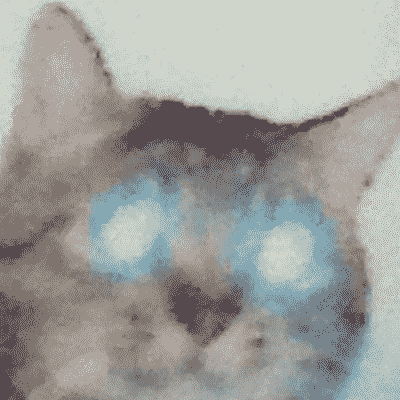

# 如何赢得高尔夫比赛

> 原文：<https://medium.com/google-developer-experts/how-to-win-kaggle-competitions-187e1df2204f?source=collection_archive---------4----------------------->

## 编剧 003-Tomohiro take sako 又名 Tom-ka ggle 竞赛特级大师

Tomohiro Takesako 是 263 名国际象棋大师之一。他已经在 Kaggle 上参加了超过 40 场比赛。在这次采访中，他告诉我们他是如何开始的，以及他在 Kaggle 上比赛时使用的过程。他还揭示了你需要做些什么来赢得梦寐以求的卡格尔比赛大师的头衔。

## 你是怎么开始做 Kaggle 的？

我从[“预测未来销售”竞赛](https://www.kaggle.com/competitions/competitive-data-science-predict-future-sales/overview)开始，这是 Coursera 课程“如何赢得数据科学竞赛”的最终项目。我从吴恩达的 Coursera ML 课程开始学习 ML，然后寻找更高级的课程。那个项目对我来说真的很难，但我学到了很多。在那个项目之后，我参加了“桑坦德价值预测挑战赛”，这最终不是标准的比赛，但对我来说是值得纪念的，因为这是我第一次参加有排名点和等级的比赛。

## 一个人需要做什么才能成为一名高尔夫比赛大师？

尽可能继续参加比赛。至少需要 5 枚金牌:)。我通常会参加一些从某些角度看起来很有趣的比赛(任务是否具有挑战性，该领域对我来说是否是新的，或者是一个有意义的任务？)或者哪个大概好保持动力。

尽量不要轻易放弃。有时候多做一点实验会有很好的洞察力。

## 在团队中工作对成为一名高尔夫比赛大师有什么作用？

我们可以从队友那里学到新的东西(技术，如何参加比赛等)。这些往往对获得更多金牌有帮助。此外，与队友合作可能会给我们在比赛中奔跑的动力。如果你有强大的队友，你很幸运，因为你将有更多的机会进入黄金地带:)。

我也喜欢独奏。这是因为当我单干时，我可以在比赛中做出所有的决定，这是一个不同于团队合作的很好的学习过程。

## 你参与过的最有趣的 Kaggle 比赛是哪一个？

[生财狗意象](https://www.kaggle.com/c/generative-dog-images):)。这是 Kaggle 上的第一次 GAN 比赛，我们需要在 Kaggle 笔记本上从头开始训练一个模型(9 小时限制)！从甘那里得到一个好的输出真的很有趣。我甚至在比赛后继续生成假狗。

## 你参与过的最具挑战性的 Kaggle 比赛是哪一场，你从中学到了什么？

[人类蛋白质图谱——单细胞分类](https://www.kaggle.com/c/hpa-single-cell-image-classification)。这是一个弱标签设置的竞争。我们得到了每个图像的标签，但我们需要预测图像中实例的标签。所以我们没有目标实例的任何直接标签。我了解到创造性的数据扩充真的很重要，但我错过了。

我还想选择“ [VSB 故障检测](https://www.kaggle.com/c/vsb-power-line-fault-detection)”，这真的很难，因为数据很嘈杂，CV-LB 相关性也不好(我想对于大多数团队来说)。我们的团队在私立学校从公立学校的第 14 名下滑了大约 500 名。这是我的第一次大搜查。我相信我的简历，但是失败了。我认识到，即使 CV-LB 看起来相关，仍然有可能错过一些重要的东西。

## 参加 Kaggle 比赛可以获得哪些技能？

我认为你可以获得很多技能:编码技能，更有效和快速地做实验的技能，使用最先进的 ML DL 库的技能，研究相关论文的技能，等等。但是你需要花费大量的时间去获得它们。

## Kaggle 发起一个你有兴趣参加的比赛。请向我们介绍一下您从比赛开始到结束的过程。你有你使用的小抄吗？

1.  我会阅读比赛的首页(概述，数据，讨论，规则)，然后点击加入按钮。
2.  新建一个笔记本，查看数据。然后做一些 EDA。
3.  下载数据集并创建基线模型。然后提交检查 CV-LB 相关性。
4.  尽量用小型号的拿个像样的 CV-LB。如果我对它满意，就搬到大一点的。
5.  运用包括系综在内的标准方法来检查竞争中最重要的因素是什么。
6.  尝试了所有的想法后，阅读讨论并查看过去比赛中的最佳解决方案。试试我觉得有意思的，检查一下表现。
7.  如果我卡住了，做一些错误分析，找到一个好的洞察力。
8.  在比赛的最后阶段，如果我需要的话，使用更多的模型和更大的系综。

## 告诉我们您目前在 Kaggle 比赛中使用的硬件类型。

*   CPU:英特尔酷睿 i7–8700k
*   GPU:英伟达泰坦 RTX
*   固态硬盘:2TB
*   内存:64GB

## 如果没有海量的 GPU 硬件，一个人能参加 Kaggle 比赛吗？如果有，如何实现？

这取决于你参加的比赛。但是好的硬件有助于你专注于比赛任务本身。

## 你为什么决定攻读博士学位？

我想做物理方面的研究，所以自然要去读博士课程。

## 如果你今天开始学习数据科学和机器学习。你的学习过程会是怎样的？你会从哪些技能开始，在哪里可以找到资源？

我会从一些在线课程开始。吴恩达在 Coursera 上的 ML 讲座将是我的起点。我也会阅读关于 ML 的教科书。至于 DL，我会从 PyTorch 官方教程和 Kaggle 课程开始。

## 你写了一些论文。写作在构建数据科学和机器学习的职业生涯中有多重要？

我觉得对我的数据科学生涯没有直接帮助因为我的论文主要是关于粒子物理中的暗物质模型:)。但那段经历对我搜索论文，了解领域脉络很有帮助。

## 在你看来，数据科学和机器学习中最被低估的技能是什么？

不确定，但在 Kaggle 中，我认为快速创建一个坚实的基线是最终不被评级的重要技能之一(如果你不公开的话)。

## 人们说 Kaggle 竞赛不能反映真实世界的问题，部分原因是有时数据已经被清理，而事实是这是一个测试你的解决方案的排行榜。你对这一说法有何回应？

我不在乎这些，因为 Kaggle 专注于创建最好的性能模型，这本身就很有意义。只调模型参数是赢不了的。此外，有时我们在 Kaggle 中有几乎真实世界的数据。反正我推荐这样的人至少跑过 10 场比赛。很好玩:)。

## 在 Spout.ai 如何将机器学习应用于理赔自动化和欺诈资格认定？

我们使用 OCR 和 NLP 技术。所以 DL 模型是其中的核心部分。这很有挑战性。

## 除了 TensorFlow 和 PyTorch 等主流机器学习包。你在工作中还使用过哪些鲜为人知的工具？

我认为我只使用主流软件包。

## 人们在网上哪里可以找到你？

*   我的[卡格尔账号](https://www.kaggle.com/tikutiku)。
*   我的 [LinkedIn 账户](https://www.linkedin.com/in/tomohiro-takesako-45a146134)。

[在 LinkedIn 上关注我](https://www.linkedin.com/in/mwitiderrick/)获取更多技术资源。