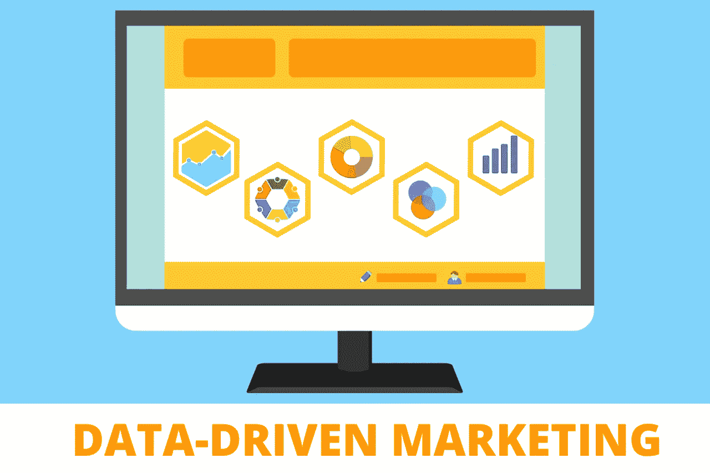
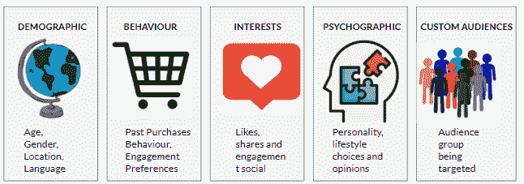
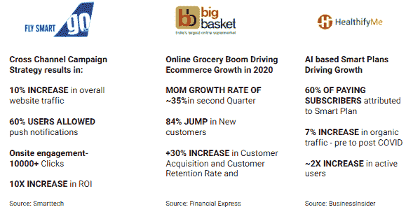
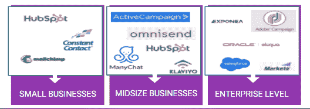
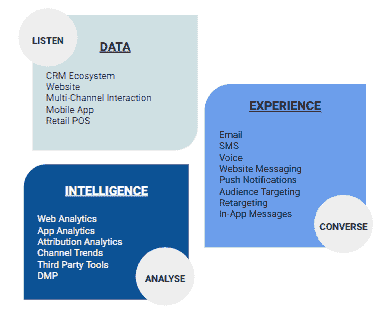
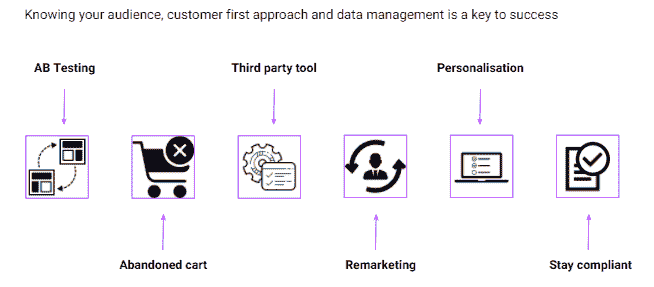

# 2021 年电子商务如何以数据驱动的营销策略赢得营销自动化游戏

> 原文：<https://medium.com/globant/how-to-win-the-marketing-automation-game-with-a-data-driven-strategy-de14240ef972?source=collection_archive---------1----------------------->

Win the Marketing Automation game with a data-driven marketing strategy

尽管当前危机重重，数据驱动的营销策略和营销自动化仍然是企业数字解决方案的首要投资重点。

# 数据驱动营销的定义是什么？

> **数据** - **驱动营销**指的是建立在洞察力基础上的战略。我们根据客户的网站互动、参与度、行为和偏好从他们那里发现并获取这些见解**。**借助营销自动化，我们可以优化数据驱动营销的绩效。

# 在数据驱动的营销策略中，受众细分是如何起作用的？

## 受众细分有不同的类型，可以分为人口统计、心理分析、兴趣、行为和习惯受众。我个人最喜欢的是行为受众和定制受众，包括长相相似和重定目标的受众

对于营销人员来说，受众细分策略是一座机会的金矿，可以吸引潜在客户，并用正确的数据转化他们

5 tactics to drive Audience Segmentation in Data-Driven Strategy:

# 电子商务创业的 5 种行为模式

## 让我们来谈谈行为，您实际上可以基于以下内容来构建细分列表:

## #1:为被放弃的购物车用户创建一个细分列表

## #2:为目标客户创建细分列表

## #3:创建客户平均订单价值(AOV)的细分列表

## #4 为过去的客户创建一个细分列表

## #5 根据参与度指标创建细分列表

细分在数据驱动战略中发挥着重要作用。当你有合适的客户数据推向市场时，就不需要猜测了

借助自动化工具，您可以进行更精细的细分，从而提高影响力、参与度和转化率。

# 成功电子商务创业的数据驱动营销案例:

在与 Bigbasket 或 Healthify 这样的应用程序交互时，你会觉得他们的产品是专门为你制作的，尤其是在到处都是个性化的时候。

最好的例子是航空业或零售业一个类似于亚马逊的电子商务品牌，Cleartrip 引领了不同的客户接触点。他们证明了跨不同渠道和设备的沟通应该是个性化的。优势在于“你的品牌形象在不同渠道间保持一致。”

我举了一些有趣的例子，说明顶级初创公司是如何利用数据做出决策，从而提高他们的成功和盈利能力的。

**Data-Driven Marketing Examples**

# **面向小型企业的营销自动化工具。中型商业和企业公司:**

你可能有很多数字接触点，比如你的网站、你的博客、你的社交渠道、一个应用程序、一个电子商务平台，或许还有线下渠道。营销自动化帮助您跟踪所有接触点的客户旅程。

当我们对客户受众有一个统一的看法时，获得数据驱动的洞察力是相当可能的。这只有通过营销自动化工具才能实现。

我们已经提到了基于小型企业、中型企业和大型企业的营销自动化工具。Source-g2.com 数据

Marketing Automation Tools for Small Business. Midsize Business and Enterprise companies:

# 如何采用数据驱动的营销自动化方法？

*   整合数据驱动营销战略
*   优化您的数字营销渠道
*   用数据了解你的客户
*   在每个阶段个性化客户旅程
*   显示下一个最佳报价
*   在网站或应用上创造更好的用户体验

# 十大营销自动化功能:

1.  领导管理

2.电子邮件活动管理

3.社交媒体营销

4.定制的电子邮件模板

5.动态个性化

6.分割

7.重新定位

8.跨渠道营销活动协调

9.基于 AI 的分析

10.推荐引擎

**Marketing Automation Features**

让我们来看几个上述特性的例子:

# 关于电子邮件营销的 5 个事实

> 基于这项研究，我想提一下，
> 
> 系列欢迎邮件的打开率超过 90%——Hive.co
> 
> 上午 11 点、下午 2 点和下午 6 点是电子邮件 opens-Hive.co 的高峰时段
> 
> 欢迎电子邮件可以在 30%的独特打开率中创造 86%的提升-企业家
> 
> 84%的 B2C 欢迎邮件到达收件箱，阅读率为 23%

# 动态个性化的示例:

一个明显的例子是亚马逊，我相信你会得到有力的建议:

*   你可能会对…感兴趣
*   客户还查看了…
*   买了 X 的顾客也买了 Y
*   受你的浏览历史的启发

# **统治数据驱动战略应该遵循的 5 个最佳实践:**

**Best Practices for Data-Driven Strategy**

*   **废弃电子邮件**——自动发送一系列废弃购物车电子邮件给将物品留在购物车中的顾客。电子商务公司是领导者的典型例子。
*   AB 测试——不管是网站还是电子邮件，你都应该做测试，看看什么是最好的。最好的例子就是优化。你可以测试你的网页。
*   **第三方工具** -有许多第三方工具可以帮助您提高转化率和销售线索质量。Web engage 和 Snapap 就是这类工具的例子。
*   **再营销** -这创造了有价值的接触点，你可以将你的销售线索转化为客户。
*   **保持合规-** 美国法律对 GDPR 相当严格，但我们应该能够为那些接受 cookies 的人重新营销和收集数据。

**总结:**

总之，每个企业和聪明的营销人员都应该有顾客至上的方法。从网站到信息传递，让您的客户体验物有所值，看看他们的数据会带来怎样的奇迹。

要胜过任何活动，跨渠道营销、正确的内容策略和受众细分是关键。这必将有助于赢得以数据驱动营销的营销自动化这场游戏。

要了解更多关于像 SFMC 这样的流行自动化工具，请阅读文章[sales force 营销云(SFMC)生态系统指南](/globant/leverage-automation-technology-guide-to-salesforce-marketing-cloud-d02d38c6f50e)