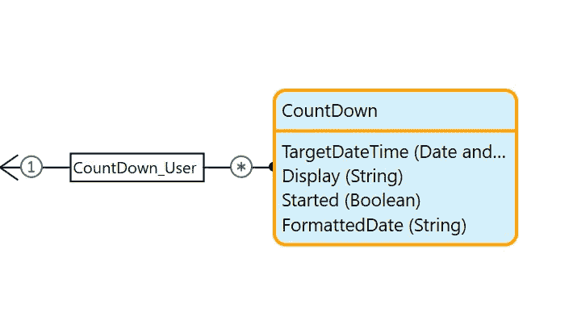
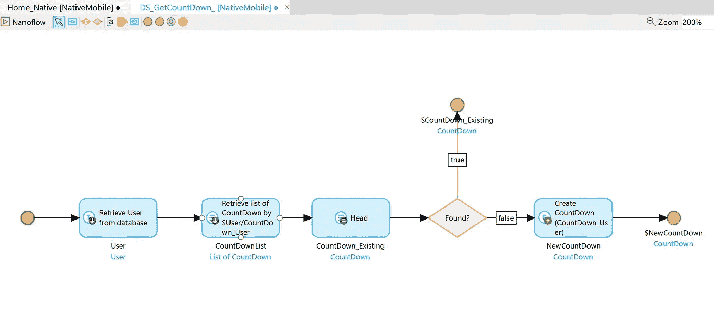
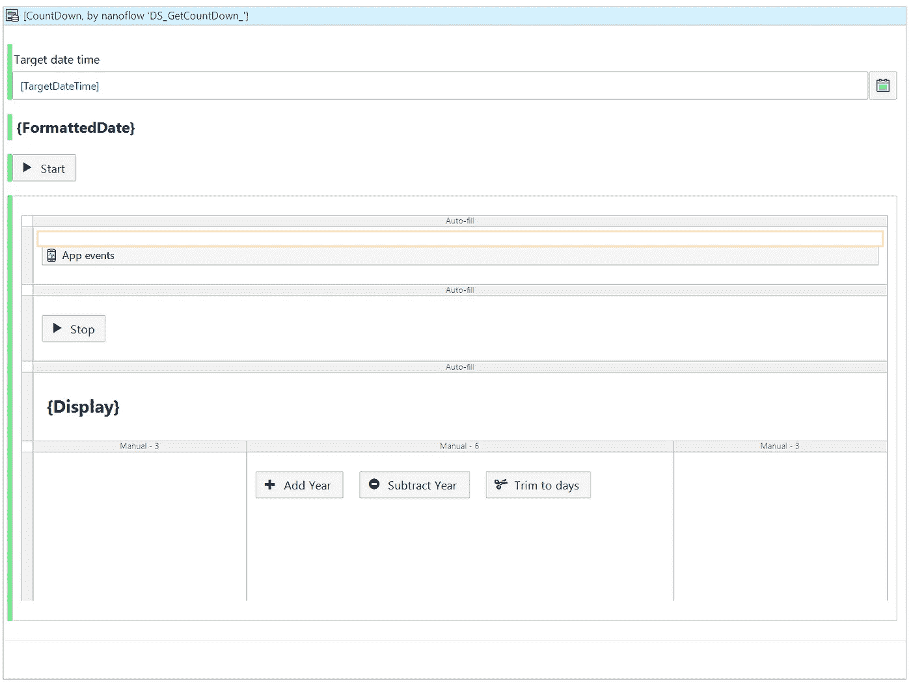
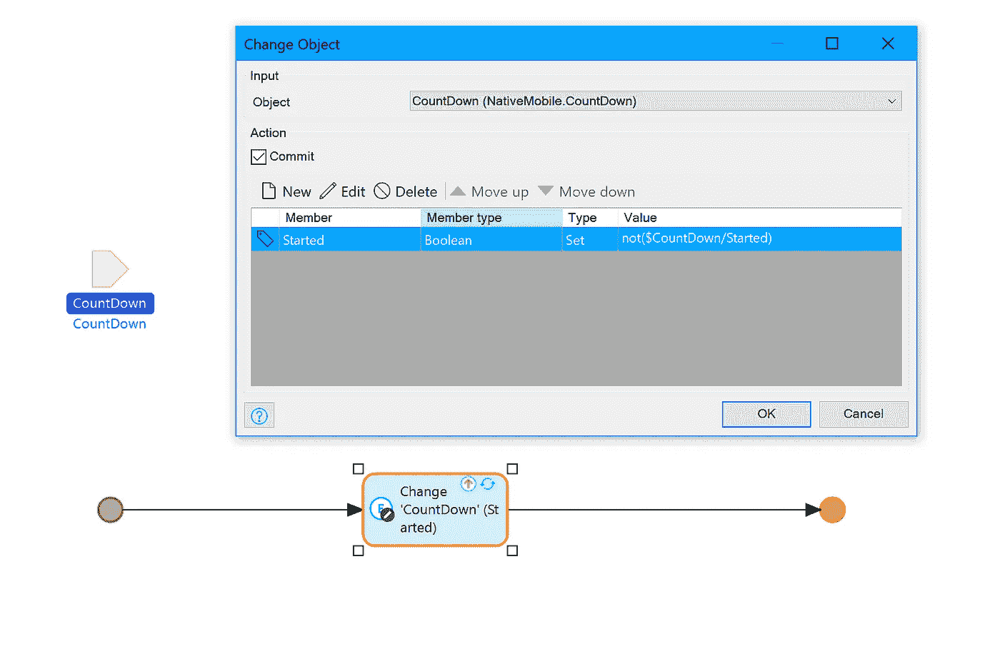
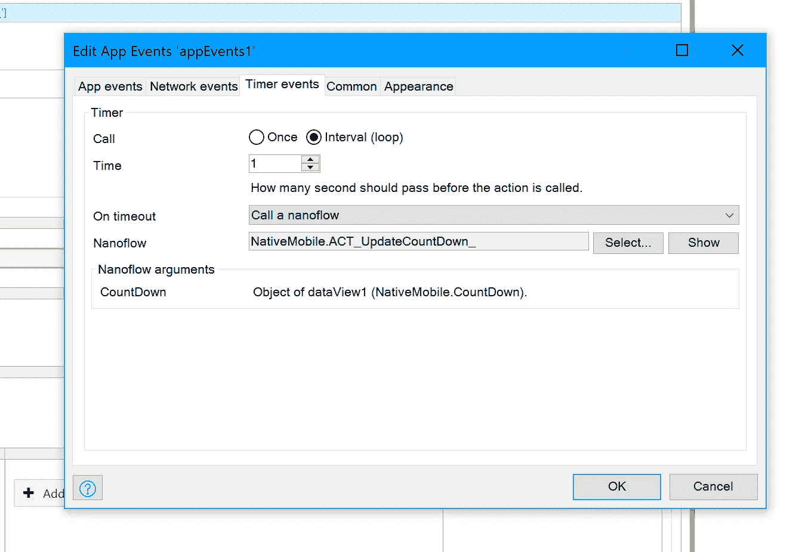
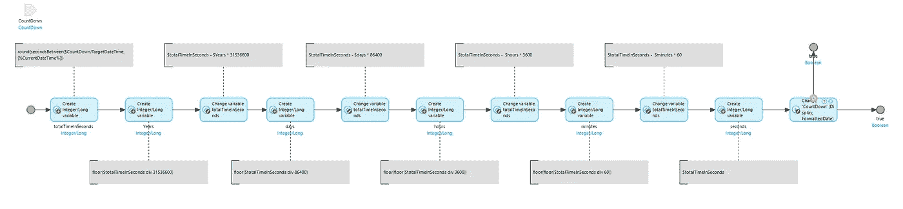
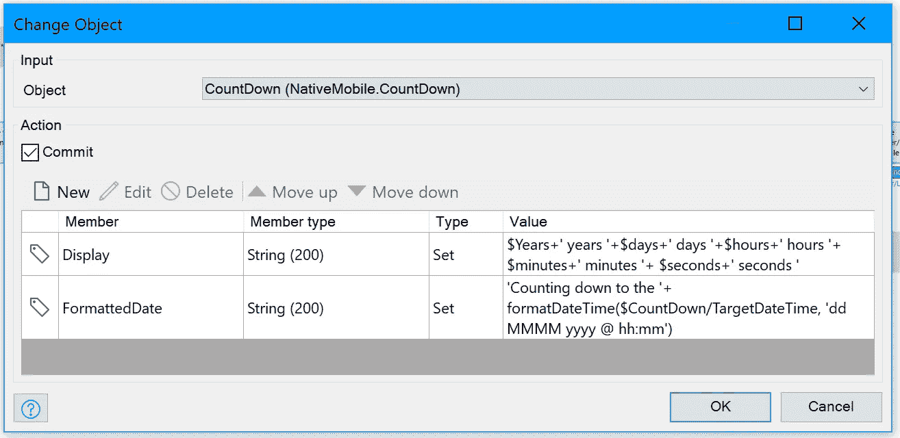

# 如何使用日期时间函数

> 原文：<https://medium.com/mendix/how-to-work-with-date-time-functions-mendix-how-to-f00d61496f48?source=collection_archive---------2----------------------->

## 从时间开始，我们作为一个物种就一直试图记录它。从我们的设备在早上的预定时间叫醒我们，到我们在晚上设置同样的闹钟叫醒我们，每天的每一秒都被跟踪和记录。幸运的是，我们现在有技术来跟踪这一点，但如何在 Mendix 中使用日期时间函数呢？我创建了一个倒计时应用程序，向您展示如何处理这种棘手的数据类型。

# 日期时间函数

当构建任何与日期或时间有关的东西时，最好了解一些基本的函数来帮助您完成任务

给一个属性或变量加上时间或者减去时间是一个非常方便的函数，或者说是一组函数。根据您想要更改的程度，您可以添加或删除以下值:

*   毫秒
*   秒
*   分钟
*   小时
*   天
*   周；星期
*   月份
*   年

这可能看起来令人困惑，但是为了减去时间，你需要使用适当的加法函数，但是你需要给它提供一个负值。例如，要删除一年，语句应该是

`addYear($dateVar, -1)`

其他一些有用的函数允许您将日期时间值格式化为字符串，并且您可以将字符串解析为日期。

修剪日期允许您从中获得特定的数据，这意味着如果您有日期时间，但只关心日期，您可以使用修剪到天的功能。

虽然这不会从整个字符串中删除小时或秒，但会将它们设置为一天的开始。

`trimToDays([currentdate]) = 28 November 2020 12:00 AM`

# 入门指南

为了开始，我使用 8.14.1 创建了一个应用程序，使用了本地移动快速入门模板。

虽然 app store 中有 counter widget，但它与原生移动不兼容，所以我决定使用离线优先方法重新创建此功能，这意味着我只使用了 nanoflows、UI 中的一些可见性规则和原生移动快速入门应用中的应用事件 widget。

# 设置领域模型和用户界面

在 NativeMobile 模块的域模型中，我创建了一个名为 CountDown 的实体。倒计时通过关联链接到用户，并具有如下图所示的一些属性。

我没有为此项目配置项目安全性，因此我不必为我的用户添加任何访问权限，但如果您在应用中启用了安全性，则需要这样做。

然后在 Home_Native 页面上，我添加了一个 dataview，由一个名为 DS_GetCountDown 的 nanoflow 数据源填充。这个流程检查用户是否有链接到他们的倒计时对象，如果没有，就创建一个。

然后回到 Home_Native 的页面编辑器中，我将元素添加到页面中，如下所示:

可见性规则基于存储为$CountDown/Started 的$Started 布尔值。当计时器启动时，显示容器内部的所有内容，反之亦然。

# 逻辑

开始和停止按钮连接到同一个纳米流，称为 ACT_ToggleCountDown。在里面，我改变了开始的布尔值，并提交了对象。

然后，我将应用程序计时器小部件配置为每秒调用我的流 ACT_UpdateCountDown，以便更新页面。

nanoflow 获得目标日期和当前日期之间的总时间(以秒为单位),然后使用一些数学方法，我计算出它们之间的年、日、小时、分钟和秒。我发现这个[网站](https://brainly.in/question/3979888)的一个帖子对计算这些值很有帮助。

这是它在流程中的样子:

一旦我正确计算了所有的值，我就改变倒计时对象来更新这些值。

请注意我是如何在字符串属性 Formatted Date 中使用 FormatDateTime 的，并将其与一些文本结合起来以使其更具可读性。

最后，我又创造了 3 个纳米流:

添加年份

`addYears($CountDown/TargetDateTime,1)`

减去一年

`addYears($CountDown/TargetDateTime,-1)`

将日期时间调整为天。

`trimToDays($CountDown/TargetDateTime)`

(注意 trim 不会删除小时和分钟，它只是将它们设置为 00:00 或午夜)

# 测试应用程序

在本地部署应用程序使我能够通过使用 [make it native mobile 应用程序](https://docs.mendix.com/refguide/getting-the-make-it-native-app)来测试我的应用程序，该应用程序可在 Android 和 IOS 的应用商店中获得。这是我测试时这个应用程序的一个短片。

我希望你喜欢这个指南，请关注下一个，即将推出！

*你在发展中有没有正在纠结的事情？想要一份专为你打造的个性化指南吗？*

*你可以在* [*Mendix 社区 Slack 频道*](https://join.slack.com/t/mendixcommunity/shared_invite/zt-hwhwkcxu-~59ywyjqHlUHXmrw5heqpQ)*@ Ryan mock*联系到我