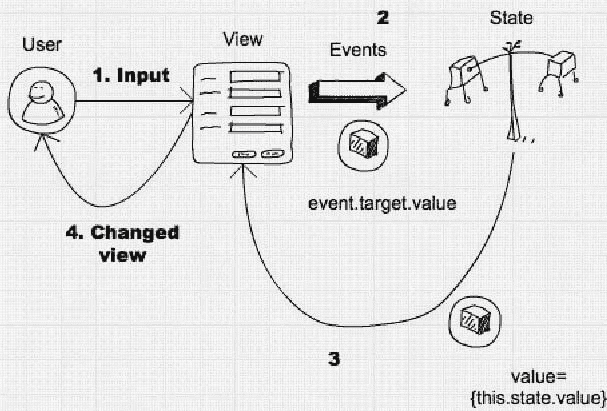
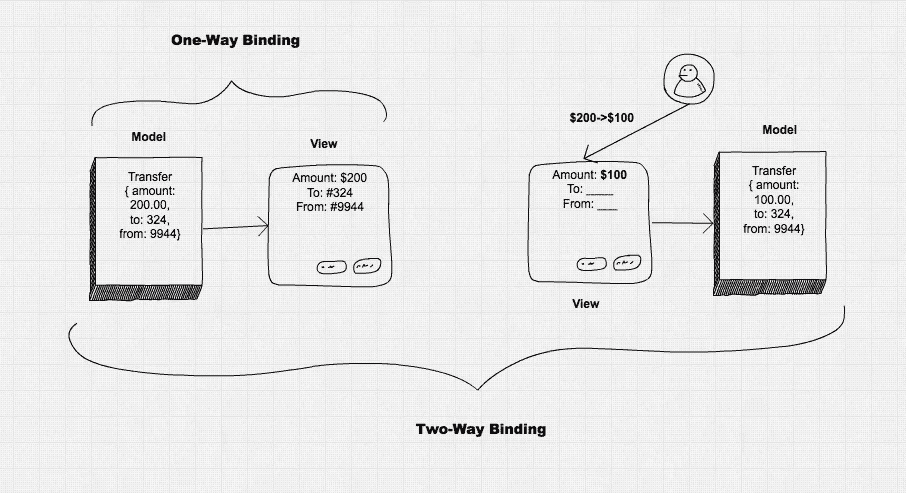

# 如何在 React 中使用表单、输入和事件

> 原文：<https://medium.com/capital-one-tech/how-to-work-with-forms-inputs-and-events-in-react-c337171b923b?source=collection_archive---------0----------------------->


***这是本书摘录的*** [***反应迅速***](https://www.manning.com/books/react-quickly) ***，可用在***[***【manning.com】***](https://manning.com/)

本文介绍了如何捕获文本输入以及通过其他表单元素(如、<textarea>和<option>)进行输入。使用它们对于 web 开发来说是至关重要的，因为它们允许我们的应用程序接收来自用户的数据(例如文本)和动作(例如点击)。</option></textarea>

## **React 中使用表单的推荐方式**

在常规 HTML 中，当我们处理 input 元素时，页面的 DOM 在其 DOM 节点中维护该元素的值。可以通过像:`document.getElementById(‘email’).value`这样的方法或者使用 jQuery 方法来访问这个值。大教堂是我们的储藏室。

在 React 中，当处理表单或任何其他用户输入字段(如独立的文本字段或按钮)时，开发人员有一个有趣的问题需要解决。来自 React 的文档:*“React 组件必须表示视图在任何时间点的状态，而不仅仅是在初始化时。”React 就是通过使用声明式风格来描述用户界面，让事情变得简单。React 描述了 UI、它的结束阶段以及它应该是什么样子。*

你能发现冲突吗？在传统的 HTML 表单元素中，元素的状态会随着用户输入而改变。React 使用声明性方法来描述 UI。输入需要是动态的，以正确反映状态。

如果开发人员选择不维护组件状态(在 JavaScript 中)，也不与视图同步，那么就会产生问题——可能会出现内部状态和视图不同，而 React 不知道状态发生变化的情况。这可能导致各种各样的麻烦，并削弱了 React 的简单哲学。最佳实践是让 React 的`render()` 尽可能接近真实的 DOM，这包括表单元素中的数据。

考虑这个文本输入字段的例子。React 必须在组件的`render()`中包含新值。因此，我们需要使用`value`将元素的值设置为新值。如果我们像以前在 HTML 中一样实现一个 `<input>`字段，React 将使 `render()`与真正的 DOM 保持同步。React 不允许用户更改该值。你自己试试。这可能感觉很疯狂，但这是反应的适当行为！

```
render() { return <input type=”text” name=”title” value=”Mr.” />}
```

上面的代码表示任何状态下的视图，值始终为“Mr”。对于输入字段，它们必须响应于用户的击键而改变。鉴于以上几点，让我们将价值动态化。

这是一个更好的实现，因为它将从以下状态进行更新:

```
render() { return <input type=”text” name=”title” value={this.state.title} />}
```

国家的价值是什么？React 不知道用户在表单元素中键入的内容。开发人员需要实现一个事件处理程序来捕捉`onChange`的变化。

```
handleChange(event) { this.setState({title: event.target.value})}render() { return <input type=”text” name=”title” value={this.state.title} 
    onChange={this.handleChange.bind(this)}/>}
```

鉴于以上几点，对于开发人员来说，最佳做法是实现以下内容，以便将内部状态与视图同步(图 1):

1.使用状态的值在`render()` 中定义元素。

2.使用`onChange()`捕捉形状元素发生的变化。

3.更新事件处理程序中的内部状态。

4.新值保存在状态中，然后视图由新的`render()`更新。



***图 1:捕捉输入变化并应用到状态***

乍看之下，这似乎是一项很大的工作，但我希望通过更多地使用 React，您会欣赏这种方法。之所以称之为单向绑定，是因为状态只改变视图。没有返程，只有从一个州到另一个州的单程旅行。使用单向绑定时，库不会自动更新状态(或模型)。单向绑定的一个主要好处是，它在处理大型应用程序时消除了复杂性，在大型应用程序中，许多视图可以隐式更新许多状态(数据模型)，反之亦然——图 2。

简单并不总是意味着更少的代码。有时，就像这种情况一样，开发人员必须编写额外的代码来手动将来自事件处理程序的数据设置为状态(呈现为视图)。但当涉及到复杂的用户界面和具有无数视图和状态的单页应用程序时，这种方法往往更优越。简言之: ***简单并不总是容易。***



**图 2:单向与双向绑定**

相反，双向绑定允许视图自动更改状态，而无需开发人员显式实现。双向绑定是 Angular 1 的工作方式。有趣的是，Angular 2 从 React 借用了单向绑定的概念，并将其设为默认值(您仍然可以显式地拥有双向绑定)。

因此，我们将首先介绍使用表单的推荐方法。它被称为受控组件，确保内部组件状态始终与视图同步。另一种方法是不受控制的成分。

到目前为止，我们已经了解了在 reactor 中使用输入字段的最佳做法，即捕获更改并将其应用于状态，如图 1 所示(更改视图的输入)。接下来，让我们看看如何定义一个表单及其元素。

# 定义形式及其在反应中的事件

我们将从 `<form>`元素开始。通常，我们不希望我们的输入元素随机挂在 DOM 中。如果我们有许多功能不同的输入集，这可能会变得很糟糕。相反，我们将具有共同目的的输入元素包装在一个 `<form></form>`元素中。

没有必要有一个`<form>`包装。在简单的用户界面中单独使用表单元素完全没问题。在更复杂的 ui 中，开发人员可能在一个页面上有多组元素。在这种情况下，对每个组使用`<form>`是明智的。React 的 `<form>`呈现在 HTML `<form>`中，我们对 React 的`<form>` 元素应用的任何规则也是如此。根据 HTML5 规范，开发者不应该嵌套表单(它说内容是流内容，但是没有`<form>` 元素后代)。

表单元素本身可以有事件。除了标准的 React DOM 事件之外，React 还支持表单的三个事件:

*   `onChange`:当表单的任何输入元素发生变化时触发。
*   `onInput`:每次改变 `<textarea>`和 `<input>`元素值时触发。React 团队不建议使用它(见下文)。
*   `onSubmit`:提交表单时触发，通常是按 enter 键。

# onChange 与 onInput

React 的`onChange`在每次改变时触发，与之相反的是[DOM 的改变事件](https://developer.mozilla.org/en-US/docs/Web/Events/change)，它可能不会在每次值改变时触发，而是在失去焦点时触发。例如，对于`<input type=”text”>`,用户可以在没有 onChange 的情况下输入，只有在用户按下 tab 或者用他/她的鼠标点击另一个元素(失去焦点)之后，onChange 才会在 HTML 中被触发(常规浏览器事件)。如前所述，在 React 中，onChange 在每次击键时触发，而不仅仅是在失去焦点时。

另一方面，React 中的 onInput 是 DOM 的 onInput 的包装器，它在每次更改时触发。因此，React 团队建议在 onInput 上使用 onChange。底线是 React 的 onChange 与 HTML 中的 onChange 工作方式不同，因为它更一致(也更像 HTML 的 onInput)。onChange 在每次更改时触发，而不是在失去焦点时触发。

React 中推荐的方法是只在需要访问 onInput 事件的本机行为时才使用 onChange 和 onInput。原因是 React 的 onChange 包装器行为提供了一致性。

# 使用表单事件

除了上面列出的三个事件， `<form>` 还可以有标准的反应事件，比如 `onKeyUp`或`onClick`。当我们需要捕获整个表单(一组输入元素)的特定事件时，使用表单事件可能会很方便。

例如，允许用户在按下 enter 键时提交数据是一个很好的 UX(假设您不在 textarea 字段中，在这种情况下，enter 应该会创建一个新行)。我们可以通过创建一个触发`this.handleSubmit()`的事件监听器来监听表单提交事件。

```
handleSubmit(event) {…}render() { return (
    <form onSubmit={this.handleSubmit}> <input type=”text” name=”email” /> </form>
  )}
```

**请注意:**我们需要在 render()之外实现 handleSubmit 函数，就像我们处理其他事件一样。React 不要求任何命名约定，您可以随意命名事件处理程序，只要它是可理解的和一致的。现在，我们将坚持使用最流行的约定，在事件处理程序前面加上单词“handle ”,以区别于常规的类方法。

提醒一下，不要调用方法(不要放括号)，不要在花括号周围用双引号(正确做法:EVENT={this。方法})时设置事件处理程序。在 React 中，我们传递函数的定义，而不是它的结果，我们使用花括号作为 JSX 属性值。

在 enter 上实现表单提交的另一种方式是通过手动监听 key up 事件(`onKeyUp`)并检查键码(13 代表 enter)。

```
handleKeyUp(event) { if (event.keyCode == 13) return this.sendData()}render() { return <form onKeyUp={this.handleKeyUp}> … </form>}
```

请注意，`sendData`方法是在代码中的其他地方实现的。此外，我们需要在`constructor()`中绑定(这个)事件处理程序。

总而言之，在 React 中，我们可以在表单元素上拥有事件，而不仅仅是表单中的单个元素。

***注意*** *:本文中的例子的源代码在 GitHub 资源库* [*的 ch04 文件夹中，azat-co/react-quick*](https://github.com/azat-co/react)*。还有一些演示可以在 http://reactquickly.co/demos 的*[](http://reactquickly.co/demos)**找到。**

> *本文到此结束，更多关于 React 及其无数用途的信息，请查看 manning.com[的](https://manning.com/)[快速反应](https://www.manning.com/books/react-quickly)。*

*[](https://www.manning.com/books/react-quickly)*

****声明:以上观点仅代表作者个人观点。除非本帖中另有说明，否则 Capital One 不属于所提及的任何公司，也不被其认可。使用或展示的所有商标和其他知识产权都是其各自所有者的所有权。本文为 2017 首都一。****