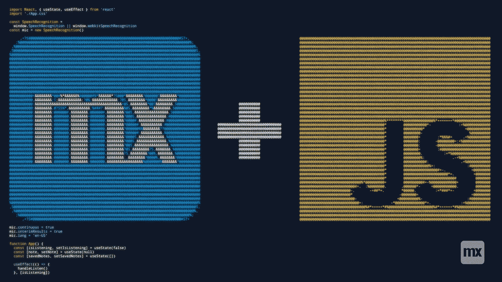
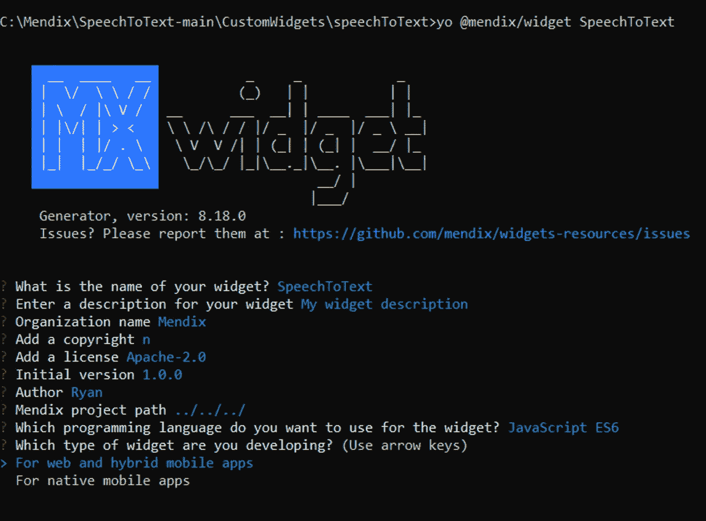

# 如何使用 JavaScript 和 Mendix

> 原文：<https://medium.com/mendix/how-to-work-with-javascript-and-mendix-a1cd7594f46c?source=collection_archive---------1----------------------->



How to work with Javascript and Mendix

## 在一级防范禁闭期间，我有很多空闲时间，和许多人一样，我大部分时间都在疯狂地看电视剧，跑电影马拉松。在将近一个月的电影马拉松中，我开始好奇是否可以用 JavaScript 在 Mendix 中创建一个语音应用。

那些熟悉超级英雄电影和其他科幻类型的人，将会熟悉入侵安全系统的数字助手和故事主角的更多信息。但对于我来说，我会专注于我的数字助理语音应用程序的语音到文本和文本到语音方面。我是说，这到底有多难？几乎不考虑我自己的理智或压力水平，我一头扎进了语音合成技术的深渊，以及如何用 Javascript 和 Mendix 实现它们。

## “据我所知，JavaScript 是唯一一种人们觉得在开始使用之前不需要学习的语言。”

> —道格拉斯·克洛克福特

# 这个想法

这个设计很简单——我能做的最简单的设计。这个想法是创建一个 Mendix 应用程序，它可以听到并理解用户所说的话，然后通过自己的“声音”做出回应。听起来很简单，对吗？一旦我决定了一个设计，就该去寻找任何我可以使用的现有技术了——当已经有许多语音平台存在时，从零开始重新开发没有多大意义，比如 IBM 的 Watson 和谷歌的云人工智能平台。

不过我以前也做过聊天机器人——在去年的 Mendix World 上，我和 Jan de Vries 一起主持了一个低代码的实时构建。在会议中，我开发了一个 Alexa 技能，允许用户通过与 Alexa 对话来与 Mendix 应用程序进行交互。这一次，我决定少关注实际的谈话和对话，而更多地关注这个构建的实际口语方面。如果你想了解更多关于建立对话树的知识，我推荐你观看《Mendix World 2020》的录像。

# 设计

那么我到底要建造什么呢？经过一些研究后，我选定了一个设计，我的应用程序将专注于两个核心方面:

1.  一个语音到文本的插件，将能够听到和理解用户的声音。
2.  一个文本到语音的 JavaScript 动作，将允许应用程序大声响应用户。

对于这个小部件，我将使用我在 [Github](https://github.com/NikValdez/voiceTextTut/blob/master/src/App.js) 上找到的库，它利用了 [Mozilla 的语音合成库。](https://developer.mozilla.org/en-US/docs/Web/API/SpeechRecognition)

为了方便 JavaScript 操作，我看到了由 Mendix 创建的 [JavaScript 教程，它在我们自己的文档中做了同样的事情。](https://docs.mendix.com/howto/extensibility/write-javascript-actions)

最后，在电影中，英雄总是为他们的机器人助手取一个很酷的名字。为了纪念这一点，我决定将我的应用程序命名为 **MAEVIS** ，代表“ **Mendix 的令人敬畏的优秀非常智能的系统**

# 建筑梅维斯

一般来说，当我开发一个应用程序的时候，我会首先关注最具挑战性或者最复杂的流程。由于我已经对如何让应用程序说话有了一个粗略的想法，我决定专注于构建一个小部件，让梅维斯**听到我的声音**。如上所述，我决定在 Github 上使用 NikValdez[](https://github.com/NikValdez)**的这个 [**库**](https://github.com/NikValdez/voiceTextTut/blob/master/src/App.js) 。**

**我使用 Mendix 小部件生成器来创建我的小部件支架。我选择使用 JavaScript ES6 来构建它，它是为 web 和混合移动应用而构建的。**

****

> **我在修改这段代码以在 MAEVIS 中工作时遇到的主要问题是，该示例使用了一个功能组件，而小部件支架将代码生成为一个类组件。一旦我理解了这个问题，解决它就简单了。**

**我以此作为最后的小部件代码:**

```
import React,{ Component, createElement, useState, useEffect } from "react";import "./ui/SpeechToText.css";const SpeechRecognition = window.SpeechRecognition || window.webkitSpeechRecognition;const mic = new SpeechRecognition();mic.continuous = true;mic.interimResults = true;mic.lang = 'en-US';export default function SpeechToText(){const [isListening, setIsListening] = useState(false);const [note, setNote] = useState('');const [savedNotes, setSavedNotes] = useState([]);useEffect(() => {handleListen()}, [isListening]);const handleListen = () => {if (isListening) {mic.start()mic.onend = () => {console.log('continue..')mic.start()}} else {mic.stop()mic.onend = () => {console.log('Stopped Mic on Click')handleSaveNote()}}mic.onstart = () => {console.log('Mics on')}mic.onresult = event => {const transcript = Array.from(event.results).map(result => result[0]).map(result => result.transcript).join('')console.log(transcript)//textAttribute(transcript)setNote(transcript)mic.onerror = event => {console.log(event.error)}}}const handleSaveNote = () => {setSavedNotes([...savedNotes, note])setNote('')}return  <span className="flexColumn"><><p>{note}</p><buttonclassName={isListening ? 'pulse-button btn-danger' : 'pulse-button'}onClick={() => setIsListening(prevState => !prevState)}>{isListening ? <span>🎙️Stop</span> : <span>🛑Start</span>}</button></><><h2>Notes</h2>{savedNotes.map(n => (<p key={n}>{n}</p>))}</></span>;}
```

**我还添加了一些样式来改变 widgets 前端，所以它看起来比屏幕上的常规按钮更好:**

```
.flexColumn{display: inline-flex;flex-direction: column;}.container {width: 200px;height: 100%;margin: 0 auto 0;perspective: 1000;-webkit-perspective: 1000;-webkit-backface-visibility: hidden;backface-visibility: hidden;background: #fff;}.pulse-button {position: relative;margin: auto;display: block;width: 10em;height: 10em;font-size: 1.3em;font-weight: light;font-family: 'Trebuchet MS', sans-serif;text-transform: uppercase;text-align: center;line-height: 100px;letter-spacing: -1px;color: white;border: none;border-radius: 50%;background: #5a99d4;cursor: pointer;box-shadow: 0 0 0 0 rgba(90, 153, 212, 0.5);-webkit-animation: pulse 1.5s infinite;animation: pulse 1.5s infinite;}.pulse-button:hover {-webkit-animation: none;animation: none;}@-webkit-keyframes pulse {0% {-moz-transform: scale(0.9);-ms-transform: scale(0.9);-webkit-transform: scale(0.9);transform: scale(0.9);}70% {-moz-transform: scale(1);-ms-transform: scale(1);-webkit-transform: scale(1);transform: scale(1);box-shadow: 0 0 0 50px rgba(90, 153, 212, 0);}100% {-moz-transform: scale(0.9);-ms-transform: scale(0.9);-webkit-transform: scale(0.9);transform: scale(0.9);box-shadow: 0 0 0 0 rgba(90, 153, 212, 0);}}@keyframes pulse {0% {-moz-transform: scale(0.9);-ms-transform: scale(0.9);-webkit-transform: scale(0.9);transform: scale(0.9);}70% {-moz-transform: scale(1);-ms-transform: scale(1);-webkit-transform: scale(1);transform: scale(1);box-shadow: 0 0 0 50px rgba(90, 153, 212, 0);}100% {-moz-transform: scale(0.9);-ms-transform: scale(0.9);-webkit-transform: scale(0.9);transform: scale(0.9);box-shadow: 0 0 0 0 rgba(90, 153, 212, 0);}}
```

**我必须说，我认为让这个小部件在屏幕上呈现是我迄今为止最伟大的开发壮举之一，这是我一生中第一次真正感到“啊哈！”用 JavaScript 编码时的瞬间。对于那些想知道这要花多长时间的人来说，我花了大约 3 天时间拔掉头发，对着我的笔记本电脑大喊大叫，但最终我得到了巨大的回报。**

**完成困难的部分后，简单地按照这个关于构建 JavaScript 动作的教程[去做就很容易了。](https://docs.mendix.com/howto/extensibility/write-javascript-actions)**

**仅仅一两个小时，我就有了一个动作，它可以大声读出我作为参数给它的任何文本。对于那些只是在寻找代码的人来说，它就在这里，但是如果你不熟悉 Mendix 中的 JavaScript 操作，我建议你遵循这个教程。**

```
// This file was generated by Mendix Studio Pro.//// WARNING: Only the following code will be retained when actions are regenerated:// - the import list// - the code between BEGIN USER CODE and END USER CODE// - the code between BEGIN EXTRA CODE and END EXTRA CODE// Other code you write will be lost the next time you deploy the project.import { Big } from "big.js";// BEGIN EXTRA CODE// END EXTRA CODE/*** @param {string} text* @returns {Promise.<boolean>}*/export async function JS_TextToSpeech(text) {// BEGIN USER CODEif (!text) {return false;}if ("speechSynthesis" in window === false) {throw new Error("Browser does not support text to speech");}// const utterance = new SpeechSynthesisUtterance(text);// window.speechSynthesis.speak(utterance);// return true;return new Promise(function(resolve, reject) {const utterance = new SpeechSynthesisUtterance(text);utterance.onend = function() {resolve(true);};utterance.onerror = function(event) {reject("An error occured during playback: " + event.error);};window.speechSynthesis.speak(utterance);});// END USER CODE}
```

# **是时候测试一下了**

**所以事不宜迟，我想向大家介绍我的作品梅维斯:**

# **包扎**

**我想强调我在这个项目中学到了多少，虽然它很有挑战性，但我强烈建议你亲自尝试一下。我很想给这个版本添加更多的东西，但是由于其他一些令人兴奋的项目正在进行中，我不得不把它留在这里。**

**理想情况下，我希望小部件本身触发 Nanoflow，后者触发文本到语音的 JavaScript 操作。我认为利用 props 将对话从 widget 提取回 Mendix 会很棒，而不是简单地将其存储在 widget 的状态中。我将继续致力于这些功能，并可能在未来发布后续内容，但在此之前，我认为这对你们所有人来说都是一个很好的练习。如果你用这个，请联系我，我很想看看这个给了你们什么疯狂的想法。在那之前，记住——去做吧！**

## **阅读更多**

**[](https://docs.mendix.com/howto/extensibility/write-javascript-actions) [## 构建 JavaScript 操作:第 1 部分(基础)— Studio Pro 9 操作指南| Mendix 文档

### 这篇操作指南将教你创建一个 JavaScript 动作。

docs.mendix.com](https://docs.mendix.com/howto/extensibility/write-javascript-actions) [](https://docs.mendix.com/howto/extensibility/create-a-pluggable-widget-one#1-introduction) [## 构建可插入的 Web 小部件:第 1 部分— Studio Pro 9 操作指南| Mendix 文档

### 可插拔 web 小部件是新一代的定制小部件。这些小部件基于 React 并使用了…

docs.mendix.com](https://docs.mendix.com/howto/extensibility/create-a-pluggable-widget-one#1-introduction) [](https://developer.mozilla.org/en-US/docs/Web/API/SpeechRecognition) [## 演讲人识别—Web API | MDN

### Web 语音 API 的 SpeechRecognition 接口是识别服务的控制器接口；这个…

developer.mozilla.org](https://developer.mozilla.org/en-US/docs/Web/API/SpeechRecognition) 

*来自发布者-*

*如果你喜欢这篇文章，你可以在我们的* [*媒体页面*](https://medium.com/mendix) *或我们自己的* [*社区博客网站*](https://developers.mendix.com/community-blog/) *找到更多类似的文章。*

*希望入门的创客，可以注册一个* [*免费账号*](https://signup.mendix.com/link/signup/?source=direct) *，通过我们的* [*学苑*](https://academy.mendix.com/link/home) *即时获取学习。*

有兴趣更多地参与我们的社区吗？你可以加入我们的 [*Slack 社区频道*](https://join.slack.com/t/mendixcommunity/shared_invite/zt-hwhwkcxu-~59ywyjqHlUHXmrw5heqpQ) *或者想更多参与的人，看看加入我们的* [*遇见 ups*](https://developers.mendix.com/meetups/#meetupsNearYou) *。***