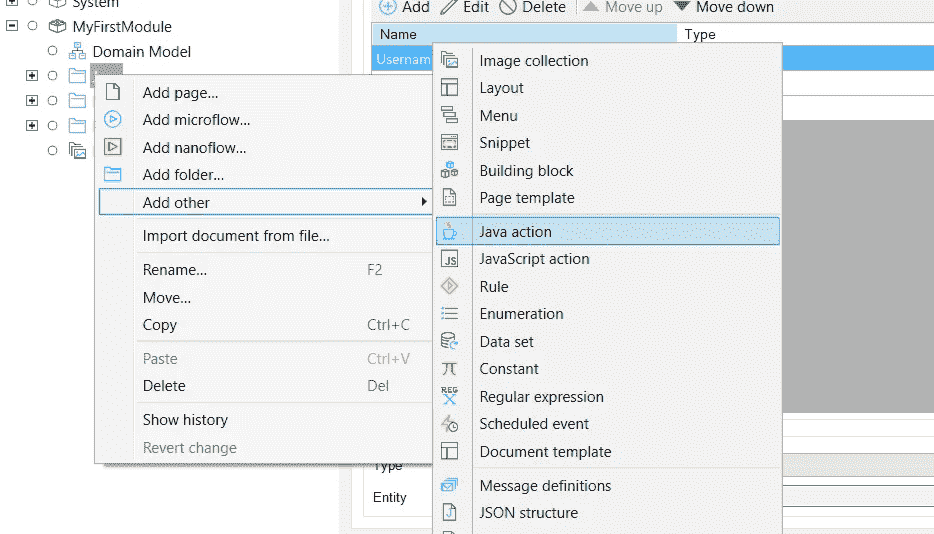
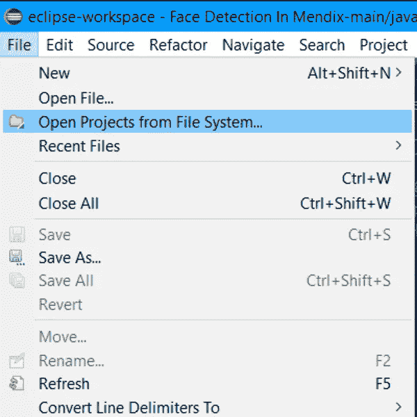
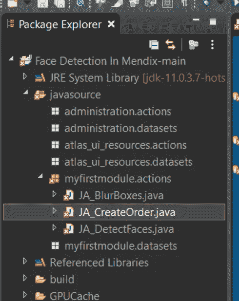

# 如何在 Java 操作中使用变量— Mendix How-to

> 原文：<https://medium.com/mendix/how-to-work-with-variables-in-java-actions-mendix-how-to-12db5c79e4fd?source=collection_archive---------1----------------------->


# Mendix 最大的优势之一是能够使用 Java 动作添加定制代码扩展。任何与应用程序逻辑相关的东西，用现成的功能是不可能的，但用 Java 通常可以 100%实现。

对于新用户和缺乏经验的低级程序员来说，知道从哪里开始可能很困难。因此，这篇博客将带你了解如何创建和编写 Java 动作，以及如何使用其中的变量和对象。

# 先决条件

在我们开始之前，您需要在您的机器上安装一些东西:

-Mendix Studio Pro 8 或以上(本例中我用的是 8，12)

-可以在 www.Eclipse.org/downloads/[下载的 Eclipse IDE](https://www.eclipse.org/downloads/)

# 创建领域模型

在这篇操作指南中，我将根据动作参数中提供的数据，在 Java 动作中手动**创建 Mendix 对象。为了做到这一点，我们必须在域模型中创建 Java 操作应该返回的实体。在您的域模型中，**创建一个名为 Order** 的实体。现在添加 **3 个属性**，一个用于**用户名**(字符串)，一个用于**地址**(字符串)，一个用于**订单总计**(十进制)。**


[https://bit.ly/MXW21](https://bit.ly/MXW21)

# 创建 Java 操作

要创建 Java 操作，只需在项目浏览器中右键单击并选择创建一个新的 Java 操作，该操作位于“Add Other”类别下。



给你的动作起一个相关的名字，并确保遵循命名惯例。Java 动作的约定是 **JA_(你的动作名)**。在我的例子中，我称之为 **JA_CreateOrder** 。

在项目浏览器中双击新创建的 Java 操作，将其打开。在 General 选项卡中，添加我们添加到 order 实体中的相同的三个参数。确保**区分参数名和原始参数名，**我喜欢在我的 Java 动作参数后面加上后缀“_Param”，这样在代码中很容易区分它们。

同样**将 Java 动作的返回类型**设置为**类型对象**，然后选择我们之前创建的 o**order 实体**。

# 使用 Eclipse

而在 **Studio Pro** 中，你可以**按下 F6 或者进入项目- >部署 Eclipse。**

然后在 **Eclipse** 中转到 **File - >从文件系统中打开项目**。在输入源窗口中选择目录，然后选择项目的根文件夹。单击“完成”完成。



在左侧的项目浏览器中，打开 Java source 文件夹，并转到 myfirstmodule.actions，在这里您将找到该模块中包含的所有 Java 操作，包括我们刚刚创建的那个。



# 已经有什么了？

在我们开始编码之前，让我们来看看已经为我们创造了什么。您会注意到有一些自动创建的导入，以及一个以我们的 Java 动作命名的公共类，然后是我们添加的所有参数和该类的构造函数。然后我们有一些方法和两个开始和结束用户代码块。非常重要的是要记住，除了导入之外，不在这些用户代码块中的任何内容都将在运行时被覆盖，所以确保不要在除了这三个区域之外的任何地方编码。

# 该编码了！

为了使用 Java 从我们的域模型中创建一个实体，我们需要导入由 Mendix 为该对象创建的代理。在进口下添加-

`import myfirstmodule.proxies.Order;`

然后在第一个用户代码块中，我们需要创建一个上下文对象，用

```
IContext context = getContext();
```

:然后，我们可以创建订单实体，并将上下文对象传递给构造函数:

`Order newOrder = new Order(context);`

然后，我们可以使用导入的代理中为我们创建的 set 方法来设置新订单的属性。所以我将这三个属性设置为 Java 动作的参数。

剩下要做的就是返回订单对象，我们可以使用 getMendixObject()方法来完成，如下所示:

`return newOrder.getMendixObject();`

这在将实体作为返回值处理时很重要，代理中也提供了 getMendixObject()方法。

我们现在可以从你的应用中的任何微流调用这个动作。我已经在我的代码中添加了一个断点，所以您现在可以运行您的应用程序并进行测试。

如果您遇到任何问题或有编译错误，您可以从文档页面获得一些故障排除提示，用于在 Eclipse 中[调试 java 操作。](https://docs.mendix.com/howto/monitoring-troubleshooting/debug-java-actions)

# 最后的想法

现在，您可以创建定制的 java 操作，并在其中处理数据和变量。您可能不是专家，但是使用 Mendix，您正在成为更好的 Java 开发人员。

不要害怕尝试，为什么不试着给订单实体添加更多的属性，甚至试着使用文件对象。Java 和 Mendix 有无限的可能性，所以去创造它们吧！

# 完整的 Java 操作代码:

```
// This file was generated by Mendix Studio Pro.//// WARNING: Only the following code will be retained when actions are regenerated:// - the import list// - the code between BEGIN USER CODE and END USER CODE// - the code between BEGIN EXTRA CODE and END EXTRA CODE// Other code you write will be lost the next time you deploy the project.// Special characters, e.g., é, ö, à , etc. are supported in comments.package myfirstmodule.actions;package myfirstmodule.actions;import com.Mendix.systemwideinterfaces.core.IContext;import com.Mendix.webui.CustomJavaAction;import com.Mendix.systemwideinterfaces.core.IMendixObject;import myfirstmodule.proxies.Order;public class JA_CreateOrder extends CustomJavaAction<IMendixObject>{private java.lang.String Username_Param;private java.lang.String Address_Param;private java.math.BigDecimal OrerTotal_Param;public JA_CreateOrder(IContext context, java.lang.String Username_Param, java.lang.String Address_Param, java.math.BigDecimal OrerTotal_Param){super(context);this.Username_Param = Username_Param;this.Address_Param = Address_Param;this.OrerTotal_Param = OrerTotal_Param;}*@*java.lang.*Override*public IMendixObject executeAction() throws Exception{// BEGIN USER CODEIContext context = getContext();Order newOrder = new Order(context);newOrder.setUsername(Username_Param);newOrder.setAddress(Address_Param);newOrder.setOrderTotal(OrerTotal_Param);return newOrder.getMendixObject();// END USER CODE}/*** Returns a string representation of this action*/*@*java.lang.*Override*public java.lang.String toString(){return "JA_CreateOrder";}// BEGIN EXTRA CODE// END EXTRA CODE}
```

## 阅读更多

[](https://bit.ly/MXW21) [## Mendix World 2021 |召集您的应用开发团队 2021 年 9 月 7 日至 9 日

### 好像你需要说服…在一个全球制造商社区，他们想通过探索什么来相互学习…

bit.ly](https://bit.ly/MXW21) [](https://www.mendix.com/mendix-world/tracks/) [## 曲目|门迪克斯世界 2021

### 在今年 Mendix World 开幕之前，手工制作您的议程。浏览专为您量身定制的 8 个专题讲座中的 85 个以上专题讲座…

www.mendix.com](https://www.mendix.com/mendix-world/tracks/) 

*   [https://docs.mendix.com/refguide/java-actions](https://docs.mendix.com/refguide/java-actions)
*   [https://docs . mendix . com/how to/logic-business-rules/extending-your-application-with-custom-Java](https://docs.mendix.com/howto/logic-business-rules/extending-your-application-with-custom-java)
*   【https://docs.mendix.com/refguide/java-programming 
*   [https://docs.mendix.com/refguide/using-eclipse](https://docs.mendix.com/refguide/using-eclipse)

*来自发布者-*

*如果你喜欢这篇文章，你可以在我们的* [*媒体页面*](https://medium.com/mendix) *或我们自己的* [*社区博客网站*](https://developers.mendix.com/community-blog/) *找到更多类似的内容。*

*希望入门的创客，可以注册一个* [*免费账号*](https://signup.mendix.com/link/signup/?source=direct) *，通过我们的* [*学苑*](https://academy.mendix.com/link/home) *获得即时学习权限。*

有兴趣加入我们的社区吗？你可以加入我们的 [*Slack 社区频道*](https://join.slack.com/t/mendixcommunity/shared_invite/zt-hwhwkcxu-~59ywyjqHlUHXmrw5heqpQ) *或者想更多参与的人，看看加入我们的*[*Meet ups*](https://developers.mendix.com/meetups/#meetupsNearYou)*。*