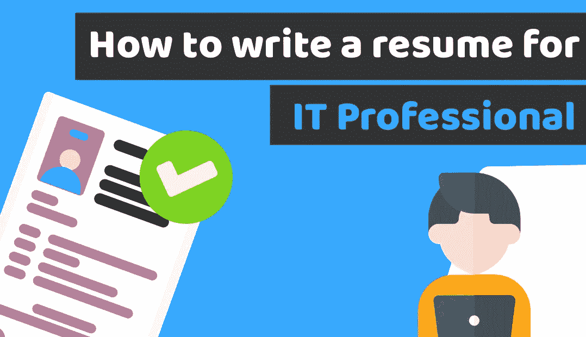

# 如何为 IT 专业人士撰写简历——带简历示例模板的教程

> 原文：<https://medium.com/duomly-blockchain-online-courses/how-to-write-a-resume-for-it-professional-tutorial-with-resume-example-template-cbdc0275a16d?source=collection_archive---------0----------------------->

[Duomly — Programming Online Courses](https://www.duomly.com)

本文最初发表于[https://www . blog . duomly . com/how-to-write-a-resume-for-it-job-tutorial-with-resume-example-template/](https://www.blog.duomly.com/how-to-write-a-resume-for-it-job-tutorial-with-resume-example-template/)

# 介绍

今天我将向你展示如何写一份 IT 工作的简历。