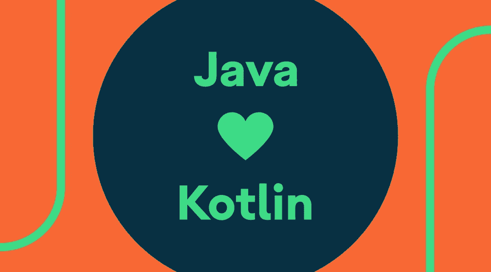

# 如何编写 Java 友好的 Kotlin 代码

> 原文：<https://medium.com/androiddevelopers/how-to-write-java-friendly-kotlin-code-333f32ad0df3?source=collection_archive---------7----------------------->

Illustration by [Kiran Puri](https://twitter.com/_kiranpuri)

TL:DR:跟随我们新的 [Java 友好的 Kotlin codelab](https://codelabs.developers.google.com/codelabs/java-friendly-kotlin/) ，学习如何从 Kotlin 和 Java 编程语言编写符合习惯的 Kotlin 代码。

自从我们宣布将 Kotlin 作为官方支持的语言[添加到 Android 上之后，我们已经推荐了](https://android-developers.googleblog.com/2017/05/android-announces-support-for-kotlin.html)[一种采用 Kotlin 的分阶段方法](https://developer.android.com/kotlin/get-started#add_kotlin_into_an_existing_app)。一开始，这意味着用 Kotlin 编写测试和新特性等代码，这通常意味着从 Java 代码调用 Kotlin。

随着新库的增加，或者现有库被转换为 Kotlin，Java 代码调用 Kotlin 变得越来越常见。

Java 友好的 Kotlin code lab[展示了一个样例应用，我们在其中重构了一个从 Java 到 kot Lin 的库。该库包括一个 singleton `Repository`、一个`data class`和 Kotlin 扩展方法。然后，我们解释如何更新新创建的 Kotlin 代码，这样我们就不必对现有的 Java 代码进行任何重构。我们研究了如何以及何时使用 Kotlin 特性，比如`const`关键字，以及`@JvmName`、`@JvmStatic`和`@JvmOverrides`等注释。](https://codelabs.developers.google.com/codelabs/java-friendly-kotlin/)

开始使用 Java 友好的 Kotlin code lab[并获得编写 Kotlin 代码的信心，这些代码可以在 kot Lin 和 Java 编程语言中使用。](https://codelabs.developers.google.com/codelabs/java-friendly-kotlin/)

你开始把你的代码转换成科特林了吗？从 Java 代码调用 Kotlin 代码时遇到过哪些问题？请在下面的评论中告诉我们！