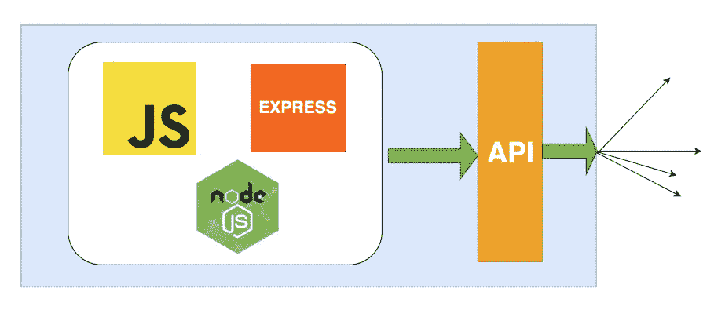

# 如何编写生产就绪的 Node.js Rest API — Javascript 版本

> 原文：<https://medium.com/bb-tutorials-and-thoughts/how-to-write-production-ready-node-js-rest-api-javascript-version-db64d3941106?source=collection_archive---------0----------------------->

## 带示例的逐步指南

**Node.js Rest API**

本文用普通的 javascript 列出了生产就绪的 Node.js rest API 的所有必要成分。我想把这分为两个阶段

1.  **开发阶段**
2.  **生产阶段**