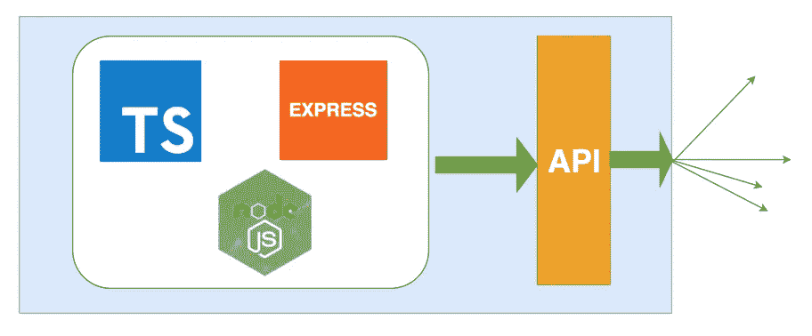

# 如何编写生产就绪 Node.js Rest API — Typescript 版本

> 原文：<https://medium.com/bb-tutorials-and-thoughts/how-to-write-production-ready-node-js-rest-api-typescript-version-94e993b368c0?source=collection_archive---------0----------------------->

## 带示例的逐步指南

**Node js Rest API**

本文用 ***类型脚本*** 列出了生产就绪的 Node.js rest API 的所有必要成分。

如果你想看看 javascript 版本。请看看这个。