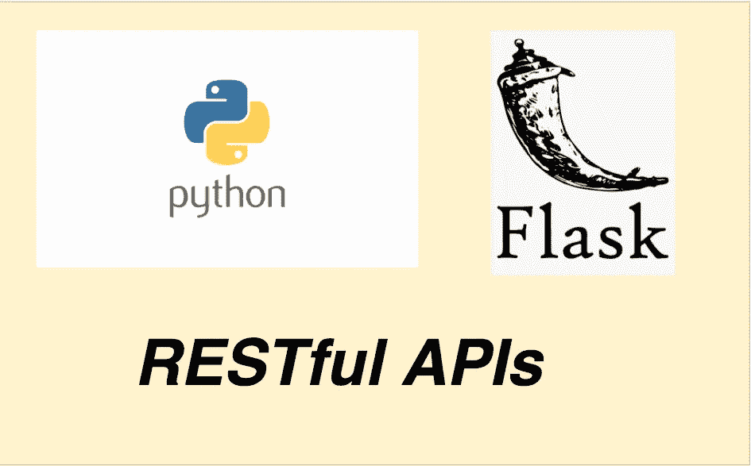

# 如何用 Python 和 Flask 编写 REST API

> 原文：<https://medium.com/bb-tutorials-and-thoughts/how-to-write-rest-api-with-python-and-flask-71ab42d253c5?source=collection_archive---------0----------------------->

## 包含示例项目的逐步指南

REST 是表述性状态转移的首字母缩写。Rest 遵循一些准则来促进系统间的通信。本文通过一个示例项目列出了生产就绪的 Python rest API 的所有必要成分。REST API 用资源来响应，这些资源可以是…