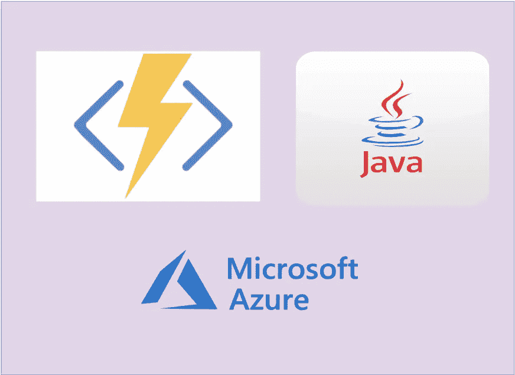

# 如何用 Azure 函数编写无服务器的 Java REST API

> 原文：<https://medium.com/bb-tutorials-and-thoughts/how-to-write-serverless-java-rest-api-with-azure-functions-bf1cba5818d?source=collection_archive---------0----------------------->

## 包含示例项目的逐步指南

Azure 函数是一种在云中运行小段代码的简单方式。您不必担心托管这些代码所需的基础设施。您可以用 C#、Java、JavaScript、PowerShell、Python 或[支持的](https://docs.microsoft.com/en-us/azure/azure-functions/supported-languages)中列出的任何语言编写函数