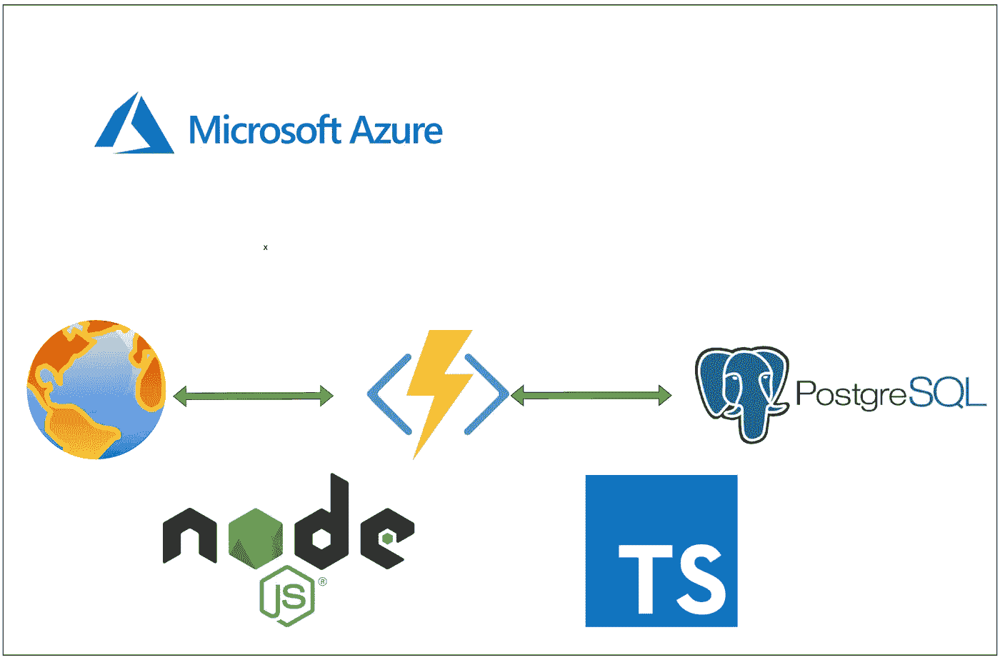

# 如何用 PostgreSQL 数据库编写无服务器 NodeJS Azure 函数— Typescript 版本

> 原文：<https://medium.com/bb-tutorials-and-thoughts/how-to-write-serverless-nodejs-azure-functions-with-postgresql-database-typescript-version-83dec2a65fd3?source=collection_archive---------0----------------------->

## 包含示例项目的逐步指南

Azure 函数是一种在云中运行小段代码的简单方式。您不必担心托管这些代码所需的基础设施。您可以用 C#、Java、JavaScript、PowerShell、Python 或任何…