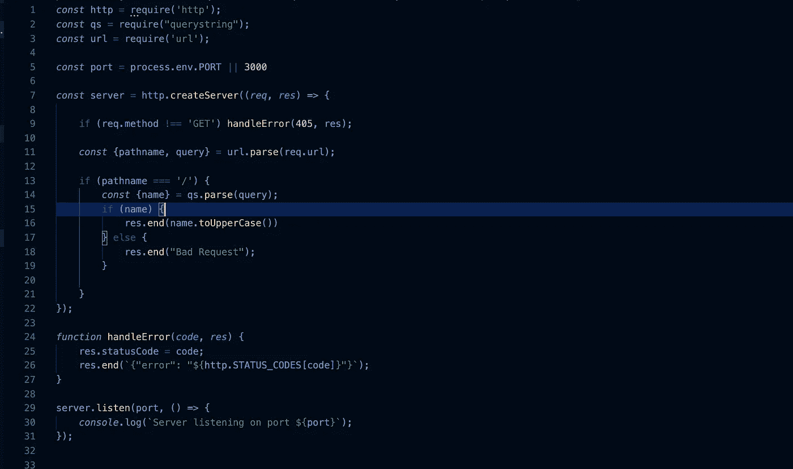

# 如何用核心 HTTP 模块编写简单的 NodeJS Rest API

> 原文：<https://medium.com/bb-tutorials-and-thoughts/how-to-write-simple-nodejs-rest-api-with-core-http-module-dcedd2c1256?source=collection_archive---------1----------------------->

## 没有明确的框架或任何其他

NodeJS API

大部分时间我们用 express framework 或者其他什么来写 NodeJS Rest API。有时我们不得不使用 NodeJS 核心 HTTP 模块来创建 web 服务器。如果您没有权限安装 NPM 模块，或者如果您希望创建一个简单的端点，而没有太多的依赖关系，当您有低…