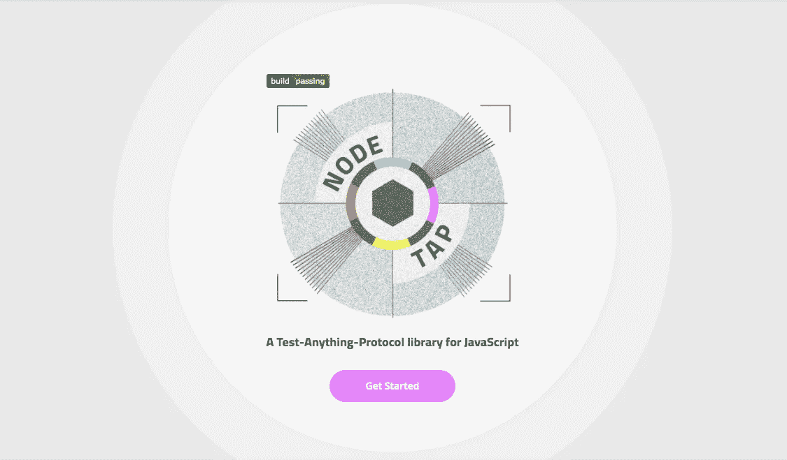

# 如何用 Tap 测试库在 NodeJS 中编写单元测试

> 原文：<https://medium.com/bb-tutorials-and-thoughts/how-to-write-unit-tests-in-nodejs-with-tap-test-library-dcac104fefa6?source=collection_archive---------0----------------------->

## 带有示例项目的初学者指南

如今，单元测试和开发一个项目一样重要，它已经成为开发中不可或缺的一部分。它实际上提高了代码的质量和开发人员的信心。有时，您必须修复生产中的代码，并在部署到之前进行一些更改…