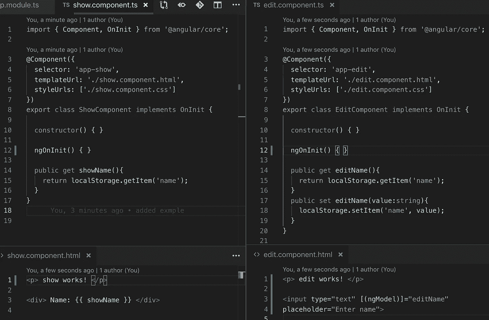
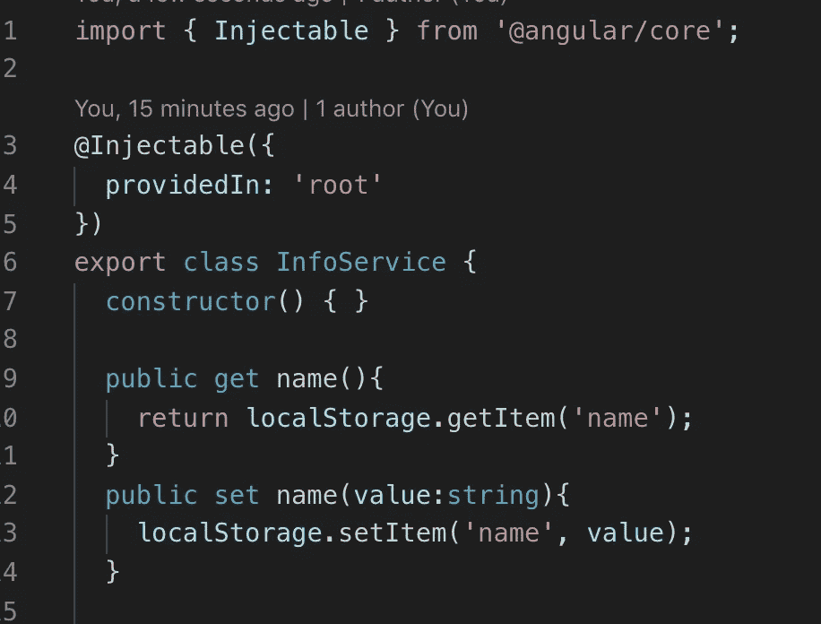
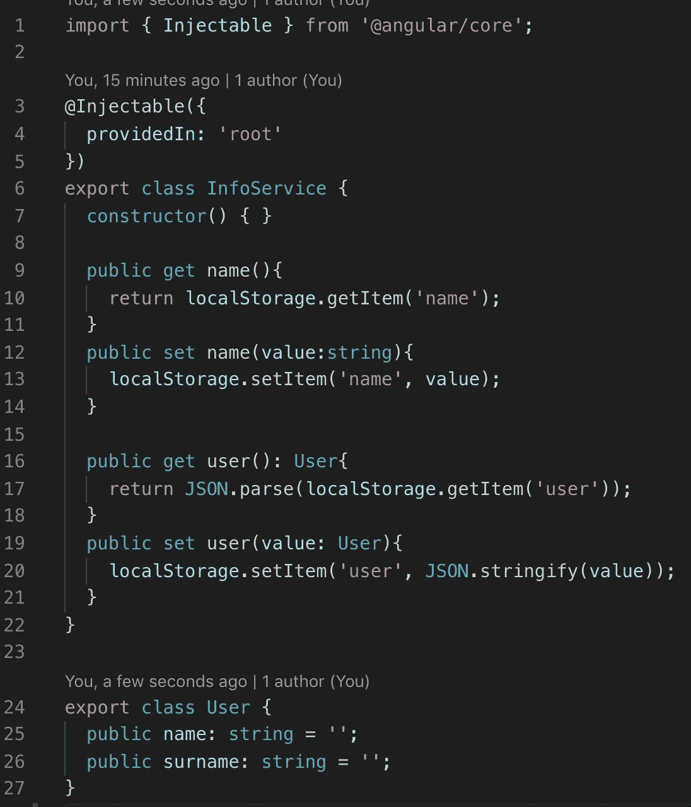

# 如何在 Angular 中使用本地存储

> 原文：<https://medium.com/quick-code/how-use-localstorage-in-angular-85c924275ad0?source=collection_archive---------1----------------------->

## 角度指南

## 在客户端保存数据

LocalStorage 的目的是在客户端保存信息，然后我们可以在项目中的某个地方使用这些信息。

LocalStorage in Angular

每个项目都在发展和演变，这意味着也许有一天我们会需要添加一个新的属性，例如姓氏。对我们来说，这意味着每一个地方，我们使用本地存储与关键'名称'我们需要添加另一个'姓氏'。

如果在未来，我们将需要存储另一个字段，或者如果我们需要改变存储字段的逻辑，例如，我们可能需要创建一个唯一的关键取决于当前使用我们网站的用户。它将看起来像这样:" local storage . getitem(userId+' name ')；"。

要点是，如果某些东西会随着 LocalStorage 而改变，我们需要找到我们项目中的所有 LocalStorage 键，并一遍又一遍地改变它。我不喜欢那样做。

让我们创建一个包装类，而不是在我们的 Angular 项目中直接使用 LocalStorage。

Wrapper Service

现在我们只有一个地方需要改变。这个类比添加一行新的 LocalStorage 更容易扩展。

Extend Service

服务和本地存储的结合有很多好处。服务类易于扩展和更改，节省了大量的精确时间。

如果你需要仔细看看项目[，这里有链接](https://github.com/8Tesla8/local-storage-angular)。

*原载于 2019 年 5 月 18 日*[*【http://tomorrowmeannever.wordpress.com*](https://tomorrowmeannever.wordpress.com/2019/05/18/how-use-localstorage-in-angular/)*。*