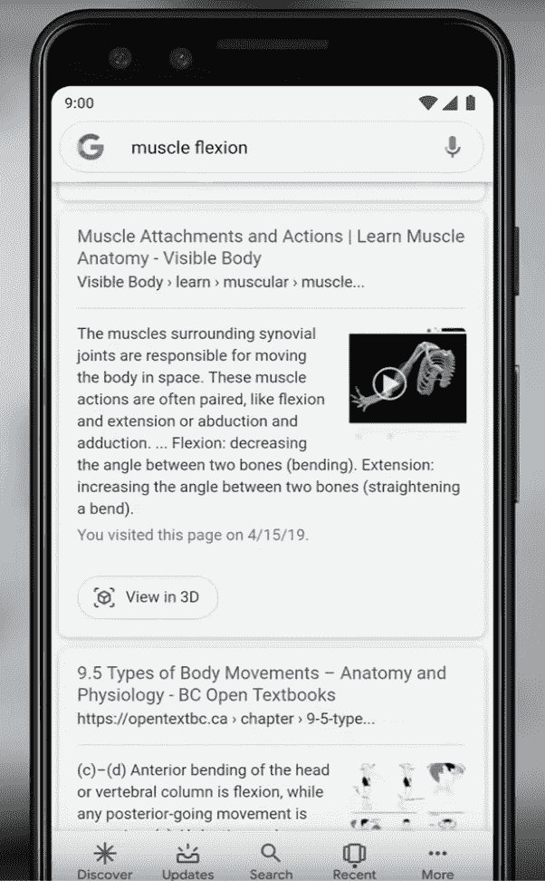
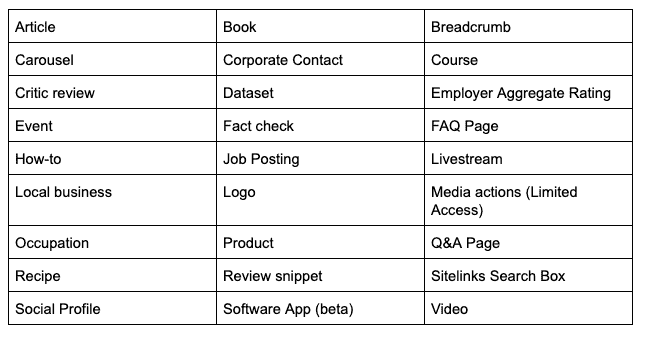

# “3D 视图”和“网络双工”将如何改变网站性能

> 原文：<https://medium.com/quick-code/how-view-in-3d-and-duplex-for-web-will-change-website-performance-911ff5fb1676?source=collection_archive---------1----------------------->

让我们考虑一下在 [Google I/O 2019](https://events.google.com/io/) 上宣布的新功能。值得注意的是:3D 视图和网络双工视图。

# 网站性能

这不是一个秘密，更高的网站在谷歌 SERP 的排名，网站获得更多的流量。这也增加了销售额。还有另一个提高点击率和在用户访问网站之前吸引他们的好方法——谷歌的“丰富结果”。“3D 视图”功能允许通过增强现实的体验来吸引潜在的客户和读者。

很明显，将产品的“虚拟”版本“握在手中”会让你觉得你已经拥有了这个东西，这反过来增加了潜在销售的机会。举例来说，当你只看鞋子的照片时，和当你看到它们在货架上，挨着你的其他收藏品时，那是完全不同的感觉。

这些 [UX 的改进](https://qarea.com/blog/ui-ux-terminology-words-and-slang-every-designer-should-know)已经在谷歌 I/O 2019 上宣布，应该会在今年夏天推出。然而，我们确信，当这些功能在电子商务和其他网站上实现时，预测一些变化是真实的。

剧透:【schema.org】是关键。

# 自定义搜索结果

有一些工具可以帮助改变搜索结果，但是谷歌自己决定搜索结果是基本的还是丰富的。

让我们看看所有可能的结果:

# 基本结果

# 丰富的结果

# 丰富的结果

# 知识图结果

# 旋转木马

# 现在，还有 3D 视图

所有这些都可以用 schema.org 词汇表创建。

Schema.org 是由必应、谷歌、雅虎创建的社区。和 Yandex 为网站管理员发明了一种通用的数据组织方式，通过使用搜索爬虫和其他机器人来优化网页的停放。

以下是可能的内容类型列表:

如果你是一名软件开发人员，读到这里，你可能会发现其中许多类似于编程类。

此外，这些增强中的许多可以应用于几乎所有的内容类型(面包屑、星形、轮播等)。)

# 现在，让我们来谈谈代码！

创建结构化数据有几个选项:

## 1)微观数据

http://schema.org/Person>

嗨，我是

爱丽丝。

## 2) RDFa

嗨，我是

爱丽丝。

## 3) JSON-LD

你好，我是爱丽丝。