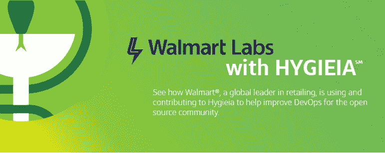

# 开源案例研究——沃尔玛如何将卫生用品扩展到 5000 多个仪表板

> 原文：<https://medium.com/capital-one-tech/how-walmart-scaled-hygieia-the-open-source-devops-dashboard-tool-4fd65f0f589?source=collection_archive---------0----------------------->

## 了解世界上最大的零售商如何使用 Hygieia 来监控和改善他们的 CI/CD 渠道。

## 案例研究一瞥

*   项目:[卫生学](https://developer.capitalone.com/opensource-projects/hygieia/)
*   行业:零售(电子商务，杂货，药房)
*   公司:沃尔玛
*   公司规模:230 万员工
*   卫生学用户:5，000+人

## 背景

支持 11 个国家的电子商务网站，超过 100 万个产品 SKU 的目录，以及具有按需功能(如产品扫描和处方补充)的移动应用程序，这意味着沃尔玛需要一个可定制的仪表板来监控跨团队的 DevOps，他们在 Hygieia 找到了一个企业解决方案。

沃尔玛实验室的技术专家 Bryan Finster 说:“我们正在努力寻找实现零停机、按需和频繁交付的方法。“我们的首要问题之一是如何让团队了解管道的健康状况，以防止不良变化影响生产和我们改善交付流程的努力。”

当 Bryan 和他的团队在一次会议上看到 [Hygieia](https://developer.capitalone.com/opensource-projects/hygieia/) 的演示时，他们知道这就是他们一直在寻找的仪表板——因为它是开源的，他们可以修改它以满足他们的需求，并以最小的努力进行测试，而不是满足于一个现成的解决方案并为升级付费。

## 扩展到 5，000 多个仪表板

在独立团队使用可用的硬件进行了最初的小规模测试(例如，将 Raspberry Pi 单元插入 scrum 区域的备用监视器)后，他们拥有了数据和支持来建立一个支持整个企业的 Hygieia 集中实例，这意味着将它扩展到整个组织的数千名用户。

为了有效地管理迁移，他们必须超越松弛的渠道和手动升级，实现配置流程的自动化，以便新团队在满足其工具最低要求的几个小时内自动收到入职电子邮件和管理员访问。

“因为我们是沃尔玛，我们倾向于强调工具，”布莱恩开玩笑说。“我们现在有超过 5，000 个仪表板，并且增长曲线持续陡峭。团队重视卫生，并不断挑战我们去改善它。我们从来没有空的积压订单。”

## 通过游戏化推广良好实践

这种增长的一部分来自于“游戏化”，或者对卫生用品的使用进行评分，以鼓励团队之间的良好实践。

例如，为了在 Hygieia 的源代码管理小部件上获得五颗星，团队需要使用 pull requests 和 integrate 来掌握每个开发人员每天至少一次。这使得代码制造过程对组织的所有级别都是可见的，并且允许团队看到他们如何与他们所在区域和整个部门中的其他团队进行比较。

“反应非常积极，”布莱恩说，“各队要么相互挑战，要么寻求帮助以提高分数。”

这种可见性还使他们能够就跨团队的效率和价值进行明智的对话，并相应地更新他们的评分模型。

## 设计仪表板和支持团队

除了自动化的入职流程，沃尔玛还推出了一个配置向导，使创建卫生信息仪表板变得更加容易，并创建了一个组合视图，显示从团队级别到首席信息官级别的综合得分，包括安全扫描、依赖性漏洞扫描以及团队规模和组成的数据。

“这一切都是为了帮助团队保持他们的存储库干净，并鼓励我们需要保持高质量的实践，”Bryan 说。

沃尔玛还计划建立一个团队，专门帮助其他团队解决与内部目标和挑战相关的任何限制，进一步最大限度地提高易用性，并最小化学习曲线。

## 结果

虽然他们仍在招募新团队和完善评分逻辑的过程中，但沃尔玛已经看到了“使用 Hygieia 后的具体改善”，经理们表示，看到开发人员希望通过他们的仪表板来监控和改善管道的健康状况，这令人欣慰。

他们正在将所有修改推回到 Capital One Hygieia 团队进行考虑，希望能够为 Hygieia 的发展做出贡献，并帮助其他企业更有效地监控他们开发人员的健康状况。

除非本帖中另有说明，否则 Capital One 不隶属于所提及的任何公司，也不被其认可。使用或展示的所有商标和其他知识产权都是其各自所有者的所有权。本文为 2018 首都一。