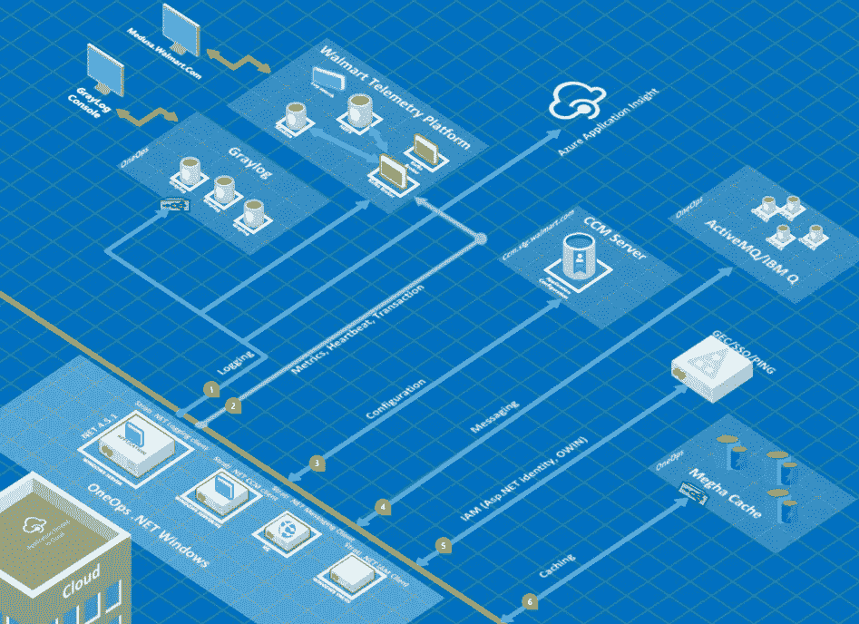

# 我们如何带来了 Windows、IIS 和。沃尔玛的云计算网络应用

> 原文：<https://medium.com/walmartglobaltech/how-we-brought-windows-iis-net-apps-to-cloud-at-walmart-54da624f2e8a?source=collection_archive---------3----------------------->

构建云原生应用有其独特的挑战，当您构建一个应该满足传统 Windows &需求的云平台时，这些挑战会变得更大。NET 应用程序，它满足了全球最大组织之一的各种业务需求。

O *目标:该团队的目标是帮助沃尔玛 Windows/。NET 应用程序，使他们的业务能够迁移到云。句号。*

C 这些应用主要是。基于. NET/C#的 Web 应用程序，或者说 Windows 服务，具有消息传递和数据库层。它们部署并运行在不同的 Windows 场集群上，并且是手动管理的。有很多团队也在管理他们自己的基础设施。

应用程序的任何部署和更新都是手动的，需要多步操作，应用程序所有者的访问权限有限，通常是通过许多服务请求单。

*现有的沃尔玛云基础设施无法供应基于 Windows 操作系统的虚拟机，因此 IIS web 服务器&无法运行。基于. NET 或 Windows 的云应用程序。*

好消息是，云和平台基础设施已经拥有了大部分平台服务，解决了云上基于 Java/Linux 的应用程序的云原生和交叉问题，只是它们不能被 Windows 和。NET 应用程序。

*我们的解决方案构建方法。NET/Windows 功能有两个主要的关注点:*

*首先:作为一个. NET 云平台，首先让 Windows OS ready computes&IIS web 服务器在沃尔玛云基础设施上可用。*

*第二:提供。NET 中间件 API 供应用程序使用&通过解决云上的应用程序交叉问题，帮助他们构建云原生应用程序。*

*首先:* **Windows OS，IIS Web 服务器&。NET 运行时:**

我们通过构建 OneOps(支持沃尔玛云的基础设施)包，使 Windows server OS 和 IIS 成为沃尔玛云中可用的 web 服务器映像，这些包能够选择、配置和部署不同的虚拟机大小和。NET 框架和运行时。我们还让用户选择添加额外的应用程序特定的运行时间和依赖，使用通过 Nexus 服务器分发的 Chocolatey 包的驱动程序。

*第二:* **解决云原生应用横切关注点:**

*我们的第二个目标是通过向应用所有者提供适当的云原生中间件 API 和服务来抽象云开发中面临的挑战&顾虑，以便构建采用云的云原生应用&变得更加容易。*

在此过程中，我们研究了许多内部可用的云服务，并研究了它们的模式和实践。沃尔玛已经有了云文化和对云的关注，专家们正在为云构建平台和服务，主要是基于 java 和开源的技术。我们从他们那里采纳了一些实践(没有必要重新发明轮子)。我们进一步增强了它们，以提供独特的解决方案。NET 和 Windows 环境。来自非 Windows 背景的专家经常对这些选择提出质疑。在这个过程中，帮助我们的是对我们的 Windows 客户、应用程序及其使用案例的理解。

**远程应用配置:**

*将配置与应用程序组件一起存储会产生更多开销，以防配置发生变化&尤其是在环境动态变化的云中进行管理。配置更改需要传播到应用程序组件。*

传统上。NET 应用程序将其配置设置存储在 app.config 或 web.config 的本地文件中，在云场景中，这需要远程管理或存储。我们支持现有的远程云配置管理服务。NET 应用程序。NET 中间件 API。我们还将它与本地配置文件集成在一起，当应用程序所有者希望这样做或远程配置服务不再可用时，应用程序可以覆盖它。远程服务器的任何配置更改都将通过。NET 事件供应用程序更新它。将配置从本地服务器转移到远程服务器是一种范式转变，当我们将这种能力带给应用程序所有者时，他们看不到其中的价值。然而，当我们用用例向他们展示示例时，他们采用了它。

**应用日志管理:**

*应用程序日志是从所有正在运行的进程的输出流中收集的聚合的、按时间顺序排列的事件流。每个正在运行的进程都写入其事件流，该事件流将事件路由到 stdout。*

基于本地文件的日志记录在云中不起作用&日志需要远程管理。在沃尔玛，我们已经有了基于 Kafka 的记录和监控平台。通过为. NET 开发 Kafka 传输层，我们编写了一个具有标准调试、信息、错误消息的新日志客户端。我们意识到许多团队已经在使用流行的 Log4Net API，我们告诉他们转移到新的日志 API 和库是徒劳的。我们通过编写 Log4Net appender 使这个过程无缝。我们还通过使用 Gray log cluster pack 提供了对日志管理的完全控制，应用程序可以根据需要进行部署和配置。我们通过编写新的 C# Graylog 传输来增强我们的日志 API。这使得应用程序能够使用远程配置动态地在它们的日志记录选项之间切换。

我们还利用 Windows 事件跟踪为大量日志事件提供了更强大的进程外日志记录解决方案。

**云消息基础设施:**

*分布式应用程序的应用程序组件托管在多个站点上，必须相互交换信息，消息传递基础设施支持异步操作，使您能够将使用服务的流程与实现服务的流程分离开来。*

在沃尔玛，应用程序根据其需求和专业知识使用各种消息平台，如 IBM MQ、Active MQ、TIBCO 等。在中提供一个云就绪的统一 API 并不是一件容易的事情。在 java 中，你有标准的 JMS 规范，但是在。NET 提供了一个跨多个消息传递提供者的公共 API。我们研究了像 AMQP 这样的标准，但是它没有提供流行消息供应商的全部功能。我们为。NET，它是根据我们的需求定制的，适合云场景，比如跨代理集群发送消息、负载平衡、远程配置等。

**身份和访问管理:**

*IAM 旨在通过将认证委托给外部身份提供者来改善应用程序的用户体验。它还最大限度地减少了对用户管理的需求。*

在 Walmart 应用程序中，使用各种解决方案来满足他们的认证/授权需求。传统上，身份存储在各种 active directory 部署中，我们也有自己的 SSO 和身份服务。沃尔玛的客户可以从内部和外部访问许多应用程序。这是应用程序向云迁移的瓶颈之一，因为用于 AuthN/AuthZ 的现有解决方案是传统解决方案，不支持云。

我们开发了可插入 ASP.NET 管道的 OWIN 中间件，以及抽象 SSO(单点登录)和身份服务的 ASP.NET 身份提供商，为所有 AuthZ 需求提供异步 API。我们确保身份服务路由并与 Active directory 对话，以获取存储在那里的身份。

**应用缓存需求:**

*缓存旨在通过将频繁访问的数据临时复制到靠近应用程序的快速存储位置来提高系统的性能和可扩展性。*

我们已经在沃尔玛数据中心部署了分布式缓存服务，这是基于 McRouter 的 MemCache 解决方案。我们启用了分布式缓存来。NET 应用程序。NET API，因此我们避免给应用程序所有者提供新的缓存 API。我们希望从内存缓存到分布式云专用缓存的过渡对于应用所有者来说是无缝的。

**应用审计&性能监控:**

*遥测解决方案收集并突出显示操作事件，降低应用管理成本，同时实时提供对应用行为的有用见解。*

在沃尔玛，我们已经有了遥测平台来监控应用性能指标。然而，它只被 Java 应用程序使用。我们编写了集成 Windows &的 C#中间件 API。Net/ASP。NET 特定性能计数器&允许应用程序在基于 Grafana 的仪表板上实时可视化和监控它们的应用程序性能。它还允许应用程序根据预定义的性能阈值发送通知。

**云采用&利用率跟踪:**跟踪云平台以及我们的 API 中间件的利用率对于了解云平台的采用情况非常重要。Utilization Platform 和中间件能够收集运行时或云环境信息，并向我们使用 ELK 和 Kibana dashboard 构建的利用率服务发送 pings。

.NET Cloud Platform

**设计、质量&持续集成:**在我们开发任何中间件或服务之前。NET 我们已经有了 CI/CD 渠道。我们确保为我们提供给客户的每个 API 编写足够的单元测试、系统测试和示例应用程序，此外，在每个 sprint 中还要进行多轮代码审查。在将中间件发布到 nexus server 之前，我们确保我们的 CI 管道有这些步骤，并且每个代码更改都运行所有这些测试案例。我们特别关注为每个中间件 API 生成的性能测试案例和报告。我们花了额外的精力来详细分析它们&确保 API 不会对系统资源(内存、线程、IO 等)产生任何不必要的影响。)以及消费应用程序的性能。我们充分利用 API，或者调用任何由适当的云本地模式支持的异步远程服务，例如断路器、远程配置、服务注册等。

我们与客户(应用程序所有者、主管、架构师等)进行了交流。)尽可能经常。我们了解他们的使用案例、痛点和对我们的期望。

我们为应用程序团队提供了足够的 API 文档、样本代码和演示，帮助他们重新设计应用程序，使其为云做好准备。