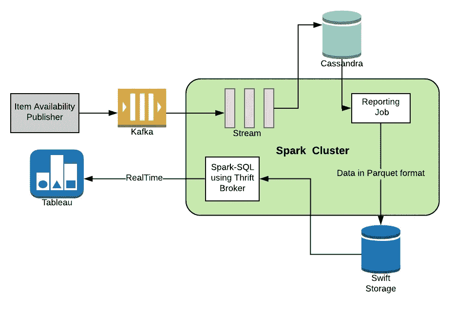

# 我们如何使用 Spark、Kafka 和 Cassandra 构建强大的分析平台

> 原文：<https://medium.com/walmartglobaltech/how-we-build-a-robust-analytics-platform-using-spark-kafka-and-cassandra-lambda-architecture-70c2d1bc8981?source=collection_archive---------0----------------------->

在今天的网上世界，供应链是任何网上商店最重要的支柱之一。不仅仅是高质量的产品，顾客也希望快速交货。这需要在关键地点保持物品的可用性，以便这些物品能够在尽可能短的时间内到达客户手中。这也将允许企业用户持续监控库存可用性。

鉴于沃尔玛网站上的商品数量庞大，在 SKU 个人层面上跟踪它们可能会变得很困难。业务用户需要的是一个仪表板，他们可以在其中看到可用性的汇总数据。

*在这篇博客中，我们将详细介绍这一点——我们构建了一个平台，为用户提供可视化功能来跟踪商品的可用性。*

# 我们最关心的是什么？

有了这个新平台，我们必须解决一些问题。以下是对他们和我们所做的选择的调查:

*   高数据流

鉴于沃尔玛网站上每秒都有大量订单，商品的可用性也经常变化。更新数据(可能是每秒 100 MB)意味着将信息实时传输到分析平台。

***那么，我们是如何解决这个问题的呢？*** 我们为它选择了[阿帕奇卡夫卡](http://kafka.apache.org/)。Kafka 是一个分布式、可扩展的容错消息传递系统，默认情况下提供流支持。

*   存储万亿字节的数据，并频繁更新

为了存储商品可用性数据，我们需要能够在不影响性能的情况下处理大量追加销售的数据存储。为了生成报告，数据必须每隔几个小时处理一次，因此读取速度也必须很快。

虽然 RDBMS 可以存储大量数据，但是它不能提供可靠的上插和读取性能。我们过去和卡桑德拉有过很好的经验，因此，这是第一选择。 [Apache Cassandra](http://cassandra.apache.org/) 拥有最佳的读写性能。像卡夫卡一样，它是分布式的、高度可扩展的和容错的。

*   处理大量数据

数据处理必须在流水线的两个地方进行。首先，在写入期间，我们必须从 Kafka 传输数据，对其进行处理并保存到 Cassandra。第二，在生成业务报告时，我们必须读取完整的 Cassandra 表，将它与其他数据源连接起来，并在多个列中聚合它。

对于这两个需求， [Apache Spark](https://spark.apache.org/) 是一个完美的选择。这是因为 Spark 使用最先进的 DAG 调度程序、查询优化器和物理执行引擎，实现了批处理和流数据的高性能。

# 体系结构

下面(图 1)是我们使用上述技术构建的**分析平台**的最终架构。

维护项目可用性的应用程序在 kafka 主题中发布项目可用性更新。Spark 流处理 kafka 消息并在 cassandra 中保存数据。

Spark 批处理作业被安排为每 6 小时运行一次，它从 cassandra 可用性表中读取数据，并将聚集的数据以 T4 的格式写入 T2 的 swift 存储器中。

为了可视化，我们利用[画面](https://www.tableau.com/)。创建 Hive 表是为了读取 spark sql 中的 swift 存储数据。为了连接 tableau 和 spark sql，我们在 spark 端使用 thrift server，在 tableau 端使用 spark sql 连接器。

Figure 1: All components of platform

# 就这样结束了！

总之，使用 Spark、Kafka 和 Cassandra 可以帮助我们实现实时和批处理。继续尝试这个平台来帮助您解决您的流和批处理问题！