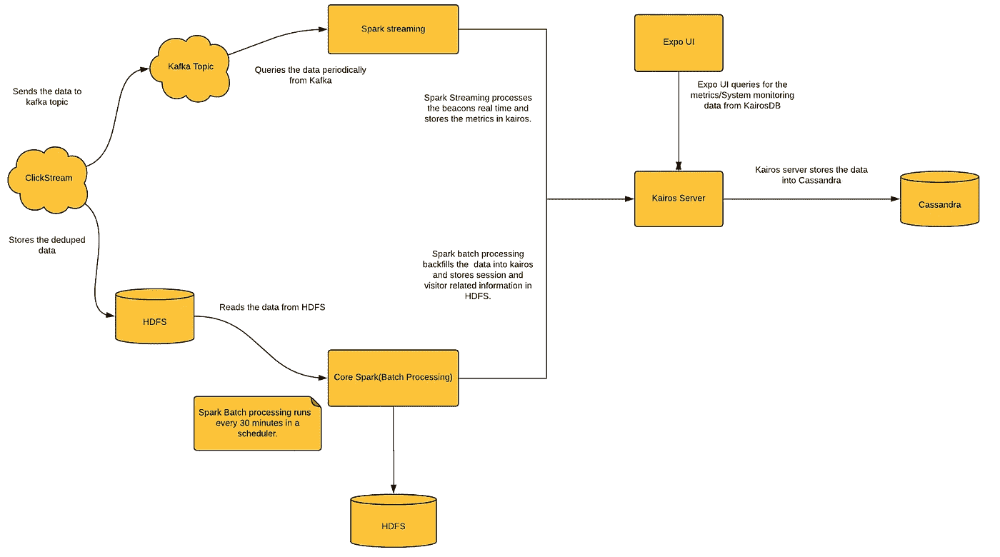
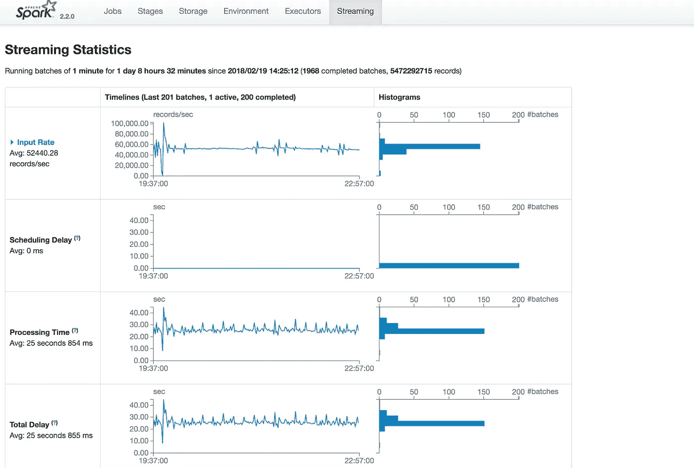
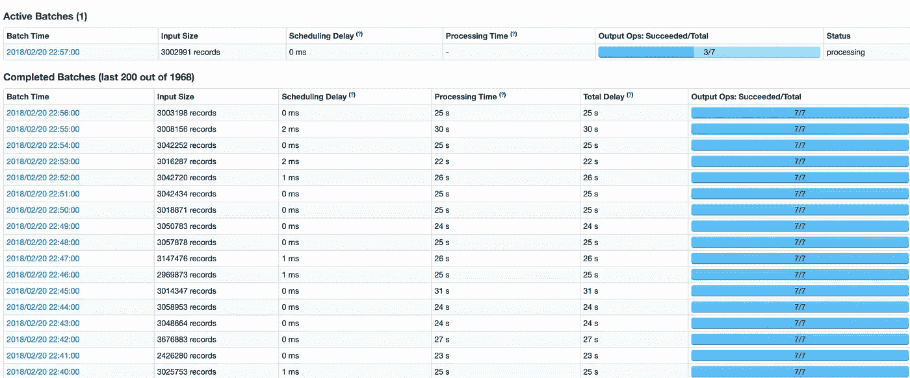
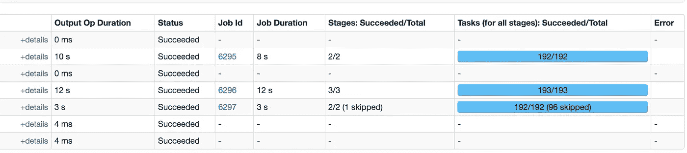
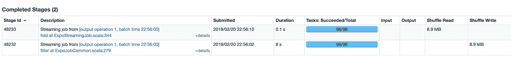
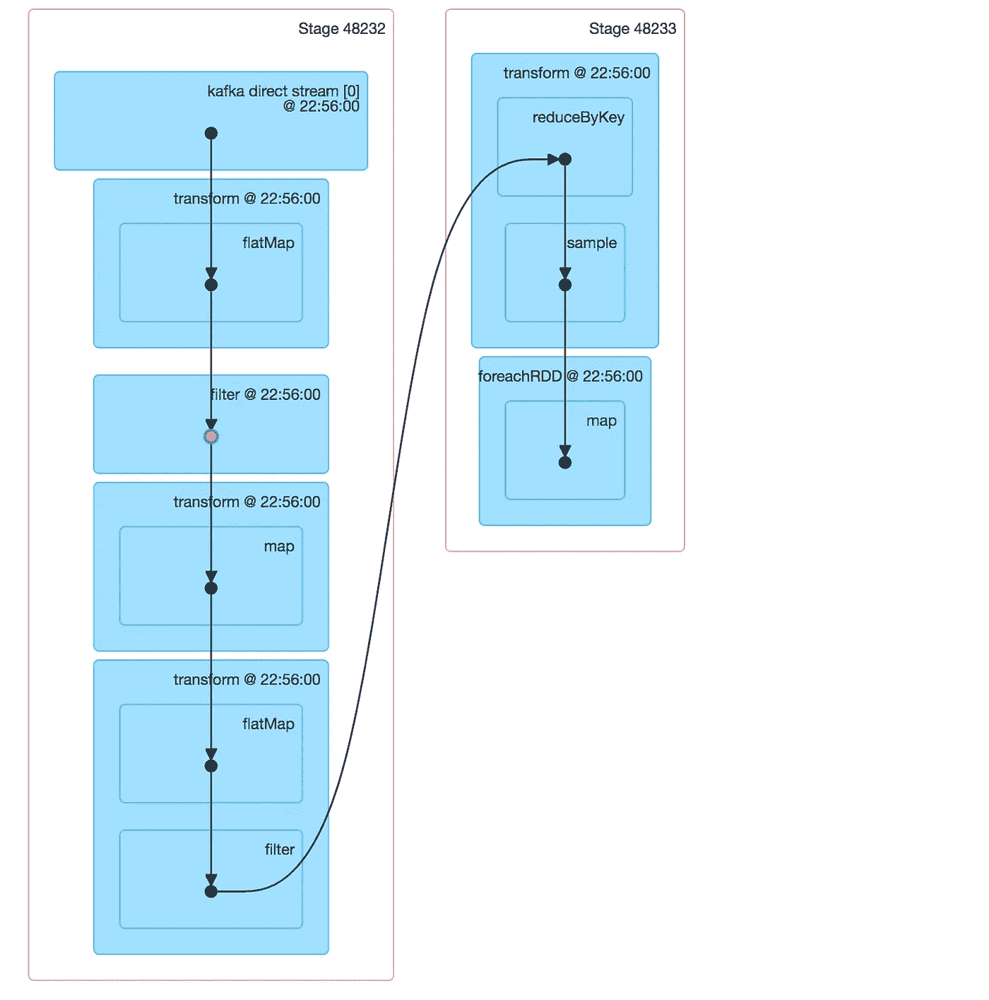
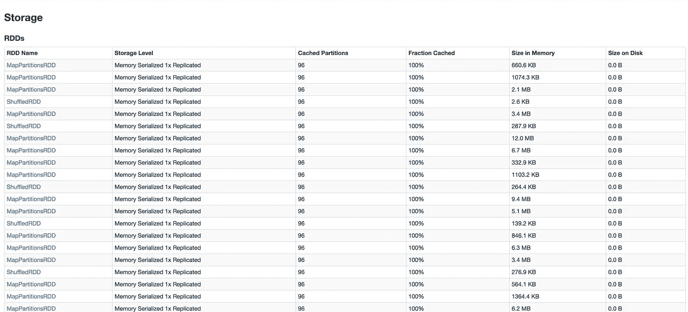
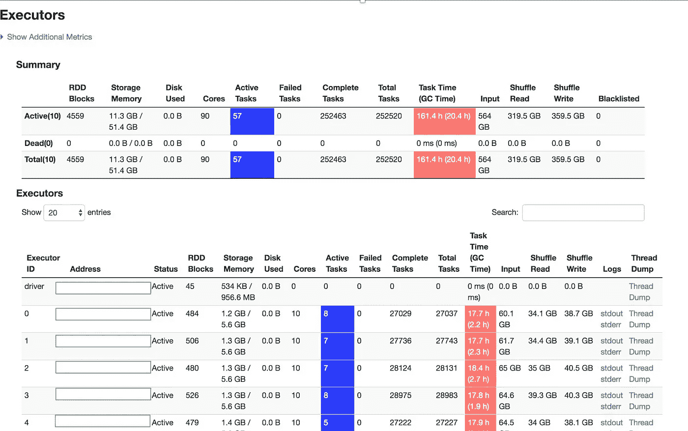
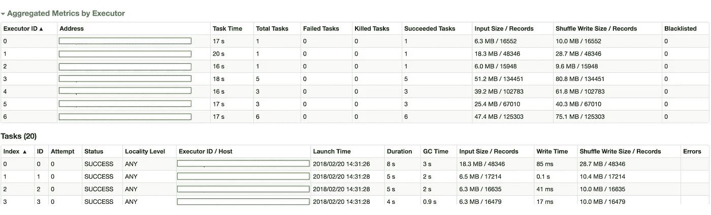
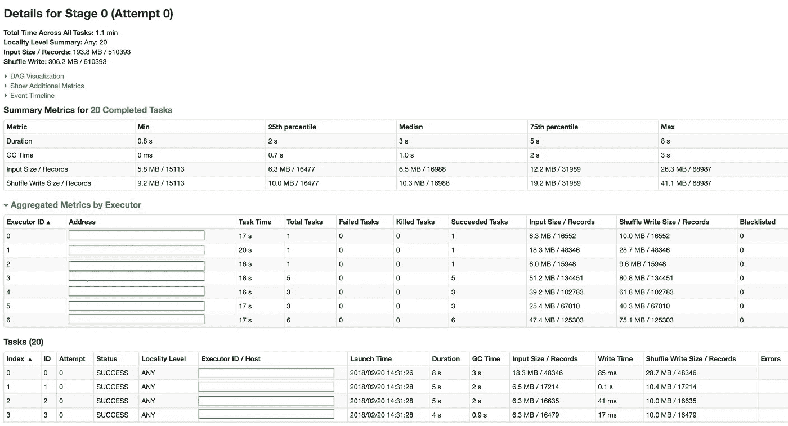

# 我们如何使用 Spark/Spark 流构建 Lambda 架构的数据管道

> 原文：<https://medium.com/walmartglobaltech/how-we-built-a-data-pipeline-with-lambda-architecture-using-spark-spark-streaming-9d3b4b4555d3?source=collection_archive---------0----------------------->

Photo credit: [Pexels](https://pixabay.com/en/analysis-analytics-business-chart-1841158/)

沃尔玛实验室是一家数据驱动的公司。许多业务和产品决策都基于从数据分析中获得的洞察力。我在 Expo 工作，这是沃尔玛的 A/B 测试平台。作为平台的一部分，我们构建了一个数据摄取和报告管道，实验团队使用它来确定实验的趋势。在这篇博客中，我想简单介绍一下我们如何使用 Spark 构建 Lamda 架构的数据接收和报告管道，Spark 提供了流层和批处理层之间的代码可重用性、部署的关键配置以及一些故障排除技巧。

# 用例

用例是获取点击流事件，基于会话 id 聚合它们，并为分配的和合格的实验生成指标，如唯一访问者、访问量、订单、收入、单位、跳出率、站点错误率、性能指标等。以下是我们实现这一目标的架构:

# Lamda 建筑

我们已经用 Spark 运行 Lambda 架构两年多了。Lambda 架构提供了一个健壮的系统，该系统对硬件故障和人为错误具有容错能力。最终的系统可以通过横向扩展而不是纵向扩展来实现线性扩展。我们需要一个 lambda 体系结构，因为无法保证数据会准确到达一次，而且数据中可能存在噪声，并且需要防止由于网络或服务器不稳定而导致数据延迟到达。Lambda 架构通过两次处理数据来处理这些问题，一次在实时流中快速查看生成的数据/指标，第二次在预定的批处理中提供更可靠的数据/指标视图。我们对 lambda 架构的一个关键考虑是让我们对 KairosDB 等幂的写入能够重新处理数据，并保证只处理一次语义。

# 为什么是火花/火花流

Spark/Spark streaming 提高了开发人员的工作效率，因为它为流、批处理和交互式分析提供了统一的 api。总的来说，对于我们的用例，Spark 是一个灵活、健壮和可扩展的数据处理引擎。Spark 流提供高效的容错状态流处理。它提供了高吞吐量以及与 Cassandra、Kafka、Hadoop 等数据存储的良好集成。

# 统计数据

以下是关于我们数据管道的一些统计数据:

*   平均每秒约 7 万个事件
*   高峰时段每秒约 25 万个事件

# 细节

我们将 Spark Kafka Direct 用于我们的流，它保证只处理一次语义，并启用检查点以进行恢复。批处理建立在核心 spark 之上。上述指标在 KairosDB(一个时间序列数据库)中进行计算和存储。此外，用户会话信息作为批处理的 Hive 外部表存储在 HDFS 中。用户状态在流模式下保持 12 小时，而在批处理模式下，只要用户处于活动状态，用户状态就会一直保持。

流和批处理中的 rdd 按如下方式处理:

*解析和验证*:这是在一系列的`map()`、`flatMap()`、`filter()`、`groupByKey()`、`reduceByKey()` 和`leftOuterJoin()` RDD 转换中完成的，这些转换可以在流和批处理作业中重用。

*数据丰富和状态维护*:数据丰富和状态维护在流式作业中的`updateStateByKey()`下完成，在批处理的情况下则在`mapPartitions()`下完成，业务逻辑用于合并会话，并使用在批处理和流式作业中重用的附加信息丰富会话。作为`updateStateByKey()`提供的功能的一部分，在流式传输中，状态保存在内存和检查点中。在批处理中，状态保持在 HDFS 的`Hive External Tables`中。我们还使用流作业中的反函数`reduceByKeyAndWindow()`计算滚动小时和 24 小时独立访问者。

*指标生成并保存到 KairosDB* :在会话化和数据丰富后，使用`flatMap()`和`reduceByKey()`生成指标，并使用 KairosDB 客户端保存到 KairosDB。对 KairosDB 的写入发生在`forEachPartition()`动作中。保存逻辑在流处理和批处理中都可以重用。

在流处理中，每个微批次的传入信标按 sessionId 分组，并按时间戳排序。通过处理来自当前微批的会话并将它们与来自先前微批的会话状态合并来更新会话状态。会话化后生成的指标被减少，然后存储到 KairosDB。我们将偏移量存储在 Zookeeper 中，以防需要从上次成功处理的偏移量开始重新启动作业。为了准确起见，我们的事务在更新结果时会在同一个事务中更新偏移量。下面的代码示例对此进行了概述。

以下代码示例具有从流处理和批处理调用的可重用函数，用于过滤和填充有效信标、填充分组和排序的会话、处理有状态会话、生成度量值、减少度量并将生成的度量存储到 KairosDB。

以下是批处理的代码示例，它执行有状态会话化、指标生成并保存到 KairosDB，从流处理调用的上述函数也从批处理调用，从而提供批处理和流处理之间的代码可重用性。

# 流式配置和部署

我们使用独立集群进行 Spark 流作业部署。对于`HA/DR`,我们在两个不同的区域运行流式作业。仅来自一个区域的流作业在任何时间点写入 kairos 集群，第二个区域中的作业通过保持没有写入 Kairos 的状态来保持运行。如果第一个区域中的作业有任何问题，或者如果我们需要对集群进行任何维护或升级代码，或者如果一个区域中的 Kafka 主题有任何问题，我们将从第二个区域中运行的作业切换到 Kairos。这为我们提供了更高的流作业可用性，会话状态得到维护，写入 kairos 的数据是连续的。

我们的流式作业以 60 秒的小批量运行。根据加工时间选择正确的微批量。我们从 10 秒的批处理窗口大小开始，观察处理时间，并逐渐增加处理时间，直到处理时间在微批处理时间段内完成，并且没有调度延迟，或者只是偶尔增加并快速恢复。执行器/内核的理想数量取决于应用，需要考虑各种因素，如每秒峰值事件数、最大允许延迟和流媒体源的缓冲能力，这些因素可以通过在预生产环境中进行测试来确定。合适的并行度是内核数量的 2-3 倍，需要通过使用各种配置测试作业来反复实现。另一个关键的考虑是将`spark.memory.fraction`和`spark.memory.storageFraction`设置为正确的值。根据各种测试，观察到`spark.locality.wait=0s`对工作绩效有好处。我们在 Spark 作业中使用`kryo serialization`以获得更好的性能。当升级应用程序代码时，应用程序需要正常关闭，不再处理任何记录。

***作业监控和自动作业重新启动进行流式处理***

我们使用每 5 分钟运行一次的 python 脚本来监控流作业，看它是否启动并运行。我们监控是否有任何滞后、总延迟、失败作业的数量与成功作业的数量，如果超过某个阈值，则采取适当的措施。我们从 Spark UI 端点`http://streamingUIURL:4040/metrics/json`和`http://streamingUIURL:4040/api/v1/applications/<appId>/jobs`查询这些指标。如果在过去 5 分钟内，作业由于某种原因停止，或者失败作业的数量大于成功作业的数量，或者任何任务由于任何基础架构问题而停滞，则作业会自动重新启动，我们会收到一封警报电子邮件。

# 流式作业故障排除

我们使用 Spark streaming UI 来解决工作中的任何问题。以下是流媒体用户界面的屏幕截图。理想情况下，调度延迟应该为 0，或者即使它增加，也应该在可接受的时间段内快速恢复。处理时间应小于或等于微批次时间段。Kafka 直接流消耗并行度等于 Kafka 分区的数量，如果没有足够的并行度用于读取，则需要调整分区的数量。

在处理时间增加的情况下，可以向下钻取单个批次，以查看哪个阶段花费的时间，如下所示。随机读取/写入应尽可能少，并且不应有任何数据倾斜。如果洗牌花了很多时间，那么解决的方法之一就是增加内核和并行度。

如下所示的 DAG 可视化用于确定是否存在被混洗分开的任何流水线操作。如果所有的操作都通过一个管道，没有任何混乱，那么性能是好的。它还提供了是否缓存了任何 rdd 的信息。缓存的 rdd 以绿色突出显示。缓存此 RDD 意味着可以从内存中访问此 RDD 的未来计算，从而提高性能。

如下所示的流用户界面的存储部分提供了一种洞察，以查看缓存的 rdd 是否被定期清除。理想情况下，应该定期清除缓存的 rdd，以避免任何性能瓶颈。

如下所示的 Web UI 的 executors 选项卡还提供了关于活动任务数量、内核利用率、任务 GC 时间、随机读/写的信息。如果活动任务与分配的核心之间存在巨大差异，则表明集群的利用率不足，需要相应地调整核心分配。线程转储用于深入研究可能的性能问题。

# 批量配置和部署

我们使用 Mesos 作为批处理作业的集群管理器，使用 HDFS 进行状态维护和中间文件存储。批处理作业每 30 分钟运行一次，处理 HDFS 中任何可用的新数据。数据存储在配置单元外部表中。我们根据每个批处理中处理的数据量来配置执行器内存。我们还使用混洗操作，如`reduceByKey`、`groupByKey`、`repartition`、`coalesce`、`cogroup`、`join`等作为批处理作业的一部分，配置如`spark.executor.memory`、`spark.cores.max`、`spark.default.parallelism`根据作业要求反复调整。

# 批处理作业故障排除

当一个阶段需要在下一个阶段开始之前完成时，一些缓慢的本地任务可能会导致巨大的性能影响。Spark UI 中的详细阶段/任务链接可用于识别运行缓慢的节点、存在资源问题的节点、数据分区的偏差(可通过查看输入大小/记录来识别),或者执行时间明显长于其他任务的少量任务。深入到运行较慢的任务，我们可以确定是写数据、读数据还是计算缓慢。如果处理很慢，可能是因为没有足够的资源，我们需要关注为执行器分配了多少内存和 cpu，以及为作业分配的内核总数。

# 结论

概括地说，本文中包含了以下几点

*   使用 Spark 为 lambda 架构的 A/B 测试构建数据管道有助于我们快速查看流作业生成的数据/指标，以及来自预定批处理的可靠视图。
*   使用 Spark/Spark Streaming 帮助我们编写一次业务逻辑功能，然后在批处理 ETL 流程和流流程中重用代码，这有助于我们降低由重复代码库导致的错误风险，并有助于提高开发人员的工作效率，因为它为流、批处理和交互式分析提供了统一的 api。
*   在关注吞吐量之前，我们首先关注稳定的流/批处理应用程序。通过优化 Spark 的序列化、内存参数、增加内核数量和并行性，应用程序的性能得到了提高。
*   Spark Streaming/Batch UI 提供了关于性能瓶颈的非常好的信息，如混洗、数据不对称、由于资源问题导致的运行缓慢的任务、任务 GC 时间、混洗读/写、运行缓慢的阶段、存储和其他信息，以帮助对作业进行故障排除。