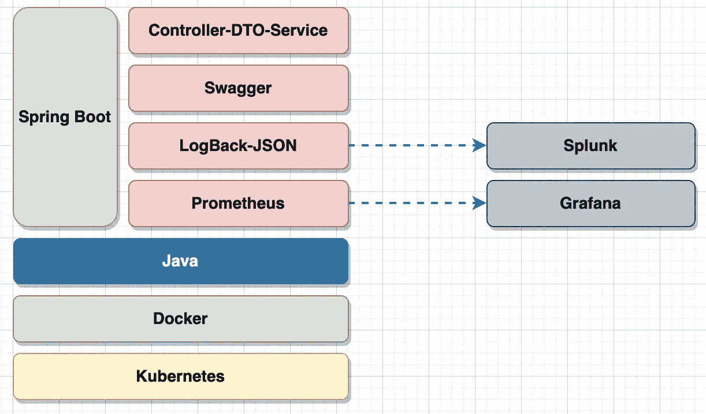
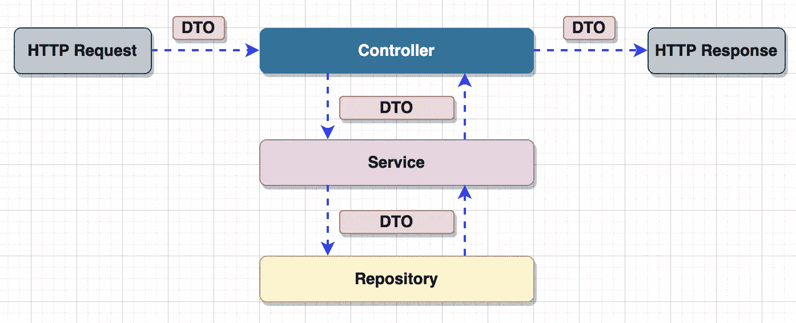
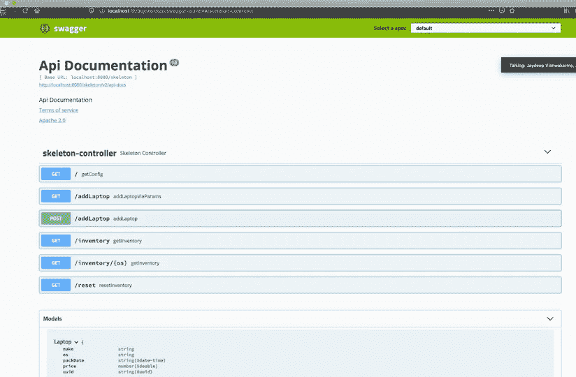
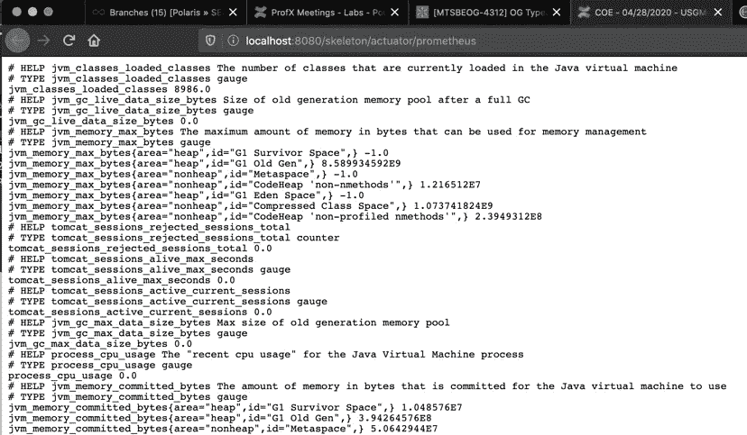
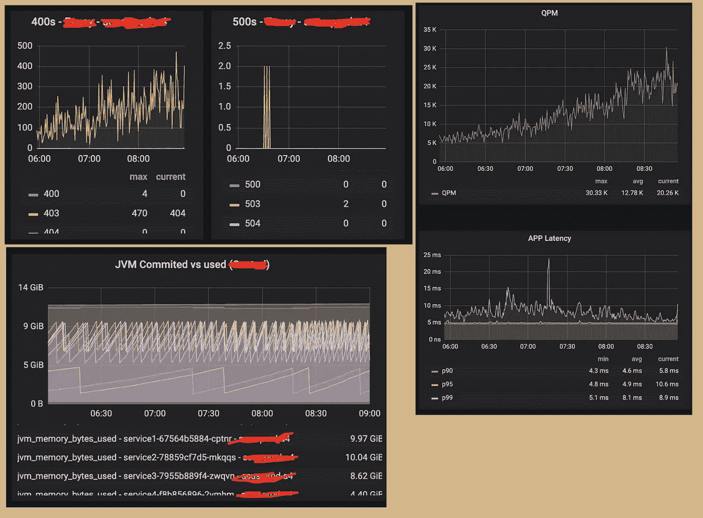
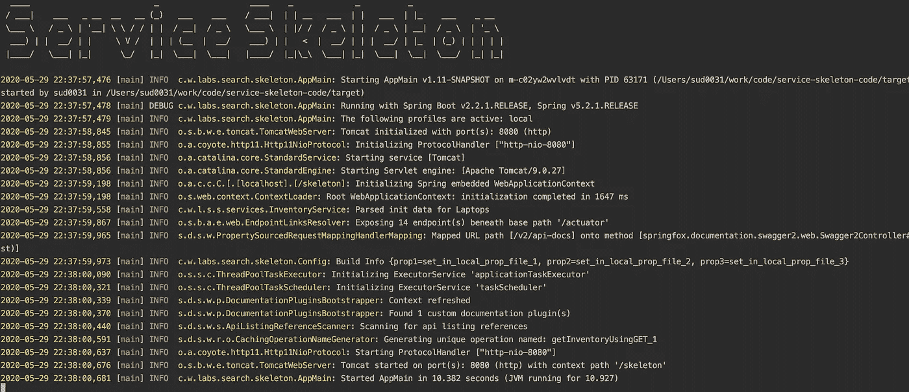
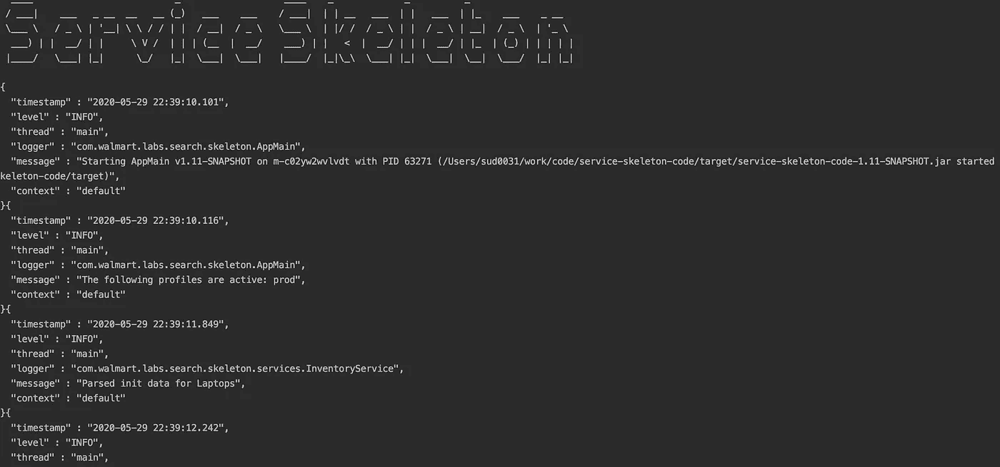
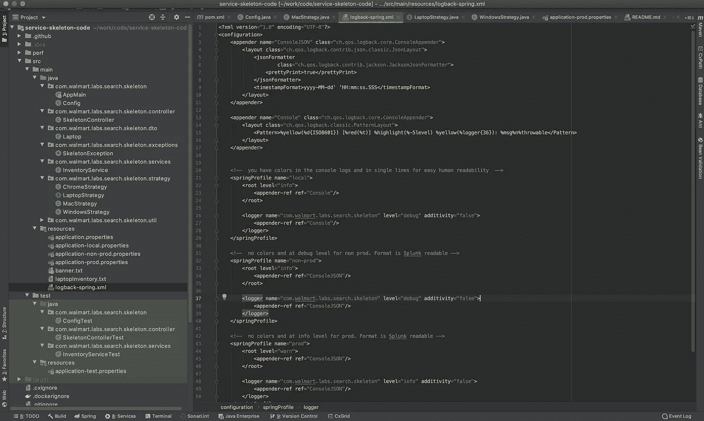
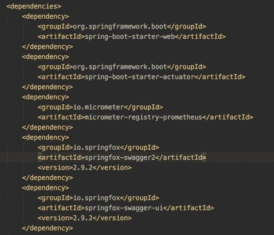

# 我们如何构建一个服务框架而不是框架

> 原文：<https://medium.com/walmartglobaltech/how-we-built-a-service-skeleton-instead-of-a-framework-227c9cd08a37?source=collection_archive---------0----------------------->

Photo Credit: [pixabay](https://pixabay.com/photos/tools-construct-craft-repair-864983/)

# 目录

*   介绍
*   搭建骨架
    - HTTP 端点
    -斯瓦格
    -普罗米修斯&格拉法纳
    -伐木
    - CICD 整合
*   结论

# 介绍

许多组织都在构建和使用定制框架，以使工程师的生活更加轻松。任何这样的框架都应该提供我们在每个应用程序中都期望的必要特性，或者按照组织的要求，使其标准化和可靠。这包括特定的日志格式、使用或限制某些开源软件、强制版本、构建工具甚至部署策略。框架(和库)通常是一个黑盒，工程师不希望改变它的内部工作方式。而不是简单地通过将应用程序嵌入其中来使用它(如果它是一个框架)，或者将包/类导入到代码中并调用它们(如果它是一个库)。

虽然这听起来不错，但更多情况下，如果框架设计不当，它可能会变得不结构化或过时。一个例子是一个定制的框架，它可能与 *Tomcat* 一起工作，但不能与 *Spring Boot、*一起工作，或者与 *Tomcat 7.x* 一起工作，但不能与 *Tomcat 9.x* 一起工作。更糟糕的是，如果框架继续增加新的特性而不关注向后兼容性，或者强制执行新的标准，那么你已经把它变成了一个不再受控制的野兽。在这一点上，一个工程师将她的代码融入其中的成本超过了实现她自己的最小框架。在构建这样的框架时，我们需要画一条线，我经常思考这个问题，*多少是太多？*

Photo credit: [pixabay](https://pixabay.com/photos/technology-hands-agreement-ok-4256272/)

首先，框架需要是可维护的。我们可能会被诱惑加入大量的特性，这显然是出于好意。但是，我的所有用户都需要所有的功能吗？我是在强化一个特定的特性吗？如果其中一个应用程序有特定的需求，而该需求被该强制措施阻止了，该怎么办？此外，提供一个模板，工程师可以从中挑选，而不是提供一个一刀切的黑盒，这是不是一个更好的主意。

更常见的是，我们遇到内部框架强迫工程师使用 [log4J](https://logging.apache.org/log4j/2.x/) (而不是 [slf4j](http://www.slf4j.org/) )并在特定位置以不可覆盖的格式输出日志。或者我们看到框架的一个核心特性是使用了一个不推荐使用的依赖项，或者一个不能升级的[阴影依赖项](https://softwareengineering.stackexchange.com/questions/297276/what-is-a-shaded-java-dependency)。

## 使用定制框架的优点

*   无需了解其工作原理即可获得开箱即用的支持
*   无需定制和添加依赖项。仅仅集成框架就足够了

## 使用自定义框架的缺点

*   *一刀切*的意思是，你也可以引入你不需要的特性
*   如果某个依赖项被否决，除非深入研究，否则您无法覆盖它，即使这样，您也可能无法修复一个阴影依赖项
*   如果框架强制限制，你就不走运了。你需要联系维护它的团队，让它正常工作
*   除非设计得当，否则可维护性将是一个问题，它包含的功能越多，维护起来就越困难。*‘多少才算多？’*问题
*   如果不与支持框架的团队合作，工程师不可能排除她不需要的项目，或者合并她需要的东西

因此，除非有特定的需求，否则定制框架的缺点可能会超过优点。仔细思考后，我们还观察到，如果构建一个*模板，*上面的优点会变成缺点，反之亦然。

# 构建骨架

面对所有这些问题，我们开始努力建造一些*恰到好处的东西*。一个拥有我们需要的所有东西，但工程师可以挑选的地方。这不应该是一个库或框架，而是一个模板。团队可以克隆这个*模板*，并删除与其用例不相关的东西。人们可以随意使用、贡献并让其他人知道这个*模板*。目前，我们希望保持它的内部源代码(如果将来不开源的话)。

The Skeleton-Stack

我们决定将其称为**服务框架**，并用“搜索组织”中最常用的语言——Java 来构建。这是一个简单的漂亮而有用的工具集合，它们可以很好地相互集成。为此，我们决定使用*。这里的目标不是重新发明轮子。而是提供简单的集成点来快速衍生新的微服务。Spring boot 似乎是显而易见的选择，因为它提供了我们开始工作所需的几乎所有东西。*

**Spring boot* 轻松配合 *Rest/HTTP 服务*工作，无需零锅炉板代码。它与用于日志记录目的的 [*logback*](http://logback.qos.ch/) 和用于度量暴露的[*actuator-Prometheus*](https://docs.spring.io/spring-boot/docs/current/reference/html/production-ready-features.html)集成在一起。它也很容易与[T21 霸气](https://swagger.io/)融为一体。应用程序在一个 [*docker*](https://www.docker.com/) 容器内运行，该容器又由 [*Kubernetes*](https://kubernetes.io/) 管理和编排。为了更平稳地运行，应用程序需要向外部系统公开日志和指标，如[*【Splunk】*](https://www.splunk.com/en_us/central-log-management.html)和 [*Grafana*](https://grafana.com/) ，以及它自己的 HTTP 端点。我们现在将检查这些。*

**

*The call stack*

## *HTTP 端点*

*由于大多数应用程序都是暴露 HTTP 端点的微服务，它使用 *Spring boot* 和样本测试用例给出了一个 [*控制器-DTO-服务*](https://martinfowler.com/bliki/LocalDTO.html) 集成的模板，这是任何微服务中最常用的东西。*

*重要的是要记住，一个微服务已经基于**域驱动设计被分解了。*应该不再需要在微服务中有子域。代码应该简单地根据其职责(控制器/服务/存储库/DTO)进行分组。面向外部的 dto 可能值得作为一个单独的工件，但这是一个单独的讨论，超出了我们的范围。如果需要，可以有其他逻辑分组。但是，除非有特殊需要，否则您不应该在回购中创建子模块。**

****

**Swagger endpoints**

## **时髦的**

**对于 HTTP 端点，需要定义契约，并与将使用该服务的团队进行沟通。这意味着在 Confluence、Github 或其他地方记录这些内容。随着时间的推移，这些文档似乎变得不同步，甚至被遗漏了。如果文档能与代码集成在一起就好了，而且也有一种简单的方法来测试它们。输入 [Swagger](https://www.baeldung.com/swagger-2-documentation-for-spring-rest-api) 获取合同文件。**

****

**Prometheus Endpoint**

## **普罗米修斯和格拉夫纳**

**了解流量、延迟、CPU/内存使用、可伸缩性、吞吐量和可用性以及其他因素对于确保应用程序正常运行非常重要。我们的 devOps 团队拥有 [Grafana](https://grafana.com/) 基础设施，该基础设施期望应用程序提供这些可以以图形显示的指标。支持的通用标准格式是[普罗米修斯](https://prometheus.io/)的格式。**服务框架**公开了 [Prometheus](https://docs.spring.io/spring-boot/docs/current/reference/html/production-ready-features.html) 格式的指标，并提供了实现定制指标的示例。**

****

**Grafana dashboard**

****

**color coded logging**

****

**json formatted logging**

## **记录**

**另一个操作方面是解决问题并及时查看发生了什么。为此，我们需要记录。与过去不同，我们不能在运行应用程序的同一个“硬件”上将日志写入物理文件。我们在云上，在一个容器中，来自容器的所有实例的日志需要进入一个中央日志管理系统。为此，我们使用了 [Splunk](https://www.splunk.com/en_us/central-log-management.html) 。应用程序只是将日志写入控制台，devOps 团队负责确保日志最终保存在 Splunk 中。我们不打算关注如何做到这一点，相反，我们确保**服务框架**以正确的格式写日志。我们使用 [*回退*](http://logback.qos.ch/) ，它与 *Spring Boot* 捆绑在一起。在这种情况下，我们还利用了[*spring profiles*](https://www.baeldung.com/spring-profiles)，其中 local profile 生成标准的单色编码日志行，以便在您需要在本地计算机/IDE 上运行它时进行调试。而为 *Splunk* 生成日志的 *Kubernetes* 上的部署则采用 json 格式，以便于过滤。**

****

**template code structure and test cases**

## **CICD 一体化**

**由于所有的部署都将发生在运行于 *Kubernetes* 的 pods 上，我们甚至为*服务框架*安装了一个 Docker 文件模板和一个样本 CICD 管道。**

****

**因此，我们构建的不是一个框架或库，而是一个工程师在组织中启动项目所需的协作，而不是挖掘集成的痛点。就像使用 *Spring* 一样，您不再需要担心解析 HTTP 请求，有了它，您不需要放下架子。继续添加肌肉，骨骼将开始移动，因为它们已经在那里了。正是这个原因，我们称之为**服务框架**。**

# **结论**

**每次我们建造新的东西，我们都需要划定界限。虽然向肉汤中加入新的口味很诱人，但加入太多可能会淹没味道，使你的菜肴不那么吸引人。理解我们正在构建的用例也很重要。**

**正如我们在上面看到的，**服务框架**在提供与 Swagger、Prometheus、Grafana、Logging 和 CICD 管道集成的工具的同时，也为工程师提供了包含或删除功能的选项。如果有人特别需要使用不同的记录器，或者不使用 Metrics endpoint，他们可以很容易地做到。**

**我们希望让工程师能够快速开发出新的服务，同时确保有足够的灵活性来满足她的需求并进行定制。要实现这一点，你能做的最好的事情不是建立一个库或框架，而是一个骨架，让工程师给它添加肌肉。**