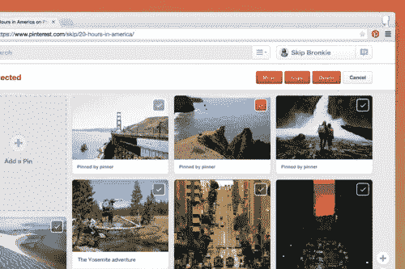

# 我们如何构建新的批量编辑工具

> 原文：<https://medium.com/pinterest-engineering/how-we-built-new-bulk-editing-tools-a1384a852daa?source=collection_archive---------4----------------------->

肯·墨菲| Pinterest 工程师，拯救

随着系统中的引脚数量增长到 300 多亿，难怪人们最需要的功能是能够将大量引脚移动到另一个电路板并更好地管理它们。

上个月，一个由两名工程师、一名设计师和一名产品经理组成的小团队构建了我们的第一套组织工具，以允许[批量编辑](https://blog.pinterest.com/post/105361940479/a-new-way-to-edit-pins-on-the-web)。现在，Pinners 可以一次对几个引脚执行操作。例如，一个 Pinner 可以将 15 个引脚移动到一个新的电路板上，删除 5 个不太正确的引脚或将 30 个引脚复制到另一个电路板上。

构建移动、编辑和组织多个大头针的工具不是一件容易的事情。我们遇到了两个关键的挑战:同步和顺序完成任务。

## 前端同步

第一个挑战是保持 web 不同组件的同步。

像许多 web 框架一样，我们的框架将站点分成不同的组件(我们称之为“模块”)。批量编辑工具需要几个不同的模块和持续的通信来保持一切顺利运行，这导致了该特性的两个设计问题。

首先，不同的模块应该如何相互通信？模块能够以三种方式对话:

1.  1.父母可以直接把信息传递给他们的孩子。
2.  2.孩子们可以引发一些事件，这些事件会浮现在他们的父母面前。父母可以监听事件并做出相应的反应。
3.  3.模块可以订阅一个通道，其他模块可以向该通道发布消息，这是一种发布-订阅模式。

批量编辑使用所有这些方法来帮助模块之间的相互交流，但是它特别依赖于发布-订阅模式(也称为“PubSub”)。许多需要通信的模块没有直接的父子关系，因此需要发布-订阅模式。

第二个设计决策是如何控制不同模块执行动作的顺序，比如发送消息和执行动画。例如，当 Pinner 点击“移动大头针”按钮开始编辑时。

编辑按钮被渲染和动画化以过渡到页面上。该纸板页面上的所有图钉上也会出现一个复选框。

这个决定导致了 JavaScript Promises 和 JavaScript 库 [Transit](http://ricostacruz.com/jquery.transit/) 的使用。承诺让我们运行一个函数，并在完成后运行其他代码，而无需处理回调。我们使用 promises 来调用 API，并在成功或失败时向不同的模块发送消息，告诉它进入或退出批量编辑模式。

Transit 允许我们从 JavaScript 运行 CSS 动画，甚至允许我们将动画链接在一起。这给了我们细粒度的控制，当不同的元素进入和离开页面。

## 竞赛条件

我们遇到的第二个关键挑战是比赛条件。批量编辑需要一次完成许多任务。按顺序完成这些任务可能会导致服务器超时，并向 Pinner 返回一条无用的错误消息。

为了解决这个问题并为 Pinners 创造更好的体验，我们使用 Python 的 barrier 库来并行运行每个单独的任务。整个移动的长度取决于最慢的移动需要多长时间。

不幸的是，许多批量执行的操作都是按顺序执行的。我们面临的最大挑战是保持电路板和用户缓存最新。

对于我们的各种缓存，我们使用两种不同的技术，Memcache 和 Redis。Redis 是一个更高级的键值存储，它允许键和值有不同的数据结构。Memcache 仅限于使用字符串，并且由于传统原因仍然存在。我们的大部分缓存都是在 Redis 中实现的。用户和板卡缓存仍由 Memcache 存储。

当我们从存储列表中删除 pin_id(每个 pin 的唯一标识符)时，我们的代码将执行以下操作:

1.  1.从 Memcache 获取列表
2.  2.检查 pin_id 是否在列表中，如果是，则将其删除
3.  3.将列表写回 Memcache

这导致步骤 1 和 3 之间的竞争条件。如果两个单独的批量操作同时从 Memcache 获取列表，两个操作都可能删除一个 pin_id，最后一次写回 Memcache 会覆盖第一个 pin_id 的删除。作为临时解决方案，我们将缓存更新移到批量移动完成后执行。

我们接下来的步骤是简化许多单独的任务，以便能够处理多个项目。例如，向我们的 Memcache 客户端添加方法，允许它一次添加或删除多个项目。这通过减少排队的网络请求和任务的总数而提高了效率。

最终，我们希望使用 Stingray，这是由我们的 BlackOps(垃圾邮件/滥用)团队开发的通用流处理器。黄貂鱼会让我们:

如果你热衷于解决这样的软件工程挑战，看看我们的[职业网站](https://about.pinterest.com/en/careers/engineering-product)！

*肯·墨菲是平纳体验团队的软件工程师。*

*获取 Pinterest 工程新闻和更新，关注我们的工程*[*Pinterest*](https://www.pinterest.com/malorie/pinterest-engineering-news/)*，* [*脸书*](https://www.facebook.com/pinterestengineering) *和*[*Twitter*](https://twitter.com/PinterestEng)*。有兴趣加入团队吗？查看我们的* [*招聘网站*](https://about.pinterest.com/en/careers/engineering-product) *。*

*   利用有限的并行形式。
*   自动将我们的输入分成多个作业。如果我们想移动 300 个引脚，它可以自动将其分解为 10 个引脚的任务，并处理它们。
*   回滚改变了，所以如果我们想移动 10 个图钉，而其中一个图钉没有移动，Stingray 会恢复其他 9 个图钉的移动。这比移动其他引脚的当前状态好得多，并且引脚会显示一条错误消息。