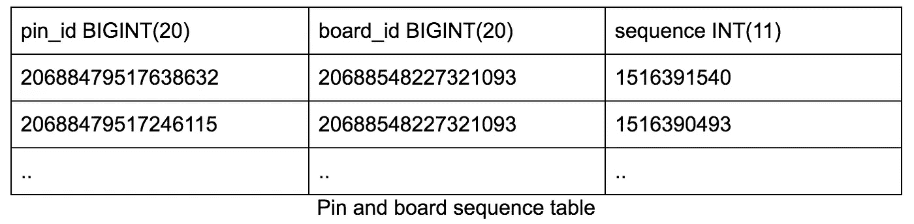
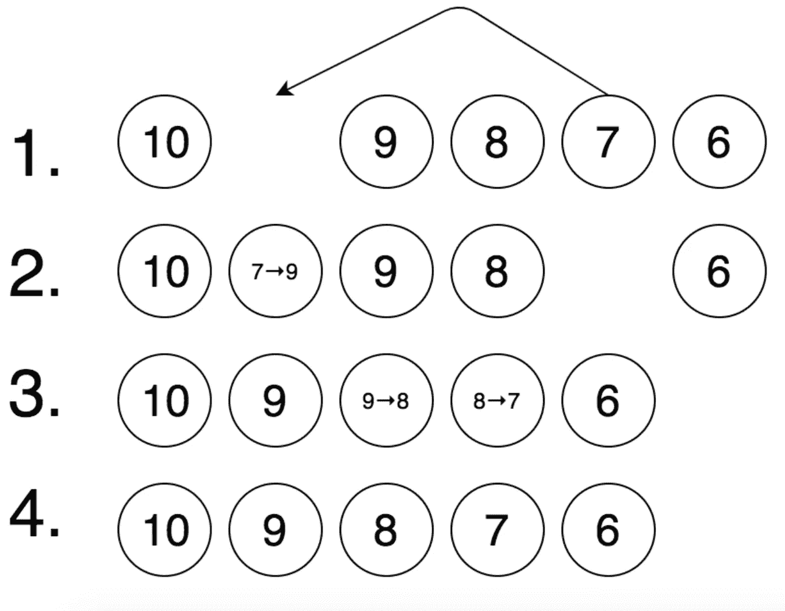
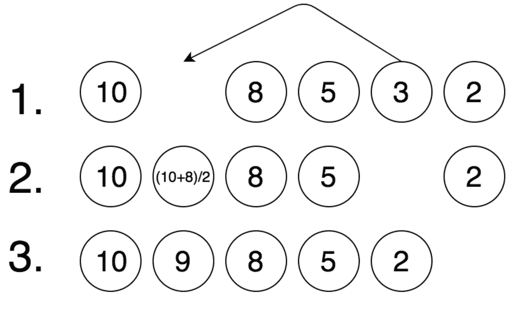
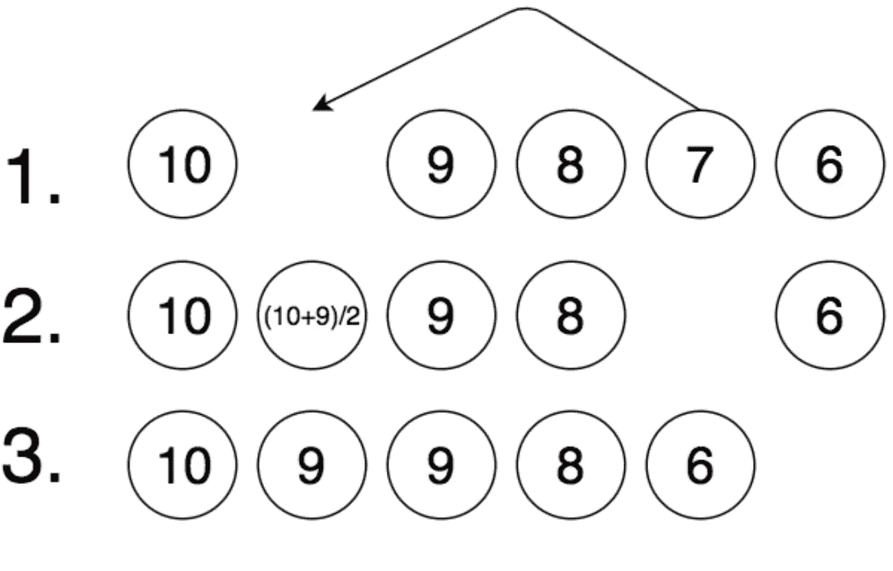
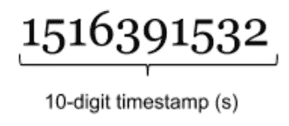
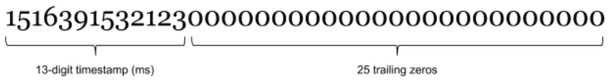

# How we built rearranging Pins

> 原文：<https://medium.com/pinterest-engineering/how-we-built-rearranging-pins-b11052e95c8b?source=collection_archive---------1----------------------->

Samuel Hsiung & Alice Chang | Pinterest engineers, Emerging products

Listening to user feedback is essential to building a product Pinners love and use to discover and save ideas every day. Often, their feature requests present interesting technical challenges for our engineers. For example, today we launched the ability to [reorder Pins on boards](https://pin.it/62qiveja7ssx6k), one of the most frequently asked for features. As we set out to build its backend service, we tackled new database scaling problems we’ll cover in this post.


Rearranging Pins on iOS

## **Requirements**

During the planning phase, we set the following requirements for the reordering backend service:

*   Pins can be dragged between two other Pins on the same board
*   Pin reordering can happen in the same board repeatedly within a span of seconds
*   The solution should scale across boards with many Pins

To fulfill the first requirement, we built the following interface for the reordering API:

```
reorder_board_pin(board_id, pin_id, before_pin_id, after_pin_id)
```

`pin_id` corresponds to the Pin being dragged, and `before_pin_id` and `after_pin_id` correspond to the neighbors of its dropped position.

## **Data storage**

The relationship between boards and their child Pins is stored in a sharded MySQL table. Before Pin reordering was implemented, Pins were arranged by recency via a descending sort on the `sequence` column of the table.



Each Pin’s sequence is initialized to the epoch timestamp in seconds corresponding to the moment of creation.

## **Explorations**

One naive approach to reordering we briefly considered was adjusting the sequence values of each consecutive Pin between the reordered Pin’s initial and final position. The diagram below outlines the steps for this approach, where each circle represents a Pin and the number represents its sequence.



This solution requires a few SQL queries which look like this:

One drawback of this approach is that some Pinners have boards with as many as tens of millions of Pins. This could result in many row updates for a single Pin reorder if the drag distance is far away (such is the case if the reorder API is called manually), thereby putting a heavy writeload on the database.

## **Gap bisection**

To reduce the number of writes, we considered bisecting gaps between the neighboring sequences of the dropped Pin. In the figure below, the reordered Pin takes on the midpoint value 9 of its neighbors 8 and 10:



With gap bisection, we only need to update one row in the table after each reorder:

However, as you may have quickly noticed, the sequences will collide after enough reorders, because the integer-based sequence won’t have enough resolution to capture the gaps. Take the following example where the Pin with sequence 7 collides with the sequence of its right neighbor 9 after the midpoint is rounded down to the nearest integer:



In our case, the sequence column type is INT(11), meaning sequences are represented as ten digit 4-byte integers.This means that Pins saved eight seconds apart could only support *log(8) = 3** bisections before a collision.

## **Improvements**

To address this, we increased the resolution of the timestamps used for initializing sequence values from seconds to milliseconds. We also increased the digits of the sequence column from ten to 38 (the max allowed by our Hive backup tables).

To fully utilize the column size, we padded the 13 digit timestamp given by Java’s epoch timestamp generator *System.currentTimeMillis()* with twenty-five trailing zeros. Here’s an example of a sequence before and after the conversion:

Before:



After:



With the new type, we can now support up to *log(10²⁵) ≈ 84** bisections before two sequences collide, assuming a worst case scenario where Pins are saved one millisecond apart.

## **Tying up loose ends**

While increasing the sequence resolution allows us to support most reordering use cases by making sequence collisions unlikely, it doesn’t guarantee they won’t happen. To ensure sequence gaps always have space available to them, we created an offline job that’s enqueued when the sequence gap between any two neighboring Pins ever dips below a chosen threshold following a reorder. The job re-spaces the sequences of the neighboring Pins until each gap is guaranteed to support at least a configured number of bisections.

*Acknowledgements: Pin reordering was built in collaboration with Brian Donohue, Eric Sung, Ernie Souhrada, Kapil Bajaj, Kelei Xu, Purajit Malalur and Steven Ramkumar.*

*logarithms are base 2