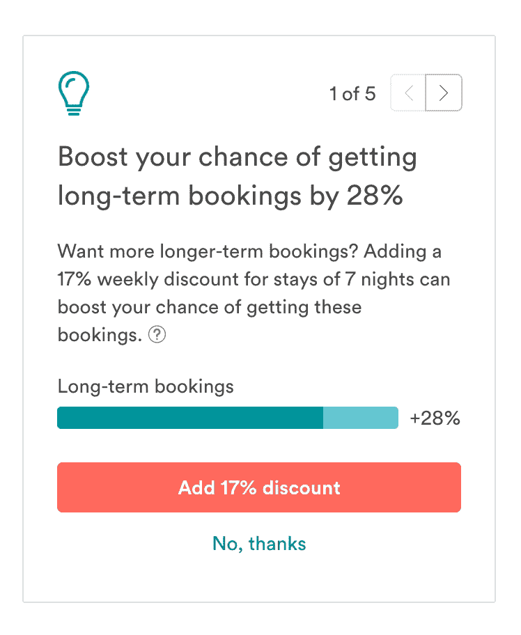
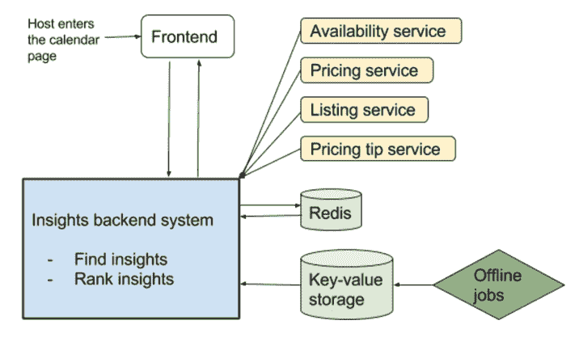
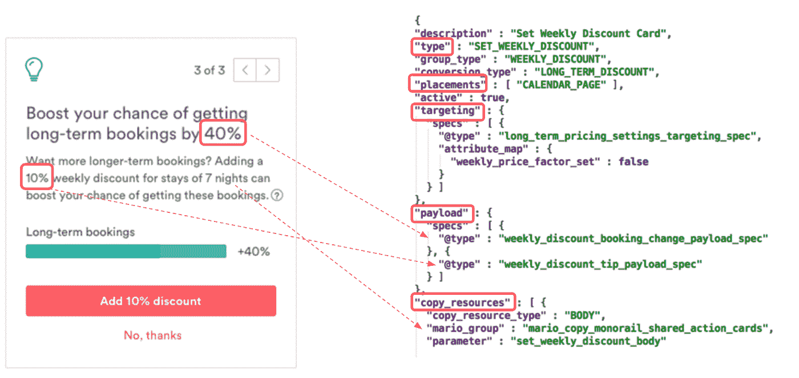

# 我们如何向主持人提供见解

> 原文：<https://medium.com/airbnb-engineering/how-we-deliver-insights-to-hosts-7d836520a38?source=collection_archive---------2----------------------->

由[迪潘克古普塔](https://www.linkedin.com/in/deepankgupta) & [基代权](https://www.linkedin.com/in/kidai-kwon-28912a26)

# 动机和背景

我们从人们在 Airbnb 上搜索和预订的内容中观察到大量数据。在这些数据的背后，有很多有用的见解，可以帮助主机更好地管理他们的列表。与此同时，如果不能以有效的方式共享这些信息，主机处理这些信息会变得不堪重负。

例如，我们从主持人那里听到的最常见的问题之一是:*我如何选择合适的价格？*如果没有你所在地区其他房源的可靠信息、旅游趋势以及人们对你提供的便利设施的兴趣，定价可能会很困难。在过去的几年里，我们推出了定价技巧和智能定价，帮助主机获得个性化的每日定价建议。为了做到这一点，我们开发了一个数学模型，该模型可以了解客人在特定日期以不同价格预订特定房源的可能性。它使用不同类型的信息，包括你的列表类型，它的位置，你的当前价格，你的可用性，以及每个可用日期有多远。

随着我们的模型在理解市场方面变得更好，我们能够了解更多。现在我们可以和我们的主人分享我们学到的见解。例如，如果客人倾向于在某个地区长期住宿，我们可以建议设置长期折扣。

# 主机的新见解

洞察是一种活动，引导主持人在定价上变得更加成功。为了提出这些见解，我们决定每个见解必须:

1.  **个性化**:每一个洞察都利用市场需求、预订概率等房源信息，展示个性化的房源推荐。
2.  **有针对性的**:每种洞察都以某些标准(如列表属性和定价设置)为目标，以最大化其相关性。只有符合目标标准的列表才会显示特定的洞察力。
3.  **可操作的**:每一个洞察都应该可以通过具体的行动立即付诸实施。

# 我们如何提供见解

为了向从主机控制面板到主机日历页面的各种主机交互位置提供个性化、有针对性和可操作的洞察，我们构建了一个可扩展的后端服务来为多个渠道提供洞察。该服务是一个实时系统，它从一组离线和在线数据源获取数据，以生成个性化的见解，对不同列表和上下文的有效性进行排名，并在正确的时间和正确的地点提供见解。这项服务叫做 Narad。Narad 这个名字来自印度传统——Narad 曾经是一个神圣的圣人和一个旅行的故事讲述者，他带来了新闻和启发性的智慧。

# 请求的生命周期:

1.  当收到获取清单的洞察列表的请求时，洞察后端获取符合清单条件的所有洞察。
2.  它使用每个洞察的目标规则来过滤掉不相关的洞察。目标规则基于主机和列表的在线信息，以及使用预测模型和聚合作业计算的离线信息。
3.  它根据疲劳规则过滤掉洞察，这样主机就不会重复看到相同类型的洞察。
4.  对于每个选择的洞察，它生成个性化的有效载荷和静态信息。这些信息包括向主机显示的值，如潜在的预订收益或每周折扣的建议值。
5.  它根据对主机的价值对选定的见解进行排名。洞察的价值被确定为洞察的固有影响和洞察的转化率的乘积。诸如重复惩罚之类的其他项被包括在内，以使排名更加动态。

# 洞察力是如何表现的？

洞察力有许多相似的组成部分。例如，鼓励主机设置周折扣的不同见解变体可以针对没有设置周折扣的主机或只获得少量长期预订的主机。这些见解也将共享相同的个性化有效载荷，这将是每周折扣的建议金额。考虑到这一点，insights 的表示被设计成可以通过 json 配置轻松地即插即用共享组件。

洞察由以下内容组成:

1.  **标识符**:这包括作为每个洞察标识符的洞察类型、告知该洞察可以被交付到哪个主机工具的位置，以及其他分组信息。
2.  **目标**:这是一个目标条件列表，为了使 insight 符合给定列表的条件，需要满足这些条件。有各种维度，如入住率、过去和未来预订、市场需求、地理位置、列表属性和定价设置，可以针对这些维度进行洞察。
3.  **Payload** :这决定了 insight 向主机显示的一组个性化信息。示例有效负载的范围从主机设置的建议值到对主机的好处，例如潜在的预订增加。
4.  **Copy** :包含为 UI 提取国际化内容的信息。

下面是一个示例，展示了如何将洞察的后端表示(右侧)转化为向主机显示的个性化洞察(左侧)。此每周折扣信息仅提供给主机日历页面，面向未设置每周折扣的主机。它包含两条个性化信息:长期预订的潜在预订增长，以及建议的每周折扣值。

# 在洞察力上理解主人的行为

每当主机对 insights 采取行动时，后端系统都会通过 Redis 跟踪这些事件。系统跟踪的操作类型包括印象、转换、跳过和解散。为了保持洞察力的新鲜，它使用这些交互数据来实现疲劳规则。可以通过一组维度(如动作、持续时间和计数)来实施疲劳规则。例如，一个疲劳规则可以允许在过去一周内最多 3 次展示，以鼓励主机设置每周折扣。另一个疲劳规则可以限制某个特定的洞察在宿主拒绝该洞察后出现。这些可配置的规则确保系统以愉快的体验将相关内容传递给主机。

这些交互数据也用于对这些见解进行排名。该系统负责向主持人提供最相关和最有影响力的见解。排名的第一次迭代通过一组术语定义每个洞察的总价值。第一项是权重，指洞察力的内在影响。例如，与只影响列表提供的几个可用夜晚的洞察相比，具有适用于整个列表的行动的洞察本质上更有价值。第二项是特定见解的历史转换率。一些见解可能会产生很大的影响，但不会引起主持人的注意。其他见解可能会获得大量的转化，但并不具有内在的影响力。第一项和第二项保持这种平衡。最后一项是重复惩罚，如果同一见解上次被列为最高见解，则该惩罚会降低该见解的总价值。这有助于在顶部位置提供一些变化，以便相同的洞察力不会反复出现在顶部，即使它是最好的洞察力，以保持主机更多的参与。

# 下一步是什么

我们已经看到了非常积极的成果，在主机日历页面上引入了 insights。主持人参与到见解中，并通过采取行动变得更加成功。总体而言，我们看到 Airbnb 的预订量上升了 2%。除此之外，它还为我们提供了一个与主持人交流的平台，并通过 narad 快速介绍新的见解。见解的接受率很高，五分之一的见解会被主持人采纳。

以下是一些未来的作品:

1.  扩展洞察集，以提高个性化并捕捉市场中的其他宏观趋势。
2.  创建更好的排序算法，根据相关性和影响对见解进行排序。
3.  为不同的主机工具和平台带来见解。

如果没有 Jerry Su(前端工程师)、Luca Beltrami(产品经理)、Clara Lam(设计师)、Holly Hetherington(内容策略师)和其他许多人的努力，所有这些都是不可能的。如果这些角色听起来让你感兴趣和兴奋，请告诉我们！我们正在 Airbnb 的定价团队中招聘 [工程师](https://www.airbnb.com/careers/departments/engineering)、[数据科学家](https://www.airbnb.com/careers/departments/data-science-analytics)和[设计师](https://www.airbnb.com/careers/departments/design)。

## 在 [airbnb.io](http://airbnb.io) 查看我们所有的开源项目，并在 Twitter 上关注我们:[@ Airbnb eng](https://twitter.com/AirbnbEng)+[@ Airbnb data](https://twitter.com/AirbnbData)