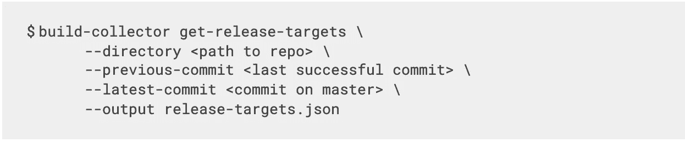

# 我们如何设计持续集成系统，使其速度提高 50%以上

> 原文：<https://medium.com/pinterest-engineering/how-we-designed-our-continuous-integration-system-to-be-more-than-50-faster-b70a59342fe2?source=collection_archive---------0----------------------->

Urvashi Reddy |工程生产力团队软件工程师

*今年早些时候，Pinterest 的工程生产力团队发表了一篇名为* [*的博客，介绍了一行代码的改变如何将我们的克隆时间减少了 99%*](/pinterest-engineering/how-a-one-line-change-decreased-our-build-times-by-99-b98453265370) *。在那篇文章中，我们描述了一个简单的 Git 配置如何在我们 Pinterest 最大的存储库中加快克隆速度。在本帖中，我们将讨论如何在为 Pinterest 的另一个主要存储库服务的 CI 中显著减少构建时间。剧透:这不是一行的变化！*

*本博客涵盖的内容在 BazelCon 2020 上展示过。查看演示文稿* [*使用 Bazel 查询设计语言不可知的 CI*](https://opensourcelive.withgoogle.com/events/bazelcon2020/watch?talk=day1-talk4)*。*

工程生产力团队的愿景是“建立一个开发者平台，激励开发者做最好的工作。”这个平台不可或缺的一部分是持续集成(CI)管道。CI 管道负责验证代码变更并生成发布工件，这些工件可以部署到我们支持的连续交付平台之一。该公司有 1000 多名工程师，我们的团队面临着一个有趣的挑战，即提供可靠、快速的 CI 管道，为大规模的主要存储库提供服务。

为了实现这些目标，我们的团队做出了一些关键的设计选择:

*   采用 Bazel 作为我们的构建工具
*   使用基于语言的 monorepos
*   仅测试和发布变更的代码
*   利用 Bazel 的构建文件作为 CI 和开发人员之间的契约
*   使用定制的 Bazel 规则创建发布抽象
*   尽可能并行工作

## 收养巴泽尔

选择多语言的单一构建工具使我们的团队能够创建 CI 工作流，这些工作流可以应用于 Pinterest 上使用 Bazel 的任何存储库。由于 Bazel 的设计是封闭的，我们可以在 CI 中运行 Bazel 目标，而不需要配置或管理对主机的依赖。

## 基于语言的 monorepos

当代码被提交到存储库时，我们的 CI 管道被触发，这意味着每个存储库都有一个 CI 管道。为了限制我们必须管理的 CI 管道和存储库的数量，我们将我们的服务分组到每种语言的一个存储库中。

如果你有兴趣了解以上两种选择，请查看我们团队的另一个 BazelCon 2020 演示，名为 [Pinterest 的 Monorepo 之旅](https://opensourcelive.withgoogle.com/events/bazelcon2020/watch?talk=day2-talk2)。

## 仅测试和发布更改的代码

在规模上，运行存储库中的每个目标是昂贵的。即使有了 Bazel 的缓存，用 bazel test //…运行所有测试目标仍然意味着要花费时间来获取和加载目标的依赖项。这些对缓存的网络调用非常耗时，如果只运行最少的目标集，就可以完全避免。

此外，我们 monorepos 中的服务在提交频率上有所不同。其中一些是每日贡献的，而另一些则是零星的。通过在 CI 中只运行受变更影响的内容，我们可以显著加快构建时间。

那么，我们如何让最小的目标集运行呢？我们创建了一个名为 build-collector 的 Golang CLI 来报告在 CI 中运行的目标。CLI 接收一组提交，并使用 Bazel 查询输出要运行的目标列表。CLI 会查看已更改的文件，并运行适当的查询来查找受影响的目标。例如，如果更改了几个源代码文件，build-collector 将运行以下查询:

上面的命令使用 [rdeps](https://docs.bazel.build/versions/master/query.html#rdeps) 查询函数来查找源文件的反向依赖关系。输出是我们可以在 CI 中运行的目标列表。为了具体地获得测试目标，build-collector 使用 kind query 函数用一个过滤器将上述内容包装起来:

注意:或者，可以使用[测试](https://docs.bazel.build/versions/master/query.html#tests)查询函数来过滤测试目标

这只是构建收集器运行的查询的一种类型。查询的完整列表在 [*使用 Bazel 查询*](https://opensourcelive.withgoogle.com/events/bazelcon2020/watch?talk=day1-talk4) 演示设计语言不可知 CI 中进行了说明。在这一点上，您可能想知道我们如何获得发布目标。当我们讨论我们的定制发布规则实现时，我们将在下面进一步讨论。

在我们的 CI 脚本中，我们以下列方式调用 build-collector:

这里有一个测试目标的构建收集器输出文件的例子。相同的 JSON 模式也用于发布目标。

CI 脚本解析 build-collector 输出的 JSON 文件，并在多个 workers 之间并行运行目标。

## 利用 Bazel 的构建文件作为 CI 和开发人员之间的契约

我们希望 Pinterest 工程师专注于功能工作，而不必学习太多关于如何设置 CI 的东西。考虑到我们还想在 CI 中运行最小的目标集，我们需要一种方式让开发人员交流哪些目标是本地开发的，以及他们的服务的哪些部分应该在 CI 中测试和发布。这就是 Bazel 构建文件派上用场的地方，因为它已经是开发人员定义测试和发布与他们的服务相关的工件的地方。开发人员在构建文件中遵循一些简单的约定，以便我们的 CI 可以准确地计算出要构建什么。

这些惯例是:

*   使用测试规则类型运行测试(标准 Bazel 实践)
*   使用 Pinterest 自定义发布规则来生成发布工件
*   使用 no-ci 等受支持的标记来指示管道中不应该运行的内容

## 使用定制的 Bazel 规则创建发布抽象

在 Pinterest，我们支持发布到各个商店的许多不同的工件类型。例如，docker 映像被发送到内部注册表，jar 被发布到 Artifactory，等等。为了支持这些工作流，我们为 Pinterest 的常见用例实施了自定义 Bazel 规则。定制规则帮助我们在基础设施上创建一个抽象。所有开发人员需要做的就是使用我们的自定义规则在构建文件中指出他们想要发布的内容。

一个常见的工作流是创建和发布 docker 图像，然后在部署到 EC2 或 Kubernetes 时引用这些图像。下面是一个例子，展示了工程师如何使用名为 container_release 的定制 Bazel 规则来让 CI 使他们的发布工件可用于部署。

在这个示例构建文件中，该服务已经使用开源 container_image 规则创建了一个 docker 映像。使用定制的 container_release 规则，服务作者可以将 docker 映像发布到 Pinterest 注册中心，并指定哪些部署构件应该对我们的连续交付平台可用(EC2 部署使用 [Teletraan](https://github.com/pinterest/teletraan) ，Kubernetes 工作负载使用 [Hermez](https://www.youtube.com/watch?v=KkKSoQBp2oQ) )。

实施定制发布规则有几个好处:

*   它为我们的开发人员抽象了基础设施层。他们不必知道部署工件的最终位置以及它们是如何被我们的 CD 平台消费的。
*   开发人员通过受版本控制的代码来控制他们服务的哪些部分被发布
*   我们可以通过控制在哪里发布工件来支持他们的发布工件的开发版本。

最后一个好处是通过定制发布规则实现中的另一个发布抽象来实现的。每个 Pinterest 定制发布规则实际上是一个 B [azel 宏](https://docs.bazel.build/versions/master/skylark/macros.html)，它生成两个定制发布规则:artifact_ci_release 和 artifact_dev_release。我们的开发人员不会直接看到这些规则或与之交互，但是我们的 CI 和本地开发工作流会使用它们来确保它们在正确的上下文中运行。例如，下面是 Bazel 查询构建收集器运行以获取源代码变更的发布目标:

我们在这里做的进一步优化是控制发布工件在 artifact_*_release 实现中运行的依赖顺序。例如，在我们发布引用它们的 YAML 文件之前，docker 图像被发布到注册中心。这样做使得构建收集器中的查询逻辑快速而简单。

## 尽可能并行化

为了确保我们的 CI 尽可能快地运行，我们希望尽可能地并行运行目标。我们目前通过我们称之为调度员模型来实现这一点。Dispatcher 模型非常简单:我们计算出哪些目标需要在 CI 中运行，并将这些目标的执行分派给并行运行的 workers。

这在运行发布目标时有很大的好处。如果开发人员只关心从他们参与的几个服务中发布工件，他们不应该等待 CI 构建中的所有其他服务完成。独立和并行地运行发布目标为开发人员提供了他们准备好的发布工件。

## 拉式请求(PR)构建如何？

每次创建新的拉动式请求时，我们的公关渠道都会启动 CI 运行。我们修补代码更改，并使用临时提交来传递给 build-collector。这使得我们可以轻松地为 PR 构建重用相同的 CI 设置。唯一的区别是，我们不创建任何发布工件，而是通过运行 Bazel build 来检查发布目标是否可以编译。

## 结果呢

今年年初，我们在名为 Optimus 的回购中投资了上述设计选择。Optimus 是一个 monorepo，包含 120 多个 java 服务，并拥有我们在 Pinterest 的一些最重要的数据平台。Optimus 及其 CI 渠道每月为 300 名活跃贡献者提供服务。

今年年初，我们没有使用 build-collector，也没有使用 Optimus 中的发布规则抽象。代替那些事情的是，当代码发生变化时，我们在一个服务中运行所有的目标，并且我们有用于发布发布工件的粒度发布规则。当时，CI 构建的 P50 时间为 52 分钟，P90 时间为 69 分钟。在迁移到我们的新 CI 设计后，我们看到 P50 时间在一周内下降到 19 分钟，P90 下降到 49 分钟。P50 快 2.7 倍，P90 快 1.4 倍！

*Chart comparing build times the week before and after the CI migration*

*One month distribution of build times with the old CI*

*One month distribution of build times with new CI*

# 学习

Bazel 是一个强大的工具，我们可以利用它来创建一个持续集成平台，适用于 Pinterest 的各种用例。像 build-collector 和自定义发布规则这样的优化构建了平台的基础层，我们可以在此基础上创建更多增强功能，进一步提高 CI 构建的速度和健康状况。我们希望 Bazel 接下来研究的一些东西是:远程执行、概要分析和自动检测和排除不可靠测试的系统。