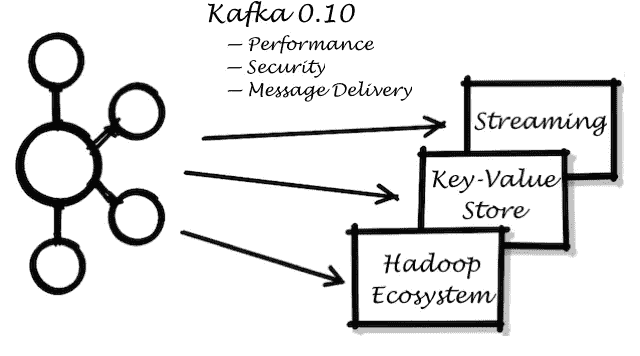
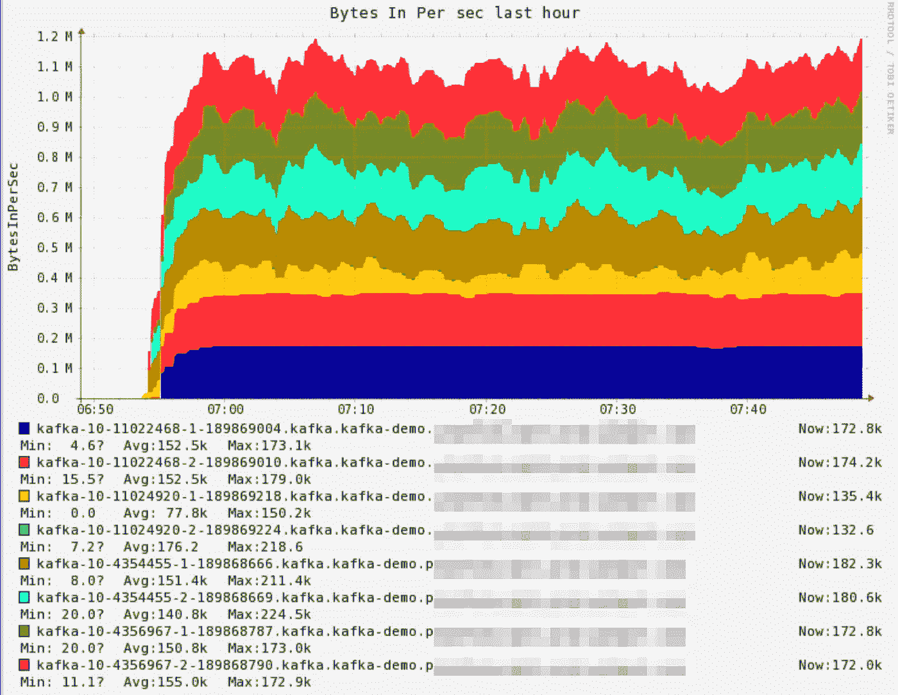
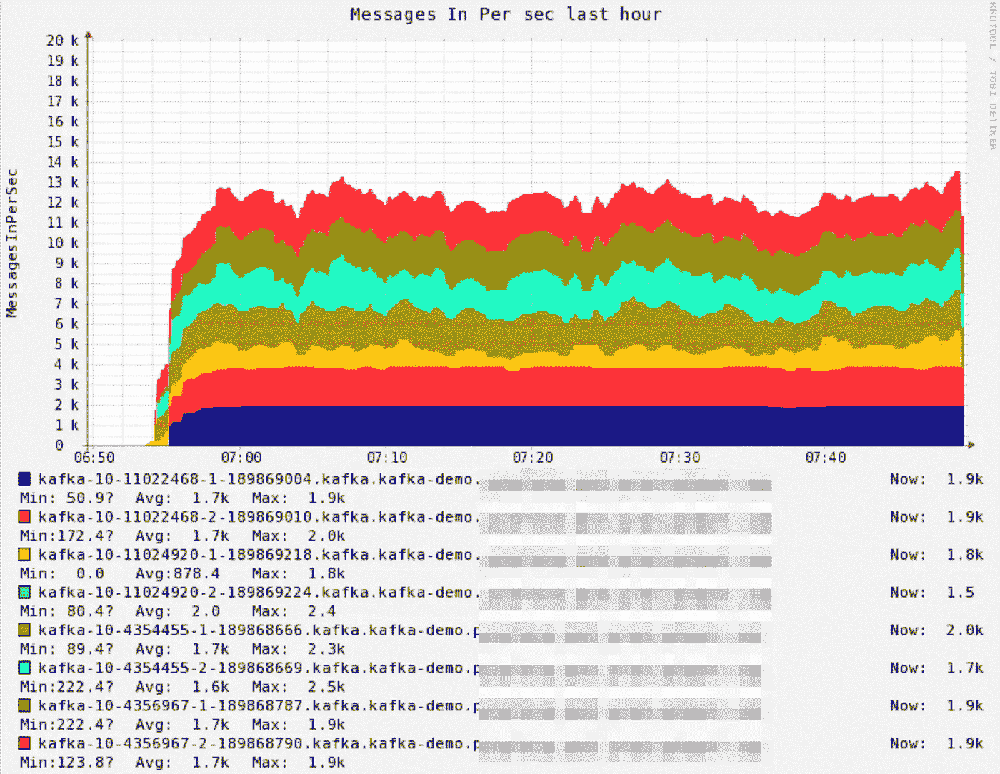
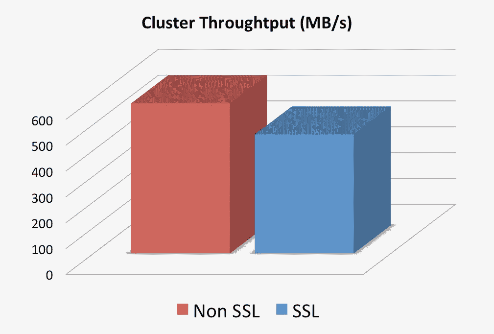

# 我们如何拥抱阿帕奇卡夫卡的新版本

> 原文：<https://medium.com/walmartglobaltech/how-we-embraced-the-new-release-of-apache-kafka-9cf617546bb6?source=collection_archive---------1----------------------->

正如我们之前的帖子所介绍的([链接 1](/walmartlabs/tech-transformation-real-time-messaging-at-walmart-8787f5ab19e8) 、[链接 2](/walmartlabs/kafka-ecosystem-on-walmarts-cloud-983570dff1f2#.7vpklr9md))【Walmart.com】背后的许多应用程序都由高度可扩展的分布式流媒体平台 [**阿帕奇卡夫卡**](https://kafka.apache.org/) 提供支持。随着高速革命，卡夫卡有了新的里程碑，[发布 0.10](https://archive.apache.org/dist/kafka/0.10.1.0/RELEASE_NOTES.html) 。随着这一版本的发布，Kafka 及其生态系统达到了一个新的成熟水平。在这篇文章中，我想分享我们最近关于 Kafka 0.10 发布的有趣结果。下一篇文章将更多地关注 Kafka 周围的流媒体、大数据和 [Hadoop](http://hadoop.apache.org/) 生态系统。

Kafka 0.10 and its Downstream Consumers around it

## 消费者补偿存储:卡夫卡主题

在早期的 Kafka 版本中(0.8.2 之前)，消费者将他们的补偿提交给动物园管理员。在上一个假期，我们的 Zookeeper 集群经历了大量的写操作，这是由许多用户频繁提交 offset 造成的。除了增加 Zookeeper 的容量(例如，SSD 作为存储)，Kafka 现在还提供了一种替代方法，可以将消费者补偿存储到一个特殊的、独立的 Kafka 主题中，该主题是可复制的、高度可用的。

考虑到这个新选项，我们进行了一些性能评估，以便更好地理解它，然后从 Zookeeper 迁移出来作为消费者补偿的存储。

我们在沃尔玛的 [**OpenStack**](https://www.openstack.org/) 云上使用了 8 台虚拟机(VM)。在 8 个虚拟机之上，由沃尔玛的开源 PaaS - [**OneOps**](http://www.oneops.com/) 部署 Kafka release 0.10.1.0，形成 1 个 Kafka 集群。每台虚拟机都有以下规格:

*   8 个 CPU 内核、24GB 内存、1Gbps 网卡、160GB 磁盘(由固态硬盘备份)

Zookeeper 集群在 3 个专用虚拟机上外部运行，也由[**OneOps**](http://www.oneops.com/)**使用 [Zookeeper cookbook](https://github.com/oneops/circuit-oneops-1/tree/master/components/cookbooks/zookeeper) 部署。**

**创建了八个 Kafka 主题:每个主题有 100 个分区，两个副本，并设置了合理的保留策略以避免磁盘溢出。其他主题配置保持默认设置。**

**为了生成和使用工作负载(消息大小 10KB)，我们使用了每个 Apache Kafka 版本附带的[生产者](https://github.com/apache/kafka/blob/trunk/bin/kafka-producer-perf-test.sh)和[消费者性能测试套件](https://github.com/apache/kafka/blob/trunk/bin/kafka-consumer-perf-test.sh)。为了减少网络延迟并完全加载 Kafka 集群，8 个生产者和 8 个消费者被部署在与 Kafka 相同的数据中心中的独立虚拟机上。**

**所有生产者和消费者都使用默认配置，只是我们在消费者端调整了以下配置:**

*   **auto.commit.interval.ms:使用者偏移量自动提交给 Kafka 或 Zookeeper 的频率(以毫秒为单位)**

****这是我们的观察结果之一:****

**当使用 Kafka topic 存储消费者补偿时，**观察到一个小的性能损失** (~7%的损失)。*这仅发生在提交用户偏移量的频率非常高时，可能会使磁盘过载*。**

**为了验证这一点，我们设置**auto . commit . interval . ms = 50**来模拟提交偏移量的高频率，并注意到 Kafka 主题的写流量( *_consumers_offsets_* )很有趣:12k 消息/秒仅生成 1.2 MB/秒，转化为微小的消息大小，大约 100 字节:**

****

**Write bandwidth (MB/s) for Kafka topic (*_consumers_offsets_*) that stores consumer offsets**

****

**Number of message per second for Kafka topic (*_consumers_offsets_*) that stores consumer offsets**

**由于 *_consumers_offsets_* 主题在 200 个分区的情况下被复制了 3 次，因此可以合理地推断，代价可能是由于偏移量(微小的消息)必须被同步写入(至少两次)这一事实。然而，当提交频率不是很高时，没有观察到性能下降。以下是**auto . commit . interval . ms**= 50 到 5000 之间的详细数字(默认为 5000):**

1.  **Kafka 吞吐量:533 MB/s 对 580MB/s**
2.  **消费者吞吐量:每秒 53300 条消息对每秒 58000 条消息**

**所以**我们初步的收获**是:对于那些应该最小化重新处理消息的情况(为了实现这一点，消费者需要频繁地提交偏移量)，如果消费者偏移量存储在 Kafka 中，可能会潜在地存在一个小的性能损失。如果磁盘 I/O 带宽足够大，这可能是不可见的。总的来说，我们认为 Kafka 主题中的消费者偏移仍然比过载和停止 Zookeeper 要好，这会导致更糟糕的情况(例如，连接超时，无法选举领导者)。**

## ****SSL** (安全套接字层)**

**为了服务于关键的业务用例(比如运送客户交易数据)，客户和 Kafka 之间的通信必须是安全的。为此，我们投资为 Kafka 0.10 版本启用 SSL。我们将简要分享我们对 SSL 的**性能权衡的观察。****

**毫无疑问，启用 SSL 会降低 Kafka 的性能，因为需要额外的加密和授权。如上所述，我们在 SSL 和非 SSL 之间进行了性能评估，以量化我们必须为 SSL 付出的性能损失。**

**我们实现了从生产者到 Kafka 和从 Kafka 到消费者的 SSL，而没有 SSL 代理间通信。**

**基于上述设置，我们的结果显示，启用 SSL 时，性能会下降 20%左右。例如，460 MB/s 对 580MB/s**

****

**Kafka cluster throughput comparison between non-SSL and SSL**

**还要注意，当启用 SSL 时，Kafka broker 上的 CPU 使用率明显高于非 SSL，因此与未启用 SSL 时相比，Kafka 变得更受 **CPU 限制**。理论上，增加更多的 CPU 容量应该有助于提高性能。**

**此外，我们启用了 SSL 代理间通信。不出所料，在换取额外安全级别的过程中，性能进一步下降。**

**处罚的根本原因主要是因为卡夫卡在 JDK 使用的 SSL 引擎。OpenSSL 可能是一个很有前途的替代品，应该运行得更快，而且[有一张票](https://issues.apache.org/jira/browse/KAFKA-2561)可以跟踪这一点。**

## **邮件丢失预防**

**在一些用例中，小的消息丢失是可接受的，例如监控、机器学习、预测。但是，对于业务关键案例，如财务报告、会计对账，应尽量减少或防止消息丢失。**

**Kafka 从 0.9 版本开始将“无消息丢失”定位为一等公民，一个例子是 [MirrorMaker](https://cwiki.apache.org/confluence/pages/viewpage.action?pageId=27846330) ，[其默认配置](https://github.com/apache/kafka/blob/0.10.1/core/src/main/scala/kafka/tools/MirrorMaker.scala#L54)是防止消息丢失。为了证明 MirrorMaker 在大多数情况下不会丢失消息，我们进行了严格的“混乱”测试:**

**除了退回和终止 MirrorMaker 进程之外，还在 MirrorMaker 计算机上采取了以下操作:**

*   **阻止端口的全部范围**
*   **关闭网络(/sbin/服务网络停止)**
*   **网络数据包丢失(例如，eth0: /sbin/tc qdisc add dev eth0 根句柄 1000 netem 丢失 10%的流量)**

**从所有的混乱测试中，我们确实看到，由于混乱场景中的重新发送逻辑，MirrorMaker 可能发送了**5–10%的重复消息**。但是，我们没有看到消息丢失，这是信任 MirrorMaker 作为 Kafka 集群之间可靠的数据传输方法的一个好信号。**

## **下一步是什么？**

**我们计划围绕 Kafka 介绍流媒体、大数据和 [Hadoop](http://hadoop.apache.org/) 生态系统，以及它如何为[Walmart.com](http://www.walmart.com/)带来商业价值**

**推特: [@ningZhang6](https://twitter.com/NingZhang6)**