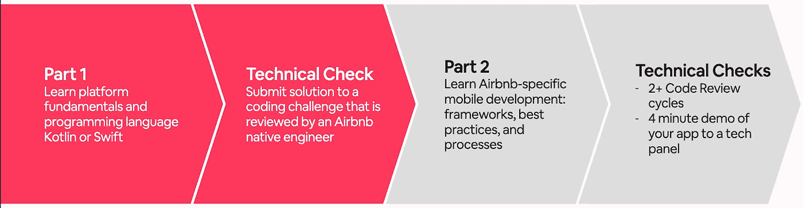

# 我们如何让 Airbnb 团队成员像移动工程师一样编码

> 原文：<https://medium.com/airbnb-engineering/how-we-enable-airbnb-team-members-to-code-like-a-mobile-engineer-d7181a20399f?source=collection_archive---------2----------------------->

我们的点对点学习计划加速了移动工程的发展

# 介绍

作为 TechEd 团队的一员，我们团队的目标是通过持续的学习计划培养我们的技术人才。我们从事的最常见的项目之一是工程和数据科学团队的新员工入职培训。然而，我们也经常考虑工程组织的更广泛的需求，有时，创建更多的策划程序来解决这些需求。一个这样的项目，像移动工程师一样的代码，解决了日益增长的移动使用，因为它已经成为我们的顶级平台。我们需要扩展本地工程知识，以便能够提供卓越的用户体验并满足我们的业务需求。由于参与者、他们的团队和工程导师的时间投入，该计划是独特的。

# 怎么开始的

2019 年，83%的日活跃主机正在使用他们的移动设备访问 Airbnb。随着这一趋势的持续增长，我们的移动工程师对新功能和工作量的需求也在不断增加。我们的产品团队只有大约 100 名移动工程师，他们的工作和影响比我们目前拥有的工程师还要多。为了加快我们移动应用的产品开发，我们像移动工程师一样设计和发布代码。最初在 2020 年夏天试行，现在我们已经扩展到每个季度提供这种学习机会，迄今为止共有 45 名工程师参加了该计划。

为了更好地帮助人们有效地完成移动工作，我们设计了一套课程，涵盖平台基础知识、Airbnb 特定的移动技术堆栈和工作流程最佳实践。参与该计划的工程师准备在他们选择的平台上为我们的应用做出贡献——无论是 Android 还是 iOS 编写 Kotlin 或 Swift。

# 谁参与该计划？

为了让工程师加入该计划，我们要求经理出于业务或个人发展和兴趣的原因提名全职工程师。我们的团队倾向于后端和网络工程师的良好组合，只有少数本地工程师学习其他平台。他们最常接触的产品代码是 Java、Kotlin、Typescript 和 Ruby。

其他关键参与者是那些提供学习机会的人。如果没有我们本地工程社区的技术领导和指导，这个项目就不可能实现。我们 Airbnb 移动工程社区的三分之一通过指导参与者、编写代码实验室、促进 Airbnb 框架的闪电对话、完成代码审查和主持办公时间为该计划做出了贡献。

# 程序结构

课程设计分为两个阶段——平台基础知识和 Airbnb 特定的技术和移动工作流程。

在平台基础阶段，参与者花 5 天时间专注于原生开发基础，重点是 Airbnb 环境中的重要内容。工程师可以利用通过我们的订阅提供的各种自学，以及由我们的工程师推荐的公开资源。在这个阶段的最后，有一个技术检查点，进行代码审查；这是一个反思点，接收关于 Airbnb 移动代码库中重要的代码模式和概念的反馈。一旦通过，工程师就可以开始下一阶段的学习了，Airbnb 移动开发。

在剩下的 1.5 周，工程师们学习 Airbnb 特有的原生开发框架、最佳实践和流程。他们通过基于项目的学习来做到这一点；工程师根据我们的产品开发了一款应用。参与者通过利用 Airbnb 的一些[开源项目](https://airbnb.io/projects/)和内部框架来构建和学习。通过为我们的社区构建一些有意义的东西，这加速了学习过程，因为这与他们如何在生产中为应用做出贡献有关。

虽然在项目期间编写的大多数代码都没有投入生产，但我们确实有一个演示日，让学习者向工程经理和员工工程师小组展示他们的应用程序，展示他们构建的东西。该演示为参与者提供了一个很好的论坛，让他们可以看到他们的同行已经构建了什么，也让高级本地工程师在工程师准备为移动工作做出贡献时提供反馈和建议。该论坛为工程领导者提供了一个信号，表明参与者愿意为应用程序做出贡献。

# 师徒制

如果没有一群本土工程师提供的难以置信的指导，这个项目就不会成功。导师，我们称之为“eng buddies”，是 Airbnb 的全职移动工程师，他们通过让自己参与结对编程、非正式调试会话、空闲对话和代码审查来领导一小组参与者。毫无疑问，感谢导师的话语是我们最后庆祝活动的亮点，也是我们反馈调查中最常见的主题。

# 影响

自 2020 年 7 月的第一次队列以来，我们已经有 45 名参与者完成了该计划，他们总共将 180 多个 PRs 合并到了我们的移动代码库中。此外，一名工程师已经转为全职 iOS 职位。

报名参加该计划的大多数人之前都没有接触过原生开发，很少有人从原生工程角色来到我们这里学习其他平台(例如，一名 iOS 工程师学习 Android)。第一天，我们要求参与者提交一份项目前调查，以更好地了解他们的工程背景。其中一个问题是信心指数，从 1(不自信)到 10(自信)。不足为奇的是，只有 15%的人表示对将安全、可靠的代码发布到我们的移动代码库中很有信心。

经过 14 天像移动工程师一样的全职代码学习，90%的人有信心将代码发布到移动代码库。这是一个重大的转变！

这个图表显示了询问工程师的结果，“你对将代码发布到移动代码库有多少信心？”工程师可以用 1 到 10 的等级来回答，1 表示不自信，10 表示非常自信。左边的条柱是项目第一天的反馈总结(45 名参与者),右边的条柱是项目最后一天的总结。

迄今为止，我们已经从参与者和工程负责人那里获得了关于该计划影响的大量反馈。以下是一些反思:

> “通过这个项目，我有机会了解一般的 Android 开发以及 Airbnb 的具体框架。在 2.5 周的时间里，我从一个对 Android 开发一无所知的人变成了一个使用 Airbnb 技术栈在 Android Studio 中开发应用的人。最后收获很大。”

*—彦博，软件工程师*

> “从今天起，我们团队中所有过去的项目参与者都被分配到本地工程工作中。无法想象没有这个项目，我们怎么能成功。”

*—工程总监江查理*

我们期待像移动工程师一样扩大代码的影响，不仅通过每个季度继续提供新的项目群，还通过与 Airbnb 的[连接项目](/airbnb-engineering/inside-connect-airbnbs-engineering-apprenticeship-program-c26d6eb2768c)合作，开始为见习工程师提供移动培训。今年，我们还将尝试将该计划作为一种自助式按需学习机会。

# 加入我们吧！

[访问我们的职业页面](https://careers.airbnb.com/)查看可用的移动工程职位，或者作为软件工程师加入，像移动工程师一样注册代码，快速启动您的移动工程技能。要了解更多关于 Airbnb 的移动工作，请查看我们最近关于[加速移动 UI](https://fb.watch/4xY9iCzAAW/) 的技术演讲，并访问我们的[开源移动项目](https://airbnb.io/mobile/)。

# 承认

这个项目的成功有赖于 30 多名 Android 和 iOS 工程师的通力合作，他们为参与者、课程和我没完没了的问题提供支持，此外还有工程领导，他们通过投资我们工程师的才能来加速产品开发。