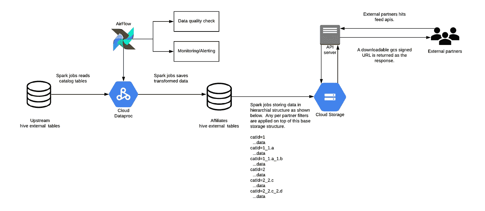
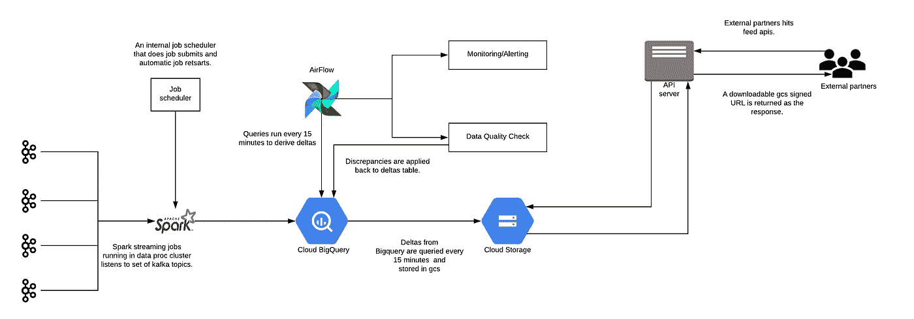

# 我们如何将产品和定价可用性提要作为 API 提供给外部合作伙伴

> 原文：<https://medium.com/walmartglobaltech/how-we-enabled-product-and-pricing-availability-feeds-as-apis-for-external-partners-a24448f976ca?source=collection_archive---------3----------------------->

Photo credit: [ReaxionLab](https://pixabay.com/illustrations/ecommerce-online-sales-sales-1706105/)

作为美国最大的杂货商，沃尔玛希望顾客能够在当地商店数字化购物，甚至在选择路边取货或送货之前就计划好行程。

我们来自子公司和 OpenAPI 工程团队。我们的团队致力于支持第三方整合，以推动沃尔玛的流量和转化率。我们的一个使用案例需要一个智能、高效的基础设施来处理数千家商店产品的可变性，从而有助于在未来与许多第三方整合，这些第三方可以帮助沃尔玛客户更好地将他们的生活与沃尔玛零售商整合在一起。

在这篇文章中，我将概述我们如何将产品和价格可用性信息作为外部合作伙伴的可下载提要。有了这些 API，沃尔玛的潜在客户可以在第三方出版商的应用程序/网站上为他们的本地商店发现产品，并可以直接将他们选择的商品添加到沃尔玛购物车。沃尔玛处理履行事宜，无论是路边取货还是送货。

# 概观

作为 feeds APIs 的一部分，我们提供了所有活动商店的产品元数据、产品定价和可用性信息的每日快照。除了快照，我们还每 15 分钟提供一次增量。合作伙伴的典型使用模式是使用快照来引导产品元数据和产品定价-可用性信息，然后每隔 15 分钟应用增量。

基于 Feeds 的集成非常适合批量数据交换。对于单个产品的积分查询，我们提供实时定价-可用性 API，可用于获取单个产品的最新数据。

所有的 API 都可以通过类别路径过滤，类别路径的列表通过我们的分类 API 公开。

# 关键设计考虑因素

以下是关键的设计考虑因素:

*   *解决一些现有 API 中出现的带宽问题，这些 API 提供从本地集群下载提要。*
*   *确保我们向外部合作伙伴公开的 API 的安全性。*
*   *确保我们公开的数据具有适当的质量，因为任何数据差异都可能导致不正确的状态，从而导致客户的购物车出错。*
*   *使 feeds APIs 成为多租户。需要多租户来确保只有给定合作伙伴可用的库存才包含在各自的 feed 或 API 中。可以把它看作是对库存信息的类别或项目级访问控制。*
*   *对管道进行监控和报警，以确保管道运行没有任何问题。*
*   *让提要可以按类别查询。*
*   *让合作伙伴的入职流程更加轻松。*

# 快照馈送 API 体系结构

快照馈送提供给定一天的产品目录元数据和产品定价-可用性信息的快照。以下是相同的高级架构:

产品目录和定价可用性数据是从许多管理库存信息的上游系统中收集的。几个气流火花作业收集上游数据，并在配置单元表中转换成一致的规范化表示。

该系统的早期版本(具有部分功能)驻留在内部托管的 Hadoop 部署中。有趣的是，随着系统利用 GCP 和优化 Spark 作业，我们观察到了显著的性能改善——我们观察到，由于在 GCP 运行的管道和优化的 Spark 作业，处理时间减少了 75%。

Google 云存储被用作向外部合作伙伴公开的提要的存储层。数据存储在分层结构中，并按 categoryId(给定产品所属类别的标识符)进行分区。基于类别的分区允许我们利用 GCP 存储访问控制来实施按合作伙伴的库存筛选—只有为给定合作伙伴启用的类别位置才会向该合作伙伴公开。

当合作伙伴对提要进行 API 调用时，会根据合作伙伴的配置为提要数据生成一个可下载的 google 云存储签名 url，并在响应中返回。合作伙伴可以从 google 云存储签名的 url 下载提要数据。这解决了我们在从本地集群下载提要时遇到的带宽问题。通过在 API 网关启用必要的身份验证和授权机制，以及通过为数据馈送提供 google 云存储签名的 url(该 URL 在预配置的时间后过期),可以保证馈送 API 的安全性。

以下是 google 云存储签名 url 的参考文档。

 [## 已签名的网址|云存储|谷歌云

### 本页概述了已签名的 URL，您可以使用这些 URL 向中的任何人授予有时间限制的资源访问权限…

cloud.google.com](https://cloud.google.com/storage/docs/access-control/signed-urls) 

如果任何 Dag 中存在任何故障，在气流中运行的监控和警报管道将发送松弛/电子邮件警报。

## 作为快照数据质量检查的一部分，我们执行以下操作:

*   *如果百分比差异超过预先配置的阈值，则生成的数据中的任何异常都会发出警报。*
*   *我们还确保馈送文件具有正确的格式、模式，以及是否存在所有必需的值，作为数据质量检查的一部分。随着时间的推移，我们将观察趋势，希望在这一数据质量检查管道的基础上建立更多的功能。*

# Delta feed API 架构

增量提要 API 提供了产品定价-可用性信息的增量。可下载的 feed 文件每小时转储一次，转储每 15 分钟更新一次。高级架构如下所示:

三角洲输送管道完全在 GCP 境内运行。我们听取一系列 Kafka 的上游话题，以确定产品的定价-可用性。dataproc 集群中运行的 Spark 结构化流作业用于监听 kafka 主题，并将转换后的数据存储在 BigQuery 的基表中。具有增量管道的 AirFlow DAG 每 15 分钟运行一次，增量是通过对 BigQuery 中的基本表和快照表运行 sql 查询获得的，并存储回 BigQuery 中的增量表。

从 BigQuery 查询增量，每 15 分钟更新一次每个合作伙伴的可下载提要。增量也存储在基于 categoryId 的分层结构中，并且可以针对每个 categoryId 进行查询。

当合作伙伴查询增量时，会提供一个可下载的 google 云存储 url，类似于 snapshot feed 架构中描述的内容。合作伙伴还可以从特定的日期/小时获取每日/每小时的增量。

监控和警报可确保流作业和气流中的增量管道持续运行，并且增量生成没有任何延迟。对于任何故障/延迟，都会提供松弛/电子邮件提醒。监控流式作业的调度程序会在作业停止时自动重新启动流式作业。

## 作为增量数据质量检查的一部分，我们执行以下操作:

*   *每 15 分钟运行一次的数据质量检查将我们生成的增量与实时价格-可用性 API 进行比较，并提醒任何发现的差异。这有助于我们主动排除任何数据差异，并在需要时应用修复。*
*   *我们每天从 BigQuery 生成一次 deltas 表的快照，并将其与上游表进行比较，并警告任何发现的差异。这样做的目的是对差异进行故障排除，并在需要时将不匹配应用回 BigQuery 增量表。*
*   *我们还确保 deltas feed 文件具有正确的格式、模式，以及是否存在所有必需的值，作为数据质量检查的一部分。随着时间的推移，我们将观察趋势，希望在这一数据质量检查管道的基础上建立更多的功能。*

# 结论

*   进料管道的一个非常重要的部分是确保所提供的进料数据尽可能准确。通过与各种上游团队讨论，制定适当的设计帮助我们实现了这一目标。
*   一个可重复使用的管道监控和警报框架帮助我们确保管道运行没有任何问题。
*   数据质量检查层帮助我们识别我们作为馈送的一部分生成的数据中的任何差异，并采取必要的措施。
*   利用 GCP 运行我们的数据管道和优化的 Spark 作业也有助于加快我们的最终快照生成，整个过程在 2 小时内完成。
*   利用 GCP 提供可下载的提要(带有 google 云存储签名的 URL)帮助我们解决了从内部基础设施下载提要时遇到的一些带宽问题。
*   为了确保向外部合作伙伴公开的 API 的安全性，我们考虑了一些重要因素，包括在 API gateway 和 google 云存储签名的 URL 上为 API 启用必要的身份验证和授权机制，用于在预配置时间后过期的数据馈送。
*   通过使用基于 API 的方法来提供提要，新合作伙伴的加入变得更加容易。