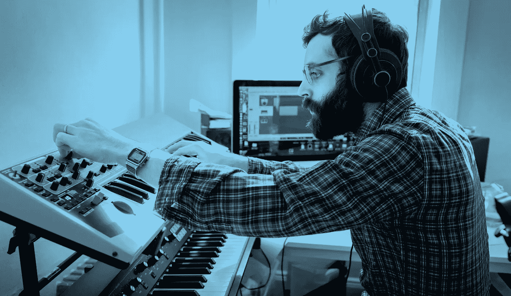

# 我们如何让 Alexa 加入我们在 TechCrunch Disrupt 的乐队

> 原文：<https://medium.com/capital-one-tech/how-we-got-alexa-to-join-our-band-at-techcrunch-disrupt-133865f8369b?source=collection_archive---------3----------------------->

软件工程师 Ardon BaileyNagkumar Arkalgud，软件工程师；
Timothy Street，第一资本公司软件工程师助理

首都一号博客的音乐制作？绝对的。我们在 Capital One 有许多软件工程师，他们也热衷于使用他们的技术技能来制作优秀的音乐。

今年早些时候，我们(Tim Street、Nagkumar Arkalgud 和 Ardon Bailey)参加了旧金山的 TechCrunch Disrupt Hackathon，希望设计出一种可以让唱片艺术家创作音乐的东西——只使用他们的声音。结果是 Odis，一个与亚马逊 Alexa 接口并将自然语言指令转换为 MIDI(音乐乐器数字接口)命令的平台。借助 Odis，音乐制作人可以在录音室录音软件中实时录制、回放和编辑曲目(歌曲)。

Odis 在黑客马拉松上大受欢迎，不仅[登上了 TechCrunch.com](https://techcrunch.com/2017/09/17/odis-brings-alexa-voice-commands-to-music-production/)，而且[还获得了亚马逊 Alexa 奖](https://devpost.com/software/odis)。

## 一定有更好的方法

在 Ardon Bailey 成为 Capital One 的软件工程师之前，他是一名 DJ/Tablist，经常参加 DJ 比赛，并在音乐会和派对上表演。在创作某些曲目时，他发现手里拿着乐器录音很不方便。例如，在弹奏吉他时，录制声音的步骤如下:

1.  握着吉他，准备演奏
2.  通过在录制软件中物理触发录制来开始录制
3.  尽快重新定位以弹奏吉他
4.  演奏，直到您对声音满意为止
5.  尽快按下停止录制

计算机和仪器之间的来回例行程序可能相当乏味，尤其是在长时间的会话中。如果这还不够的话，仪器经常会在物理上造成障碍。除非周围有人伸出援手，否则这些步骤都是你自己完成的。

输入 Odis 的想法。当我们为我们的黑客马拉松项目集思广益时，我们知道我们想要创造一些让赛道创建过程尽可能简单的东西。我们的首要任务是:让艺术家更方便地在他们选择的环境中创作内容。为了满足这一限制，我们需要一些易于集成到现有录音系统中的东西。因此，我们的解决方案是创建一个免提、声控录音助手。

**使用 Odis，在吉他上录音变得简单:**

1.  握着吉他，准备演奏
2.  说:“Alexa，让 Odis 开始录音”
3.  演奏，直到您对声音满意为止
4.  说:“Alexa，请 Odis 停止记录”

因为录音完全由声音控制，艺术家可以专注于重要的事情:音乐。录音室录音软件的控制权实际上是从艺术家手中拿走的，交给了 Alexa，他做了所有繁重的工作。

旁注:Odis 还实现了录音室录音软件中常见的其他功能，如声音回放、添加和删除 MIDI 效果等。理论上，MIDI 库中支持的任何东西都是公平游戏。

## **架构**

Odis 背后的架构很简单，可以在许多不同的 Daw(数字音频工作站)上实现。由于 Odis 的 Alexa 语音命令可以解析为 MIDI 指令，因此很容易与大多数 Daw 集成。

Sketch of the Odis Architecture

**Odis 有三个主要组成部分:**

1.Alexa Skill (Python)
我们决定使用触发 Lambda 的 Alexa Skills Kit 作为我们与 Odis 的接口。Lambda 是用 Python 编写的，负责解释自然语言指令、格式化 HTTP 请求有效负载，然后使用 Pusher 将它们发送到客户端应用程序(运行在用户的计算机上)。

2.Pusher
Pusher 是 Odis 背后架构的核心部分。在高层次上，它基本上将 RESTful web 请求翻译成 WebSocket 上的消息。因为 Pusher 处理与通过 WebSocket 打开和关闭连接相关的所有逻辑，所以我们所要做的就是在 Alexa Skills Kit Lambda 中添加对 Pusher 的调用，并在 MIDI 客户端中添加功能，以便它可以侦听通过互联网传入的请求。因为 Pusher 是免费的，并为我们做了大部分工作，这是一个很容易的决定，使它成为我们之间的 Alexa 和客户的沟通工具。

3.MIDI 客户端(node . js)
MIDI 客户端与用户电脑上的录音室录音软件一起运行。客户端包装 MIDI 库，并通过 WebSocket 监听来自 Alexa Skills Kit Lambda 的传入请求。当收到请求时，根据内容，特定的 MIDI 指令被发送到客户端正在使用的任何录音软件。

## **克服挑战**

我们在创建 ODI 时遇到了许多障碍。

1.为 AWS Lambda
创建部署包虽然 Amazon 为 Lambda 创建部署包的文档看起来简单明了，但对我们来说还不够全面。我们遇到了麻烦，包括一些第三方库和必要的配置，以我们想要的方式运行 Odis。令人欣慰的是，该团队能够联系到一位已经在 Lambda 产品中创建部署包的同事。我们打电话给他，他很乐意帮助我们粉碎这个路障。谢谢崔！

2.用于 AWS Lambda
的 Python 2.x 中的 SSL 问题当我们创建部署包并试图通过 Pusher 发送推送通知时(即从 Lambda 发送 RESTful HTTPS 请求)，请求无法完成。经过故障排除，我们发现 Lambda 使用自己的安全模块，而不是部署包中上传的那些模块。我们通过将 2.x Python 代码库转换为 3.6 版本解决了这个问题，3.6 版本遵循不同的部署包依赖标准。改变之后，一切都“神奇地”工作了！

3.在我们看来，Odis 中最酷的功能之一是能够给之前录制的音乐添加预定义的效果。我们想让它在命令“Alexa，请 Odis 添加效果”上工作。不管我们怎么测试，这个短语的触发器都不会起作用。事实证明，Alexa 在其语言检测算法中混淆了“影响”和“效果”的发音，我们不得不将短语“最后一分钟”改为“Alexa，请 Odis 添加酷”。

## **Odis 的未来**

展望未来，我们希望开发其他 DAW(数字音频工作站),并可能开发一个桌面应用程序，为不同的 DAW 运行一个脚本来配置 MIDI 控件的映射。

*以上观点为作者个人观点。除非本帖中另有说明，否则 Capital One 不属于所提及的任何公司，也不被其认可。使用或展示的所有商标和其他知识产权都是其各自所有者的所有权。本文为 2017 首都一。*