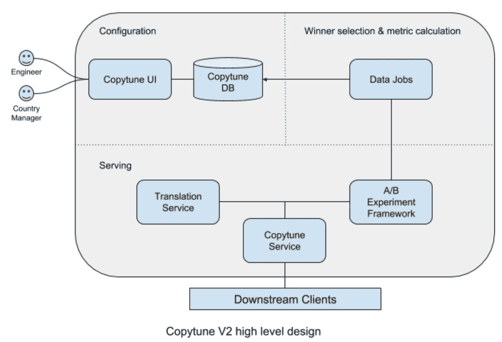
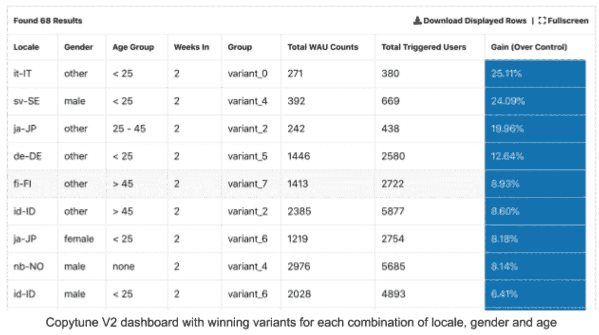

# 我们如何使用自动个性化副本测试来提高参与度

> 原文：<https://medium.com/pinterest-engineering/how-we-increased-engagement-using-automatic-personalized-copy-testing-a229f99d77ea?source=collection_archive---------3----------------------->

贾雪峰| Pinterest 工程师，成长

想想你最近一次访问网站的情形。有没有一个词让你着迷？现在想一想，如果你说不同的语言，年龄不同，或者在你国家的不同地方长大，情况会有什么不同。如果有一种工具可以为所有用户自动优化这些词，会怎么样？这就是我们用内部复制测试框架 [Copytune](/@Pinterest_Engineering/how-we-increased-active-pinners-with-one-simple-trick-a157f0a527b9) 构建的。找到正确的挂钩可能是用户选择使用你的网站还是在做出决定的瞬间继续前进的区别。

Copytune 是 Pinterest 的第一个复制测试框架，允许快速简单地测试显示给 Pinners 的不同文本变体。然而，最初的版本有一些痛点，我们看到了改进的机会。例如，Copytune 实验需要工程师来设置它们，并且只在每种语言的基础上优化副本。这意味着我们错过了有用的细分，并且结果并不总是可信的。在本帖中，我们将解释我们是如何吸取这些经验并构建出 Copytune V2 来进一步优化文案并提高参与度的。

# 复制 V2 目标

我们在构建 Copytune V2 时有几个目标:

1.  根据地区、性别和年龄优化文案。看着我们从优化每种语言中获得的收益，我们意识到其他分段可能也是有用的。
2.  用已翻译的本地化变体复制测试。通常，copy 会针对所有可用的语言环境进行翻译和测试，但有时您可能希望针对比翻译者拥有更多上下文的特定语言环境进行测试。
3.  同时对相关字符串组启用复制测试。有助于传达或阐述相同信息的字符串组是内在相关的，有时单独对它们进行复制测试是没有意义的。
4.  让工程师和非工程师无缝地创建一个复制实验。运行一个实验不应该需要修改代码。
5.  一旦实验获得足够的流量，自动为每个地区、性别和年龄段选择获胜的变体。如果一个细分市场没有显示出显著的积极结果，我们将不会发货，并将继续提供控制变量。

# 建筑 V2

为了实现这些目标，我们在 [Pinterest 现有的 A/B 实验平台](/@Pinterest_Engineering/building-pinterests-a-b-testing-platform-ab4934ace9f4)上构建了 Copytune V2，并使用 [Mojito](https://github.com/box/mojito) 来集中并实现所有副本的持续本地化。

首先，我们代码库中的所有字符串都必须加载到 Mojito 中，这样 Copytune V2 就会知道哪些字符串对于实验是有效的。用户可以通过搜索所有有效的字符串并设置一些配置来创建一个实验。我们构建了这个系统，因此所有字符串都必须通过 Copytune V2，它会检查是否正在为该字符串运行实验，以及用户的地区、性别和年龄范围(如果可用)。基于此，Copytune V2 要么提供字符串的变体，要么提供 Mojito 的正确翻译。在翻译字符串或创建实验时，翻译和实验会实时更新，而夜间作业会收集所有相关数据并计算每个运行实验的指标。

# 了解结果

由于 Copytune V2 实验可以在如此多的不同领域进行，因此有一种简洁的方法来了解哪些变体表现良好是至关重要的。我们编写了夜间数据作业，可以自动计算每个地区、性别和年龄组合的当前获胜变量。这些数据随后会出现在一个易于使用的 UI 中，使非技术用户能够独立于工程师工作。

有时候成功的结果不一定是高质量的。在某些情况下，表现最好的变体是品牌以外的，因此我们实现了一个功能，让实验创建者手动取消选择获胜的结果，并阻止它们提供给最终用户。

# 影响

在发布 Copytune V2 之后，我们与各种工程师合作进行实验并了解它的影响。第一批实验的主要目的是优化电子邮件主题行和内容中的副本，这些内容在过去已经过副本测试。我们发布的前九个实验使我们的 WAU(每周活跃用户)增加了 0.67%以上。这是一个巨大的胜利，因为这一收获是 Copytune V2 的新功能提供了超过以前优化的副本的附加值。进行复制实验的成本足够低，我们希望继续看到显著的积极影响。

# 经验教训

在建设 V2 科韵的过程中，我们学到了一些宝贵的经验。

*   买入。当试图构建一个健壮且有用的复制测试平台时，最困难的部分之一是理解什么实际上会使平台有用且健壮。我们可以做(或不做)的事情数不胜数，从所有潜在用户那里获得认同有助于我们理解工程师和非技术同事的实际痛点。
*   **确保数据可信**。这是一个反复出现的问题。积极的结果和参与度的提高只有在你能证明它们确实发生的时候才是好事，尤其是因为每个 Copytune V2 实验都必须处理地区、性别和年龄的划分。如果没有值得信赖的数据和结果，如果不能准确评估，即使是最好的副本测试也可能失败。

# 展望未来

要进一步简化复制测试的过程，还有很多工作要做。一个想法是给我们如何分割实验增加更多的定制。目前，Copytune V2 的实验只能按地区、性别和年龄来划分。例如，一些用户可能更关心用户的活跃程度，而不是他们的位置。另一个重点领域是实验过程的完全自动化。目前，当有足够的数据来自信地选择获胜者时，用户仍然必须手动增加 Copytune V2 实验并关闭它们。该过程可以自动完成，以进一步提高复制测试速度。我们还计划扩大 V2 支持的客户群。我们目前支持网络和移动网络，并希望增加 iOS，Android 和 AMP。

*鸣谢:感谢 Rajath Prasad、Jean Aurambault 和 Chidinma Egbukichi 对 Copytune V2 的研究和帮助。约翰·埃根、朱莉·特里尔、成田光一郎、朱婷婷、凯特·泰勒和弗朗切斯卡·迪马尔科，感谢他们的指导和对发展进程的宝贵贡献。*