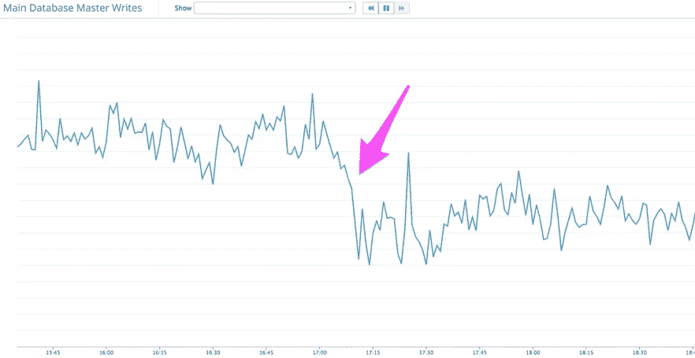

# 我们如何在两周内对 Airbnb 的主数据库进行分区

> 原文：<https://medium.com/airbnb-engineering/how-we-partitioned-airbnb-s-main-database-in-two-weeks-55f7e006ff21?source=collection_archive---------0----------------------->

由[威利·姚](https://medium.com/u/3f589e8091c9?source=post_page-----55f7e006ff21--------------------------------)

> “缩放=在以 100 英里/小时的速度行驶时更换汽车的所有部件”——Mike Krieger，Instagram 联合创始人@ [Airbnb OpenAir 2015](https://www.youtube.com/watch?v=oNA2C1vC8FQ)

*Airbnb peak traffic grows at a rate of 3.5x per year, with a seasonal summer peak.*

随着 2015 年夏季旅行季节的到来，Airbnb 的基础设施团队正在努力扩展我们的数据库，以处理预计的创纪录的夏季流量。一个特别有影响力的项目旨在按应用程序功能将某些表划分到它们自己的数据库中，这通常需要在应用层更改、数据迁移和可靠测试方面进行大量的工程投资，以保证数据一致性和最小的停机时间。为了节省数周的工程时间，我们的一位[杰出工程师](https://github.com/schleyfox)提出了一个有趣的想法，利用 MySQL 复制来完成保证数据一致性的困难部分。(这个想法被单独列为亚马逊 RDS 的“读取副本提升”功能的[明确用例](http://aws.amazon.com/about-aws/whats-new/2012/10/11/amazon-rds-mysql-rr-promotion/)。)通过容忍数据库升级期间短暂且有限的停机时间，我们能够在不编写任何簿记或迁移代码的情况下执行此操作。在这篇博文中，我们将分享一些我们的工作和我们在这个过程中学到的东西。

# 首先，一些背景

我们倾向于同意我们在 [Asana](https://eng.asana.com/2015/04/sharding-is-bitter-medicine/) 和 [Percona](https://www.percona.com/blog/2009/08/06/why-you-dont-want-to-shard/) 的朋友的观点，即水平分割是一剂苦药，因此我们更喜欢通过应用程序功能进行垂直分区，以分散负载和隔离故障。例如，我们有专用的数据库，每个都运行在自己专用的 RDS 实例上，一对一地映射到我们独立的 Java 和 Rails 服务。然而，由于历史原因，我们的许多核心应用程序数据仍然保存在 Airbnb 还是一个单一的 Rails 应用程序时的原始数据库中。

使用我们内部构建的客户端查询分析器(由于 RDS 的限制，它是客户端)来分析我们的数据库访问模式，我们发现 Airbnb 的消息收件箱功能(允许客人和主人进行通信)占了我们主数据库中近 1/3 的写入。此外，这种写模式随着流量线性增长，因此对它进行分区对于我们主数据库的稳定性来说是一个特别大的优势。由于它是一个独立的应用程序功能，我们也相信所有跨表连接和事务都可以消除，所以我们开始优先考虑这个项目。

在检查我们对这个项目的选择时，两个现实影响了我们的决策。首先，我们上一次对数据库进行分区是在三年前的 2012 年，因此以我们目前的规模进行这项操作对我们来说是一个新的挑战，我们愿意以计划内停机为代价最大限度地降低工程复杂性。其次，当我们带着大约 130 名软件工程师进入 2015 年时，我们的团队分布在一个很大的产品表面区域——从个性化搜索、客户服务工具、信任和安全、全球支付，到假设连接有限的可靠移动应用——只留下一小部分工程专用于基础设施。考虑到这些因素，我们选择利用 MySQL 复制来最小化工程复杂性和所需的投资。

# 我们的计划

决定使用 MySQL 的内置复制来为我们迁移数据意味着我们不再需要自己构建最具挑战性的部分来保证数据一致性，因为复制是一个经过验证的量。我们在 Amazon RDS 上运行 MySQL，因此创建新的读取副本和将副本升级为独立的主服务器很容易。我们的设置如下所示:

我们从我们的主数据库创建了一个新的副本(message-master ),它将在升级后作为新的独立主数据库。然后，我们附加了一个第二层副本(消息副本),作为消息主服务器的副本。问题是[提升过程可能需要几分钟](http://docs.aws.amazon.com/AmazonRDS/latest/UserGuide/USER_ReadRepl.html#USER_ReadRepl.Promote)或更长时间才能完成，在此期间，我们必须故意不对相关表进行写操作，以保持数据一致性。考虑到由于不堪重负的数据库造成的站点范围的停机时间比本地化和受控的邮件收件箱停机时间要昂贵得多，该团队愿意做出这种折衷，以减少数周的开发时间。值得一提的是，对于那些运行自己的数据库的人来说，[复制过滤器](https://dev.mysql.com/doc/refman/5.7/en/change-replication-filter.html)可以用来避免复制不相关的表，并可能减少升级周期。

# 第一阶段:预先规划

迁移后，将邮件收件箱表移动到新的数据库可能会导致现有的跨表连接查询无效。因为数据库升级无法恢复，所以此操作的成功取决于我们识别所有此类情况并弃用它们或用应用内连接替换它们的能力。幸运的是，我们的内部查询分析器允许我们轻松地识别大多数主要服务的此类查询，并且我们能够撤销对剩余服务的相关数据库权限授予，以获得完全覆盖。我们在 Airbnb 努力实现的架构原则之一是，服务应该拥有自己的数据，这将大大简化这里的工作。虽然技术上很简单，但这是项目中最耗时的阶段，因为它需要跨团队的良好沟通。

接下来，我们有一个非常广泛的数据管道，支持离线数据分析和下游生产服务。因此，预规划的下一步是移动所有相关管道来使用消息副本的数据导出，以确保我们在升级后使用最新的数据。我们的迁移计划的一个副作用是新数据库将与我们现有的数据库同名(不要与我们的 RDS 实例的名称混淆，例如 message-master 和 message-replica ),即使数据在升级后会有差异。然而，这实际上允许我们在数据管道中保持命名约定的一致性，所以我们选择不进行数据库重命名。

最后，因为我们的主要 Airbnb Rails 应用程序拥有对这些表的独占写访问权限，所以我们能够将所有相关的服务流量交换到新的消息数据库副本，以降低主要操作的复杂性。

# 第二阶段:行动

*Members of the Production Infrastructure team on the big day.*

一旦所有的预先计划工作完成，实际操作如下:

1.  与我们的客户服务团队沟通计划中的 10 分钟以下收件箱停机时间。我们非常敏感地认识到，任何停机时间都可能让客人在尝试入住 Airbnb 时滞留在国外，因此，保持所有相关功能处于循环中并在每周客流量最低时执行操作非常重要。
2.  部署对邮件收件箱查询的更改，以使用新的邮件数据库用户授权和数据库连接。在这个阶段，我们仍然将写操作指向主要主机，而读操作则指向消息副本，因此这应该不会对外部产生影响。然而，我们将这一步延迟到 op 开始，因为它将主主机的连接增加了一倍，所以我们希望这一阶段尽可能短。在下一步中交换数据库主机不需要部署，因为我们有配置工具来更新 Zookeeper 中的数据库主机条目，在这里它们可以被 [SmartStack](http://nerds.airbnb.com/smartstack-service-discovery-cloud/) 发现。
3.  将所有消息收件箱写入流量交换给消息主机。因为它尚未升级，所以在新主节点上的所有写入都会失败，我们开始计算停机时间。虽然 reads 查询会成功，但实际上，在此阶段几乎所有的消息传递都会停止，因为将消息标记为 read 需要 db write。
4.  使用步骤 2 中介绍的消息 database user 终止主服务器上的所有数据库连接。通过直接终止连接，而不是执行部署或群集重启，我们最大限度地减少了将所有写入移动到将充当新主服务器的副本服务器的时间，这是复制跟上的先决条件。
5.  通过检查以下内容来验证复制是否已跟上:a)邮件主服务器和邮件副本服务器上所有邮件收件箱表中的最新条目。b)主主机上的所有消息连接都消失了。c)在报文主机上建立新的连接
6.  提升消息主。根据我们的经验，在 RDS 上进行升级期间，数据库会完全关闭大约 30 秒，在此期间，主服务器上的读取会失败。但是，写入将失败近 4 分钟，因为在启动升级后，大约需要 3.5 分钟才能生效。
7.  在下一个 RDS 自动备份窗口之前，在新提升的消息主机上启用[多 AZ 部署](http://docs.aws.amazon.com/AmazonRDS/latest/UserGuide/Concepts.MultiAZ.html)。除了改进的故障转移支持，Multi-AZ 还最大限度地减少了 RDS 快照和备份期间的延迟峰值。
8.  一旦所有的指标看起来都不错，数据库也稳定了，就在各自的数据库中删除不相关的表。这一总结步骤对于确保没有服务消耗陈旧数据非常重要。

如果操作失败了，我们将会恢复 Zookeeper 中的数据库主机条目，并且消息收件箱功能几乎会立即恢复。然而，我们将会丢失任何写入现在独立的消息数据库的内容。从理论上讲，回填来恢复丢失的消息是可能的，但是对于我们的用户来说，这将是一个不小的努力和困惑。因此，在执行 op 之前，我们对上述每个步骤进行了稳健的测试。

# 结果呢

*Clear drop in main database master writes.*

从端到端来看，这个项目花了大约两周时间完成，邮件收件箱停机时间不到 7 . 5 分钟，主数据库的大小减少了 20%。最重要的是，这个项目通过将主数据库上的写查询减少 33%,为我们带来了显著的数据库稳定性收益。这些卸载的查询预计将在未来几个月内再增长 50%，这肯定会使我们的主数据库不堪重负，因此该项目为我们赢得了宝贵的时间来进行更长期的数据库稳定性和可伸缩性投资。

# 令人惊讶的是:RDS 快照会显著增加延迟

根据 [RDS 文档](http://aws.amazon.com/rds/details/multi-az/):

> *与单 AZ 部署不同，在 MySQL、Oracle 和 PostgreSQL 引擎的多 AZ 部署的备份过程中，主服务器上的 I/O 活动不会暂停，因为备份是从备用服务器进行的。但是，请注意，在多 AZ 部署的备份过程中，您仍可能会经历几分钟的延迟。*

我们通常在 RDS 的所有主实例上启用多 AZ 部署，以充分利用 RDS 的高可用性和故障转移支持。在这个项目中，我们观察到，如果数据库负载足够重，即使部署了多 AZ，在 RDS 快照过程中经历的延迟也会非常大，足以造成查询积压并使数据库停机。我们一直都知道快照会导致延迟增加，但在此项目之前，我们没有意识到相对于数据库负载的延迟非线性增加可能会导致完全停机。

鉴于 RDS 快照是我们日常自动备份所依赖的核心 RDS 功能，这一点非常重要。之前我们不知道的是，随着主数据库负载的增加，RDS 快照导致站点不稳定的可能性也在增加。因此，在进行这个项目的过程中，我们意识到它比我们最初预期的更为紧迫。

*Xinyao, lead engineer on the project, celebrates after the op.*

**致谢:**胡新耀领导了这个项目，我在本休斯和索尼克王的指导下编写了最初的计划。Brian Morearty 和 Eric Levine 帮助重构代码以消除跨表连接。生产基础设施团队度过了一个愉快的下午。

查看来自[生产基础设施](https://www.airbnb.com/careers/departments/position/9572)团队的更多过去的项目:

*   [【说话】缩放不缩放的东西](https://www.youtube.com/watch?v=F-QNTyAek6c)
*   [【开源】Hammerspace:持久、并发、堆外存储](http://nerds.airbnb.com/hammerspace-persistent-concurrent-off-heap-storage/)
*   [【开源】SmartStack:云中的服务发现](http://nerds.airbnb.com/smartstack-service-discovery-cloud/)
*   [Airbnb 的尸检](http://nerds.airbnb.com/postmortems-airbnb/)

## 在 [airbnb.io](http://airbnb.io) 查看我们所有的开源项目，并在 Twitter 上关注我们:[@ Airbnb eng](https://twitter.com/AirbnbEng)+[@ Airbnb data](https://twitter.com/AirbnbData)

*原载于 2015 年 10 月 6 日*[*nerds.airbnb.com*](http://nerds.airbnb.com/how-we-partitioned-airbnbs-main-db/)*。*