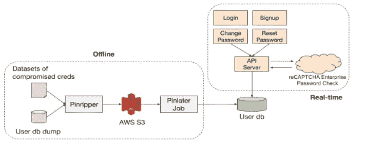
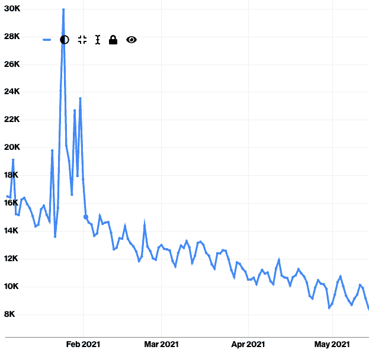
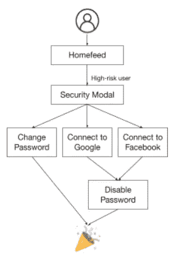
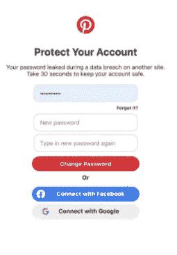
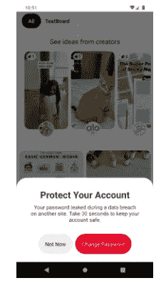
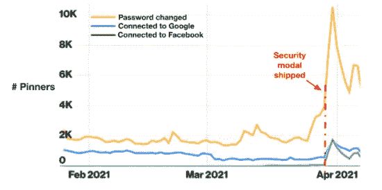

# 我们如何保护 Pinners 的密码

> 原文：<https://medium.com/pinterest-engineering/how-we-protect-pinners-passwords-e769135734d?source=collection_archive---------0----------------------->

邵玉茹|软件工程师

软件工程师

Amine Kamel |生产安全主管

在 Pinterest，我们确保账户安全的一种方法是保护 Pinners 的密码。由于各种原因，密码可能会有问题，包括人们倾向于重复使用他们的密码，选择容易记住的密码，以及与他人共享组成他们的密码的详细信息或他们的实际密码。因此，解决这些问题以提供安全、愉快的 Pinterest 体验并不是一件容易的事。在本帖中，我们将深入探讨一些我们用来实现这一目标的技术。

# 主动检测受损凭证

多年来，许多[网站已经泄露了用户凭证](https://haveibeenpwned.com/PwnedWebsites)，这使得凭证填充攻击成为可能。通过密码保护 Pinner 帐户涉及到识别最易受攻击的用户，即那些凭据受损的用户。这是通过合并离线数据集和实时检查来检测具有受损凭据的 Pinner 帐户来实现的。图 1 展示了我们的整体方法。

**Figure 1\. Detecting compromised credentials and flagging high-risk users**

# 离线数据集

Pinripper 是我们内部开发的工具，有助于检测泄露凭据的 Pinterest 用户。它的工作原理是摄取 Pinterest 用户凭据和已知的受损凭据的记录，然后尝试在两者之间找到用户匹配。正确识别的匹配首先基于电子邮件匹配，然后是这些电子邮件匹配的密码的 bcrypt 散列之间的匹配。然后，Pinripper 将这些被识别的 Pinners 的 id 上传到 S3 桶，在那里 pin later——我们在 Pinterest 的异步作业调度服务——标记它们以进行风险评估。

# reCAPTCHA 密码检查

离线数据集的整合极大地帮助我们检测高风险用户。然而，主要的限制是我们不能实时地利用用户的行为来保护那些使用泄露/破坏密码的人。为了解决这个问题，我们集成了谷歌的 [reCAPTCHA 企业密码检查 API](https://cloud.google.com/recaptcha-enterprise/docs/check-passwords) 来动态确定具有受损凭证的 Pinners。该集成涵盖了用户流程，包括登录、注册、密码更改和密码重置。我们如何利用此功能来利用用户参与的一个示例是，通过已知的受损凭据阻止密码重置和密码更改。类似于离线方法，我们将这些结果考虑在内，并更新用户数据库，以标记这些所谓的高风险用户。

# 高风险账户的保护

除了检测高风险 Pinner 帐户之外，我们还为具有已知高风险帐户的 pin ner 提供特定保护。

## 计划性保护

通过我们的信任与安全团队，我们实施了在发现可疑活动时自动保护高风险用户的规则，以限制账户接管(ATOs)。例如，如果一个高风险用户帐户从我们未知的新设备登录，我们会立即将该帐户置于保护模式，使所有用户会话无效，并发送电子邮件通知。如图 2 所示，2021 年 2 月，我们每天以编程方式保护超过 12，000 名用户。随着越来越多的用户采用订婚保护，这个数字还在不断下降。

**Figure 2\. Number of accounts protected programmatically**

## 接合保护

我们还为那些拥有已知高风险账户的 Pinners 提供特定的参与保护。这是在最小化摩擦和优化用户体验的同时完成的。我们不是强迫所有拥有高风险账户的 pinner 更新他们的密码，而是在登录时仅触发这些特定的 pinner 进入特定的“体验”。根据他们登录的平台，只要我们确信他们是其帐户的真正所有者，高风险用户就会在他们的主页上看到一种横幅，提示他们保护自己的帐户。

图 3 显示了用户参与是如何工作的。当 Pinner 访问他们的主页时，我们会检查他们是否被标记为高风险用户。如果是，则显示安全模式(如图 4a 所示)或安全提示(如图 4b 所示)。Pinner 可以选择更改他们的密码或连接到他们的社交媒体帐户。如果他们选择通过单点登录(SSO)提供商登录来保护他们的帐户，我们会禁用他们的 Pinterest 密码，将来他们可以使用他们的谷歌/脸书会话登录。

**Figure 3\. Leveraging user engagement to protect account**

**Figure 4a. Security modal on web**

**Figure 4b. Security prompt on mobile**

在我们将安全模型发布到 web 上之后，我们看到采取行动的 Pinners 数量大幅增加，如图 5 所示。这是 Pinners 愿意参与保护的明显证据。

**Figure 5\. Number of users engaged in protections**

## Chrome 密码保护

Chrome 在 2021 年 1 月发布了[新的密码保护功能](https://security.googleblog.com/2021/01/new-year-new-password-protections-in.html)。我们立即采取行动，确保我们的产品是兼容的。具体来说，Chrome 会标记泄露的密码，以及用户存储的弱密码，并将用户重定向到该网站的密码更改页面。在我们的例子中，根据 Pinner 是否已经登录，他们将被重定向到更改或重置密码页面。

# 经验教训

随着数据泄露和密码破解工具日益复杂，保护您的密码对您的帐户安全至关重要。

我们对用户的建议是:

1.  不要在不同的站点重复使用密码
2.  使用密码管理器(对网络钓鱼也有效！)
3.  为您的敏感帐户启用双因素身份认证(2FA)，最好是快速在线身份认证(FIDO)

如果您是安全从业者，强烈建议您:

1.  为您的用户主动检测受损的凭据
2.  激励你的用户(鼓励他们使用更强的密码，建议他们打开 2FA，等等。)来提高他们的帐户安全性
3.  对可疑的帐户活动采取措施，并主动保护用户

*要在 Pinterest 了解更多工程知识，请查看我们的* [*工程博客*](https://medium.com/pinterest-engineering) *，并访问我们的*[*Pinterest Labs*](https://labs.pinterest.com/)*网站。要查看和申请空缺职位，请访问我们的* [*职业*](https://www.pinterestcareers.com/homepage) *页面。*