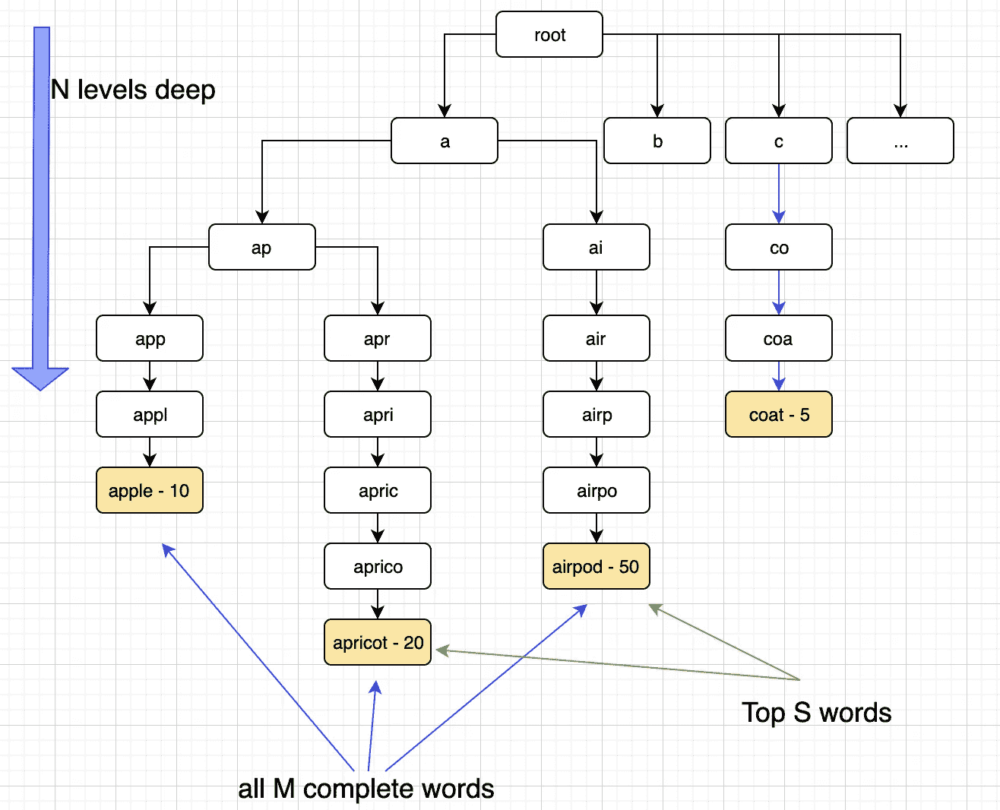

# 我们如何重建沃尔玛自动完成后端

> 原文：<https://medium.com/walmartglobaltech/how-we-rebuilt-the-walmart-autocomplete-backend-10efe71d624a?source=collection_archive---------0----------------------->

# 目录

*   介绍
*   遗产
*   方法
*   解决方案
    -处理多个数据集
    -缓存容量估计
    -调用远程缓存的延迟
*   建筑
*   接下来呢？
*   结论

# 介绍

一个 utocomplete 是进入搜索世界的第一步。用户可以开始键入前几个字符，而不是键入一个单词/短语，然后[自动完成功能](https://en.wikipedia.org/wiki/Autocomplete)会开始建议相关的匹配。它帮助用户快速找到最相关和最流行的内容，以及如何微调他们的搜索。

这在移动设备上特别有用，在移动设备上，用户可能不想键入大量字符，但仍然可以轻松获得相关结果。随着移动设备和平板电脑的使用越来越多，良好的自动完成服务可以提升客户体验，并帮助快速有效地找到相关建议。

自动完成还需要非常快速的响应，因为它的目标是在每次击键时给出一些建议。出于同样的原因，与搜索流量相比，它预计会收到更多的流量，因为用户输入的每个字符都会收到一个请求。

# 遗产

构建自动完成服务的传统方式是实现一个 [Trie](https://en.wikipedia.org/wiki/Trie) 。这种方法在学术界、面试和更快的上市时间中非常有效。然而，在现实世界中，当我们想要集成更多的特性或使其可伸缩时，这种解决方案会带来严重的问题。

沃尔玛电子商务已经在互联网上存在了一段时间，Autocomplete 的最初版本是以与上面提到的非常相似的方式构建的。

The legacy architecture

离线作业将建立一个包含建议和分数的数据文件(由受欢迎程度、使用频率等因素驱动)。这个文件每天会被解析一次，然后在内存中生成一个[TST](https://en.wikipedia.org/wiki/Ternary_search_tree)(Trie 的一种变体)，为流量服务。

随着时间的推移，当“在线杂货”成为一件事情时，OG 的一个单独的自动完成功能通过派生原始服务而建立起来。这又快又脏，增加了技术债务，我们必须维护两个独立的代码库和部署。这两种服务都是在本地运行的传统应用程序。使用这种架构:

1.  服务器的存储容量限制了建议的总数
2.  为了增加建议总数，使用[反向代理](https://en.wikipedia.org/wiki/Reverse_proxy)实现了水平扩展，这增加了网络跳数，从而增加了延迟
3.  部署/回滚既困难又复杂
4.  通过不同的路由对移动/web 请求进行不必要的分离

# 方法

我们开始了升级整个基础设施的旅程，以:

1.  将电子商务和食品杂货的代码库和服务统一到一个[多租户](https://en.wikipedia.org/wiki/Multitenancy)后端服务中
2.  将应用程序容器化并部署在云上
3.  使其可伸缩，没有反向代理，这样查询的数量就不会受到服务器内存占用的限制
4.  通过将数据转移到[外部分布式缓存](https://en.wikipedia.org/wiki/Distributed_cache)，可以更轻松地引入新功能，而不必担心 TST 的性能

基本思想是基于序列化 Trie 的概念。如果我们能够以哈希表的形式存储 Trie 用于键值查找，我们就可以实现恒定的检索时间复杂度。还要注意，*将*插入到 trie 中时间是微不足道的，因为它可以离线完成。重要的是我们能多快从 T8 拿到 T9。

A Trie representation of the data

让我们后退一步，看看特里。要查找长度为 N 的前缀( *app* N = 3， *apri* N = 4，以此类推)，我们需要在 **O(N)** 处深入 N 层。然后我们需要找到所有完整的建议(假设其中 M 个，每个 avg[len] = N+K)，在 O(MK)。假设 K 有固定的上界，这就变成了 **O(M)** 。最后，我们要对它们进行排序，以显示位于 **O(M log M)** 的前 S (≤ M)。排序是根据每个建议的得分进行的。

所以不管我们需要多少时间来构建一个 Trie，实时获取 T21 需要 O(N) + O(M) + O(M log M)的时间。随着数据的增长，这会对内存和延迟产生影响。

实际上，在网页或移动设备上，我们只显示前 8 或 10 条建议。此外，人们在输入 20-30(N)个字符后很少使用自动完成功能。如果我们能让这些东西保持不变，那么唯一对 big-O 有贡献的因素就是 m。

> 我们能不能不存储所有 M 个建议，然后在每次读取时对它们进行排序，而只存储前几个？这将使我们的获取时间为 O(1)。看起来我们可以。

为了更进一步，我们需要了解数据结构，如[数组](https://en.wikipedia.org/wiki/Array_data_structure)、[哈希表](https://en.wikipedia.org/wiki/Hash_table)、[二进制堆](https://en.wikipedia.org/wiki/Binary_heap)和[优先级队列](https://en.wikipedia.org/wiki/Priority_queue)。

# 解决方案

Building the prefix hash tree

我们阅读包含建议及其分数的数据集。在这个例子中，这些将是*银行:10，球棒:20，袋子:40，*和*球:30* 。然后我们开始构建一个散列表，它的键是可能的前缀(b *，ba，bal，bat，…* )。映射到这些键的值每个都是 PriorityQueue，其中队列元素是以前缀开始的建议，并根据分数排列优先级。我们将这个哈希表表示为 *HT <前缀，PQ >。*优先级队列在底层使用一个 MaxHeap，并在我们一个接一个地获取数据时按照*排序的顺序提供数据*。出于可视化的目的，该结构看起来就像它在图中所表示的那样。

我们使用一个 [*有界 PQ*](https://guava.dev/releases/22.0/api/docs/com/google/common/collect/MinMaxPriorityQueue.html) ，并且只保留我们想要显示的*最佳建议*。任何得分较低的建议都会从我们处理的每个建议的队列中删除，从而使 [*heapify*](https://xlinux.nist.gov/dads/HTML/heapify.html) 时间保持不变。同样，在计算前缀时，我们只计算*前 N 个字符*的前缀。所以不是生成 [k(k+1)/2](https://en.wikipedia.org/wiki/1_%2B_2_%2B_3_%2B_4_%2B_%E2%8B%AF) 前缀(给个建议，k 个字符长)，我们总是生成 *min(N，k)* 前缀。此时，前缀树的大小取决于建议的数量。请记住，我们的目标集中在常量时间中的*获取。*

接下来，我们将 *HT <前缀 pq >* 转换为 *HT <前缀数组>* 。我们通过从队列中取出每个项目，将每个 PriorityQueue 转换为一个数组。这需要 O(S log S)的时间。这个获取不是服务于实时流量，而是构建 top-S 预排序建议的数组。

哈希表的查找时间为 O(1)。获取一个子数组也是 O(1)时间。这导致查找完整数据结构的时间为 O(1)。这个 *HT <前缀，数组>T1 更好地被称为[前缀哈希树](https://en.wikipedia.org/wiki/Prefix_hash_tree)。*

最后，我们将这个前缀哈希树序列化到分布式缓存中。对于我们的用例，我们使用了 [Memcached](https://memcached.org/) 。

## 处理多个数据集

正如我们上面提到的，我们希望*统一电子商务和杂货，并引入 Omni Search* ，我们意识到，根据**体验**，建议会有所不同。例如，在杂货店搜索“苹果”可能会导致“苹果汁”,但在电子商务搜索“苹果 iPhone ”,很可能两者都有。

同样，我们可以让用户在特定的**类别**(如“电子产品”或“家庭装修”)下搜索，或者跨所有类别搜索。对于这种情况，建议会有所不同。

最后，还有一种情况，我们希望*用不同的分数加载不同的数据集*，因此它们被不同地排序(或者有不同的建议)，并查看这些查询如何执行( [**AB 测试**](https://en.wikipedia.org/wiki/A/B_testing) )。这将给内存 TST 带来一个大问题，因为内存占用将增加近一倍，我们需要扩展服务单元。由于这些原因，遗留版本最初不支持 AB 测试(水平缩放在一定程度上解决了这个问题)。

Example of a key-value pair from the cache

为了解决这些问题，我们需要在前缀前加上特定的首字母缩写，以唯一地识别这些组合。例如，不是存储前缀' *app* '(如苹果)，而是存储为' *aeE~app* ' ( **a** 定义了第一个变体——如 AB test， **e** 代表电子商务， **E** 代表电子产品类别)。类似地，您可以使用' *bg0~app'* ( **b** 定义 AB 测试中的第二个变量， **g** 代表杂货， **0** 代表所有类别)。

## **缓存容量估算**

最初的概念验证表明，与 Trie 相比，前缀哈希树将占用更多的空间，为了减少延迟和设计，我们已经准备好进行权衡。

Dense vs Sparse Tree

然而，我们观察到，在 Trie 实现中，空间与树的[密度/稀疏度](https://en.wikipedia.org/wiki/Dense_graph)相关(由于中间节点的唯一性，对于相同数量的建议，稀疏树将比密集树占用更多空间)。对于前缀哈希树，空间与前缀长度和建议数量相关。

> 随着我们增加建议的数量，由于它们的随机性，稀疏性增加，因此前缀哈希树比 Trie 提供了更好的空间优化。

在分布式缓存中存储哈希表需要多少空间？我们希望确保我们有足够的供应。由于 Memcached 将数据存储在一个[键值存储](https://en.wikipedia.org/wiki/Key%E2%80%93value_database)中，我们对哈希表进行了 JSONified 以计算它占用了多少空间。然后，我们提供了三倍的空间，以便即使在运行 AB 测试时也有足够的缓冲。将来，我们可以在缓存上分配更多的空间，而不会对数据呈现部分产生任何影响。

大约 6500 万个键值对存储在 8GB 上，相当于每对大约 125 字节。

## 调用远程缓存的延迟

数据不再是在一个 Trie 中，从数学上来说，我们能够实现 O(1)获取时间，这在笔和纸上听起来很棒。实际上，我们只是将数据移动到远程缓存服务，并引入了网络延迟！！

Service Latency (cache read + network trip)

在我们的概念验证过程中就预料到了这一点，我们希望确保*解决方案不会比问题更糟糕。*通过对分布式缓存中的数据进行性能测试，我们发现大部分数据的处理时间不到 10 毫秒，而在过去，这需要 12-14 毫秒。

有一些异常值由于不相关的因素(如拼写纠正)花费了更多的时间，并且与缓存查找无关。深入探讨这些问题超出了本次讨论的范围和背景。

> 缓存读取始终低于 1 毫秒(网络往返占剩余的 8-9 毫秒)。这意味着即使网络往返到缓存，也比在内存中查找巨大的 Trie 要快。

Cache response times (cache read)

我们为地理位置创建了副本，以便面向客户的服务和分布式缓存位于同一位置。我们还确保了每个地理位置的冗余，以避免在一个缓存实例出现故障的情况下停机。

# 建筑

将数据写入分布式缓存的*操作由 [Cron 作业](https://en.wikipedia.org/wiki/Cron)完成，并与将数据呈现到前端的*读取服务*分离。这是一种完全的职责分离，因为读取服务可以专注于快速提供*数据的*并引入其他功能，而不用担心其对数据的影响，而写入作业可以专注于在一天中的预定时间更新*缓存。**

新的 Autocomplete 托管在云上，运行在由 Kubernetes 管理的容器中。它由两项服务组成:

The new Autocomplete Architecture

****编写器*** *服务*每天运行一次，并从数据文件中填充缓存。这将数据仅加载到缓存的一个副本中，然后该副本会跨不同的地理位置(和冗余)进行自我复制。*

*****阅读器*** *服务*是面向前端的服务，以近乎恒定的时间提供实时流量服务，并从最近的缓存中提取数据。**

**为简单起见，省略了其他细节，如 [CDN](https://en.wikipedia.org/wiki/Content_delivery_network) 缓存、 [GSLB](https://en.wikipedia.org/w/index.php?title=Gslb&redirect=no) 和部署基础设施。**

# **接下来呢？**

**我们可以通过跳过中间文件生成过程来进一步优化数据生成。数据可以从上游提取，直接送入分布式缓存。这可以实时和按需完成。**

**我们还可以让缓存“位置感知”。也就是说，我们显示的建议可以基于它将服务的地理位置。例如，阿拉斯加和德克萨斯州可能对“冬季服装”有不同的要求。**

# **结论**

**通过这种重新架构，我们能够在不牺牲延迟或性能的情况下扩展应用程序；消除反向代理，减少网络跳数和服务。**

**我们还能够将数据呈现服务从数据生成/插入服务中分离出来；使引入新特性变得更加容易，而不会影响内存和完全的职责分离。**