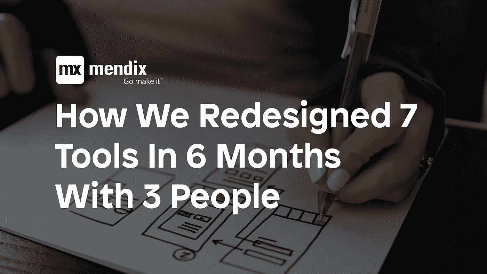
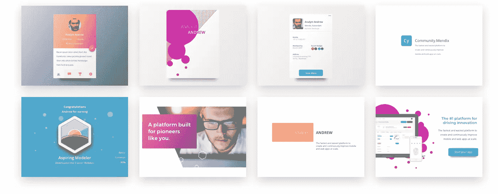

# 我们如何用 3 个人在 6 个月内重新设计了 7 个工具

> 原文：<https://medium.com/mendix/how-we-redesigned-7-tools-in-6-months-with-3-people-fac02484ddaa?source=collection_archive---------1----------------------->

这是我们重塑品牌、重新设计和重新实施 7 个积极使用 Mendix 工具的故事，只用了 3 个人，用了 6 个月！如果你打算很快做一个品牌重塑，开始并获得一些关于结构的建议，阅读这篇文章是很好的。

## 简短的背景故事

Mendix 是一个“低代码平台”,通过使用可视化建模工具和可重复使用的组件，它使那些不太懂技术的人能够构建功能完整的应用程序。

我们的工作是重塑、重新设计、实施和发布 Mendix 的[社区平台。](https://developers.mendix.com/)

社区平台由 7 个工具组成，这些工具相互连接并与 Mendix 平台完全集成:

- [Learn/Academy](https://gettingstarted.mendixcloud.com/) (教程、课程、课堂课程、考试)
- [文档](https://docs.mendix.com/)
- [论坛](https://forum.mendix.com/index3.html)
-社区(简介、徽章、游戏化)
- [合作伙伴](https://www.mendix.com/solution-providers/)(简介、项目)
-资源
-搜索

# 重新定义品牌(3 个月)

我们的第一步是找出描述 Mendix 品牌的最佳方式。
主要的痛点是[主 Mendix 网站](http://www.mendix.com)(针对作为买家角色的大公司决策者)和平台(针对使用该产品的 Mendix 制造商)之间存在品牌差距。

这也意味着我们有 4 个利益相关者，营销管理团队、社区经理、营销艺术总监和 UX 产品团队。为了更加方便，这些还被分配到不同的地区——美国和荷兰。

这一过程花费的时间比预期的长，原因是:

*   具有不同愿景、品味和观点的利益相关者。
*   努力让每个人都开心，有时候这是不可能的
*   想对所有利益相关者说“是”。

3 个月后，我们最终确定了一种设计风格，这让我们可以进入下一阶段。

Some of the experimental “brand cards”

# 重新设计第一个工具(1 周)

重新设计的第一个工具是文档。
它是最独立的工具，允许我们评估反馈，在不破坏其他应用程序组件的情况下将新设计投入使用。

大多数社区工具都是彼此独立开发的，造成了不连贯的体验。UX 是由构建工具的人创建的，在许多情况下，从他们的角度来看似乎是合乎逻辑的，但从用户的角度来看却不是。

*比如说。为了帮助创建秩序，技术人员创建了一个登录页面，上面有 80 多个链接指向所有最重要的文档，这样用户就有了一个简单快捷的方法来导航到所需的文档。实际上，这对于任何访问该文档的新用户来说都是难以承受的。*

文档为重新设计社区工具创造了一个坚实的起点，因为它的文本量很大，允许我们创建一个决定文本样式的样式表。

Left: original. Right: redesign.

# 图像、列表和可重复使用的元素。

docs 推出后，我们慢慢开始开发其他更复杂的工具，比如论坛，那里有头像、列表、图标、不同状态、鼠标悬停和其他视觉元素。

用户资料也被重新设计，以纳入越来越多的统计数据和信息。

# 学院(1 个月)

学院是它自己的野兽。学院本身就是一个平台。
正因为如此，利益相关者希望它比其他平台更有个性，但仍是整体的一部分。

另一个挑战是可视化地传达课程的层次和嵌套。课程被称为单元，一堆单元组成一个模块，模块的汇编是一条路径。令人困惑的权利，让我给你画一个小图表:

from left to right: Path, Modules, Units

我们决定采用探险家原型([什么是原型](https://www.culturetalk.com/explorer-archetype/))，它塑造了语言和主题的使用，比如“路径”。从设计的角度来看，我们使用卡片是因为它们很容易移动(而且在目前的设计领域非常流行)。)

# 设计系统的出现

设计系统开始有机地出现。例如草图中的符号，都有相同的边界框，以确保一致性和易于实现。

拥有设计系统的好处有:
——更容易与非设计师进行讨论，因为他们能够放下审美，开始更多地思考“以用户为中心的设计问题”。
-设计系统可以作为 Sass 样式表中的一组规则来实现，从而加快开发速度。

> 专业提示:在草图中你可以使用“/”
> 来嵌套符号(例如。" ICN24 /社交-活跃")

# 履行

作为一个持怀疑态度的设计师，我不确定使用 Mendix 是否是实现这些更新设计的明智选择。
我更熟悉传统 web 开发流程的利弊。

但是使用 Mendix 给了我们的团队难以置信的速度，这是传统的编码过程所不允许的。我们可以利用业务开发人员，而不是从其他项目中抽调前端/后端开发人员。我可以走到一个同事面前，告诉他需要做什么改变，3 次点击后，在我这边推送服务器和更新，我可以开始实现前端。

# 外卖食品

## **不要害怕发布**。

释放它！大家都说发布快，发布勤，失败快，失败勤。但是对于那些负有责任的人来说，发布任何没有经过至少 100 次检查的东西肯定是很可怕的

我们足够幸运，社区经理是一个特立独行的人，他按照自己的规则行事，允许我们快速发布并继续前进。

令人惊讶的是，社区看到变化是多么高兴，即使事情可能会破裂，社区也感觉像是对话的一部分，提供反馈，并积极地表达很酷的新功能。

## **Sketch 非常适合扩展和协作**

当我们开始的时候，我们并没有公布拥有一个可以和设计系统一起扩展的应用有多重要。我很高兴我们有像 Sketch 这样的程序来帮助简化工作流程。

## **门迪克斯因为实现 UX 而牛逼**

就像 Sketch 如何改进设计工作流程一样，能够使用 Mendix 有助于在实现更改时保持速度和迭代工作。

在[Dribbble](https://dribbble.com/jasonteunissen)上找我下载[草图](https://www.sketchapp.com/)下载 [Mendix](https://www.mendix.com)