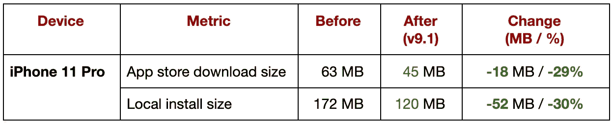

# 我们如何将 Pinterest 的 iOS 应用大小减少 30+% / 50MB

> 原文：<https://medium.com/pinterest-engineering/how-we-reduced-pinterests-ios-app-size-by-30-50mb-68d7f8425882?source=collection_archive---------1----------------------->

马良|软件工程师，应用基础

我们都知道应用程序大小(下载大小[1]和本地安装大小[2])很重要，应用程序大小和客户参与度之间存在相关性。很多时候，人们根据大小来决定是否使用软件，甚至按兆字节支付带宽费用。更不用说，当应用程序大小增加并导致用户试图释放设备上的磁盘空间时，卸载率可能会上升。

最近，我们发布了对 Pinterest iOS 应用程序 v9.1 的改进，显著缩小了它的大小:

*Table 1: iPhone 11 Pro is our target device.*

因此，自推出以来，我们看到新版本的*应用安装量*(用户从应用商店下载应用)增加。

# 有什么问题

在 Pinterest，我们用[巴泽尔](/pinterest-engineering/developing-fast-reliable-ios-builds-at-pinterest-part-one-cb1810407b92)来构建我们的 iOS。如果你不熟悉 Bazel，这篇[文章](https://github.com/pinterest/xchammer/blob/master/Docs/BazelForiOSDevelopers.md)值得一读。

为了创建我们的本地化文件，我们有一个 CI 作业，它自动扫描应用程序中的所有源代码(通过 bazel query ),并将它们发送到 [Mojito](https://github.com/box/mojito) 进行翻译。在我们添加了几个扩展之前，这一直工作得很好。

每个[扩展](https://developer.apple.com/app-extensions/)都是一个模块，有自己的[构建](https://docs.bazel.build/versions/master/build-ref.html#BUILD_files)文件。Bazel 构建完成后，它会将本地化的字符串从主应用程序包复制到每个扩展包。但是，这将在每个扩展中复制 Localizable.strings 文件，从而增加整个应用程序包的大小。

所以我们决定从扩展中消除本地化副本。

# 修复

首先，我们更新了构建文件，因此扩展不再从主应用捆绑包中复制本地化的字符串。

但是，由于这一更改，NSLocalizedString 无法正确加载本地化字符串。经过进一步的调查，我们了解到，这些宏都使用+[NSBundle mainBundle]，但+[NSBundle mainBundle]实际上返回的是包含“当前应用程序可执行文件”的捆绑包，当从扩展内部调用时，它是您的应用程序的子文件夹。比如:是`/path/to/Pinterest . app**/PlugIns/siriextension . appex/**`而不是`/path/to/Pinterest.app/`。我们做了一个更改来设置所需的路径，以便 NSLocalizedStringWithDefaultValue 可以从**主应用包**中读取本地化的字符串。

所有这些保存的更改— **(所有可本地化字符串的大小**)*****(**统计有此类本地化重复的扩展的数量**)—大约占整个应用程序大小的 **30%** 。

# 长期计划

作为后续措施，我们计划将本地化资源放入各自的 SDK/扩展中，而不是依赖于应用捆绑包，这具有以下优势:

*   每个捆绑包都是独立的，因此不需要主应用程序捆绑包就可以运行或测试本地化，并且可以捆绑到单独的应用程序中。
*   NSLocalizedString 和本地化 API 在扩展的代码中自然工作。
*   我们可以让这些包开源。

还有其他潜在的改进领域，如删除非面向消费者的代码的不必要的本地化，研究更有效的图像格式，以及其他编译器级别的优化。敬请关注更多更新，如果你对这样的机会感兴趣，请访问我们的[职业页面](https://www.pinterestcareers.com/)。

*[1]下载大小是从 app store 下载时传输的实际大小，只有当应用程序超过 Apple 确定的 200 MB 限制且用户不在 Wi-Fi 上时才会显示，除非用户更改默认设置。而且它是压缩的，所以比通常的安装尺寸要小。*

*【2】本地安装大小是手机磁盘上的实际应用大小(设置 app- > iPhone 存储- > Pinterest- > App 大小)。它根据您的手机型号变薄，因此通常比通用尺寸小。*