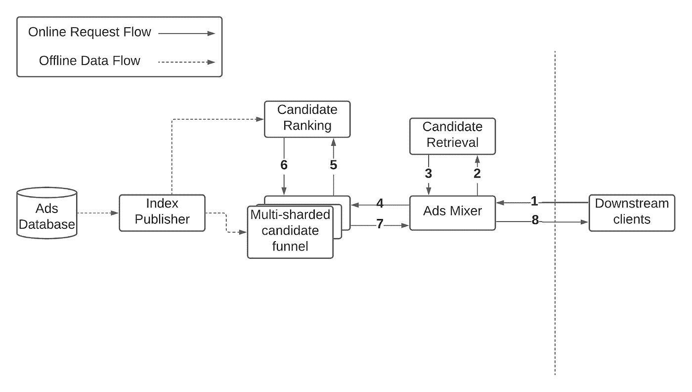
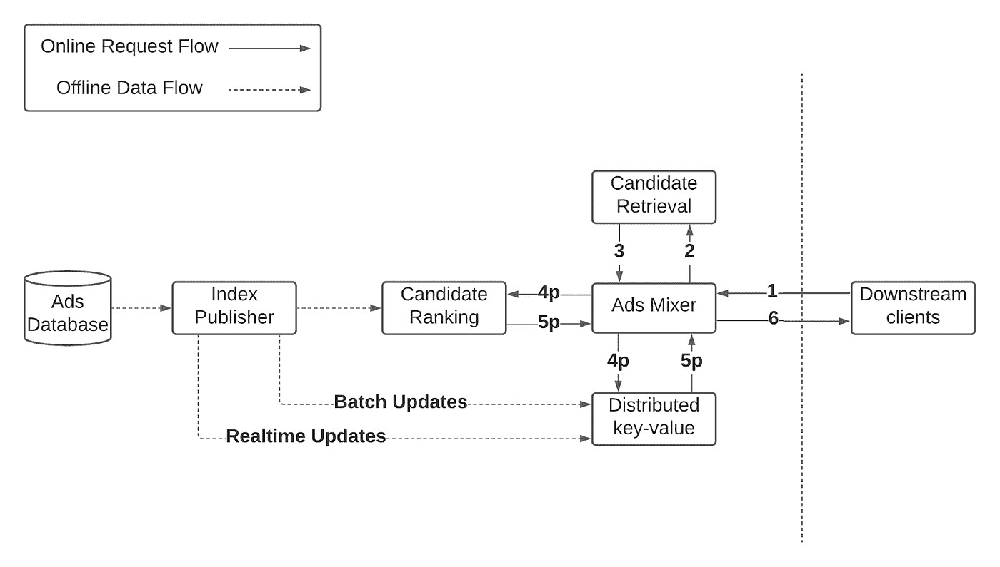
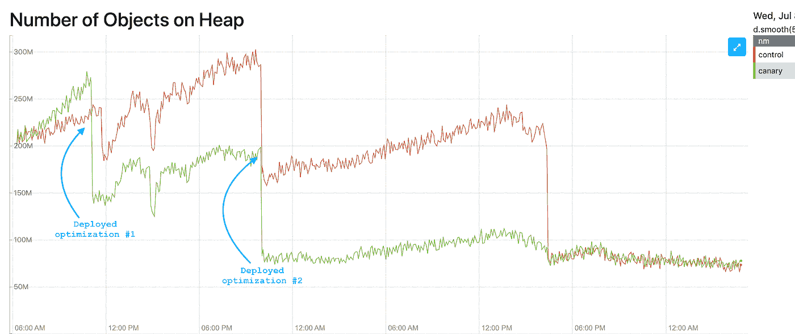
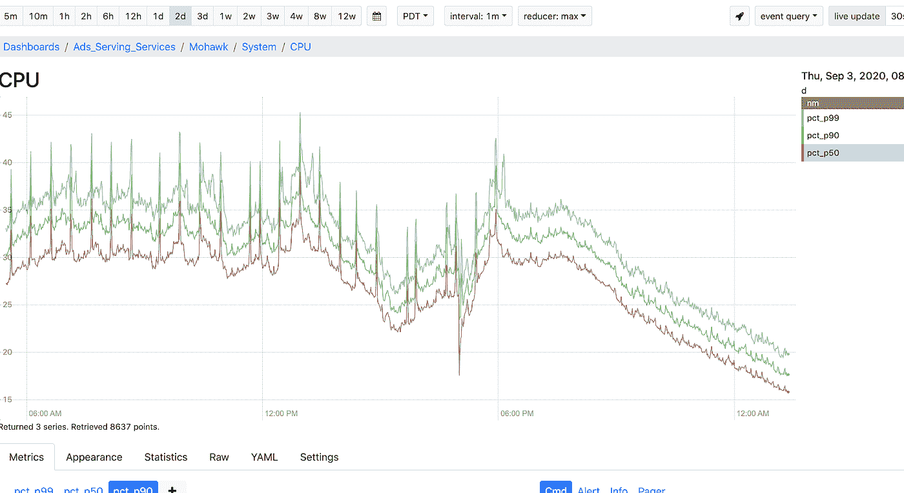
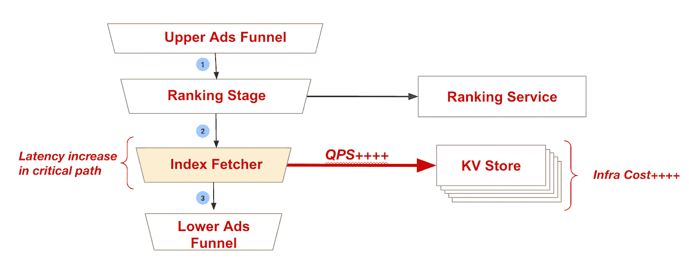
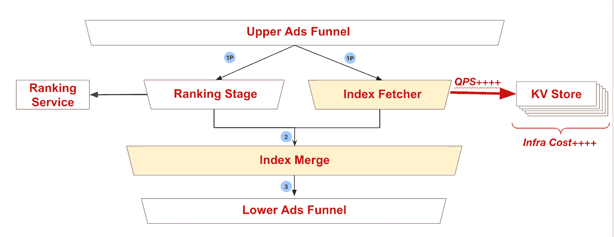
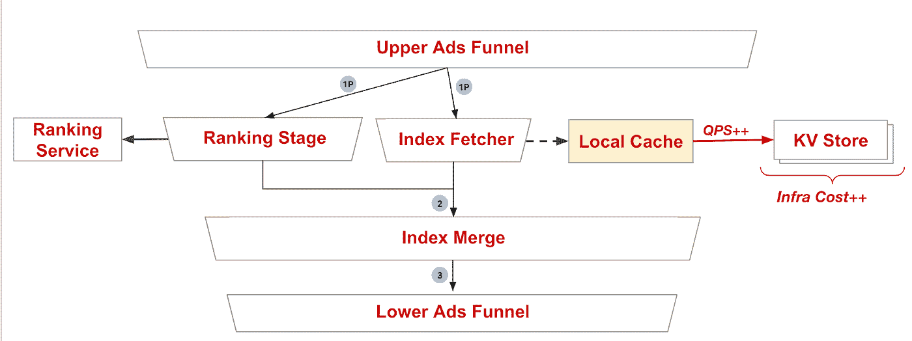
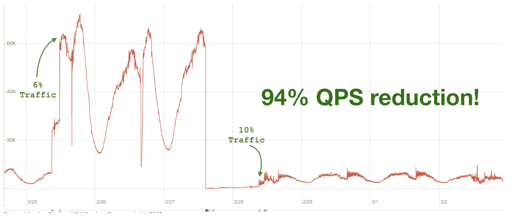
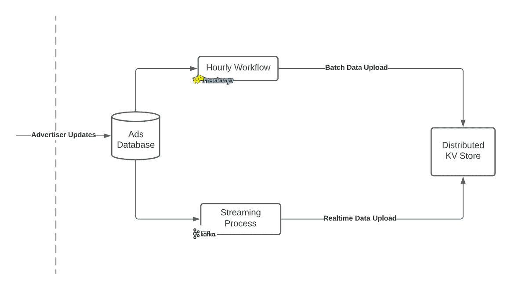
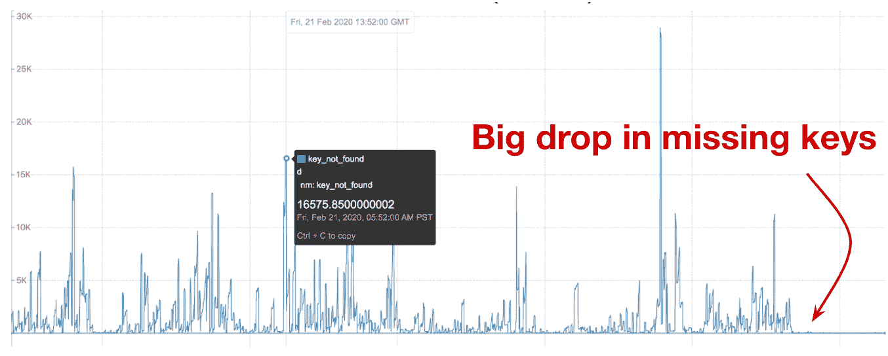

# 我们如何将 Pinterest 的广告库规模扩大 60 倍

> 原文：<https://medium.com/pinterest-engineering/how-we-scaled-the-size-of-pinterests-ad-corpus-by-60x-d6d5bfa6bf16?source=collection_archive---------0----------------------->

Nishant Roy |广告服务平台技术主管

2020 年 5 月，Pinterest 与 Shopify 建立了合作关系，允许商家轻松地将他们的目录上传到 Pinterest 平台，并创建产品 pin 和购物广告。当在 Pinterest 上投放广告时，这极大地增加了我们语料库中可供推荐引擎选择的购物广告数量。为了继续支持这种快速增长，我们利用 Go 中的键值(KV)存储和一些内存优化，将我们的广告语料库规模扩大了 60 倍。我们有三个主要目标:

*   简化我们广告业务的扩展，而不会线性增加基础设施成本
*   提高系统性能
*   最小化维护成本，提高开发人员的工作效率

这篇博客解释了我们如何扩展一个对业务至关重要的高流量推荐引擎，以及我们从中看到的好处。

# 背景

2018 年，广告服务架构是这样的:

*Fig 1: Ads-Serving Architecture in 2018*

*   离线工作流将每隔几个小时运行一次，以向系统发布活动广告的索引。候选漏斗服务将在内存中加载该索引。由于内存限制，漏斗服务有九个碎片。
*   下游客户端将调用 ads mixer 服务，该服务将执行功能扩展
*   接下来，候选检索服务将返回给定用户和上下文特征的最佳候选列表
*   然后，候选人漏斗将使用索引数据丰富候选人，调用排名服务进行评分，并基于各种规则(例如，相关性、价格、预算等)修整候选人。)
*   最后，mixer 服务将运行拍卖来选择最佳候选，分配价格，并将广告返回给用户

这个系统在几年内为我们提供了很好的服务，但我们很快就开始遇到一些挑战，这些挑战阻碍了我们扩大广告业务。

# 挑战

## 内存瓶颈

随着我们的广告语料库开始增长，我们的索引大小也开始增长，导致我们的候选人漏斗服务开始触及内存限制。更大的语料库是非常理想的；它提高了 Pinners 看到的广告的质量，允许我们登上更多的广告客户，并提高他们的广告投放率。

我们考虑了几个短期解决方案:

*   **添加更多的碎片:**通过将碎片数量增加到 9 个以上，我们可以支持一个大的 ads 索引。然而，这是一个昂贵而复杂的过程。添加更多的集群会增加我们的基础架构和维护成本，而且这并不完全适应未来的需求(例如，我们可能需要在未来重新部署)。
*   **垂直扩展:**我们用两倍大的 EC2 实例进行实验，并将集群大小减半以保持成本不变。然而，我们发现我们的服务是并发受限的，因此较小的车队无法处理相同数量的流量。这将是一个更难解决的问题，也不是面向未来的。

**解决方案:弃用内存索引**

我们决定将内存中的索引移动到外部数据存储，而不是水平或垂直扩展现有的服务。这完全消除了对碎片的需求，允许我们将所有九个碎片合并成一个单一的、无状态的 ads-mixer 服务。这也极大地简化了系统，将我们的集群从 10 个减少到 1 个。

*Fig 2: Ads-Serving Architecture now*

移除内存索引的另一个好处是，它将启动时间从 10 分钟大幅减少到了【T2 解决方案:堆优化

## 我们能够将堆上的对象数量从大约 2 . 8 亿减少到大约 6，000 万，这显著提高了我们的系统性能——尾部延迟几乎减少了 10%,成功率提高了 1%。我们通过清理未使用的数据字段、减少长寿命对象的数量以支持按需创建对象，以及池化对象以减少大的分配突发来实现这一点。

在完全否定了内存中的前向索引之后，我们还看到间歇性的 CPU 峰值变得平稳，使我们的系统更加稳定和可靠。

有关 Go GC 如何工作、它如何导致性能退化以及如何优化系统性能的更多详细信息，您可以参考这篇关于 Go 系统堆优化的[博客文章](/swlh/memory-optimizations-for-go-systems-48d95cf64a13)或[演讲](https://www.usenix.org/conference/srecon20americas/presentation/roy)。

规模和延迟

既然索引数据在外部 KV 存储中，我们需要引入另一个 RPC 来获取数据。因为没有这个索引数据，我们无法处理候选广告，所以在得到响应之前，我们会被阻塞。等待这种响应会增加我们大约 12%的端到端延迟。这将影响我们的成功率，导致更少的广告印象和因响应更慢而降低的 Pinner 体验。我们还每秒请求数百万候选人的数据，这导致 KV 商店集群的基础架构成本很高。

*Fig 3: Number of Objects on Heap for Ads-Serving*

**解决方案:并行化和缓存**

*Fig 4: CPU usage before and after GC optimizations*

通过与排名阶段并行运行索引提取器，我们能够最大限度地减少延迟影响。查看上面的图 5，我们看到排名阶段和索引提取器主要在 RPC 上被阻塞。排名阶段是漏斗中最慢的阶段，因此其延迟通常占主导地位。

## 接下来，通过在广告服务漏斗中实施本地缓存，我们能够将 KV 商店的流量减少约 94%。我们将生存时间(TTL)设置为几分钟，以在高流量和数据新鲜度之间保持平衡。

数据延迟

*Fig 5: Increased ads-serving latency and infra cost to fetch index data from external KV Store*

由于 KV 商店更新管道相对于候选检索的延迟，新创建的广告经常从 KV 商店索引中丢失，从而阻止了它们被提供给用户。这种延迟是由于更新 KV 存储的批处理工作流每隔几个小时运行一次，而候选检索索引是实时更新的。

即使是没有丢失的广告，数据也可能是陈旧的。由于该数据包括广告预算，我们可能会提供已经耗尽预算的广告，从而导致“超额投放”(即不计费的广告展示)。

*Fig 6: Parallelizing candidate ranking and index retrieval to minimize latency*

**解决方案:实时数据更新**

*Fig 7: Adding a local cache to lower the QPS to the KV Store cluster, and minimize infra cost*

*Fig 8: Reduction in QPS to KV Store cluster due to local cache. 6% and 10% traffic refers to how much experimental traffic was being served by the new architecture.*

## 通过为 KV 存储启用实时更新，我们能够减少遗漏候选项的数量，并将数据新鲜度从几个小时提高到几分钟。我们的 KV store 遵循一个 lambda 架构模式，除了推送批量工作流更新之外，它还允许我们通过 Kafka 推送实时更新。

结论

我们重新设计了我们的广告服务架构，以解决我们的内存和性能瓶颈，并为广告语料库的未来增长做好准备。事实上，我们能够在 2020 年将我们的 ads 索引大小翻两番，就在推出这一新系统的几个月后，除了缓存命中率稍低之外，没有任何负面影响。我们还通过极大地简化系统，大大降低了维护成本和随叫随到的负担。

我们提高了系统性能，减少了延迟，提高了可靠性，从而增加了广告收入、广告展示和广告点击。我们的性能改进还大幅降低了基础设施成本，因为我们能够以更高的 CPU 利用率运行，而质量没有任何下降。

承认

*Fig 8: Lambda Architecture with Batch + Real-time Data Updates*

*Fig 9: Drop in missing keys due to real-time index data updates*

# 向所有帮助这项多年努力取得成功的人大声疾呼。我要感谢、、Zack Drach、、刘明思、Sreshta Vijayaraghavan、、Shawn Nguyen、、Pihui Wei、Danyal Raza、、Zhang、cheng Hu、Jessica Chan、Rajath Prasad、Indy Prentice、Chen、Sergei Radutnuy、、Ji、Siping、Hari Venkatesan 和 Javier Llaca Ojinaga 对本项目设计和执行的帮助。

*要在 Pinterest 了解更多工程知识，请查看我们的* [*工程博客*](https://medium.com/pinterest-engineering) *，并访问我们的*[*Pinterest Labs*](https://labs.pinterest.com/?utm_source=medium&utm_medium=blog-article&utm_campaign=roy-august-5-2021)*网站。要查看和申请空缺职位，请访问我们的* [*职业*](https://www.pinterestcareers.com/?utm_source=medium&utm_medium=blog-article&utm_campaign=roy-august-5-2021) *页面。*

We were able to improve our system performance, reduce latency, and improve reliability, which resulted in an increase in ad revenue, ad impressions, and ad clicks. Our performance improvements also resulted in a large reduction in our infrastructure costs, since we were able to run at a much higher CPU utilization without any degradation in quality.

# Acknowledgements

A huge shout out to everyone who helped make this multi-year endeavor a success. I would like to thank Shu Zhang, Joey Wang, Zack Drach, Liang He, Mingsi Liu, Sreshta Vijayaraghavan, Di An, Shawn Nguyen, Ang Xu, Pihui Wei, Danyal Raza, Caijie Zhang, Chengcheng Hu, Jessica Chan, Rajath Prasad, Indy Prentice, Keyi Chen, Sergei Radutnuy, Chen Hu, Siping Ji, Hari Venkatesan, and Javier Llaca Ojinaga for their help in the design and execution of this project.

*To learn more about engineering at Pinterest, check out the rest of our* [*Engineering Blog*](https://medium.com/pinterest-engineering)*, and visit our* [*Pinterest Labs*](https://labs.pinterest.com/?utm_source=medium&utm_medium=blog-article&utm_campaign=roy-august-5-2021) *site. To view and apply to open opportunities, visit our* [*Careers*](https://www.pinterestcareers.com/?utm_source=medium&utm_medium=blog-article&utm_campaign=roy-august-5-2021) *page.*