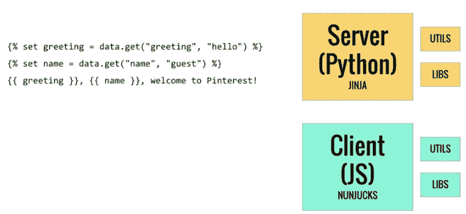
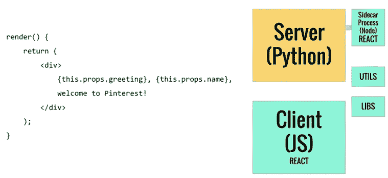
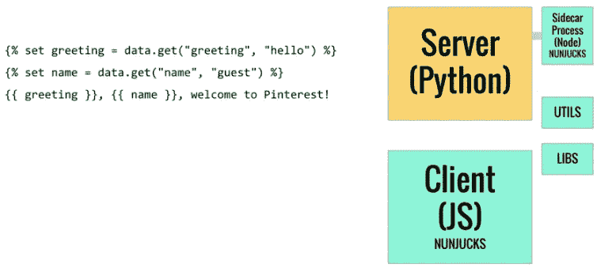
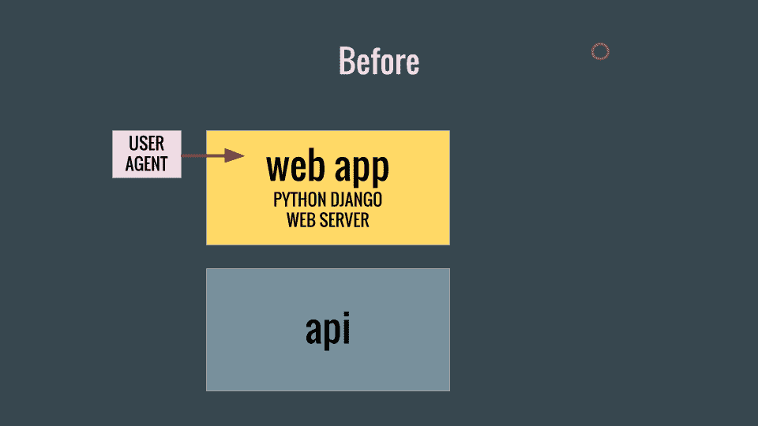
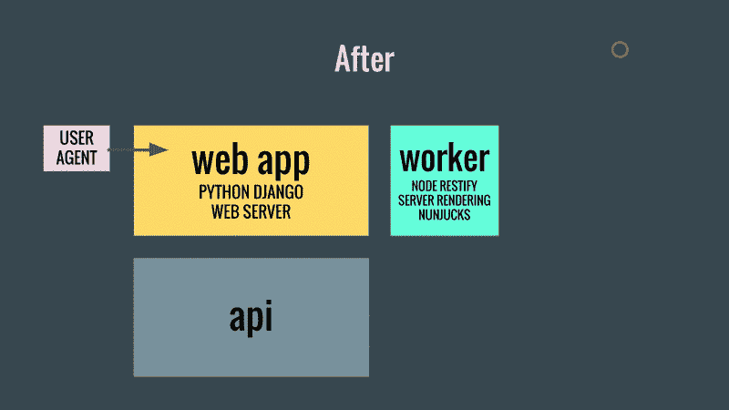
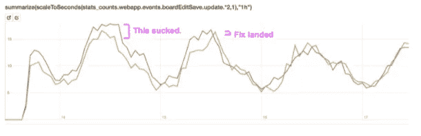
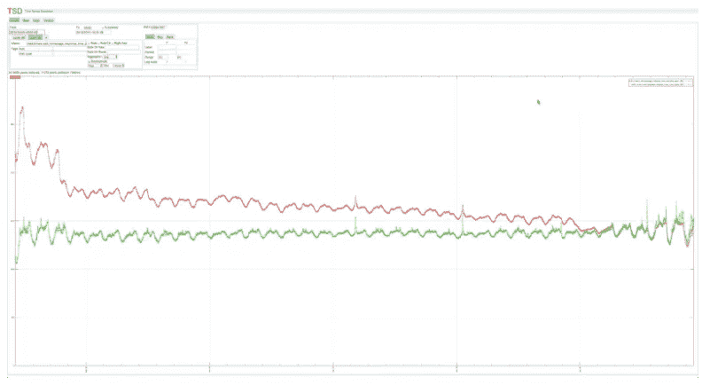

# 我们如何切换我们的模板渲染引擎作出反应

> 原文：<https://medium.com/pinterest-engineering/how-we-switched-our-template-rendering-engine-to-react-a799a3d540b0?source=collection_archive---------0----------------------->

Jessica Chan | Pinterest 工程师，核心体验

2015 年，我们决定迁移我们的传统 web 体验，以跟上我们的快速增长，并随着开发人员速度的提高而表现得更好。最终，我们发现 React 比我们以前的模板引擎渲染得更快，在迭代特性方面障碍更少，并且拥有一个大型开发人员社区。在前一篇文章的基础上，我们将更深入地迁移 web 基础设施来服务 React 页面，这需要在不破坏网站的情况下移动大量的代码。

## 做出反应的路线图

当我们开始这个项目时，Pinterest.com 已经在现有的架构上忙碌了一段时间。在服务器上， [Django](https://www.djangoproject.com/) ，一个 Python web 应用框架，服务于我们的 web 请求， [Jinja](http://jinja.pocoo.org/) 正在渲染我们的模板。服务器对浏览器的响应包括浏览器获取 JavaScript、图像和 CSS 以及初始化客户端应用程序所需的所有标记、资产和数据。Nunjucks ，一个 JavaScript 模板渲染引擎，使用与 Jinja 相同的模板语法，在客户端完成所有后续的模板渲染。

模板语法和堆栈如下所示:

这种架构是可行的，因为 Jinja 和 Nunjucks 之间的模板语法(几乎)是相同的。然而，必须复制模板渲染工具和库，如上所示，这意味着对于我们需要添加的每个 Jinja Python 工具，我们必须为 Nunjucks 编写 JavaScript 版本。这很麻烦，导致了很多错误，也是另一个让我们转向使用相同的语言和引擎在客户端和服务器端进行模板渲染的原因。

下图显示了我们在 React 中整合模板渲染的最终目标:

看起来很不错:我们可以在客户机和服务器之间共享实用程序和库，并且我们有一个引擎 React，在两者上呈现模板。但是我们如何到达那里呢？如果我们将客户端渲染引擎从 Nunjucks 切换到 React，我们还必须切换服务器端渲染，这样它们就可以共享相同的模板语法。停止开发以便我们可以切换我们所有的模板来反应不是一个选项。

我们需要一个解决方案，允许我们迭代转换数百个 Pinterest 组件，而不中断产品团队的工作或 Pinners 的体验。该解决方案如下所示:

第一步是在客户端和服务器之间整合到一个单一的模板渲染引擎，然后我们可以用其他东西来替换这个引擎。如果服务器可以解释 JavaScript，使用 Nunjucks 来呈现模板并共享我们的客户端代码，我们就可以通过迭代迁移来做出反应。

## 服务器端 Nunjucks 架构

当我们第一次考虑如何在服务器端解释 JavaScript 时，有两个主要选择: [PyV8](https://code.google.com/archive/p/pyv8/) 和[节点](https://nodejs.org)。PyV8 的优势是给了我们一个快速原型化的方法，不用太担心建立一个独立的服务，但是它没有得到很好的维护，并且这个包的内存占用很大。

Node 是一个更自然的选择，尽管建立一个新服务会有开销，而且我们会通过一个网络接口与这个服务进行通信，这个网络接口有它自己的复杂性(在下一节中有更多的描述)。有一个大型社区支持和使用 Node，我们可以更好地控制服务的调整和优化。

最后，我们继续在 Nginx 代理层后面建立节点流程，并以这样一种方式设计接口，使得每个网络请求都是无状态呈现。这允许我们将请求外包给流程组，并根据需要扩展流程的数量。

我们还重构了我们的客户端渲染 JavaScript，以便它可以被客户端和服务器端使用。这导致了一个带有 API 的同步呈现模块，该模块接受与环境无关的请求，并使用 Nunjucks 返回最终标记。节点和浏览器都调用这个模块来获取 HTML。

在 web 服务器上，我们缩短了模板渲染的时间，因此它没有调用 Jinja，而是发出网络请求，将模板渲染外包给我们的节点工作器。

## 之前:Jinja 一次渲染整个模块树

Pinterest 模板的结构是树。根模块调用子模块，子模块也有子模块，等等。，渲染过程遍历这些模块以生成最终的 HTML，该 HTML 构成了最终的结果。

每个模块可以根据从其父模块接收的数据进行渲染，也可以请求进行网络调用以获取更多数据，从而继续渲染。这些数据请求必然是阻塞的，因为我们在到达节点之前不知道呈现路径。这意味着模块树呈现被下游数据请求阻塞，这些请求可以在任何时候发起。

因为 Python 在单个线程上进行所有渲染，所以渲染会阻塞线程，本质上是串行的。

用户代理发出请求时出现的紫色圆圈表示没有数据的模块呈现请求。调用 API 来获取数据，填充圆圈并为渲染过程做好准备。渲染具体化子对象，并在到达需要数据的子对象时停止。对 API 的后续调用满足这些数据请求，呈现继续进行。

## 之后:努恩朱克斯在网上请求

和以前一样，用户代理发出一个请求，这个请求导致一个需要数据的潜在模块呈现请求。通过调用 API 再次获得数据，但是另一个网络调用是对一个位于同一位置的节点进程进行的，以便尽可能地使用它所拥有的数据来呈现模板。

然后，Node 发送回一个响应，其中包含已呈现的模板，以及一个“holes”数组，指示工人无法呈现的模块，因为它们仍然需要数据。然后我们的 Python webapp 通过调用 API 提供他们需要的数据，每个模块作为完全独立的模块请求*并行*发送回 Node。重复这一过程，直到整个树被渲染，并且所有请求都无漏洞地返回。

## 首次展示

对新系统的信心是推出该系统的关键。开发人员仍在用 Jinja 构建，并创建和修改新的 Python 实用程序，我们必须确保新系统不会给 Pinners 的页面加载带来延迟。我们还必须构建错误处理、服务监控、警报和操作手册，以扩展新节点流程的维护和故障排除。

确保平稳过渡有许多依赖因素，两个工具对项目的成功至关重要。

**棉绒和测试。** Jinja 和 Nunjucks 的语法接近相同，但不完全相同。每个模板引擎支持的内容的差异以及 Python 和 Nunjucks 中的语言差异迫使我们对工程师可以使用模板做什么保持严格的限制。最终，我们需要确保在服务器上渲染的模板在客户端上的渲染是相同的，并且由 Jinja 渲染的模板在由 Nunjucks 渲染时也是相同的。

在 Pinterest，我们非常依赖构建时 linters，它可以防止开发人员在开发时做一些会破坏网站的事情，这有助于确保所有正在开发的模板只使用 Jinja 和 Nunjucks 都支持的功能子集。我们甚至编写了一个特殊的可扩展的 Nunjucks 扩展，它采用我们编写的自定义规则，以一种 [ESLint](http://eslint.org/) 风格的方式编写，并在每次构建期间将它们应用于所有的 Nunjucks 模板。我们还实现了一个名为“render all tests”的特殊的无所不包的单元测试套件，该套件从字面上呈现每一个模板，并确保它们在 Jinja 和 Nunjucks 之间以及客户端和节点之间呈现相同。这有助于保护我们的发布免受难以追踪的疯狂错误的影响。

**Pinterest 实验框架。**我们最初只向员工推出了新架构，然后向很小一部分 Pinners 推出。我们通过我们的[实验仪表板](https://engineering.pinterest.com/blog/monitoring-ab-experiments-real-time)关注跟踪用户活动和表现的指标。在大多数 Pinners 接触到新系统之前，逐步推出使我们能够跟踪棘手的渲染错误、Python/JavaScript 差异和性能问题。

实验仪表板捕捉到的一个错误示例是一个细微的客户端渲染错误，它只影响特定浏览器上执行特定操作的一小部分用户。跟踪此操作使我们能够缩小 bug 的范围，并验证它何时得到修复:

## 表演

服务器端渲染在向 Pinners 提供 Pinterest 上的丰富内容方面发挥着重要作用。我们依靠高性能的服务器响应时间来提供更快的体验和保持良好的 SEO 地位。

在早期的迭代中，Nunjucks 架构在服务器端比我们现有的 Jinja 设置要慢。进行多个网络调用引入了额外的开销(准备请求、序列化和反序列化数据)，往返过程给我们的呈现时间增加了不小的毫秒数。

我们做了两件事，有助于降落三角洲，并允许我们发射。

**并行化。有了 Jinja，我们不需要通过网络协议调用 sidecar 进程来呈现模板。然而，由于模板渲染受 CPU 限制的特性，这也意味着 Jinja 模板渲染无法进行有意义的并行化。我们的 Nunjucks render 调用不是这样的。通过使用 gevent 并行调用，我们能够同时启动到代理 nginx 层的网络连接，从而非常高效地将请求分配给可用的工作人员。**

**避免不必要的数据序列化。**在我们的模板渲染中有几个热点，我们只是在标记中嵌入大量数据，以便发送到浏览器。这些主要位于静态头部和 body end 标签周围，对于每个 web 请求都是一致的。对于我们的员工来说，一个很大的问题是这些巨大的 JSON blobs 数据的序列化和反序列化。避免这种情况有助于我们获得另一个性能优势，最终实现对等。

下面是结果的图表(红色的是 Nunjucks，绿色的是 Jinja):

## 反应正在发生

一旦 Nunjucks 引擎就位并为 Pinterest.com 的 100%模板提供服务，开发者就可以开始将他们的模块转换为 React 组件了。今天，随着 Nunjucks 代码在整个代码库中迅速被 React 转换所取代，我们放弃了我们的旧框架，并愉快地解决了构建完整 React 应用程序的挑战，同时看到了迁移带来的许多性能和开发人员生产率的提高。